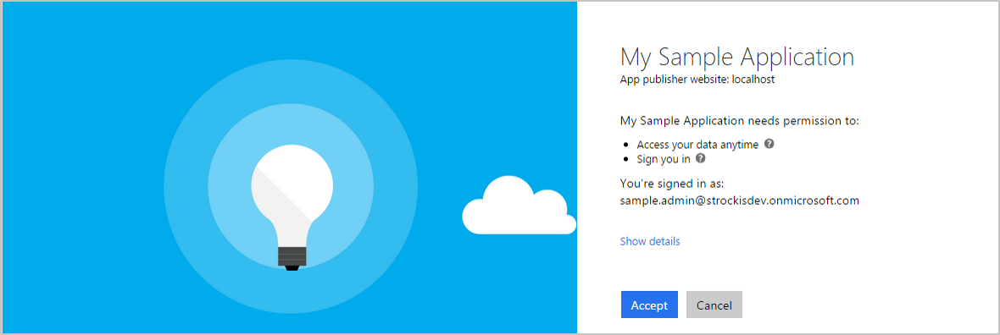

<properties
    pageTitle="Azure AD Version 2.0 Bereiche, Berechtigungen und Zustimmung | Microsoft Azure"
    description="Eine Beschreibung der Autorisierung in den Endpunkt Azure AD-Version 2.0, einschließlich Bereiche, Berechtigungen und Zustimmung."
    services="active-directory"
    documentationCenter=""
    authors="dstrockis"
    manager="mbaldwin"
    editor=""/>

<tags
    ms.service="active-directory"
    ms.workload="identity"
    ms.tgt_pltfrm="na"
    ms.devlang="na"
    ms.topic="article"
    ms.date="09/30/2016"
    ms.author="dastrock"/>

# <a name="scopes-permissions--consent-in-the-v20-endpoint"></a>Bereiche, Berechtigungen und Zustimmung in den Endpunkt Version 2.0

Apps, die Integration mit Azure AD Folgen einer bestimmten Autorisierungsmodell, mit dem Benutzer zu steuern, wie eine app für ihre Daten zugreifen kann.  Die Version 2.0 Durchführung dieses Autorisierungsmodell wurde aktualisiert, ändern, wie eine app mit Azure AD interagieren muss.  In diesem Thema werden die grundlegenden Konzepte von Autorisierungsmodell, einschließlich Bereiche, Berechtigungen und Zustimmung behandelt.

> [AZURE.NOTE]
    Nicht alle Azure Active Directory-Szenarien und Features werden von den Endpunkt Version 2.0 unterstützt.  Um festzustellen, ob den Version 2.0-Endpunkt verwendet werden sollen, erfahren Sie, [Version 2.0 Einschränkungen](active-directory-v2-limitations.md).

## <a name="scopes--permissions"></a>Bereiche und Berechtigungen

Azure AD implementiert eine Methode ist für die eine 3rd Party app Web gehosteten Zugriff auf Ressourcen im Auftrag eines Benutzers [OAuth 2.0](active-directory-v2-protocols.md) -Autorisierungsprotokoll.  Alle Web gehosteten Ressourcen, die mit Azure AD integriert haben einen Resource Identifier oder **App-ID-URI**.  Kann beispielsweise einige der Microsoft Web gehosteten Ressourcen:

- Der Office 365 Unified E-Mail-API:`https://outlook.office.com`
- Die Azure AD-Graph-API:`https://graph.windows.net`
- Die Microsoft Graph:`https://graph.microsoft.com`

Dasselbe gilt für alle 3rd Party-Ressourcen, die in Azure AD integriert hat.  Eine der folgenden Ressourcen können auch einen Satz von Berechtigungen definieren, die verwendet werden können, die Funktionalität der Ressource, die in kleinere Einheiten zu teilen.  Beispielsweise weist das Microsoft Graph wenige Berechtigungen definiert:

- Weitere Kalender eines Benutzers
- Schreiben Sie in Kalender eines Benutzers
- Ein Benutzer e-Mail senden
- [+ Weitere](https://graph.microsoft.io)

Folgende Berechtigungen definiert ist, kann die Ressource abgestimmte Kontrolle über die Daten und wie die Verbindung nach außen angezeigt werden müssen.  Eine 3rd Party app kann dann folgende Berechtigungen aus ein Endbenutzer - anzufordern, und der Endbenutzer muss die Berechtigungen genehmigen, bevor Sie die app in ihrem Auftrag fungieren kann.  Textbaustein-Methode der Ressource-Funktionalität in kleineren Berechtigungssätze, indem Sie werden 3rd Party apps erstellt, um nur die Berechtigungen anfordern, die sie benötigen, um deren Abgabe ausführen.  Sie können auch Endbenutzern zu wissen, genau wie eine app ihre Daten verwenden werden, damit sie sicher sind, dass die app nicht mit bösartiger Absicht verhält ist.

In Azure AD- und OAuth, folgende Berechtigungen als **Bereiche**bekannt sind.  Auch diese als **oAuth2Permissions**bezeichnet wird angezeigt.  Bereich wird in Azure AD als Zeichenfolgenwert dargestellt.  Ausgehend vom Microsoft Graph-Beispiel, ist der Bereichswert für die einzelnen Berechtigungen:

- Weitere Kalender eines Benutzers:`Calendar.Read`
- Schreiben Sie in Kalender eines Benutzers:`Mail.ReadWrite`
- Ein Benutzer senden Sie e-Mail:`Mail.Send`

Eine app kann folgende Berechtigungen anfordern, indem die Bereiche in Anforderungen an den Endpunkt Version 2.0 angeben wie nachstehend beschrieben.

## <a name="openid-connect-scopes"></a>Verbinden von OpenId Bereiche

Die Version 2.0-Implementierung von OpenID verbinden weist einige klar definierte Bereiche, die nicht auf eine bestimmte Ressource - gelten `openid`, `email`, `profile`, und `offline_access`.

#### <a name="openid"></a>OpenId

Wenn eine app Anmeldung führt mit [OpenID verbinden](active-directory-v2-protocols.md#openid-connect-sign-in-flow), es muss Anfordern der `openid` Bereich.  Die `openid` Bereich wird angezeigt, klicken Sie im Bildschirm Arbeit Konto Zustimmung wie die Berechtigung "Signieren Sie", und klicken Sie in der persönlichen Microsoft-Konto Zustimmung Bildschirm wie die Berechtigung "Anzeigen des eigenen Profils und Verbinden mit apps und Dienste, die mit Ihrem Microsoft-Konto".  Diese Berechtigung ermöglicht eine app erhalten Sie einen eindeutigen Bezeichner für den Benutzer in Form von der `sub` beanspruchen.  Bietet darüber hinaus app Zugriff auf den Endpunkt des Benutzers Informationen.  Die `openid` Bereich kann auch am Endpunkt token Version 2.0 verwendet werden, zum Erfassen von Id_tokens, die zum secure HTTP-Aufrufe zwischen verschiedenen Komponenten einer app verwendet werden können.

#### <a name="email"></a>E-Mail

Die `email` Bereich kann es sich um enthalten, zusammen mit den `openid` Umfang sowie alle anderen.  Diese app Zugriff auf die primäre e-Mail-Adresse des Benutzers in Form von entspricht der `email` beanspruchen.  Die `email` anfordern wird nur in Token enthalten sein, wenn eine e-Mail-Adresse das Benutzerkonto zugeordnet ist, was nicht immer der Fall ist.  Bei Verwendung von der `email` Umfang, Ihre app vorbereitet werden verarbeitet den Fall, in dem die `email` anfordern im Token nicht vorhanden.

#### <a name="profile"></a>Profil

Die `profile` Bereich kann es sich um enthalten, zusammen mit den `openid` Umfang sowie alle anderen.  Es bietet app Zugriff auf eine Vielzahl von Informationen über den Benutzer darüber.  Dies umfasst, jedoch kein auf Vornamen, Nachnamen, bevorzugte Benutzernamen, Objekt-ID und usw. des Benutzers beschränkt.  Eine vollständige Liste der Profil Ansprüche in Id_tokens verfügbar für einen bestimmten Benutzer finden Sie in der [Version 2.0 token Bezug](active-directory-v2-tokens.md).

#### <a name="offlineaccess"></a>Offline_access

Die [ `offline_access` Umfang](http://openid.net/specs/openid-connect-core-1_0.html#OfflineAccess) können Sie Ihre app Zugriff auf Ressourcen im Namen des Benutzers für eine längere Zeit.  Klicken Sie im Bildschirm Zustimmung Konto Arbeit wird dieser Bereich wie die Berechtigung "Auf Ihre Daten zugreifen jederzeit" angezeigt.  In der persönlichen Konto Zustimmung Bildschirm Microsoft wird es als die Berechtigung "Zugreifen auf Ihre Informationen jederzeit" angezeigt.  Wenn ein Benutzer genehmigt der `offline_access` Bereich, die app wird aktiviert sein, um die Aktualisierung Token von den token Version 2.0-Endpunkt zu erhalten.  Aktualisieren von Token sind langer Lebensdauer und Ihre App Zugriff auf neue Access Token zu erfassen, wie ältere abläuft.

Wenn Ihre app keine anfordert der `offline_access` Bereich, erhalten keine Refresh_tokens.  Dies bedeutet, wenn Sie eine Authorization_code im [OAuth 2.0 Autorisierung Code Fluss](active-directory-v2-protocols.md#oauth2-authorization-code-flow)einlösen, nur wieder ein Access_token von Sie erhalten die `/token` Endpunkt.  Die Access_token für einen kurzen Zeitraum (in der Regel eine Stunde) gültig bleiben, aber schließlich ablaufen.  AT, die die Zeitpunkt, Ihre app benötigen, können Sie den Benutzer umleiten zurück zu den `/authorize` Endpunkt zum Abrufen eines neuen Authorization_code.  Während dieser umleiten, der Benutzer kann oder möglicherweise nicht müssen Sie ihre Anmeldeinformationen erneut eingeben oder Zustimmung erneut Berechtigungen, je nach den den Typ der app.

Weitere Informationen zum Abrufen und Verwenden von aktualisieren Sie Token, finden Sie in der [Version 2.0-Protokoll verweisen](active-directory-v2-protocols.md).


## <a name="requesting-individual-user-consent"></a>Anfordern der Genehmigung für einzelne Benutzer

In einer Anforderung [OpenID verbinden oder OAuth 2.0](active-directory-v2-protocols.md) Autorisierung kann eine app mit erforderlichen Berechtigungen anfordern der `scope` Abfrage Parameter.  Erstanmeldung ein Benutzers in eine app, würde die app beispielsweise eine Anforderung wie folgt (mit Zeilenumbrüche zur Verbesserung der Lesbarkeit) senden:

```
GET https://login.microsoftonline.com/common/oauth2/v2.0/authorize?
client_id=6731de76-14a6-49ae-97bc-6eba6914391e
&response_type=code
&redirect_uri=http%3A%2F%2Flocalhost%2Fmyapp%2F
&response_mode=query
&scope=
https%3A%2F%2Fgraph.microsoft.com%2Fcalendar.read%20
https%3A%2F%2Fgraph.microsoft.com%2Fmail.send
&state=12345
```

Die `scope` Parameter ist ein Leerzeichen getrennte Liste von Bereichen, die die app anfordert.  Jede einzelne Bereich ist von Anhängen des Werts vom Bereich in der Ressource Identifier (URI für App-ID) angegeben.  Die oben angegebenen Anforderung gibt an, dass die app benötigt die Berechtigung zum Lesen den Kalender des Benutzers und der Benutzer e-Mail senden.

Nachdem der Benutzer ihre Anmeldeinformationen eingegeben hat, wird der Version 2.0-Endpunkt nach einem übereinstimmenden Eintrag **Benutzer Zustimmung**aktivieren.  Wenn der Benutzer nicht an die angeforderten Berechtigungen in der Vergangenheit zugestimmt hat, bitten Sie der Endpunkt Version 2.0 wird den Benutzer die erforderlichen Berechtigungen erteilen.  



Wenn der Benutzer über die Berechtigung genehmigt, wird die Zustimmung, damit der Benutzer nicht erneut auf nachfolgende Sign-ins Zustimmung aufgezeichnet.

## <a name="requesting-consent-for-an-entire-tenant"></a>Anfordern der Genehmigung für eine gesamte Mandanten

Häufig, wenn eine Organisation eine Lizenz oder ein Abonnement für eine Anwendung Einkäufe, möchten diese vollständig es für ihre Mitarbeiter bereitstellen.  Als Teil dieses Prozesses kann ein Unternehmensadministrator Zustimmung, dass diese Anwendung im Auftrag eines Mitarbeiters dienen erteilen.  Indem Sie die Berechtigung Zustimmung für eine gesamte Mandanten, treten Mitarbeiter die Organisation nicht im Bildschirm Zustimmung für die Anwendung.

Zustimmung für alle Benutzer in einen Mandanten anfordern, kann Ihre app der **Administrator Zustimmung Endpunkt**, nachfolgend beschriebenen verwenden.

## <a name="admin-restricted-scopes"></a>Administrator beschränkt Bereiche

Bestimmte Berechtigungen höchst-Berechtigungen in der Microsoft-Netz können als **Administrator beschränkt**gekennzeichnet werden.  Beispiele für solche Bereiche:

- Lesen einer Organizaion des Directory-Daten:`Directory.Read`
- Schreiben von Daten in einer Organisation Verzeichnis aus:`Directory.ReadWrite`
- Lesen Sie Sicherheitsgruppen im Verzeichnis einer Organisation:`Groups.Read.All`

Während ein Benutzers Consumer eine Anwendungszugriff auf diese Daten gewähren kann, dürfen nicht organisationsinterne Benutzern gewähren des Zugriffs auf demselben Satz von vertrauliche Daten des Unternehmens.  Wenn die Anwendung Zugriff auf einen der folgenden Berechtigungen von einer Organisation Benutzer anfordert, erhält der Benutzer eine Fehlermeldung, dass sie in Ihrer app-Berechtigungen Zustimmung unbefugten sind.

Wenn Ihre app Zugriff auf diese Bereiche Administrator beschränkt Organisationen erforderlich ist, sollten Sie diese direkt aus einer Unternehmensadministratoren auch mithilfe der **Administrator Zustimmung Endpunkt**, nachfolgend beschriebenen anfordern.

Wenn Sie über Administratorrechte verfügen über folgende Berechtigungen über den Administrator Zustimmung Endpunkt gewährt, werden Zustimmung für alle Benutzer in den Mandanten, gewährt wie zuvor beschrieben.

## <a name="using-the-admin-consent-endpoint"></a>Verwenden den Administrator Zustimmung Endpunkt

Mit folgenden Schritten, kann Ihre app zum Sammeln von Berechtigungen für alle Benutzer in einem angegebenen Mandanten, einschließlich Bereiche Administrator beschränkt werden.  Um einer Stichprobe Code anzuzeigen, die die nachstehenden Schritte vorangehenden implementiert, finden Sie in der [Administrator eingeschränkten Bereiche Stichprobe](https://github.com/Azure-Samples/active-directory-dotnet-admin-restricted-scopes-v2).

#### <a name="request-the-permissions-in-the-app-registration-portal"></a>Anfordern der Berechtigungen in der Registrierung app-portal

- Navigieren Sie zu Ihrer Anwendung in [apps.dev.microsoft.com](https://apps.dev.microsoft.com/?referrer=https://azure.microsoft.com/documentation/articles&deeplink=/appList), oder [Erstellen Sie eine app](active-directory-v2-app-registration.md) , wenn Sie noch nicht geschehen ist.
- Suchen nach dem Abschnitt **Microsoft Graph-Berechtigungen** , und fügen Sie die Berechtigungen, die Ihre app erforderlich sind.
- Vergewissern Sie sich zum **Speichern** der app-Registrierung

#### <a name="recommended-sign-the-user-into-your-app"></a>Empfohlen: Melden Sie sich den Benutzer bei der app

Normalerweise beim Erstellen einer Anwendungs, die den Administrator verwendet, Zustimmung Endpunkt, wird die app muss eine Seitenansicht sein, mit dem der Administrator des app Berechtigungen genehmigen können.  Auf dieser Seite kann Teil des app Anmeldung Fluss, Teil des app Einstellungen oder eine dedizierte "Verbinden" Fluss sein.  In vielen Fällen ist es sinnvoll, die für die app folgt anzeigen "anzeigen verbinden" erst ein Benutzers mit einem Arbeit oder Schule Microsoft-Konto angemeldet hat.

Bei der Anmeldung des Benutzers in die app, können Sie die Organziation zu identifizieren, zu der der Administrator gehört, bevor Sie bitten, die erforderlichen Berechtigungen zu genehmigen.  Während nicht unbedingt erforderlich ist, können sie eine weitere intuitive Benutzeroberfläche für Ihre Organisation Benutzer erstellen helfen.  Wenn den Benutzer anmelden möchten, führen Sie unsere [Version 2.0-Protokoll Lernprogramme](active-directory-v2-protocols.md)aus.

#### <a name="request-the-permissions-from-a-directory-admin"></a>Beantragen Sie die Berechtigungen eines Administrators Verzeichnis

Wenn Sie bereit sind Anfrage-Berechtigungen aus dem Administrator des Unternehmens, können Sie den Benutzer in der Version 2.0 **Administrator Endpunkt Zustimmung**umleiten.

```
// Line breaks for legibility only

GET https://login.microsoftonline.com/{tenant}/adminconsent?
client_id=6731de76-14a6-49ae-97bc-6eba6914391e
&state=12345
&redirect_uri=http://localhost/myapp/permissions
```

```
// Pro Tip: Try pasting the below request in a browser!
```

```
https://login.microsoftonline.com/common/adminconsent?client_id=6731de76-14a6-49ae-97bc-6eba6914391e&state=12345&redirect_uri=http://localhost/myapp/permissions
```

| Parameter | | Beschreibung |
| ----------------------- | ------------------------------- | --------------- |
| Mandanten | Erforderlich | Das Directory-Mandanten, dem Sie anfordern der Genehmigung von möchten.  Kann in Guid oder Anzeigename Format bereitgestellt werden. |
| client_id | Erforderlich | Die Anwendung-Id, dass das Registrierung-Portal ([apps.dev.microsoft.com](https://apps.dev.microsoft.com/?referrer=https://azure.microsoft.com/documentation/articles&deeplink=/appList)) Ihre app zugewiesen. |
| redirect_uri | Erforderlich | Die Redirect_uri, werden die Antwort für Ihre app zu behandeln gesendet werden soll.  Es muss exakt eine der Redirect_uris übereinstimmen, die Sie auf das Portal registriert haben. |
| Bundesstaat | empfohlen | Einen Wert enthalten, in der Besprechungsanfrage, die auch in der token Antwort zurückgegeben wird.  Es kann eine Textzeichenfolge alle Inhalte, die Sie möchten.  Der Status wird verwendet, um die Informationen zu den Status des Benutzers in der app codieren, bevor die Authentifizierungsanfrage ist, beispielsweise die Seite oder die Ansicht, die sie aufgetreten auf waren. |

An diesem Punkt wird Azure AD erzwingen, dass nur mandantenadministrator sich anmelden kann, um die Anforderung abzuschließen.  Der Administrator werden aufgefordert, alle Berechtigungen genehmigen, die Sie für Ihre app im Portal Registrierung angefordert haben. 

##### <a name="successful-response"></a>Erfolgreiche Antwort
Wenn der Administrator die Berechtigungen für eine Anwendung genehmigt hat, wird die erfolgreiche Antwort werden:

```
GET http://localhost/myapp/permissions?tenant=a8990e1f-ff32-408a-9f8e-78d3b9139b95&state=state=12345&admin_consent=True
```

| Parameter | Beschreibung |
| ----------------------- | ------------------------------- | --------------- |
| Mandanten | Das Directory-Mandanten, der die Berechtigungen für einer Anwendung gewünscht, im Guid-Format. |
| Bundesstaat | Einen Wert enthalten, in der Besprechungsanfrage, die auch in der token Antwort zurückgegeben wird.  Es kann eine Textzeichenfolge alle Inhalte, die Sie möchten.  Der Status wird verwendet, um die Informationen zu den Status des Benutzers in der app codieren, bevor die Authentifizierungsanfrage ist, beispielsweise die Seite oder die Ansicht, die sie aufgetreten auf waren. |
| admin_consent | Wird auf festgelegt `True`. |


##### <a name="error-response"></a>Antwort zurück
Der Administrator die Berechtigungen für eine Anwendung nicht genehmigt, werden die Fehler beim Antwort:

```
GET http://localhost/myapp/permissions?error=permission_denied&error_description=The+admin+canceled+the+request
```

| Parameter | Beschreibung |
| ----------------------- | ------------------------------- | --------------- |
| Fehler | Eine Zeichenfolge des Fehlercodes, die zum Fehlertypen klassifizieren, die auftreten verwendet werden kann, und kann verwendet werden, um auf Fehler zu reagieren. |
| error_description | Eine bestimmte Fehlermeldung, die einen Entwickler die Ursache eines Fehlers ermitteln helfen können.  |

Nachdem Sie eine erfolgreiche Antwort vom Administrator Zustimmung Endpunkt erhalten haben, gewonnen Ihre app hat die Berechtigungen, die sie dazu aufgefordert.  Sie können jetzt verschieben auf ein Token für die gewünschte Ressource anfordert, wie unten beschrieben.

## <a name="using-permissions"></a>Verwenden von Berechtigungen

Nachdem der Benutzer Berechtigungen für Ihre app zulässt, kann Ihre app Access Token erfassen, die Ihre app Zugriffsberechtigung für eine Ressource in einigen Kapazität darstellen.  Ein Token angegebenen Access kann nur für eine einzelne Resorce verwendet werden, aber die darin enthaltenen codiert werden jeder Berechtigung, die Ihre app für die betreffende Ressource gewährt wurde.  Um eine Access-Token zu erhalten, kann Ihre app eine Anforderung an den token Version 2.0-Endpunkt vornehmen:

```
POST common/oauth2/v2.0/token HTTP/1.1
Host: https://login.microsoftonline.com
Content-Type: application/json

{
    "grant_type": "authorization_code",
    "client_id": "6731de76-14a6-49ae-97bc-6eba6914391e",
    "scope": "https://outlook.office.com/mail.read https://outlook.office.com/mail.send",
    "code": "AwABAAAAvPM1KaPlrEqdFSBzjqfTGBCmLdgfSTLEMPGYuNHSUYBrq..."
    "redirect_uri": "https://localhost/myapp",
    "client_secret": "zc53fwe80980293klaj9823"  // NOTE: Only required for web apps
}
```

Das sich daraus ergebende Access Token klicken Sie dann in der HTTP-Anfragen, die der Ressource verwendet werden kann – es wird zuverlässig darauf hinzuweisen, die der Ressource, dass Ihre app hat die die entsprechende Berechtigung zum Ausführen einer bestimmten Aufgabe.  

Weitere Informationen über das Protokoll OAuth 2.0 und erläutert, wie Access Token finden Sie unter [Version 2.0 Endpunkt Protokoll Bezug](active-directory-v2-protocols.md).
