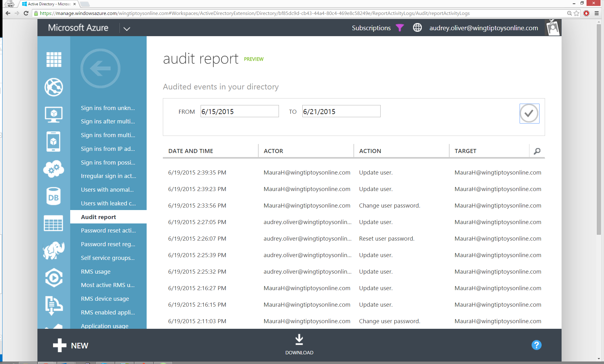
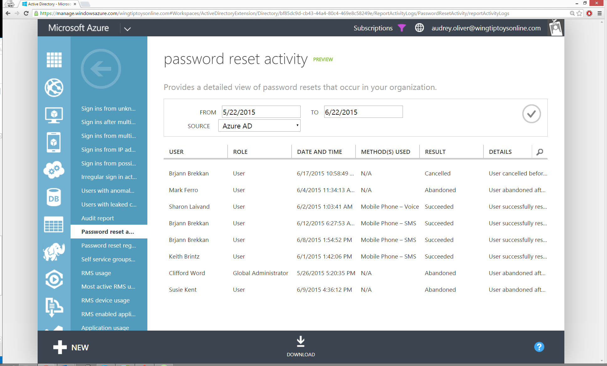
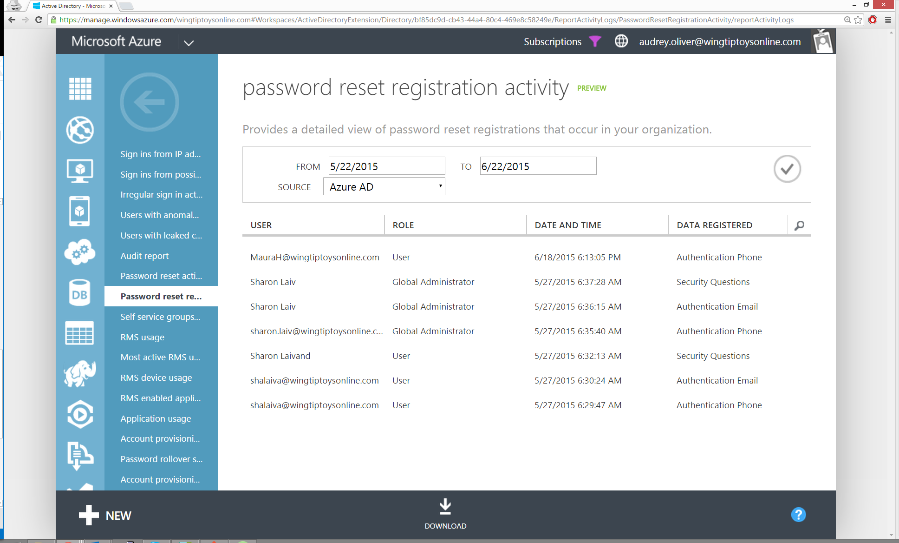
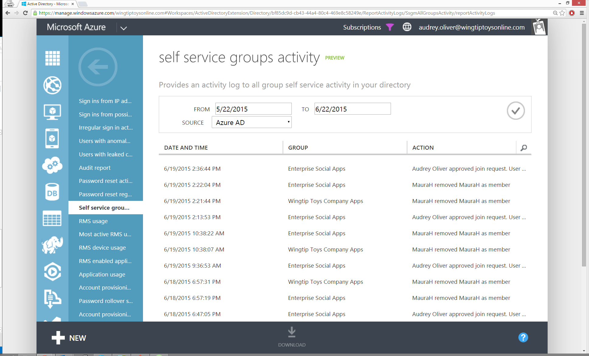
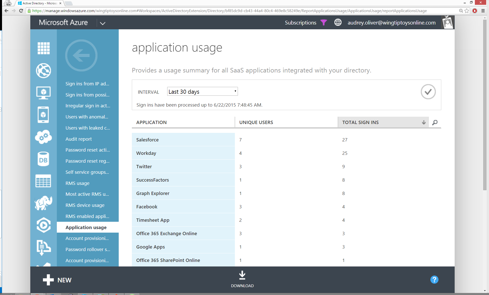
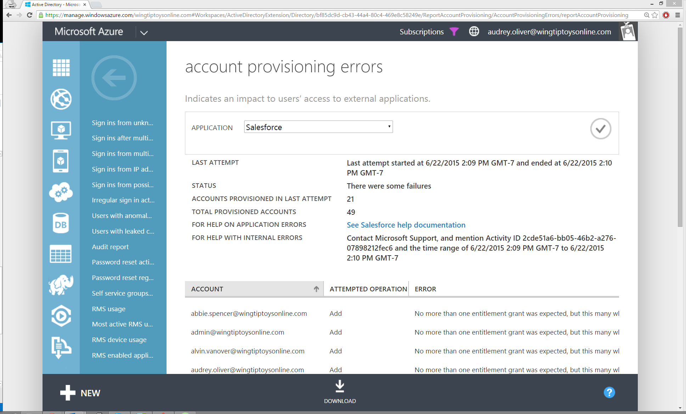

<properties
    pageTitle="Anzeigen Ihrer Access und die Verwendung der Berichte | Microsoft Azure"
    description="Erläutert, wie Sie Access und Verwendungsberichten Einblick in die Integrität und Sicherheit von Ihrer Organisation Directory anzeigen."
    services="active-directory"
    documentationCenter=""
    authors="dhanyahk"
    manager="femila"
    editor=""/>

<tags
    ms.service="active-directory"
    ms.workload="identity"
    ms.tgt_pltfrm="na"
    ms.devlang="na"
    ms.topic="article"
    ms.date="03/07/2016"
    ms.author="dhanyahk"/>

# Zeigen Sie Ihrer Berichte Zugriff und Verwendung an

*Diese Dokumentation ist Teil des [Azure Active Directory Reporting Guide](active-directory-reporting-guide.md).*

Azure Active Directory-Zugriff und Verwendungsberichte können Sie die um Transparenz für die Integrität und Sicherheit des Verzeichnisses Ihrer Organisation zu erhalten. Mithilfe dieser Informationen kann ein Administrators Directory besser bestimmen, wo mögliches Sicherheitsrisiko liegen möglicherweise so, dass er angemessen, diese Risiken planen können.

Berichte werden im Verwaltungsportal Azure wie folgt kategorisiert:

- Anomalie Berichte – enthalten anmelden Ereignisse, die wir gefunden abweichenden sein. Unser Ziel ist, stellen Sie Folgendes beachten Sie solche Aktivitäten und ermöglichen es Ihnen, vorzunehmen Feststellung darüber, ob ein Ereignis verdächtig ist.
- Integrierte Anwendung Berichte – stellt Einsichten in die Cloudanwendungen wie in Ihrer Organisation verwendet werden. Azure-Active Directory bietet Integration in Tausende von Applications Cloud.
- Fehlerberichte – kennzeichnen Fehlern, die beim Bereitstellen von externen Applikationen Konten auftreten können.
- Benutzerspezifische Berichte – Anzeige Gerät/anmelden Aktivitätsdaten für einen bestimmten Benutzer.
- Aktivitätsprotokolle – enthält einen Eintrag aller geprüften Ereignisse innerhalb der letzten 24 Stunden, letzten 7 Tage oder letzten 30 Tage als auch Gruppe Aktivität Änderungen und Kennwort zurücksetzen und Registrierung Aktivität.

> [AZURE.NOTE]
>
- Einige erweiterte Anomalie- und Verwendungsberichte Ressource sind nur verfügbar, wenn Sie [Azure Active Directory Premium](active-directory-get-started-premium.md)aktivieren. Erweiterte Berichte können Sie die Access-Sicherheit zu verbessern, reagieren möglicherweise Risiken und Zugriff auf Analytics auf Gerät Access und Anwendung Verwendung.
- Azure Active Directory Premium und grundlegende Editionen sind verfügbar für Kunden in China mithilfe der weltweiten Instanz von Azure Active Directory. Azure Active Directory Premium und grundlegende Editionen werden in der Microsoft Azure-Dienst von 21Vianet in China betrieben wird derzeit nicht unterstützt. Weitere Informationen erreichen Sie uns das [Azure-Active Directory-Forum](https://feedback.azure.com/forums/169401-azure-active-directory/).

## Berichte

|   Bericht                                              |   Beschreibung                                                                                 |
|   ------                                              |   -----                                                                                       |
|   **Abweichenden Aktivitätsberichte**
|   [Melden Sie sich ins von unbekannten Quellen](active-directory-reporting-sign-ins-from-unknown-sources.md)    |   Möglicherweise Versuch, ohne dass anmelden.                                    |
|   [Melden Sie sich ins nach mehreren Fehlern](active-directory-reporting-sign-ins-after-multiple-failures.md)      |   Kann eine erfolgreiche Hackerübergriffen hinweisen.                                               |
|   [Melden Sie sich über mehrere Regionen ins](active-directory-reporting-sign-ins-from-multiple-geographies.md)  |   Hinweisen, dass mehrere Benutzer mit dem gleichen Konto bei der Anmeldung sind.                      |
|   [Melden Sie sich ins von IP-Adressen mit verdächtigen Aktivität](active-directory-reporting-sign-ins-from-ip-addresses-with-suspicious-activity.md)    |   Möglicherweise erfolgreichen Anmelden nach einer längeren Eindringversuch.                      |
|   [Melden Sie sich ins von möglicherweise infizierten Geräte](active-directory-reporting-sign-ins-from-possibly-infected-devices.md)                |   Möglicherweise Versuch, melden Sie sich möglicherweise infizierte Geräte.                          |
|   [Unregelmäßiges anmelden Aktivität](active-directory-reporting-irregular-sign-in-activity.md)                          |   Möglicherweise Ereignisse zu Benutzer anmelden Mustern abweichenden anzugeben.                                   |
|   [Benutzer mit abweichenden anmelden Aktivität](active-directory-reporting-users-with-anomalous-sign-in-activity.md)                |   Zeigt an, Benutzer, deren Konten möglicherweise beschädigt wurde.                                   |
|   Benutzer mit verlorene Anmeldeinformationen                       |   Benutzer mit verlorene Anmeldeinformationen                                                               |
|   **Von Aktivitätsprotokollen**
|   Überwachungsbericht                                        |   Geprüften Ereignisse in Ihrem Verzeichnis                                                            |
|   Zurücksetzen des Kennworts Aktivität                             |   Stellt eine Detailansicht das Zurücksetzen von Kennwörtern, die in Ihrer Organisation auftreten.                |
|   Zurücksetzen des Kennworts Registrierungsaktivität                |   Zeigt eine Detailansicht Kennwort Registrierungen zurücksetzen, die in Ihrer Organisation auftreten.   |
|   Self-Service-Gruppen Aktivität                        |   Stellt eine Aktivität Log für alle Self-Service-Aktivitäten in Ihrem Verzeichnis gruppieren               |
|   **Integrierte Anwendungen**
|   Anwendungsverwendung                                   |   Enthält eine Zusammenfassung der Verwendung für alle SaaS Applikationen in Ihrem Verzeichnis integriert.          |
|   Berücksichtigen Sie die Aktivität bereitgestellt                       |   Stellt einen Verlauf der Versuche, die Bereitstellung von Konten in externen Anwendungen.              |
|   Kennwort Rollover status                            |   Stellt einen detaillierten Überblick Rollover Status SaaS Applikationen automatische Kennwort an.    |
|   Fehler bei der Bereitstellung zu berücksichtigen                         |   Zeigt an, hinterlassen Sie Eindruck zum Benutzerzugriff auf externen Applikationen.                              |
|   **Verwaltung von Informationsrechten**
|   RMS Verwendung                                           |   Enthält eine Zusammenfassung für die Verwendung der Verwaltung von Informationsrechten                                              |
|   Am aktivsten RMS-Benutzer                               |   Zeigt aktive Top 1000-Benutzer, die Zugriff auf RMS-geschützte Dateien                                |
|   Verwendung der RMS-Gerät                                    |   Zeigt eine Liste für den Zugriff auf RMS-geschützte Dateien verwendete Geräte                                        |
|   Verwendung der aktiviert RMS-Anwendung                       |   Zeigt die Verwendung der RMS Applikationen aktiviert                                                  |

## Bericht-Editionen

|   Bericht                                              |   Kostenlose    |   Grundlegende   |   Premium     |
|   ------                                              |   ----    |   -----   |   --------    |
|   **Abweichenden Aktivitätsberichte**
|   Melden Sie sich ins von unbekannten Quellen                       |   ✓       |   ✓   |   ✓           |
|   Melden Sie sich ins nach mehreren Fehlern                    |   ✓       |   ✓   |   ✓           |
|   Melden Sie sich über mehrere Regionen ins                  |   ✓       |   ✓   |   ✓           |
|   Melden Sie sich ins von IP-Adressen mit verdächtigen Aktivität |           |       |   ✓           |
|   Melden Sie sich ins von möglicherweise infizierten Geräte             |           |       |   ✓           |
|   Unregelmäßiges anmelden Aktivität                          |           |       |   ✓           |
|   Benutzer mit abweichenden anmelden Aktivität               |           |       |   ✓           |
|   Benutzer mit verlorene Anmeldeinformationen                       |           |       |   ✓           |
|   **Von Aktivitätsprotokollen**
|   Überwachungsbericht                                        |   ✓       |   ✓   |   ✓           |
|   Zurücksetzen des Kennworts Aktivität                             |           |       |   ✓           |
|   Zurücksetzen des Kennworts Registrierungsaktivität                |           |       |   ✓           |
|   Self-Service-Gruppen Aktivität                        |           |       |   ✓           |
|   **Integrierte Anwendungen**
|   Anwendungsverwendung                                   |           |       |   ✓           |
|   Berücksichtigen Sie die Aktivität bereitgestellt                       |   ✓       |   ✓   |   ✓           |
|   Kennwort Rollover status                            |           |       |   ✓           |
|   Fehler bei der Bereitstellung zu berücksichtigen                         |   ✓       |   ✓   |   ✓           |
|   **Verwaltung von Informationsrechten**
|   RMS Verwendung                                           |           |       |   Nur RMS    |
|   Am aktivsten RMS-Benutzer                               |           |       |   Nur RMS    |
|   Verwendung der RMS-Gerät                                    |           |       |   Nur RMS    |
|   Verwendung der aktiviert RMS-Anwendung                       |           |       |   Nur RMS    |

## Abweichenden Aktivitätsberichte

Die abweichenden anmelden Aktivitätsberichte kennzeichnen verdächtigen melden Sie sich in Office 365, Azure-Verwaltungsportal, Azure Active Directory Access Systemsteuerung, Sharepoint Online, Dynamics CRM Online und anderen Microsoft-Onlinedienste Aktivität.

Alle Berichte, mit Ausnahme der Bericht "Signieren ins nach mehreren Fehlern", auch Kennzeichnung verdächtigen <i>Partnersuche</i> melden ins mit den oben genannten Diensten, unabhängig von der Föderation Anbieter. 

Folgende Berichte stehen zur Verfügung: 
<ul>
<li>[Melden Sie sich ins von unbekannten Quellen](active-directory-reporting-sign-ins-from-unknown-sources.md).</li>
<li>[Melden Sie sich ins nach mehreren Fehlern](active-directory-reporting-sign-ins-after-multiple-failures.md).</li>
<li>[Melden Sie sich ins aus mehreren geografischen Standorten](active-directory-reporting-sign-ins-from-multiple-geographies.md).</li>
<li>[Melden Sie sich ins von IP-Adressen mit verdächtigen Aktivität](active-directory-reporting-sign-ins-from-ip-addresses-with-suspicious-activity.md).</li>
<li>[Unregelmäßig anmelden Aktivität](active-directory-reporting-irregular-sign-in-activity.md).</li>
<li>[Melden Sie sich ins von möglicherweise infiziert Geräte](active-directory-reporting-sign-ins-from-possibly-infected-devices.md).</li>
<li>[Benutzer mit abweichenden anmelden Aktivität](active-directory-reporting-users-with-anomalous-sign-in-activity.md).</li>
<li>Benutzer mit verlorene Anmeldeinformationen</li></ul>

## Von Aktivitätsprotokollen

### Überwachungsbericht

| Beschreibung        | Speicherort des Berichts |
| :-------------     | :-------        |
| Zeigt einen Eintrag aller geprüften Ereignisse innerhalb der letzte 24 Stunden, die letzten 7 Tage oder die letzten 30 Tage an.   Weitere Informationen finden Sie unter [Azure Active Directory Audit Bericht Ereignisse](active-directory-reporting-audit-events.md) | Verzeichnis > Registerkarte Berichte |

### Zurücksetzen des Kennworts Aktivität

| Beschreibung        | Speicherort des Berichts |
| :-------------     | :-------        |
| Zeigt alle Kennwort auch zurücksetzen, die in Ihrer Organisation aufgetreten sind. | Verzeichnis > Registerkarte Berichte |

### Zurücksetzen des Kennworts Registrierungsaktivität

| Beschreibung        | Speicherort des Berichts |
| :-------------     | :-------        |
| Zeigt alle Kennwort Registrierungen zurücksetzen, die in Ihrer Organisation aufgetreten sind | Verzeichnis > Registerkarte Berichte |

### Self-Service-Gruppen Aktivität

| Beschreibung        | Speicherort des Berichts |
| :-------------     | :-------        |
| Zeigt alle Aktivitäten für die verwalteten Self-service-Gruppen in Ihrem Verzeichnis. | Verzeichnis > Benutzer > <i>Benutzer</i> > Registerkarte Geräte |

## Integrierte Applications-Berichte

### Anwendungsverwendung: Zusammenfassung

| Beschreibung        | Speicherort des Berichts |
| :-------------     | :-------        |
| Verwenden Sie diesen Bericht bei Verwendung für alle SaaS Applikationen in Ihrem Verzeichnis angezeigt werden sollen. Dieser Bericht basiert auf der Anzahl, wie oft, die Benutzer in der Anwendung im Bereich Access geklickt haben. | Verzeichnis > Registerkarte Berichte |

Der Bericht enthält, melden Sie sich, dass ins müssen _Alle_ Programme, denen Ihrem Verzeichnis auf, zugreifen, einschließlich kann Microsoft Applications bereits integriert.

Vorab integrierte Microsoft Applications beziehen Sie Office 365, Sharepoint, der Azure-Verwaltungsportal und andere.

### Anwendungsverwendung: detaillierte

| Beschreibung        | Speicherort des Berichts |
| :-------------     | :-------        |
| Verwenden Sie den Bericht, wenn verwendet wird, wie viel eine bestimmte SaaS-Anwendung angezeigt werden sollen. Dieser Bericht basiert auf der Anzahl, wie oft, die Benutzer in der Anwendung im Bereich Access geklickt haben. | Verzeichnis > Registerkarte Berichte |

### Anwendung dashboard

| Beschreibung        | Speicherort des Berichts |
| :-------------     | :-------        |
| Dieser Bericht gibt kumulierte melden Sie sich an ins zur Anwendung von Benutzern in Ihrer Organisation über einen ausgewählten Zeitraum aus. Das Diagramm auf der Dashboardseite hilft Ihnen die Trends für alle Verwendung dieser Anwendung zu identifizieren. | Verzeichnis > Anwendung > Registerkarte Dashboard |

## Fehlerberichte

### Fehler bei der Bereitstellung zu berücksichtigen

| Beschreibung        | Speicherort des Berichts |
| :-------------     | :-------        |
| Verwenden Sie diese Option zum Überwachen der Fehler, die während der Synchronisierung von Konten SaaS Applications zu Azure Active Directory auftreten. | Verzeichnis > Registerkarte Berichte |

## Benutzerspezifische Berichte

### Geräte

| Beschreibung        | Speicherort des Berichts |
| :-------------     | :-------        |
| Verwenden Sie den Bericht, wenn die IP-Adresse und geografische Position des Geräte, die ein bestimmter Benutzer Zugriff auf Azure Active Directory verwendete enthält angezeigt werden sollen. | Verzeichnis > Benutzer > <i>Benutzer</i> > Registerkarte Geräte |

### Aktivität

| Beschreibung        | Speicherort des Berichts |
| :-------------     | :-------        |
| Zeigt das Vorzeichen Aktivität für einen Benutzer an. Der Bericht enthält Informationen, wie die Anwendung bei angemeldet, Gerät verwendet, IP-Adresse und Speicherort. Wir sammeln nicht den Verlauf für Benutzer, die sich mit einem Microsoft-Konto anmelden. | Verzeichnis > Benutzer > <i>Benutzer</i> > Registerkarte Aktivität |

#### Melden Sie sich in den Bericht Benutzeraktivitäten Ereignisse

Nur bestimmte Arten von Anmelden Ereignisse werden im Bericht Benutzeraktivitäten angezeigt.

| Ereignistyp                                        | Enthalten?     |
| ----------------------                                | ---------     |
| Melden Sie sich ins in den [Access-Bereich](http://myapps.microsoft.com/)              | Ja           |
| Melden Sie sich ins [Azure-Verwaltungsportal](https://manage.windowsazure.com/)       | Ja           |
| Melden Sie sich ins [Microsoft Azure-Portal](https://portal.azure.com/)           | Ja           |
| Melden Sie sich ins [Office 365-portal](http://portal.office.com/)            | Ja           |
| Melden Sie sich ins zu einer systemeigenen Anwendung, wie Outlook (siehe nachfolgende Ausnahme)          | Ja           |
| Melden Sie sich ins zu einer app Partnersuche/nach der Bereitstellung durch Klicken Sie im Bereich Access wie Vertrieb | Ja           |
| Melden Sie sich ins zu einer app-basierten Kennwort durch Klicken Sie im Bereich Access wie Twitter       | Ja           |
| Melden Sie sich ins zu einer benutzerdefinierten Geschäfts-app, die dem Verzeichnis hinzugefügt wurden        | Keine (in Kürze verfügbar)  |
| Melden Sie sich ins eine Azure AD-Anwendungsproxy-app, die dem Verzeichnis hinzugefügt wurden    | Keine (in Kürze verfügbar)  |

> Hinweis: Um den Abstand in diesem Bericht, melden Sie sich zu verringern ins vom [Microsoft Online Services-Anmeldeassistent](http://community.office365.com/en-us/w/sso/534.aspx) werden nicht angezeigt.

## Aspekte, wenn Sie vermuten, dass sicherheitsverletzung

Wenn Sie davon, die ausgehen ein Benutzerkonto möglicherweise gefährdet oder alle Arten von verdächtigen Benutzeraktivitäten, die zu einer sicherheitsverletzung der Daten in der Cloud Directory führen kann, Sie möchten möglicherweise sollten eine oder mehrere der folgenden Aktionen:

- Wenden Sie sich an den Benutzer aus, um zu überprüfen, ob die Aktivität
- Zurücksetzen eines Benutzerkennworts
- [Aktivieren Sie die kombinierte Authentifizierung](../multi-factor-authentication/multi-factor-authentication-get-started.md) zur Erhöhung der Sicherheit

## Anzeigen oder Herunterladen eines Berichts

1. Im Portal Azure klassischen klicken Sie auf **Active Directory**, klicken Sie auf den Namen des Verzeichnisses Ihrer Organisation, und klicken Sie dann auf **Berichte**.
2. Klicken Sie auf der Seite Berichte auf den Bericht, den Sie anzeigen und/oder herunterladen möchten.

    > [AZURE.NOTE] Wenn dies das erste Mal Sie die Funktion für die Berichterstattung von Azure Active Directory verwendet haben ist, sehen Sie eine Nachricht ein, Suchbegriffen. Wenn Sie zustimmen, klicken Sie auf das Häkchen-Symbol, um den Vorgang fortzusetzen.

3. Klicken Sie auf das Dropdownmenü neben Intervall, und wählen Sie dann eine der folgenden Zeitbereiche, die beim Generieren dieses Berichts verwendet werden soll:
    - Letzte 24 Stunden
    - Letzten 7 Tage
    - Letzten 30 Tage
4. Klicken Sie auf das Häkchen-Symbol, um den Bericht auszuführen.
    - Bis zu 1000 Ereignisse werden im klassischen Azure-Portal angezeigt.
5. Falls zutreffend, klicken Sie auf **herunterladen** , um den Bericht auf eine komprimierte Datei im Format durch Trennzeichen getrennte Werte (CSV) für offline anzeigen oder Archivieren herunterzuladen.
    - Bis zu 75.000 Ereignisse sein in der heruntergeladenen Datei enthalten.
    - Checken Sie die [Azure AD Reporting API](active-directory-reporting-api-getting-started.md)für weitere Daten aus.

## Ignorieren eines Ereignisses

Sie Anomalie Berichte, die Sie anzeigen, können Sie feststellen, dass verschiedene Ereignisse zu ignorieren, die in verwandte Berichte angezeigt. Um ein Ereignis zu ignorieren, markieren Sie das Ereignis im Bericht, und klicken Sie auf **ignorieren**. Die Schaltfläche **ignorieren** das hervorgehobene Ereignis aus dem Bericht werden dauerhaft entfernt, und es kann nur von globalen Administratoren lizenzierte verwendet werden.

## Automatische e-Mail-Benachrichtigungen

Weitere Informationen zu reporting Azure AD-Benachrichtigungen checken Sie [Azure Active Directory Reporting Benachrichtigungen](active-directory-reporting-notifications.md)aus.

## Nächste Schritte

- [Erste Schritte mit Azure Active Directory Premium](active-directory-get-started-premium.md)
- [Fügen Sie Unternehmen branding anmelden und Access-Bereich Seiten hinzu](active-directory-add-company-branding.md)
