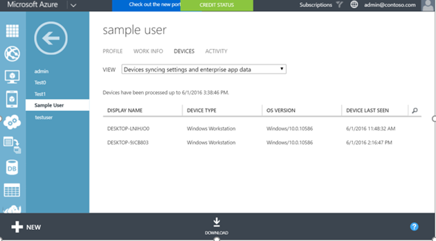

<properties
    pageTitle="Enterprise-Aktivierungsstatus in Azure-Active Directory Roaming | Microsoft Azure"
    description="Häufig gestellte Fragen zu Enterprise Zustand Roaming Einstellungen in Windows-Geräte ein. Enterprise Zustand Roaming ermöglicht eine einheitliche Verwendung über ihren Windows-Geräten und Zeit zum Konfigurieren eines neuen Geräts verkürzt."
    services="active-directory"
    keywords="Enterprise-Zustand roaming, Windows Cloud, wie Enterprise Zustand roaming aktivieren"
    documentationCenter=""
    authors="femila"
    manager="swadhwa"
    editor="curtand"/>

<tags
    ms.service="active-directory"  
    ms.workload="identity"
    ms.tgt_pltfrm="na"
    ms.devlang="na"
    ms.topic="article"
    ms.date="09/27/2016"
    ms.author="femila"/>

# Enterprise-Aktivierungsstatus Roaming in Azure-Active Directory

Enterprise Zustand Roaming steht für eine Organisation ein Abonnement Premium Azure-Active Directory (Azure AD). Weitere Informationen zum Abrufen eines Azure AD-Abonnements finden auf der [Seite Azure AD-Produkt](https://azure.microsoft.com/services/active-directory).

Wenn Sie Enterprise Zustand Roaming aktivieren, wird Ihre Organisation automatisch Lizenzen für ein Abonnement kostenlos, Beschränkung Einsatz Azure Rights Management erteilt werden. Diese kostenlose Abonnement gilt nur für verschlüsseln und Entschlüsseln Enterprise-Einstellungen und Anwendungsdaten vom Dienst Enterprise Zustand Roaming synchronisiert. Sie müssen ein kostenpflichtiges Abonnement der volle Funktionsumfang Azure Rights Management verwenden können.

Nach dem Erhalt einer Premium Azure AD-Abonnements können folgendermaßen Sie vor, um Enterprise Zustand Roaming zu aktivieren:

1. Melden Sie sich zum klassischen Azure-Portal.
2. Klicken Sie auf der linken Seite Wählen Sie **ACTIVE DIRECTORY**, und wählen Sie dann aus dem Verzeichnis aus, für das Sie Enterprise Zustand Roaming aktivieren möchten.

3. Wechseln Sie zur Registerkarte **Konfigurieren** oben.

4.  Bildlauf der Seite Wählen Sie die **Benutzer möglicherweise SYNCHRONISIEREN von EINSTELLUNGEN und ENTERPRISE-APP-Daten**aus und klicken Sie dann auf **Speichern**.

Für ein Windows-10-Gerät Einstellungen mit dem Dienst Enterprise Zustand Roaming Roaming muss das Gerät mit einer Azure AD-Identität authentifiziert. Für Geräte, die mit Azure AD verbunden sind, ist der primäre Benutzername der Identität Azure AD-, sodass keine zusätzliche Konfiguration erforderlich ist. Für Geräte, die einem herkömmlichen lokalen Active Directory verwenden, muss der IT-Administrator [die Domänenverbund Geräten für Erfahrung 10 Windows Azure AD verbinden](active-directory-azureadjoin-devices-group-policy.md).

## Synchronisieren von Datenspeicher
Enterprise Zustand Roaming-Daten werden in eine oder mehrere [Azure Regionen](https://azure.microsoft.com/regions/ ) gehostet, das in der Azure-Active Directory-Instanz festgelegten Wert Land/Region am besten ausgerichtet. Enterprise Zustand Roaming Daten basierend auf drei wichtigsten geographischen Regionen aufgeteilt: Nordamerika, EMEA und APAC. Enterprise Zustand Roaming-Daten für den Mandanten befindet sich lokal mit geografische Region, und nicht über Regionen repliziert ist.  Beispielsweise Kunden, die deren Land/Region auf einen der EMEA-Ländern Feldwert, wie "Frankreich" oder "Sambia" kann ihre Daten in einem oder der Azure Regionen in Europa gehostet sind.  Kunden, die den Wert für Land/Region in einem Nordamerika Länder Azure AD festlegen, wie "USA" oder "Kanada" ihre Daten in einer oder mehreren der Azure Regionen innerhalb der USA gehostet aufweisen soll.  Kunden, die den Wert für Land/Region in einem APAC Länder Azure AD festlegen, wie "Australien" oder "Neuseeland" ihre Daten in einem oder mehreren der Azure Regionen in Asien gehostet aufweisen soll.  Südamerikanischer Länder und Antarktis Daten werden in einem oder mehreren Azure Bereichen innerhalb der USA gehostet werden.  Der Wert für Land/Region als Teil der Azure AD-Directory Erstellungsprozess festgelegt ist und nicht später geändert werden kann. 

Wenn Sie weitere Informationen zum Speicherort der Daten benötigen, die Datei ein Ticket mit [Azure unterstützen](https://azure.microsoft.com/support/options/)auf.

## Enterprise-Zustand Roaming verwalten
Azure AD globale Administratoren können aktivieren und deaktivieren Enterprise Zustand Roaming, in der klassischen Azure-Portal.

Globale Administratoren können die Einstellungen synchronisieren zu bestimmten Sicherheitsgruppen einschränken.

Globale Administratoren können auch einen Statusbericht für Einzelbenutzer-Gerät synchronisieren anzeigen, indem einen bestimmten Benutzer in der Liste der Active Directory-Instanz **Benutzer** und Auswählen von Ansicht **Geräten synchronisiert und Enterprise-app**und durch Klicken auf die Registerkarte **Geräte**

##Beibehaltung der Daten
Daten auf Azure über Enterprise Zustand Roaming synchronisiert werden endlos aufbewahrt werden, es sei denn, ein manuellen Löschvorgang ausgeführt wird oder die Daten in Frage veraltete werden ermittelt werden. 

**Explizit Löschvorgang:** Beim Administrator Azure einen Benutzer oder ein Verzeichnis löscht oder ein Administrator fordert explizit an, dass Daten gelöscht werden die Daten gelöscht.

- **Löschen des Benutzers zu**: Wenn ein Benutzer in Azure AD gelöscht wird, wird das Benutzerkonto roaming Daten wird zum Löschen ausgewählt und zwischen 90 bis 180 Tage gelöscht. 
- **Verzeichnis löschen**: Löschen ein gesamtes Verzeichnis in Azure AD ist ein sofort-Vorgang. Alle Einstellungsdaten, die Verzeichnis wird zum Löschen ausgewählt und wird gelöscht zwischen 90 bis 180 Tage, zugeordnet ist. 
- **Klicken Sie auf Besprechungsanfrage löschen**: Wenn der Administrator Azure AD-Daten oder Einstellungsdaten eines bestimmten Benutzers manuell zu löschen möchte, kann der Administrator ein Ticket mit [Azure unterstützen](https://azure.microsoft.com/support/)ablegen. 

**Löschvorgang veraltete Daten**: Daten, die für ein Jahr ("Aufbewahrungszeitraum") als veraltet behandelt werden und aus Azure gelöscht werden möglicherweise nicht zugegriffen wurde. Der Aufbewahrungszeitraum kann geändert werden jedoch nicht kleiner als 90 Tagen ab. Veralteten Daten möglicherweise eine bestimmte Gruppe von Einstellungen für Windows-Anwendung oder alle Einstellungen für einen Benutzer. Beispiel:
 
- Wenn keine Geräte Zugriff auf eine bestimmte Einstellungen-Auflistung (z. B. Anwendung wird vom Gerät entfernt, oder eine Gruppe "Einstellungen" wie "Design" für alle Geräte eines Benutzers deaktiviert ist), und dann dieser Sammlung so nach der Aufbewahrungszeitraum veraltet wird, möglicherweise gelöscht werden. 
- Wenn ein Benutzer die Option Einstellungen Synchronisieren aller seiner Geräte deaktiviert hat, dann keine Daten Einstellungen zugegriffen wird, und alle Einstellungsdaten für diesen Benutzer werden veraltet und können nach der Aufbewahrungszeitraum gelöscht werden. 
- Wenn der Administrator Azure AD-Verzeichnis Enterprise Zustand Roaming für das gesamte Verzeichnis, und klicken Sie dann auf alle Benutzer deaktiviert dieses Verzeichnis wird die Synchronisierung von Einstellungen und alle Einstellungsdaten für alle Benutzer werden veraltet und können nach der Aufbewahrungszeitraum gelöscht werden. 

**Gelöschte Daten Wiederherstellung**: die Datenaufbewahrungsrichtlinie kann nicht konfiguriert werden. Sobald die Daten endgültig gelöscht wurden, wird es nicht wiederhergestellt werden. Es ist jedoch zu beachten, dass nur die Einstellungsdaten aus Azure, nicht auf dem Gerät Endbenutzer gelöscht werden. Wenn es sich bei einem beliebigen Gerät später auf den Dienst Enterprise Zustand Roaming erneut eine Verbindung herstellt, wird die Einstellungen werden, erneut synchronisiert und in Azure gespeichert.

## Verwandte Themen
- [Enterprise Zustand Roaming (Übersicht)](active-directory-windows-enterprise-state-roaming-overview.md)
- [Einstellungen und roaming häufig gestellte Fragen zu Daten](active-directory-windows-enterprise-state-roaming-faqs.md)
- [Gruppieren der Richtlinie und MDM Einstellungen für Einstellungen synchronisieren](active-directory-windows-enterprise-state-roaming-group-policy-settings.md)
- [Windows-10 roaming Einstellungen Bezug](active-directory-windows-enterprise-state-roaming-windows-settings-reference.md)
