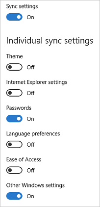
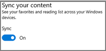

<properties
    pageTitle="Windows-10 roaming Einstellungen Verweis | Microsoft Azure"
    description="Eine vollständige Liste der alle Einstellungen, die Server gespeichert oder in Windows 10 gesichert werden."
    services="active-directory"
    keywords="Enterprise-Zustand roaming, Windows cloud"
    documentationCenter=""
    authors="femila"
    manager="swadhwa"
    editor="curtand"/>

<tags
    ms.service="active-directory"  
    ms.workload="identity"
    ms.tgt_pltfrm="na"
    ms.devlang="na"
    ms.topic="article"
    ms.date="09/27/2016"
    ms.author="femila"/>

# Windows-10 roaming Einstellungen Bezug

Im folgenden finden eine vollständige Liste der die Einstellungen, die Server gespeichert oder in Windows 10 gesichert werden. 

##Geräte und Endpunkte
Finden Sie in der folgenden Tabelle eine Zusammenfassung der Geräte und Kontotypen, die durch die synchronisieren, Sicherung, unterstützt werden, und Wiederherstellen von Framework in Windows 10.

| Kontotyp und Vorgang | Desktop | Mobile |
|----------------------------|---------|--------|
|Azure-Active Directory: Synchronisieren| Ja        | Nein       |
|Azure-Active Directory: Sicherung und Wiederherstellung| Nein        | Nein       |
|Microsoft-Konto: Synchronisieren|Ja         |  Ja      |
|Microsoft-Konto: Sichern/Wiederherstellen|  Nein       |   Ja     |

##Was ist die Sicherung?
Windows-Einstellungen standardmäßig in der Regel synchronisieren, jedoch einige Einstellungen werden nur gesichert, z. B. die Liste der installierten Programme auf einem Gerät. Sicherung ist für mobile Geräte für Enterprise Zustand Roaming Benutzer nur und derzeit nicht zur Verfügung. Sichern einer Microsoft-Konto verwendet und die Einstellungen sowie Anwendung in OneDrive gespeichert. Wenn ein Benutzer auf dem Gerät mit den Einstellungen-app synchronisieren deaktiviert, werden nur Daten für die Anwendung, die sich normalerweise synchronisiert Sicherung. Zusätzliche Daten können nur über die Wiederherstellung während der ersten Eindruck des Ausführen eines neuen Geräts zugegriffen werden. Sicherungskopien können über die Einstellungen für Audiogeräte, deaktiviert und kann verwaltete und gelöscht über OneDrive-Benutzerkonto.

## Übersicht über die Windows-Einstellungen
Die folgenden Einstellungsgruppen stehen für Endbenutzer So aktivieren oder Deaktivieren von Windows 10 Geräte Einstellungen synchronisieren.

- Design: Desktophintergrund, Benutzerkachel, Taskleiste Position, usw. 
- Internet Explorer-Einstellungen: Verlauf, eingegeben haben, URLs, Favoriten usw.. 
- Kennwörter: [Windows-Anmeldeinformationen Schließfach](https://technet.microsoft.com/library/jj554668.aspx), einschließlich Wi-Fi-Profile 
- Spracheinstellungen: Rechtschreibwörterbuch, Language Systemeinstellungen 
- Center für erleichterte Bedienung: Sprachausgabe, Bildschirmlupe Bildschirmtastatur 
- Andere Windows-Einstellungen: finden Sie unter Windows-Einstellungen-details

Synchronisieren von Kante Browser Einstellung Gruppe (Favoriten, Literaturverzeichnis) kann aktiviert oder deaktiviert von Endbenutzern Kante Browser Menüoption Einstellungen werden.

 
## Windows-Einstellungen-details
In der folgenden Tabelle verweist anderen Einträge in der Spalte Gruppe Einstellungen auf Einstellungen, die deaktiviert werden können, indem Sie auf Einstellungen > Konten > Synchronisieren Sie Ihre Einstellungen > Weitere Windows-Einstellungen. 

Interner Einträge in der Gruppe Einstellungen Spalte beziehen sich auf Einstellungen und apps, die nur innerhalb der app ähneln oder indem Sie synchronisieren für das gesamte Gerät mithilfe von mobilen Gerätemanagement (MDM) oder Gruppenrichtlinien deaktivieren synchronisieren deaktiviert werden können.
Einstellungen, die nicht Roaming oder synchronisieren wird nicht zu einer Gruppe gehören.

| Einstellungen                         | Desktop | Mobile  | Gruppe |
|----------------------------------|---------|---------|-------|
| **Konten**: Kontobild        |  Synchronisieren   |X        |Design  |
| **Konten**: andere Konten-Einstellungen |X        |X        |       |
|  **Erweiterte mobilen breitbandnetzen**: ICS-Netzwerkname (ermöglicht-AutoErmittlung von mobilen Wi-Fi-Hotspots über Bluetooth)|X  |X   |Kennwörter |
|**App-Daten**: einzelne apps können Daten synchronisieren|Synchronisieren Sicherung   | Synchronisieren Sicherung|Interner       |
|**App-Liste**: Liste der installierten apps  |X         |Sicherung  |Andere  |
|**Bluetooth**: alle Bluetooth-Einstellungen |X        |X        |       |
|**Eingabeaufforderungsfenster**: alle Eingabeaufforderungsfenster-Einstellungen |Synchronisieren    |X      |    |
|**Cortana**: Aktivieren oder deaktivieren                |X        |X        |       |
|**Cortana**: Cortana im Sperrbildschirm aktivieren  |X        |X        |       |
|**Cortana**: Benutzername                |Synchronisieren     |Synchronisieren     |Interner|
|**Cortana**: SMS vorlesen           |X        |Synchronisieren     |Interner|
|**Cortana**: sicheres Suchen              |X         |Synchronisieren    |Interner|
|**Cortana**: Suchen nach Informationen auf Flüge und vieles mehr|X    |Synchronisieren    |Interner|
|**Anmeldeinformationen**: Schließfach von Anmeldeinformationen    |Synchronisieren     |Synchronisieren     |Kennwort|
|**Datum, Uhrzeit, und Region**: automatische Zeit (Internet Uhrzeit synchronisieren) |Synchronisieren     |Synchronisieren     |Sprache|
|**Datum, Uhrzeit, und Region**: 24-Stunden-Format|Synchronisieren     |X     |Sprache|
|**Datum, Uhrzeit, und Region**: Datum und Uhrzeit|Synchronisieren     |X     |Sprache|
|**Datum, Uhrzeit, und Region**: (Bildschirmdruck) |     |X     |Sprache|
|**Datum, Uhrzeit, und Region**: Sommerzeit|Synchronisieren     |X     |Sprache|
|**Datum, Uhrzeit, und Region**: Land/Region |Synchronisieren     |X     |Sprache|
|**Datum, Uhrzeit, und Region**: erster Tag der Woche |Synchronisieren     |X     |Sprache|
|**Datum, Uhrzeit, und Region**: Regionenformat (Gebietsschema) |Synchronisieren     |X     |Sprache|
|**Datum, Uhrzeit, und Region**: Kurzes Datum |Synchronisieren     |X     |Sprache|
|**Datum, Uhrzeit, und Region**: langes Datum |Synchronisieren     |X     |Sprache|
|**Datum, Uhrzeit, und Region**: kurze Zeit |Synchronisieren     |X     |Sprache|
|**Datum, Uhrzeit, und Region**: lange dauern. |Synchronisieren     |X     |Sprache|
|**Desktop für eine Personalisierungswebsite**: desktop Design (Hintergrund, Systemfarbe, Standard Systemsounds, Bildschirmschoner) |Synchronisieren     |X     |Design|
|**Desktop für eine Personalisierungswebsite**: Diaschau Hintergrundbild |Synchronisieren     |X     |Design|
|**Desktop für eine Personalisierungswebsite**: Taskleiste Einstellungen (Position, automatisch ausblenden usw.). |Synchronisieren     |X     |Design|
|**Desktop für eine Personalisierungswebsite**: Starten Bildschirmlayout |X     |Sicherung     ||
|**Geräte**: Sie haben eine Verbindung mit Drucker freigegeben |X         | X    |andere |
|**Rand-Browser**: Liste lesen        |Synchronisieren     |Synchronisieren     |Interner|
|**Rand-Browser**: Favoriten           |Synchronisieren     |Synchronisieren     |Interner|
|**Rand-Browser**: alle anderen Randeinstellungen|X     |X    ||
|**Hoher Kontrast**: Aktivieren oder deaktivieren                |Synchronisieren     |Synchronisieren     |Center für erleichterte Bedienung|
|**Hoher Kontrast**: Design für|Synchronisieren     |X    ||Center für erleichterte Bedienung|
|**Internet Explorer**: Öffnen von Registerkarten (URL und Titel)|Synchronisieren     |Synchronisieren  |InternetExplorer|
|**Internet Explorer**: Liste lesen|Synchronisieren     |Synchronisieren  |InternetExplorer|
|**Internet Explorer**: eingegebene URLs|Synchronisieren     |Synchronisieren  |InternetExplorer|
|**Internet Explorer**: Verlauf|Synchronisieren     |Synchronisieren  |InternetExplorer|
|**Internet Explorer**: "Favoriten"|Synchronisieren     |Synchronisieren  |InternetExplorer|
|**Internet Explorer**: Ausgeschlossene URLs|Synchronisieren     |Synchronisieren  |InternetExplorer|
|**Internet Explorer**: Homepages|Synchronisieren     |Synchronisieren  |InternetExplorer|
|**Internet Explorer**: Domäne Vorschläge|Synchronisieren     |Synchronisieren  |InternetExplorer|
|**Tastatur**: Benutzer können Aktivieren/Deaktivieren der Bildschirmtastatur|Synchronisieren     |X     |Center für erleichterte Bedienung|
|**Tastatur**: Aktivieren von Kurznotizen Ja (standardmäßig deaktiviert)|Synchronisieren     |X     |Center für erleichterte Bedienung|
|**Tastatur**: Filter Tasten aktivieren (standardmäßig deaktiviert)|Synchronisieren     |X     |Center für erleichterte Bedienung|
|**Tastatur**: Tasten den Schalter Protokollierung aktivieren (standardmäßig deaktiviert)|Synchronisieren     |X     |Center für erleichterte Bedienung|
|**Internet Explorer**: Domäne Sprache: Chinesisch (CHS) QWERTY - aktivieren Self learning|Synchronisieren     |X  |Sprache|
|**Sprache**: CHS QWERTY - aktivieren dynamische Candidate Rangfolgen|Synchronisieren     |X  |Sprache|
|**Sprache**: CHS QWERTY - Zeichensatz Chinesisch (vereinfacht)|Synchronisieren     |X  |Sprache|
|**Sprache**: CHS QWERTY - Zeichensatz Chinesisch (traditionell)|Synchronisieren     |X  |Sprache|
|**Sprache**: CHS QWERTY - fuzzy Pinyin|Synchronisieren     |Synchronisieren  |Sprache|
|**Sprache**: CHS QWERTY - fuzzy Paare|Synchronisieren     |Synchronisieren  |Sprache|
|**Sprache**: CHS QWERTY - vollständige Pinyin|Synchronisieren     |X  |Sprache|
|**Sprache**: CHS QWERTY - doppelte Pinyin|Synchronisieren     |X  |Sprache|
|**Sprache**: CHS QWERTY - automatische Korrektur lesen|Synchronisieren     |X  |Sprache|
|**Sprache**: CHS QWERTY - C/E Switch-Taste, UMSCHALT|Synchronisieren     |X  |Sprache|
|**Sprache**: CHS QWERTY - STRG-Taste C/E wechseln|Synchronisieren     |X  |Sprache|
|**Sprache**: CHS WUBI - Eingabemodus einzelnen Zeichen     |Synchronisieren     |X  |Sprache|
|**Sprache**: CHS WUBI - Anzeigen der verbleibenden der Kandidat mit dem Schreiben von Code     |Synchronisieren     |X  |Sprache|
|**Sprache**: CHS WUBI - Signalton beim 4-Codierung ungültig ist|Synchronisieren     |X  |Sprache|
|**Sprache**: CHS Bopomofo - einschließen CJK A-App.|Synchronisieren     |X  |Sprache|
|**Sprache**: japanische IME - Vorhersage eingeben und benutzerdefinierte Wörter|Synchronisieren     |Synchronisieren     |Sprache|
|**Sprache**: Koreanisch (KOREANISCHE) Eingabemethoden-Editor|X    |X    |Sprache|
|**Sprache**: handschrifterkennung|X    |X     |Sprache|
|**Sprache**: Sprache Profil|Synchronisieren     |Sicherung     |Sprache|
|**Sprache**: der Rechtschreibprüfung - AutoKorrektur und Hervorhebung Rechtschreibfehlern|Synchronisieren     |Sicherung     |Sprache|
|**Sprache**: Liste der Tastaturen|Synchronisieren     |Sicherung     |Sprache|
|**Sperrbildschirm**: alle Sperren Bildschirm Einstellungen|X     |X     ||
|**Bildschirmlupe**: Aktivieren oder deaktivieren (master ein-/ausschalten)|X    |X     |Center für erleichterte Bedienung|
|**Bildschirmlupe**: Aktivieren oder Deaktivieren der Umkehrung Farbe (standardmäßig deaktiviert)|Synchronisieren     |X     |Center für erleichterte Bedienung|
|**Bildschirmlupe**: Überwachung - Tastaturfokus folgen|Synchronisieren     |X     |Center für erleichterte Bedienung|
|**Bildschirmlupe**: Überwachung - folgen Sie den Mauszeiger|Synchronisieren     |X     |Center für erleichterte Bedienung|
|**Bildschirmlupe**: beginnen Sie bei der Anmeldung von Benutzern (standardmäßig deaktiviert)|Synchronisieren     |X     |Center für erleichterte Bedienung|
|**Maus**: Ändern der Größe des Mauszeigers|Synchronisieren     |X     |andere|
|**Maus**: Ändern der Farbe des Mauszeigers|Synchronisieren     |X     |andere|
|**Maus**: alle anderen Einstellungen|X     |X     ||
|**Sprachausgabe**: der Schnellstartleiste|Synchronisieren     |X   |Center für erleichterte Bedienung|
|**Sprachausgabe**: Benutzer können sprechen Pitch Sprachausgabe ändern|Synchronisieren     |X   |Center für erleichterte Bedienung|
|**Sprachausgabe**: Benutzer können aktivieren oder Deaktivieren der Sprachausgabe lesen Hinweise für die gemeinsame Elemente (klicken Sie auf als Standard)|Synchronisieren     |X   |Center für erleichterte Bedienung|
|**Sprachausgabe**: Benutzer können aktivieren oder Deaktivieren von, ob sie die eingegebene Zeichen hören können (klicken Sie auf als Standard)|Synchronisieren     |X   |Center für erleichterte Bedienung|
|**Sprachausgabe**: Benutzer können aktivieren oder Deaktivieren von, ob sie die eingegebenen Wörter hören können (klicken Sie auf als Standard)|Synchronisieren     |X   |Center für erleichterte Bedienung|
|**Sprachausgabe**: des Einfügecursors der Sprachausgabe Folgen haben (klicken Sie auf als Standard)|Synchronisieren     |X   |Center für erleichterte Bedienung|
|**Sprachausgabe**: visuelles hervorheben Cursor der Sprachausgabe aktivieren (klicken Sie auf als Standard)|Synchronisieren     |X   |Center für erleichterte Bedienung|
|**Sprachausgabe**: Wiedergeben von Audio-als Ersatz (klicken Sie auf als Standard)|Synchronisieren     |X   |Center für erleichterte Bedienung|
|**Sprachausgabe**: Tasten auf der Bildschirmtastatur aktivieren, wenn Sie mit dem Finger heben Sie (standardmäßig deaktiviert)|Synchronisieren     |Synchronisieren    |Center für erleichterte Bedienung|
|**Center für erleichterte Bedienung**: Legen Sie die Breite des Cursors blinkende|Synchronisieren    |X     |Center für erleichterte Bedienung|
|**Center für erleichterte Bedienung**: Hintergrundbilder entfernen (standardmäßig deaktiviert)|Synchronisieren    |X     |Center für erleichterte Bedienung|
|**Power und Sleep**: alle Einstellungen|X     |X     ||
|**Bildschirm für eine Personalisierungswebsite starten**: Systemfarbe|Synchronisieren     |Synchronisieren     |Design|
|**Eingabe**: Rechtschreibwörterbuch|Synchronisieren     |Sicherung    |Sprache|
|**Eingabe**: AutoKorrektur falsch geschriebene Wort|Synchronisieren     |Sicherung    |Sprache|
|**Eingabe**: Hervorheben von falsch geschriebene Wörter|Synchronisieren     |Sicherung    |Sprache|
|**Eingabe**: Anzeigen der Textvorschläge während der Eingabe|Synchronisieren     |Sicherung    |Sprache|
|**Eingabe**: Fügen Sie ein Leerzeichen ein, nachdem ich einen Vorschlag für Text auswählen|Synchronisieren     |Sicherung    |Sprache|
|**Eingabe**: Fügen Sie einen Punkt, nachdem ich die LEERTASTE Doppeltippen|Synchronisieren     |Sicherung    |Sprache|
|**Eingabe**: Großschreiben des ersten Buchstabens eines Satzes|Synchronisieren     |Sicherung    |Sprache|
|**Eingabe**: Großbuchstaben verwenden, wenn ich UMSCHALTTASTE Doppeltippen|Synchronisieren     |Sicherung    |Sprache|
|**Eingabe**: Key Sounds wiedergeben, während der Eingabe|Synchronisieren     |Sicherung    |Sprache|
|**Eingabe**: Personalisierungsdaten für Bildschirmtastatur|Synchronisieren     |Sicherung    |Sprache|
|**Wi-Fi**: Wi-Fi-Profile (nur WPA)|Synchronisieren     |Synchronisieren     |Kennwörter|

## Verwandte Themen
- [Enterprise-Zustand roaming (Übersicht)](active-directory-windows-enterprise-state-roaming-overview.md)
- [Aktivieren Sie Enterprise-Status in Azure Active Directory roaming](active-directory-windows-enterprise-state-roaming-enable.md)
- [Einstellungen und roaming häufig gestellte Fragen zu Daten](active-directory-windows-enterprise-state-roaming-faqs.md)
- [Für Gruppenrichtlinien und MDM Einstellungen für Einstellungen synchronisieren](active-directory-windows-enterprise-state-roaming-group-policy-settings.md)

  

