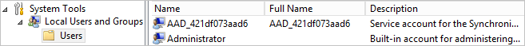

<properties
   pageTitle="Azure AD-verbinden: Konten und Berechtigungen | Microsoft Azure"
   description="In diesem Thema werden die Konten verwendet und erstellt und die erforderlichen Berechtigungen."
   services="active-directory"
   documentationCenter=""
   authors="billmath"
   manager="femila"
   editor=""/>

<tags
   ms.service="active-directory"  
   ms.workload="identity"
   ms.tgt_pltfrm="na"
   ms.devlang="na"
   ms.topic="article"
   ms.date="10/04/2016"
   ms.author="billmath"/>

# Azure AD-verbinden: Konten und Berechtigungen
Der Assistent zum Installieren von Azure AD verbinden bietet zwei verschiedenen Wege:

- In Express-Einstellungen benötigt der Assistent mehr Rechte, damit sie Ihre Konfiguration einfach, einrichten können, ohne dass Sie die Benutzer erstellen oder Konfigurieren von Berechtigungen separat.

- In den benutzerdefinierten Einstellungen der Assistent bietet weitere Auswahlmöglichkeiten und Optionen, aber es gibt Situationen, in denen müssen Sie sicherstellen, dass Sie die erforderlichen Berechtigungen verfügen selbst.

## Verwandte Dokumentation
Wenn Sie nicht die Dokumentation zur [Integration von Ihrem lokalen Identitäten mit Azure Active Directory](../active-directory-aadconnect.md)gelesen, bietet in der folgenden Tabelle Links zu verwandten Themen.

Thema |  
--------- | ---------
Installieren Sie Express-Einstellungen | [Express-Installation von Azure AD-verbinden](active-directory-aadconnect-get-started-express.md)
Installieren Sie die angepasste Einstellungen verwenden | [Benutzerdefinierte Installation von Azure AD-verbinden](active-directory-aadconnect-get-started-custom.md)
Upgrade von DirSync | [Aktualisieren von Azure Active Directory-Synchronisierungstool (DirSync)](active-directory-aadconnect-dirsync-upgrade-get-started.md)

## Express-Einstellungen-installation
In den Express-Einstellungen fragt der Assistenten zum Installieren für AD DS Enterprise Administrator-Anmeldeberechtigungen, damit Ihre lokalen Active Directory mit den erforderlichen Berechtigungen für Azure AD Verbinden konfiguriert werden können. Wenn Sie ein Upgrade von DirSync sind, werden die Anmeldeinformationen für die AD DS-Unternehmensadministratoren zum Zurücksetzen des Kennworts für das von DirSync verwendete Konto verwendet. Sie benötigen ferner Azure AD globaler Administrator-Anmeldeinformationen.

Seite des Assistenten  | Gesammelten Anmeldeinformationen | Erforderliche Berechtigungen| Für verwendet
------------- | ------------- |------------- |-------------
N/V|Ausführen des Installationsassistenten Benutzer| Administrator des lokalen Servers| <li>Erstellt das lokale Konto, das als das [Synchronisieren-Engine Dienstkontos](#azure-ad-connect-sync-service-account)verwendet wird.
Herstellen einer Verbindung Azure AD mit| Azure AD-Directory-Anmeldeinformationen | Globale Administratorrolle in Azure AD- | <li>Aktivieren im Verzeichnis Azure AD-synchronisieren.</li>  <li>Erstellung von [Azure AD-Kontos](#azure-ad-service-account) , der für Vorgänge fortlaufend synchronisieren in Azure AD verwendet wird.</li>
Herstellen einer Verbindung AD DS mit | Lokalen Active Directory-Anmeldeinformationen | Mitglied der Gruppe Enterprise Administratoren (EA) in Active Directory.| <li>Erstellt ein [Konto](#active-directory-account) in Active Directory und Berechtigungen darauf gewährt. Dieses Konto erstellt wird zum Lesen und Schreiben von Verzeichnisinformationen während der Synchronisierung.</li>

### Enterprise-Administrator-Anmeldeberechtigungen
Diese Anmeldeinformationen werden nur während der Installation und nach Abschluss die Installation verwendet werden. Es ist Enterprise-Administrator und nicht Domäne-Administrator, um sicherzustellen, dass die Berechtigungen in Active Directory in allen Domänen festgelegt werden können.

### Globaler Administrator-Anmeldeberechtigungen.
Diese Anmeldeinformationen werden nur während der Installation verwendet und sind nicht verwendet werden, nachdem die Installation abgeschlossen ist. Hiermit wird das Synchronisieren von Änderungen Azure AD verwendete [Azure AD-Konto](#azure-ad-service-account) erstellen. Das Konto ermöglicht synchronisieren auch als ein Feature in Azure Active Directory.

### Berechtigungen für den erstellten AD DS-Konto für express-Einstellungen
Das [Konto](#active-directory-account) zum Lesen und Schreiben in AD DS erstellt haben, beim Erstellen von express-Einstellungen folgenden Berechtigungen:

Berechtigung | Für verwendet
---- | ----
<li>Repliziert Directory Änderungen</li><li>Repliziert Verzeichnis ändert sich alle | Kennwort synchronisieren
/ Lese alle Eigenschaften Benutzer | Importieren und Exchange-hybrid
/ Lese alle Eigenschaften iNetOrgPerson | Importieren und Exchange-hybrid
/ Lese gruppieren alle Eigenschaften | Importieren und Exchange-hybrid
/ Lese wenden Sie sich an alle Eigenschaften | Importieren und Exchange-hybrid
Zum Zurücksetzen von Kennwörtern | Vorbereitung für das Kennwort abgeschlossenen writebackvorgängen aktivieren

## Benutzerdefinierte Einstellungen-installation
Wenn Sie benutzerdefinierte Einstellungen verwenden zu können, muss das Konto verwendet, um eine Verbindung mit Active Directory vor der Installation erstellt werden. Die Berechtigungen, die Sie diesem Konto zuweisen müssen finden Sie in [der AD DS-Konto erstellen](#create-the-ad-ds-account).

Seite des Assistenten  | Gesammelten Anmeldeinformationen | Erforderliche Berechtigungen| Für verwendet
------------- | ------------- |------------- |-------------
N/V | Ausführen des Installationsassistenten Benutzer|<li>Administrator des lokalen Servers</li><li>Wenn eine vollständige SQL Server verwenden zu können, muss der Benutzer System Administrator (SA) in SQL sein.</li>| Standardmäßig erstellt das lokale Konto, das als das [Synchronisieren-Engine Dienstkontos](#azure-ad-connect-sync-service-account)verwendet wird. Das Konto wird nur erstellt, wenn der Administrator ein bestimmtes Konto keinen angibt.
Installieren von Synchronisierungsdienste, Option Service-Konto | Active Directory oder lokale Anmeldeinformationen | Benutzer werden vom Assistenten Berechtigungen gewährt. | Wenn der Administrator ein Konto gibt an, wird dieses Konto für den Synchronisierungsdienst als Dienstkonto verwendet.
Herstellen einer Verbindung Azure AD mit | Azure AD-Directory-Anmeldeinformationen| Globale Administratorrolle in Azure AD-| <li>Aktivieren im Verzeichnis Azure AD-synchronisieren.</li>  <li>Erstellung von [Azure AD-Kontos](#azure-ad-service-account) , der für Vorgänge fortlaufend synchronisieren in Azure AD verwendet wird.</li>
Verbinden Sie Ihre Verzeichnisse durchsuchen | Lokalen Active Directory-Anmeldeinformationen für die einzelnen Gesamtstrukturen, die mit Azure AD verbunden ist | Die Berechtigungen abhängig sind, welche Features aktivieren, und finden Sie unter [Erstellen der AD DS-Konto](#create-the-ad-ds-account) |Dieses Konto wird zum Lesen und Schreiben Verzeichnisinformationen während der Synchronisierung verwendet.
AD FS-Server | Für jeden Server in der Liste sammelt Assistenten Anmeldeinformationen, wenn die Anmeldeinformationen des Benutzers Ausführen des Assistenten Verbindung nicht ausreichend sind | Domain-Administrator | Installation und Konfiguration von ADFS-Server-Rolle.
Web-Anwendung Proxy-Servern |Für jeden Server in der Liste sammelt Assistenten Anmeldeinformationen, wenn die Anmeldeinformationen des Benutzers Ausführen des Assistenten Verbindung nicht ausreichend sind | Lokale Administrator auf dem Zielcomputer | Installation und Konfiguration von WAP Serverrolle.
Proxy-Trust-Anmeldeinformationen |Föderation Dienst vertrauen (die Anmeldeinformationen des Proxys verwendet, um registrieren für ein Vertrauenszertifikat, aus der FS-Anmeldeinformationen |Domänenkonto, ein lokaler Administrator des Servers AD FS ist | Ursprüngliche Registrierung FS-WAP Trust Zertifikats.
AD FS-Dienstkontos Seite "Verwenden Sie eine Domäne Konto Benutzeroption" | Active Directory-Anmeldeinformationen | Domänenbenutzer | Das AD-Benutzerkonto, dessen Anmeldeinformationen bereitgestellt werden, wird als des Kontos Anmeldung der AD FS-Dienst verwendet.

### Erstellen Sie das AD DS-Konto
Bei der Installation von Azure AD verbinden, das Konto aus, die Sie auf der Seite **Verbinden Ihrer Verzeichnisse** angeben muss in Active Directory vorhanden sein und haben erforderlichen Berechtigungen gewährt. Der Assistent zum Installieren überprüft nicht, dass die Berechtigungen und Probleme bei der Synchronisierung nur gefunden werden.

Welche Berechtigungen, die Sie benötigen, hängt von der optionale Features ermöglichen. Wenn Sie mehrere Domänen haben, müssen die Berechtigungen für alle Domänen in der Gesamtstruktur erteilt werden. Wenn Sie eine der folgenden Features nicht aktivieren, sind die **Domänenbenutzer** Standardberechtigungen ausreichend.

Feature | Berechtigungen
------ | ------
Kennwort synchronisieren | <li>Repliziert Directory Änderungen</li>  <li>Repliziert Verzeichnis ändert sich alle
Exchange-hybridbereitstellung | Schreiben Sie Berechtigungen in den Attributen, die für Benutzer, Gruppen und Kontakten in [Exchange-Hybrid abgeschlossenen writebackvorgängen](../active-directory-aadconnectsync-attributes-synchronized.md#exchange-hybrid-writeback) dokumentierten.
Kennwort abgeschlossenen writebackvorgängen | Schreiben Sie Berechtigungen auf die [erste](../active-directory-passwords-getting-started.md#step-4-set-up-the-appropriate-active-directory-permissions) Schritte mit der Verwaltung der Kennwörter für Benutzer dokumentierten Attribute ein.
Gerät abgeschlossenen writebackvorgängen | Mit einem Powershellskript in [Gerät abgeschlossenen writebackvorgängen](../active-directory-aadconnect-feature-device-writeback.md)beschriebenen Berechtigungen.
Gruppe abgeschlossenen writebackvorgängen | Lesen Sie, erstellen Sie, aktualisieren Sie und löschen Sie die von Gruppenobjekten in der Organisationseinheit, in dem die Verteilergruppen befinden soll.

## Upgrade
Beim upgrade von einer Version von Azure AD verbinden auf einer neuen Version benötigen Sie die folgenden Berechtigungen:

Hauptbenutzer | Erforderliche Berechtigungen | Für verwendet
---- | ---- | ----
Ausführen des Installationsassistenten Benutzer | Administrator des lokalen Servers | Aktualisieren von Binärdateien.
Ausführen des Installationsassistenten Benutzer | Mitglied von ADSyncAdmins | Ändern Sie die Synchronisierung Regeln und andere Konfiguration.
Ausführen des Installationsassistenten Benutzer | Wenn Sie ein vollständiges SQLServer verwenden: DBO (oder eine ähnliche) der Datenbank-Engine synchronisieren | Stellen Sie die Datenbank Änderungen auf Websiteebene vorzunehmen, wie etwa Tabellen mit neuen Spalten aktualisieren.

## Weitere Informationen zu den erstellten Konten

### Active Directory-Konto
Wenn Sie auf express-Einstellungen verwenden, wird ein Konto in Active Directory erstellt, die für die Synchronisierung verwendet wird. Das erstellte Konto befindet sich im Container Benutzer Domänen und verfügt über deren Namen mit dem Präfix **MSOL_**. Das Konto wird durch ein Kennwort lange komplexe erstellt, das nicht abläuft. Wenn Sie Ihre Domäne einen Kennwortrichtlinien haben, stellen Sie sicher, dass lange und komplexe Kennwörter für dieses Konto zulässig wäre.

### Azure AD verbinden synchronisieren Dienstkonten
(Es sei denn, Sie angeben, dass das Konto aus, in den benutzerdefinierten Einstellungen verwenden), wird ein lokale Dienstkonto vom Assistenten erstellt. Das Konto ist mit dem Präfix **AAD_** und verwendet für den Synchronisierungsdienst tatsächlichen, als auszuführen. Wenn Sie auf einem Domain Controller Azure AD verbinden installiert haben, wird das Konto in der Domäne erstellt. Bei Verwendung von einem Remoteserver mit SQLServer oder wenn Sie einen Proxy verwenden, der Authentifizierung erforderlich ist, muss die **AAD_** Dienstkontos in der Domäne befinden.

Das Konto wird durch ein Kennwort lange komplexe erstellt, das nicht abläuft.

Dieses Konto wird verwendet, um die Kennwörter für die anderen Konten auf sichere Weise zu speichern. Diese anderen Konten Kennwörter werden verschlüsselt in der Datenbank gespeichert. Die privaten Schlüssel für die Verschlüsselung Tasten mit der Verschlüsselung mit Schlüssel geheim cryptographic Services mit Windows Data Protection API (DPAPI) geschützt sind. Sie sollten nicht das Kennwort des Dienstkontos zurücksetzen, da Windows dann der Schlüssel für die Verschlüsselung aus Sicherheitsgründen verloren.

Wenn Sie eine vollständige SQL Server verwenden, ist das Dienstkonto der Datenbankbesitzer der erstellten Datenbank für die Synchronisierung-Engine. Der Dienst funktioniert nicht wie beabsichtigt mit einem beliebigen anderen Berechtigungen. Außerdem wird eine SQL-Anmeldung erstellt.

Das Konto ist auch Berechtigungen auf Dateien, Registrierungsschlüsseln und anderen Objekten im Zusammenhang mit der Synchronisierung-Engine gewährt.

### Azure AD-Dienstkontos
Für die Verwendung des Diensts synchronisieren wird ein Konto in Azure Active Directory erstellt. Dieses Konto kann mit ihrem Anzeigenamen identifiziert werden.

Der Namen des Servers ein, der das Konto verwendet wird, kann im zweiten Teil des Benutzernamens identifiziert werden. In der Abbildung ist der Servername FABRIKAMCON. Wenn Sie das staging-Server haben, weist jede Server eigene Rechnung. Es gibt maximal 10 synchronisieren Dienstkonten in Azure Active Directory.

Das Dienstkonto wird durch ein Kennwort lange komplexe erstellt, das nicht abläuft. Es wird eine besondere Rolle **Directory-Synchronisierung Konten** gewährt werden, die nur Berechtigungen zum Ausführen von Synchronisierungsaufgaben Verzeichnis verfügt. Azure-Portal zeigt dieses Konto mit der Rolle **Benutzer**, und diese spezielle integrierte Rolle kann nicht außerhalb des Assistenten Azure AD verbinden gewährt.

## Nächste Schritte

Erfahren Sie mehr über die [Integration von Ihrem lokalen Identitäten mit Azure Active Directory](../active-directory-aadconnect.md).
