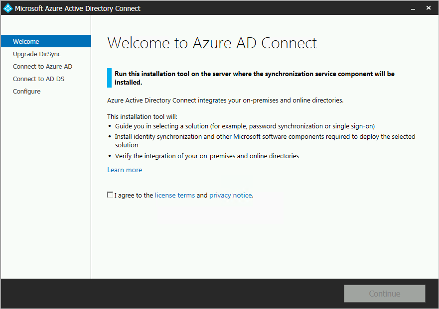
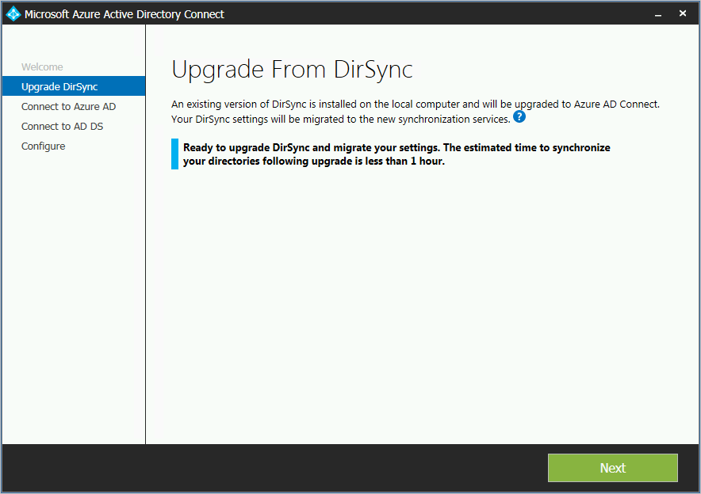
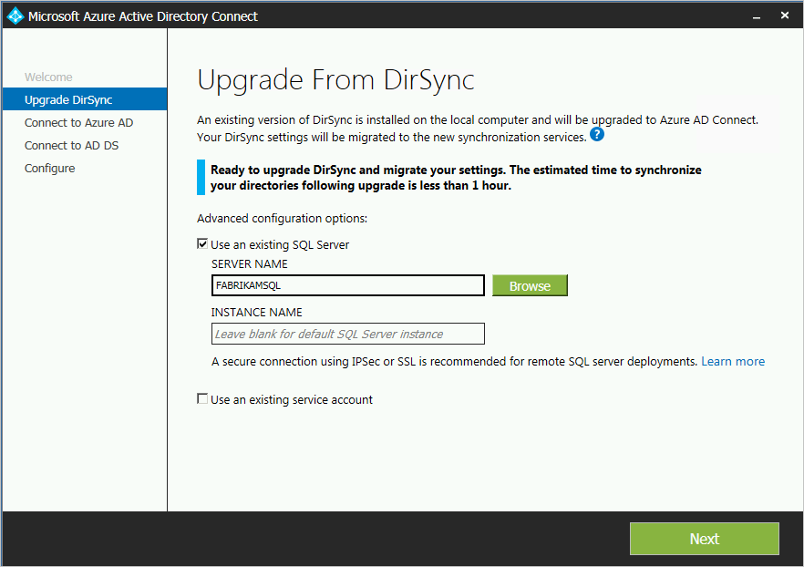
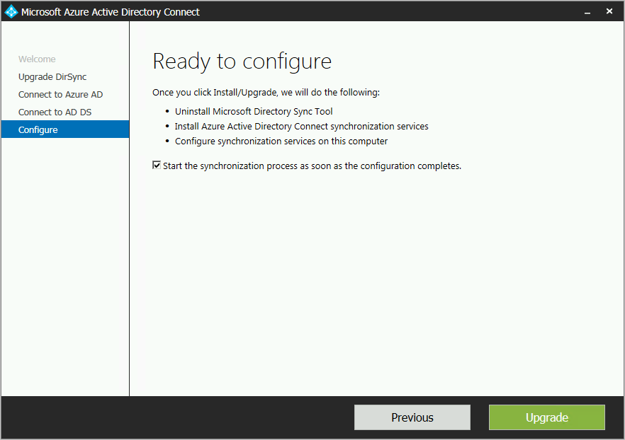
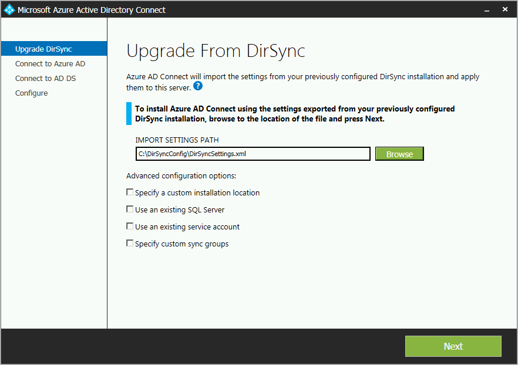

<properties
   pageTitle="Azure AD verbinden: Aktualisieren von DirSync | Microsoft Azure"
   description="Informationen Sie zum Aktualisieren von DirSync auf Azure AD verbinden. Dieser Artikel beschreibt die Schritte zum Aktualisieren von DirSync auf Azure AD verbinden."
   services="active-directory"
   documentationCenter=""
   authors="andkjell"
   manager="femila"
   editor=""/>

<tags
   ms.service="active-directory"
   ms.workload="identity"
   ms.tgt_pltfrm="na"
   ms.devlang="na"
   ms.topic="get-started-article"
   ms.date="08/19/2016"
   ms.author="shoatman;billmath"/>

# Azure AD verbinden: Upgrade von DirSync
Verbinden von Azure AD ist der Nachfolger von DirSync. Sie finden die Verfahren, die Sie in diesem Thema von DirSync aktualisieren können. Diese Schritte funktionieren nicht für das Upgrade von einer anderen Version von Azure AD verbinden oder Azure AD synchronisieren.

Vorbereitung der Installation von Azure AD-Verbindung herstellen, vergewissern Sie sich zum [Herunterladen von Azure AD verbinden](http://go.microsoft.com/fwlink/?LinkId=615771) und Schließen der Voraussetzung Schritte im [Azure AD verbinden: Hardware und Voraussetzungen für](../active-directory-aadconnect-prerequisites.md). Insbesondere möchten lesen, Sie zu den folgenden, da diese Bereiche von DirSync unterscheiden:

- Die erforderliche Version von .net und PowerShell. Neuere Versionen müssen auf dem Server als was DirSync erforderlich sein.
- Konfiguration des Proxyservers. Wenn Sie einen Proxyserver verwenden, mit dem Internet herstellen, muss diese Einstellung konfiguriert sein, bevor Sie aktualisieren. DirSync immer für den Benutzer, installieren es so konfiguriert, dass den Proxyserver verwendet, aber Azure AD verbinden verwendet Computer Einstellungen stattdessen.
- Die URLs erforderlich ist, in dem Proxyserver geöffnet sein. Für grundlegende Szenarios, die auch von DirSync unterstützten, sind die Anforderungen identisch. Wenn Sie die neuen Features enthaltenen Azure AD verbinden verwenden möchten, müssen einige neue URLs geöffnet werden.

Wenn Sie nicht von DirSync durchführen, finden Sie in anderen Szenarien [zugehörigen Dokumentationsdateien](#related-documentation) .

## Upgrade von DirSync
Es gibt verschiedene Optionen für die Aktualisierung, abhängig von der aktuellen Dirsync-Bereitstellung. Ist die erwartete Upgrade Zeit weniger als drei Stunden, wird empfohlen, ein Upgrade von in-situ durchzuführen. Ist die erwartete Upgrade Zeit mehr als drei Stunden, wird empfohlen, führen Sie eine parallele Bereitstellung auf einem anderen Server. Es wird geschätzt, wenn Sie mehr als 50.000 Objekte weisen mehr als drei Stunden für die Aktualisierung dauert.

Szenario |  
---- | ----
[In-Place-Aktualisierung](#in-place-upgrade)  | Bevorzugte Option, wenn die Aktualisierung weniger als 3 Stunden dauern soll.
[Parallele Bereitstellung](#parallel-deployment) | Bevorzugte Option, wenn die Aktualisierung mehr als 3 Stunden dauern soll.

>[AZURE.NOTE] Wenn Sie ein upgrade von DirSync auf Azure AD-Verbindung herstellen möchten, deinstallieren Sie nicht DirSync selbst vor dem Upgrade. Azure AD verbinden gelesen und die Konfiguration von DirSync migrieren und deinstallieren Sie nach dem Server zu prüfen.

**In-Place-Aktualisierung**  
Vom Assistenten wird die erwartete Zeit für die Aktualisierung angezeigt. Diese Schätzung basiert auf der Annahme, dass das dauert drei Stunden für eine Aktualisierung für eine Datenbank mit 50.000 Objekte (Benutzer, Kontakte und Gruppen). Ist die Anzahl der Objekte in Ihrer Datenbank weniger als 50.000, empfiehlt Azure AD Verbinden eines in-situ-Upgrades. Wenn Sie sich entscheiden, um den Vorgang fortzusetzen, Ihrer aktuellen Einstellungen werden automatisch während des Upgrades angewendet und der Server nimmt automatisch wieder aktiven Synchronisierung.

Wenn Sie eine Konfiguration Migration führen, und führen Sie eine parallele Bereitstellung möchten, können Sie das Upgrade in-situ-Empfehlungen überschreiben. Sie können beispielsweise die Möglichkeit, aktualisieren die Hardware und das Betriebssystem dauern. Finden Sie im Abschnitt [parallele Bereitstellung](#parallel-deployment) Weitere Informationen ein.

**Parallele Bereitstellung**  
Wenn Sie mehr als 50.000 Objekte haben, wird dann eine parallele Bereitstellung empfohlen. Dadurch wird vermieden keinerlei Betrieb von Ihren Benutzern erfahrene Verzögerung. Verbinden von Azure AD-Installation versucht wird, zum Schätzen der Ausfall für die Aktualisierung verwendet, doch wenn Sie in der Vergangenheit DirSync aktualisiert haben, Ihrer eigenen Erfahrung ist wahrscheinlich die beste Leitfaden.

### Unterstützte DirSync Konfigurationen aktualisiert werden
Die folgende Konfiguration, die Änderungen mit DirSync unterstützt werden, wird ein Upgrade ausgeführt:

- Domäne und Organisationseinheit filtern
- Alternative ID (Benutzerprinzipalnamen)
- Kennwort synchronisieren und Einstellungen für Exchange-hybrid
- Ihre Gesamtstruktur-als und Azure AD-Einstellungen
- Filtern basierend auf Benutzerattributen

Die folgende Änderung kann nicht aktualisiert werden. Wenn Sie diese Konfiguration haben, wird das Upgrade blockiert:

- Nicht unterstützte DirSync Änderungen, entfernt zum Beispiel Attribute und die Verwendung einer benutzerdefinierten Erweiterung DLL

In diesen Fällen empfiehlt es sich, einen neuen Azure AD verbinden Server in [das staging Modus](../active-directory-aadconnectsync-operations.md#staging-mode) installieren und überprüfen den alten DirSync und Konfiguration der neuen Azure AD verbinden. Erneutes Anwenden Sie mit benutzerdefinierten Konfiguration vornehmen, wie [benutzerdefinierte](../active-directory-aadconnectsync-whatis.md)Konfiguration Azure AD verbinden synchronisieren beschrieben.

Die Kennwörter von DirSync für die Dienstkonten verwendet können nicht abgerufen werden und nicht migriert werden. Während der Aktualisierung werden diese Kennwörter zurücksetzen.

### Allgemeinen Schritte zum Aktualisieren von DirSync auf Azure AD-verbinden

1. Willkommen bei Azure AD verbinden
2. Analyse der aktuellen Dirsync-Konfiguration
3. Sammeln Sie Azure AD-globaler Administratorkennwort
4. Sammeln von Anmeldeinformationen für ein Enterprise-Administrator-Konto (nur während der Installation von Azure AD verbinden verwendet)
5. Installation von Azure AD verbinden
    * Deinstallieren von DirSync (oder vorübergehend zu deaktivieren)
    * Verbinden von Azure AD-Installation
    * Startet die Synchronisierung optional

Zusätzliche Schritte sind erforderlich, wenn:

* Sie sind derzeit vollständigen SQL Server - lokalen oder einer Remotedatenbank verwenden.
* Sie haben mehr als 50.000 Objekte im Bereich für die Synchronisierung

## In-Place-Aktualisierung

1. Starten Sie das Installationsprogramm Azure AD-verbinden (MSI).
2. Überprüfen Sie, und stimmen Sie Lizenzbedingungen und Datenschutzhinweis.

3. Klicken Sie auf Weiter, um die Analyse Ihrer vorhandenen Dirsync-Installation zu starten.

4. Wenn die Analyse abgeschlossen ist, wird die Empfehlungen über die Vorgehensweise.  
    - Im folgenden Bildschirm wird angezeigt, wenn Sie SQL Server Express verwenden, haben weniger als 50.000 Objekte: 
    - Wenn Sie eine vollständige SQL Server für DirSync verwenden, lesen Sie dieser Seite stattdessen:   
Die Informationen zu den vorhandenen SQL Server-Datenbankserver von DirSync verwendet wird, wird angezeigt. Nehmen Sie entsprechende Anpassungen vor, falls erforderlich. Klicken Sie auf **Weiter** , um die Installation fortzusetzen.
    - Wenn Sie mehr als 50.000 Objekten arbeiten, lesen Sie dieser Bildschirm stattdessen:   
Um eine Aktualisierung in-situ fortzusetzen, klicken Sie auf das Kontrollkästchen neben diese Meldung: **Aktualisierung DirSync auf diesem Computer fortzusetzen.**
Um eine [parallele Bereitstellung](#parallel-deployment) stattdessen durchzuführen, exportieren die Einstellungen der Dirsync-Konfiguration und die Konfiguration auf den neuen Server verschieben.
5. Geben Sie das Kennwort für das Konto ein, das Sie aktuell verwenden, um die Verbindung mit Azure AD. Dies muss das aktuell von DirSync verwendete Konto ein.
  
Wenn Sie eine Fehlermeldung und haben Probleme mit der Konnektivität, finden Sie unter [Behandeln von Verbindungsproblemen](../active-directory-aadconnect-troubleshoot-connectivity.md).
6. Geben Sie ein Enterprise-Administratorkonto für Active Directory.

7. Sie nun können zum Konfigurieren. Wenn Sie auf **Aktualisieren**klicken, DirSync deinstalliert und Azure AD Verbinden konfiguriert ist und mit der Synchronisierung beginnt.

8. Nach Abschluss die Installation, melden Sie sich ab, und melden Sie sich erneut bei Windows vor der Synchronisierung Dienst-Manager, Synchronisierung Regel-Editor verwenden oder versuchen, stellen Sie andere konfigurationsänderungen vornehmen.

## Parallele Bereitstellung

### Exportieren Sie die Dirsync-Konfiguration
**Parallele Bereitstellung mit mehr als 50.000 Objekten**

Wenn Sie mehr als 50.000 Objekte haben, empfiehlt es sich bei die Installation Azure AD verbinden um eine parallele Bereitstellung.

Ein Bildschirm ähnlich wie der folgende wird angezeigt:

Wenn Sie die parallele Bereitstellung fortsetzen möchten, müssen Sie die folgenden Schritte ausführen:

- Klicken Sie auf die Schaltfläche **Einstellungen exportieren** . Bei der Installation von auf einem separaten Server Azure AD verbinden, werden diese Einstellungen der neuen Azure AD verbinden Installation aus Ihrer aktuellen DirSync migriert.

Nachdem Sie Ihre Einstellungen erfolgreich exportiert haben, können Sie den Assistenten Azure AD verbinden auf dem Server DirSync beenden. Fahren Sie mit dem nächsten Schritt fort, [Azure AD verbinden auf einem separaten Server zu installieren](#installation-of-azure-ad-connect-on-separate-server)

**Parallele Bereitstellung mit weniger als 50.000 Objekten**

Wenn Sie weniger als 50.000 Objekte haben aber immer noch eine parallele Bereitstellung tun möchten, klicken Sie dann folgendermaßen Sie vor:

1. Führen Sie das Installationsprogramm Azure AD-verbinden (MSI).
2. Wenn der Bildschirm **Willkommen bei Azure AD verbinden** angezeigt wird, beenden Sie den Assistenten zum Installieren, indem Sie auf das "X" in der oberen rechten Ecke des Fensters.
3. Öffnen Sie ein Eingabeaufforderungsfenster.
4. Vom Speicherort installieren der Azure AD-verbinden (Standard: c:\Programme c:\Programme\Microsoft Azure Active Directory eine Verbindung herstellen) den folgenden Befehl ausführen:  `AzureADConnect.exe /ForceExport`.
5. Klicken Sie auf die Schaltfläche **Einstellungen exportieren** .  Bei der Installation von auf einem separaten Server Azure AD verbinden, werden diese Einstellungen der neuen Azure AD verbinden Installation aus Ihrer aktuellen DirSync migriert.

Nachdem Sie Ihre Einstellungen erfolgreich exportiert haben, können Sie den Assistenten Azure AD verbinden auf dem Server DirSync beenden. Fahren Sie mit dem nächsten Schritt fort, [Azure AD verbinden auf einem separaten Server zu installieren](#installation-of-azure-ad-connect-on-separate-server)

### Installieren von Azure AD verbinden auf separaten server

Wenn Sie Azure AD verbinden auf einem neuen Server installieren, wird vorausgesetzt, dass Sie Ausführen eine ordnungsgemäßen Installation von Azure AD-Verbindung herstellen möchten. Da Sie die Dirsync-Konfiguration verwenden möchten, gibt es jedoch einige zusätzliche Schritte ausführen:

1. Führen Sie das Installationsprogramm Azure AD-verbinden (MSI).
2. Wenn der Bildschirm **Willkommen bei Azure AD verbinden** angezeigt wird, beenden Sie den Assistenten zum Installieren, indem Sie auf das "X" in der oberen rechten Ecke des Fensters.
3. Öffnen Sie ein Eingabeaufforderungsfenster.
4. Vom Speicherort installieren der Azure AD-verbinden (Standard: c:\Programme c:\Programme\Microsoft Azure Active Directory eine Verbindung herstellen) den folgenden Befehl ausführen:  `AzureADConnect.exe /migrate`.
    Die Azure AD verbinden-Installation-Assistent wird gestartet und bietet Ihnen die folgenden Bildschirm: 
5. Wählen Sie die Einstellungsdatei, die aus der Dirsync-Installation exportiert.
6. Konfigurieren Sie die geeignete erweiterten Optionen, einschließlich:
    - Eine benutzerdefinierte Installation Downloadspeicherort Azure AD verbinden.
    - Eine vorhandene Instanz von SQL Server (Standard: Azure AD Verbinden mit SQL Server 2012 Express-Installationen). Verwenden Sie nicht die gleiche Datenbankinstanz als Dirsync-Server.
    - Ein Dienstkonto verwendet, um die Verbindung mit SQL Server (wenn die SQL Server-Datenbank und dann dieses Konto ein Domänendienstkonto sein muss remote ist).
Diese Optionen können auf dieser Bildschirm dargestellt werden: 
7. Klicken Sie auf **Weiter**.
8. Lassen Sie auf der Seite **So konfigurieren Sie bereit sind** , **Starten Sie den Synchronisierungsprozess sofort nach Abschluss der Konfiguration** aktiviert. Der Server ist nun in [das staging Modus](../active-directory-aadconnectsync-operations.md#staging-mode) , damit die Änderungen zu Azure AD nicht exportiert werden.
9. Klicken Sie auf **Installieren**.
10. Nach Abschluss die Installation, melden Sie sich ab, und melden Sie sich erneut bei Windows vor der Synchronisierung Dienst-Manager, Synchronisierung Regel-Editor verwenden oder versuchen, stellen Sie andere konfigurationsänderungen vornehmen.

>[AZURE.NOTE] Synchronisierung zwischen Windows Server Active Directory und Azure Active Directory beginnt, aber keine Änderungen in Azure AD exportiert werden. Nur eine Synchronisierungstool kann Änderungen aktiv nacheinander exportiert werden. Dieser Status wird [das staging Modus](../active-directory-aadconnectsync-operations.md#staging-mode)bezeichnet.

### Vergewissern Sie sich, dass Azure AD verbinden Synchronisierung beginnen kann

Zum Überprüfen, dass Azure AD-Verbinden von DirSync übernehmen werden kann, müssen Sie in der Gruppe **Azure AD verbinden** über das Startmenü **Synchronisierung Dienst-Manager** zu öffnen.

Wechseln Sie in der Anwendung die auf die Registerkarte **Vorgänge** . Auf dieser Registerkarte zu bestätigen, dass die folgenden Vorgänge abgeschlossen haben:

- Importieren, auf dem AD-Connector
- Importieren der Azure AD-Netzwerke
- Vollständige Synchronisieren der AD-Verbinder
- Vollständige Synchronisieren der Azure AD-Verbinder

Überprüfen Sie das Ergebnis aus dieser Vorgänge aus, und stellen Sie sicher, dass keine Fehler vorliegen.

Wenn Sie möchten, finden Sie unter, und prüfen die Änderungen, die zum nach Azure AD zu exportierenden gelesen werden, klicken Sie dann so überprüfen die Konfiguration unter [staging Modus](../active-directory-aadconnectsync-operations.md#staging-mode). Nehmen Sie erforderliche Konfiguration Änderungen, bis Sie nichts unerwartete nicht angezeigt werden.

Sie können nun von DirSync zur Azure AD zu wechseln, wenn Sie diese Schritte ausgeführt haben und mit dem Ergebnis zufrieden sind.

### Deinstallieren von DirSync (alten Server)

- Finden Sie unter **Programme und Funktionen** **Windows Azure Active Directory-Synchronisierungstool**
- Deinstallieren von **Windows Azure Active Directory-Synchronisierungstool**
- Die Deinstallation kann bis zu 15 Minuten dauern.

Wenn Sie DirSync später deinstallieren lieber, können Sie auch vorübergehend fahren Sie den Server oder deaktivieren Sie den Dienst. Wenn ein Problem auftritt, können Sie diese Methode um wieder zu aktivieren. Jedoch wird nicht erwartet, dass im nächste Schritt schlägt fehl, damit diese nicht erforderlich sein sollte.

Mit DirSync deinstalliert oder deaktiviert gibt es keine active Server zu Azure AD exportieren. Im nächste Schritt zur Azure AD verbinden aktivieren muss abgeschlossen sein, bevor Änderungen in Ihrem lokalen Active Directory weiterhin in Azure Active Directory synchronisiert werden.

### Aktivieren von Azure AD verbinden (neue Server)
Nach der Installation werden Azure AD wird verbinden können Sie zusätzliche Konfiguration Änderungen vornehmen. Starten Sie **Azure AD verbinden** , über das Startmenü oder die Verknüpfung auf dem Desktop. Stellen Sie sicher, dass nicht zu versuchen, die Installation MSI erneut starten.

Sie sollten Folgendes angezeigt:

- Wählen Sie **konfigurieren das staging Modus**aus.
- Deaktivieren der staging durch Deaktivieren das Kontrollkästchen **staging Modus aktiviert** .

- Klicken Sie auf die Schaltfläche **Weiter**
- Klicken Sie auf der Bestätigungsseite auf die Schaltfläche **Installieren** .

Verbinden von Azure AD ist jetzt Ihrer active Server aus.

## Nächste Schritte
Jetzt, da Sie Azure AD verbinden installiert haben, können Sie [die Installation überprüfen und Zuweisen von Lizenzen](../active-directory-aadconnect-whats-next.md).

Erfahren Sie mehr über diese neuen Features, die bei der Installation aktiviert wurden: [Automatische Aktualisierung](../active-directory-aadconnect-feature-automatic-upgrade.md) [verhindern unbeabsichtigtes löscht](../active-directory-aadconnectsync-feature-prevent-accidental-deletes.md)und [Azure AD verbinden Dienststatus](../active-directory-aadconnect-health-sync.md).

Weitere Informationen zu diesen allgemeinen Themen: [Scheduler und wie Sie synchronisieren auslösen](../active-directory-aadconnectsync-feature-scheduler.md).

Erfahren Sie mehr über die [Integration von Ihrem lokalen Identitäten mit Azure Active Directory](../active-directory-aadconnect.md).

## Verwandte Dokumentation

Thema |  
--------- | ---------
Azure AD verbinden (Übersicht) | [Integrieren von Ihrem lokalen Identitäten in Azure Active Directory](../active-directory-aadconnect.md)
Upgrade von einer früheren Version von verbinden | [Upgrade von einer früheren Version von verbinden](../active-directory-aadconnect-upgrade-previous-version.md)
Installieren Sie Express-Einstellungen | [Express-Installation von Azure AD-verbinden](active-directory-aadconnect-get-started-express.md)
Verwenden von benutzerdefinierten Einstellungen installieren | [Benutzerdefinierte Installation von Azure AD-verbinden](active-directory-aadconnect-get-started-custom.md)
Konten für die Installation verwendet | [Weitere Informationen zum Verbinden von Azure AD-Konten und Berechtigungen](active-directory-aadconnect-accounts-permissions.md)
