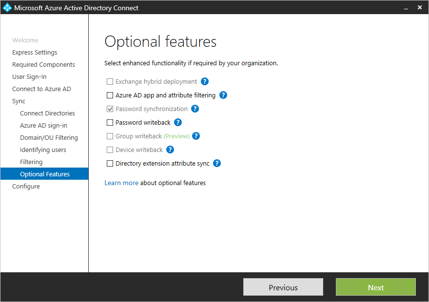
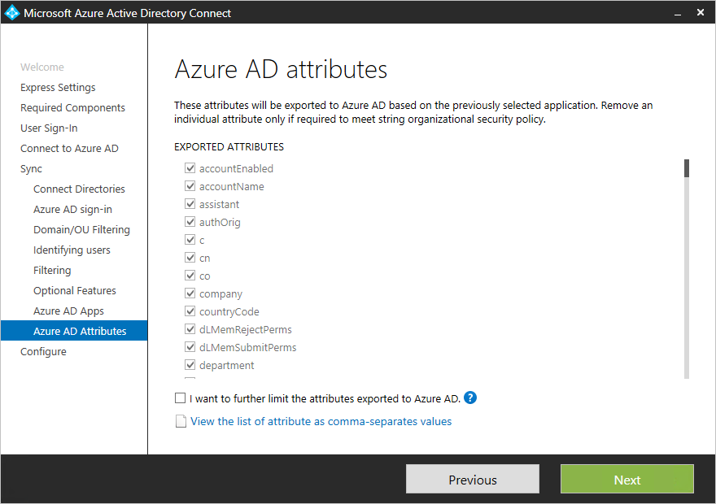
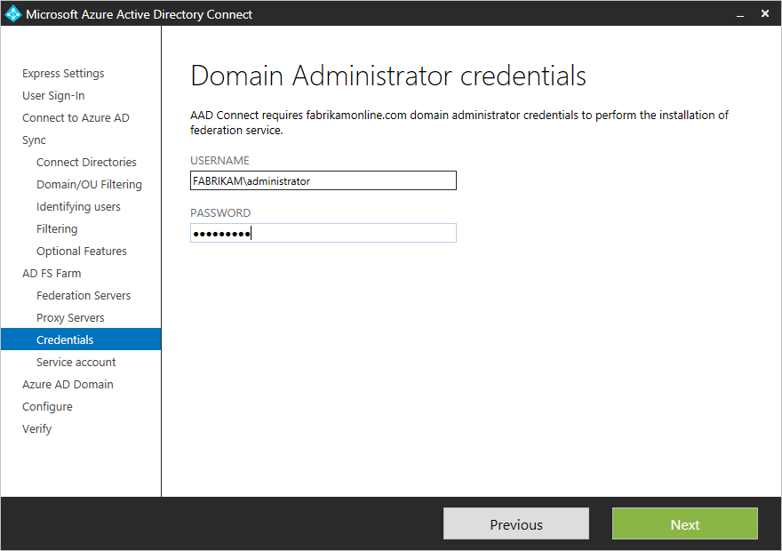
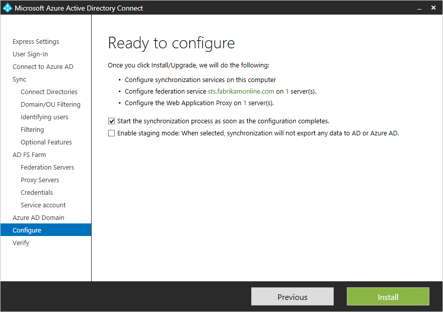

<properties
    pageTitle="Azure AD-verbinden: Die benutzerdefinierte Installation | Microsoft Azure"
    description="Dieses Dokument beschreibt die benutzerdefinierten Installationsoptionen für Azure AD verbinden. Gehen Sie folgendermaßen vor, um Active Directory durch Azure AD verbinden zu installieren."
    services="active-directory"
    keywords="Was ist Azure AD verbinden, installieren Sie Active Directory, erforderlichen Komponenten für Azure AD"
    documentationCenter=""
    authors="andkjell"
    manager="femila"
    editor="curtand"/>

<tags
    ms.service="active-directory"  
    ms.workload="identity"
    ms.tgt_pltfrm="na"
    ms.devlang="na"
    ms.topic="get-started-article"
    ms.date="09/13/2016"
    ms.author="billmath"/>

# Benutzerdefinierte Installation von Azure AD-verbinden
Azure AD verbinden **Benutzerdefinierte Einstellungen** wird verwendet, wenn Sie weitere Optionen für die Installation möchten. Es wird verwendet, wenn Sie mehrere Gesamtstrukturen haben, oder wenn Sie optional in die express-Installation nicht behandelt Features konfigurieren möchten. Es wird in allen Fällen verwendet, in dem die Option [**express-Installation**](active-directory-aadconnect-get-started-express.md) Ihrer Bereitstellung oder Suchtopologie nicht kompatibel sind.

Vorbereitung der Installation von Azure AD-Verbindung herstellen, vergewissern Sie sich zum [Herunterladen von Azure AD verbinden](http://go.microsoft.com/fwlink/?LinkId=615771) und Schließen der Voraussetzung Schritte im [Azure AD verbinden: Hardware und Voraussetzungen für](../active-directory-aadconnect-prerequisites.md). Stellen Sie auch sicher, dass Sie erforderliche Konten verfügbar, wie unter [Verbinden von Azure AD-Konten und Berechtigungen](active-directory-aadconnect-accounts-permissions.md)verfügt.

Wenn Einstellungen angepasst entspricht der Suchtopologie, beispielsweise zum upgrade DirSync finden Sie unter [Zusammenhang Dokumentation](#related-documentation) für andere Szenarien nicht.

## Benutzerdefinierte Einstellungen Installation von Azure AD-verbinden

### Express-Einstellungen
Klicken Sie auf dieser Seite auf **Anpassen** , um einen benutzerdefinierten Einstellungen Installation zu starten.

### Installieren Sie die erforderliche Komponenten
Wenn Sie die Synchronisierungsdienste installiert haben, lassen Sie im Abschnitt optionale Konfiguration nicht aktiviert und Azure AD verbinden richtet alles automatisch. Eine Instanz von SQL Server 2012 Express LocalDB richtet, die entsprechenden Gruppen erstellen und Zuweisen von Berechtigungen. Wenn Sie die Standardeinstellungen ändern möchten, können in der folgenden Tabelle Sie um die Optionen optionale Konfiguration zu verstehen, die verfügbar sind.

Optionale Konfiguration  | Beschreibung
------------- | -------------
Verwenden einer vorhandenen SQL Server | Können Sie den SQL Server-Namen und den Instanznamen angeben. Wählen Sie diese Option, wenn Sie bereits einen Datenbankserver verfügen, den Sie verwenden möchten. Geben Sie den Instanznamen gefolgt von einer Zahl mit Komma und den Port **Instanznamen** , wenn Ihre SQL Server keinen Browsen aktiviert.
Verwenden Sie ein vorhandenes Dienstkonto | Azure AD verbinden erstellt standardmäßig einen lokalen Dienstkontos für die Synchronisierungsdienste verwenden. Das Kennwort wird automatisch generierten "und" unbekannt an die Person, die Installation von Azure AD verbinden. Wenn Sie einen entfernten SQL Server, oder verwenden Sie einen Proxy, der Authentifizierung erforderlich ist, benötigen Sie einen Dienst Konto in der Domäne und das Kennwort kennen. Geben Sie in diesen Fällen Dienstkonto verwenden. Sicherstellen Sie, dass der Benutzer mit der Installation ist eine SA in SQL aus, damit eine Anmeldung für das Dienstkonto erstellt werden kann. Finden Sie unter [Verbinden von Azure AD-Konten und Berechtigungen](active-directory-aadconnect-accounts-permissions.md#custom-settings-installation)
Synchronisieren von benutzerdefinierten Gruppen angeben | Wenn erstellt standardmäßig Azure AD verbinden vier Gruppen lokal auf dem Server die Synchronisierungsdienste installiert sind. Diese Gruppen sind: Administratorgruppe, Operatorengruppe, durchsuchen Gruppe und der Gruppe "Kennwort zurücksetzen". Sie können eigene Gruppen hier angeben. Die Gruppen auf dem Server lokal sein und können sich nicht in der Domäne.

### Benutzer anmelden
Nach der Installation von erforderlichen Komponenten, werden Sie aufgefordert, Ihre Benutzer einzelne anmelden Methode auszuwählen. Die folgende Tabelle enthält eine kurze Beschreibung der verfügbaren Optionen. Eine vollständige Beschreibung der Methoden Anmeldung finden Sie unter [Benutzer anmelden](../active-directory-aadconnect-user-signin.md).

Single Sign On-option | Beschreibung
------------- | -------------
Kennwort synchronisieren | Benutzer können sich anmelden bei Microsoft Cloud-Dienste, wie Office 365, in ihrem lokalen Netzwerk verwendeten dasselbe Kennwort verwenden können. Die Kennwörter der Benutzer zu Azure AD als eine Kennworthash synchronisiert werden und Authentifizierung tritt auf, in der Cloud. Weitere Informationen finden Sie unter [Synchronisierung von Kennwörtern](../active-directory-aadconnectsync-implement-password-synchronization.md) .
Föderation mit AD FS | Benutzer können sich anmelden bei Microsoft Cloud-Dienste, wie Office 365, in ihrem lokalen Netzwerk verwendeten dasselbe Kennwort verwenden können.  Die Benutzer umgeleitet werden in ihrer lokalen AD FS Instanz fest, um sich anzumelden und Authentifizierung erfolgt lokal.
Nicht konfigurieren | Weder Feature installiert und konfiguriert ist. Wählen Sie diese Option, wenn Sie bereits eine 3rd Party Föderation Server oder einer anderen vorhandenen Lösung angeordnet haben.

### Herstellen einer Verbindung Azure AD mit
Geben Sie auf Verbinden zum Bildschirm Azure AD-ein globaler Administrator-Konto und das Kennwort ein. Wenn Sie **einen Partnerverbund mit AD FS** auf der vorherigen Seite ausgewählt haben, melden Sie sich nicht mit einem Konto in einer Domäne, dass Sie für die Föderation aktivieren möchten. Wird eine empfohlen, ein Konto in der Standarddomäne **"onmicrosoft.com"** verwenden, die mit Ihrem Verzeichnis Azure AD-stammt.

Dieses Konto dient nur zum Erstellen eines Dienstkontos in Azure Active Directory und nicht verwendet wird, nach Beendigung des Assistenten.  

Wenn Ihr Konto globaler Administrator MFA aktiviert wurde, müssen Sie geben Sie das Kennwort erneut in das Popup-in, und führen Sie die MFA Herausforderung. Die Herausforderung könnte eine Bereitstellen einer Überprüfungscode oder einen Anruf.  

Globaler Administrator-Konto kann auch [Berechtigten Identitätsmanagement](../active-directory-privileged-identity-management-getting-started.md) aktiviert haben.

Wenn Sie eine Fehlermeldung erhalten, und haben Probleme mit der Konnektivität, lesen Sie [Behandeln von Verbindungsproblemen](../active-directory-aadconnect-troubleshoot-connectivity.md).

## Klicken Sie im Abschnitt synchronisieren Seiten

### Verbinden Sie Ihre Verzeichnisse durchsuchen
Zum Verbinden mit Ihrer Active Directory-Domänendienste-benötigt Azure AD verbinden die Anmeldeinformationen für ein Konto mit den entsprechenden Berechtigungen. Sie können entweder NetBIOS- oder das FQDN-Format, das heißt, FABRIKAM\syncuser oder fabrikam.com\syncuser Teil der Domäne eingeben. Dieses Konto kann ein normales Benutzerkonto sein, da die Leseberechtigungen Standard nur benötigt. Abhängig von Ihrem Szenario benötigen Sie möglicherweise weitere Berechtigungen. Weitere Informationen finden Sie unter [Azure AD verbinden Konten und Berechtigungen](../active-directory-aadconnect-accounts-permissions.md#create-the-ad-ds-account)

### Azure AD-Anmeldung-Konfiguration
Auf dieser Seite können Sie überprüfen Sie die Benutzerprinzipalnamen Domänen präsentieren im lokalen AD DS und welche in Azure AD überprüft wurden. Auf dieser Seite können auch so konfigurieren Sie das Attribut für die UserPrincipalName verwendet werden soll.

  
Überprüfen Sie jeder Domäne **Nicht hinzugefügt** und **Nicht überprüft**gekennzeichnet. Stellen Sie sicher, dass diese Domänen, die Sie verwenden in Azure AD überprüft wurden. Wenn Sie Domänen überprüft haben, klicken Sie auf das Symbol aktualisieren. Weitere Informationen finden Sie unter [Hinzufügen und überprüfen die Domäne](../active-directory-add-domain.md)

**UserPrincipalName** - Attribut UserPrincipalName ist das Attribut Benutzer verwenden, wenn Azure AD anmelden und Office 365. Die Domänen verwendet, auch bekannt als das Benutzerprinzipalnamen-Suffix, sollten in Azure AD, damit die Benutzer synchronisiert werden überprüft werden. Microsoft empfiehlt UserPrincipalName Attribut standardmäßig beibehalten. Wenn dieses Attribut nicht geroutet ist und kann nicht bestätigt werden, ist es möglich, ein weiteres Attribut auszuwählen. Sie können beispielsweise e-Mail als das Attribut, halten die Anmelde-ID auswählen. Verwenden ein anderes Attribut als UserPrincipalName wird als **Alternative ID**bezeichnet. Alternativer Wert muss den standardmäßigen RFC822 folgen. Mit Kennwort synchronisieren und Föderation kann eine alternative Kennung verwendet werden.

>[AZURE.WARNING]
Verwenden eine alternative Kennung ist nicht mit allen Office 365-Auslastung kompatibel. Weitere Informationen finden Sie in den [Alternativen Benutzernamen konfigurieren](https://technet.microsoft.com/library/dn659436.aspx).

### Domäne und Organisationseinheit filtern
Standardmäßig werden alle Domänen und Organisationseinheiten synchronisiert. Wenn es gibt einige Domänen oder Organisationseinheiten, die Sie nicht mit Azure AD synchronisieren möchten, können Sie diese Domänen und Organisationseinheiten Auswahl aufheben.  
 ist dieser Seite des Assistenten konfigurieren von Domänen basierendes filtern. Weitere Informationen finden Sie unter [Domänen basierendes Filtern](../active-directory-aadconnectsync-configure-filtering.md#domain-based-filtering).

Es ist es möglich, dass einige Domänen nicht aufgrund einer Firewall erreichbar sind. Diese Domänen sind standardmäßig deaktiviert und verfügen über eine Warnung.  
  
Wenn Sie diese Warnung angezeigt wird, stellen Sie sicher, dass diese Domänen tatsächlich um nicht erreichbar sind, wird die Warnung erwartet.

### Eindeutig identifizieren Ihre Benutzer
Die übereinstimmende über Gesamtstrukturen Feature können Sie festlegen, wie Benutzer aus Ihrer AD DS-Gesamtstrukturen in Azure AD dargestellt werden. Ein Benutzer möglicherweise entweder dargestellt werden nur einmal in allen Gesamtstrukturen oder eine Kombination von Konten aktiviert und deaktiviert haben. Der Benutzer kann auch als Kontakt in einigen Gesamtstrukturen dargestellt werden.

Einstellung | Beschreibung
------------- | -------------
[Benutzer werden nur einmal in allen Gesamtstrukturen dargestellt.](../active-directory-aadconnect-topologies.md#multiple-forests-separate-topologies) | Alle Benutzer werden als einzelne Objekte in Azure Active Directory erstellt. Die Objekte sind im Metaverse angeschlossen.
[E-Mail-Attribut](../active-directory-aadconnect-topologies.md#multiple-forests-full-mesh-with-optional-galsync) | Diese Option verknüpft Benutzer und Kontakte an, wenn das Attribut Mail in verschiedenen Gesamtstrukturen denselben Wert aufweist. Verwenden Sie diese Option aus, wenn Sie Ihre Kontakte mit GALSync erstellt wurden.
[ObjectSID und MsExchangeMasterAccountSID / MsRTCSIP-OriginatorSid](../active-directory-aadconnect-topologies.md#multiple-forests-account-resource-forest) | Diese Option verknüpft einen aktivierten Benutzer in einer Kontogesamtstruktur mit einen deaktivierten Benutzer in einer Ressourcengesamtstruktur. In Exchange, wird diese Konfiguration als ein verknüpftes Postfach bezeichnet. Diese Option kann auch verwendet werden, wenn Sie nur die Lync verwenden und Exchange nicht in der Ressourcengesamtstruktur vorhanden ist.
sAMAccountName und MailNickName | Diese Option verknüpft auf Attributen, wenn erwartet wird, dass die Anmelde-ID für den Benutzer gefunden werden kann.
Ein bestimmtes Attribut | Mit dieser Option können Sie Ihre eigenen Attribut auswählen. **Einschränkung:** Vergewissern Sie sich ein Attribut auswählen, der bereits im Metaverse gefunden werden kann. Wenn Sie ein benutzerdefiniertes Attribut (nicht im Metaverse) auswählen, wird der Assistent kann nicht abgeschlossen.

**Quelle Anker** - das Attribut SourceAnchor ist ein Attribut, die während der Lebensdauer eines Objekts Benutzer unveränderlich ist. Es ist den Primärschlüssel den lokale Benutzer mit der Benutzer in Azure AD verknüpfen. Da das Attribut geändert werden kann, müssen Sie eine gute das zu verwendende Attribut planen. Ein guter Kandidat ist die Objekt-GUID. Dieses Attribut wird nicht geändert, es sei denn, das Benutzerkonto zwischen Gesamtstrukturen/Domänen verschoben wird. In einer Umgebung mit mehreren Gesamtstrukturen, in dem Sie Konten zwischen Gesamtstrukturen verschieben, muss ein weiteres Attribut, wie etwa ein Attribut mit der EmployeeID verwendet werden. Vermeiden von Attributen, die ändern, wenn eine Person heiratet oder Zuordnungen ändern möchten. Können keine Attribute mit einer @-sign, , damit e-Mail- und UserPrincipalName verwendet werden können. Das Attribut ist auch Groß-/Kleinschreibung beachtet also, wenn Sie ein Objekt zwischen Gesamtstrukturen verschieben möchten, stellen Sie sicher, die/Kleinschreibung beibehalten. Binäre Attribute werden base64-codierte, aber andere Arten Attribut im Zustand nicht codierte bleiben. Föderation Szenarien und einige Azure AD-Schnittstellen ist dieses Attribut auch bekannt als ImmutableID. Weitere Informationen zu den Anker Quelle kann in den [Entwurfskonzepte](../active-directory-aadconnect-design-concepts.md#sourceAnchor)gefunden werden.

### Synchronisieren Filtern basierend auf Gruppen
Die Filterung Gruppen Feature, können Sie nur eine kleine Teilmenge von Objekten für eines Pilotprojekts synchronisieren. Wenn Sie dieses Feature verwenden möchten, erstellen Sie eine Gruppe für diesen Zweck in Ihrem lokalen Active Directory. Fügen Sie dann Benutzer und Gruppen aus, die synchronisiert werden sollen Azure AD als direkte Mitglieder hinzu. Sie können später hinzufügen und Entfernen von Benutzern zu dieser Gruppe zum Verwalten der Liste der Objekte, die in Azure AD vorhanden sein sollten. Alle Objekte, die Sie synchronisieren möchten, muss ein direktes Mitglied der Gruppe. Benutzer, Gruppen, Kontakte und Computer/Geräte müssen alle direkte Mitglieder sein. Geschachtelte Gruppenmitgliedschaft nicht behoben wurde. Wenn Sie eine Gruppe hinzufügen, wie ein Element, das nur die Gruppe selbst hinzugefügt wird und nicht auf deren Mitglieder.

>[AZURE.WARNING]
Dieses Feature ist nur eine Pilotprojekte Bereitstellung unterstützen soll. Verwenden Sie diese nicht in einer vollständigen Herstellung Bereitstellung.

In einer vollständigen Herstellung Bereitstellung werden jetzt schwer zu verwalten eine Gruppe mit allen Objekten synchronisiert werden. Verwenden Sie stattdessen eine der Methoden in [konfigurieren zu filtern](../active-directory-aadconnectsync-configure-filtering.md).

### Optionale Features
Auf dieser Seite können Sie die optionale Features für Ihre spezifischen Szenarios auswählen.

>[AZURE.WARNING]
Wenn Sie aktuell DirSync oder Azure AD synchronisieren aktiven verfügen, aktivieren Sie die abgeschlossenen writebackvorgängen Features in Azure AD Verbinden nicht.

Optionale Features | Beschreibung
------------------- | -------------
Exchange-Hybridbereitstellung | Das Exchange-Hybridbereitstellung Feature ermöglicht das gemeinsame Vorhandensein des Exchange-Postfächer beide lokal und in Office 365. Azure AD verbinden wird wieder in Ihrem lokalen Verzeichnis von einer bestimmten Folge von [Attributen](../active-directory-aadconnectsync-attributes-synchronized.md#exchange-hybrid-writeback) aus Azure Active Directory synchronisiert.
Azure AD-app und Attribut filtern | Aktivieren Sie Azure AD-app und Attribut filtern, kann der Satz von synchronisierten Attributen angepasst werden. Diese Option hinzugefügt dem Assistenten zwei weitere Konfigurationsseiten. Weitere Informationen finden Sie unter [Azure AD-app und Attribut zu filtern](#azure-ad-app-and-attribute-filtering).
Synchronisierung von Kennwörtern | Wenn Sie als die Lösung Anmeldung Föderation ausgewählt haben, können Sie diese Option aktivieren. Synchronisierung von Kennwörtern kann dann als Sicherung Option verwendet werden. Weitere Informationen finden Sie unter [Synchronisierung von Kennwörtern](../active-directory-aadconnectsync-implement-password-synchronization.md).
Kennwort abgeschlossenen writebackvorgängen | Aktivieren Sie das Kennwort abgeschlossenen writebackvorgängen, Kennwort Änderungen, die in Azure AD stammen ist geschrieben wieder zu Ihrem lokalen Verzeichnis. Weitere Informationen finden Sie unter [Erste Schritte mit der Verwaltung der Kennwörter](../active-directory-passwords-getting-started.md).
Gruppe abgeschlossenen writebackvorgängen | Wenn Sie die **Gruppen von Office 365** -Funktion verwenden, können Sie diesen Gruppen in Ihrem lokalen Active Directory dargestellt haben. Diese Option ist nur verfügbar, wenn Exchange in Ihrer lokalen Active Directory vorhanden ist. Weitere Informationen finden Sie in der [Gruppe abgeschlossenen writebackvorgängen](../active-directory-aadconnect-feature-preview.md#group-writeback).
Gerät abgeschlossenen writebackvorgängen | Können Sie abgeschlossenen writebackvorgängen Geräteobjekte in Azure AD zu Ihrem lokalen Active Directory für bedingten Zugriffsszenarien. Weitere Informationen finden Sie unter [Aktivieren Gerät abgeschlossenen writebackvorgängen in Azure AD-Verbindung herstellen](../active-directory-aadconnect-feature-device-writeback.md).
Verzeichnis Erweiterung Attribut synchronisieren | Aktivieren Sie Directory Erweiterungen Attribut synchronisieren, werden angegebenen Attribute auf Azure AD synchronisiert. Weitere Informationen finden Sie unter [Verzeichnis Erweiterungen](../active-directory-aadconnectsync-feature-directory-extensions.md).

### Azure AD-app und Attribut filtern
Wenn Sie die zu synchronisierenden zu Azure AD Attribute beschränken möchten, beginnen Sie, indem Sie auf welche Dienste, die Sie verwenden auswählen. Wenn Sie auf dieser Seite Konfiguration Änderungen vornehmen, muss eine neue Dienstleistung explizit ausgewählt werden, indem Sie den Installationsassistenten erneut.

Basierend auf den Diensten, die im vorherigen Schritt ausgewählte, werden auf dieser Seite alle Attribute, die synchronisiert werden. Diese Liste ist eine Kombination aus allen Objekttypen synchronisiert werden. Wenn es einige bestimmten Attributen, die Sie nicht synchronisieren müssen gibt, können Sie diese Attribute Auswahl aufheben.

>[AZURE.WARNING]
Entfernen von Attributen kann die Funktionalität auswirken. Bewährte Methoden und Empfehlungen finden Sie unter [Attribute synchronisiert](../active-directory-aadconnectsync-attributes-synchronized.md#attributes-to-synchronize).

### Verzeichnis Erweiterung Attribut synchronisieren
Sie können das Schema in Azure AD mit benutzerdefinierten Attributen, die von Ihrer Organisation oder andere Attribute in Active Directory hinzugefügt erweitern. Um dieses Feature verwenden zu können, wählen Sie auf der Seite **Optionale Features** **Directory Extension Attribut synchronisieren** aus. Sie können weitere Attribute synchronisieren auf dieser Seite auswählen.

Weitere Informationen finden Sie unter [Verzeichnis Erweiterungen](../active-directory-aadconnectsync-feature-directory-extensions.md).

## Konfigurieren von Föderation mit AD FS
Konfigurieren von AD FS mit Azure AD verbinden ist einfach, mit nur wenigen Mausklicks. Bevor Sie die Konfiguration ist erforderlich.

- Ein Windows Server 2012 R2-Server für die Föderation mit remote-Verwaltung aktiviert
- Einem Server Windows Server 2012 R2 für den Web-Anwendung Proxyserver mit remote-Verwaltung aktiviert
- Ein SSL-Zertifikat für den Namen der Föderation Dienst ausgefüllt werden sollen (beispielsweise sts.contoso.com) verwenden.

### Erforderliche Komponenten für AD FS-Konfiguration
Zum Konfigurieren Ihrer AD FS-Farm mit Azure AD verbinden, stellen Sie sicher, dass WinRM auf remote-Servern aktiviert ist. Darüber hinaus aufzurufen Sie, die in der [Tabelle 3: Verbinden der Azure AD und Föderation Servern/WAP](../active-directory-aadconnect-ports.md#table-3---azure-ad-connect-and-federation-serverswap)aufgeführten Ports Anforderung.

### Erstellen einer neuen AD FS-Farm oder verwenden Sie eine vorhandene AD FS-farm
Können Sie eine vorhandene AD FS-Farm oder Sie können auch eine neue AD FS-Farm zu erstellen. Wenn Sie zum Erstellen eines neuen Kontos auswählen, müssen Sie das SSL-Zertifikat bereitstellen. Wenn das SSL-Zertifikat durch ein Kennwort geschützt ist, werden Sie aufgefordert, das Kennwort ein.

Wenn Sie eine vorhandene AD FS-Serverfarm verwenden, werden Sie direkt zum Konfigurieren der Vertrauensstellung zwischen AD FS und Azure AD-Bildschirm übernommen.

### Geben Sie die AD FS-Server
Geben Sie die Servern, denen Sie auf AD FS installieren möchten. Sie können einen oder mehrere Server basierend auf Ihrer Kapazität, Planung Anforderungen hinzufügen. Teilnehmen an alle Server in Active Directory vor dem Durchführen dieser Konfiguration. Microsoft empfiehlt einen einzelnen ADFS-Server für Test- und Pilotprojekts Bereitstellungen zu installieren. Klicken Sie dann hinzufügen und weitere Server an Ihre Skalierung Anforderungen durch Ausführen der Azure AD verbinden erneut nach der Konfiguration bereitstellen.

>[AZURE.NOTE]
Stellen Sie sicher, dass alle Server in einer AD-Domäne verknüpft sind, bevor Sie diese Konfiguration ausführen.

### Geben Sie die Web-Anwendungsproxy-Server
Geben Sie die Server, die als Ihre Webanwendung Proxy-Servern verwendet werden soll. Die Anwendung Proxy Webserver in Ihrer DMZ (extranet Facing) bereitgestellt wird und unterstützt Authentifizierungsanfragen aus dem extranet. Sie können einen oder mehrere Server basierend auf Ihrer Kapazität, Planung Anforderungen hinzufügen. Microsoft empfiehlt einen einzelnen Web Anwendung Proxyserver für Test- und Pilotprojekts Bereitstellungen zu installieren. Klicken Sie dann hinzufügen und weitere Server an Ihre Skalierung Anforderungen durch Ausführen der Azure AD verbinden erneut nach der Konfiguration bereitstellen. Es empfiehlt sich, eine entsprechende Zahl von Proxy-Server zum Authentifizierung aus dem Intranet erfüllen müssen.

>[AZURE.NOTE]
<li> Wenn das von Ihnen verwendete Konto keines lokalen Administrators auf dem AD FS-Servern ist, werden Sie für Administrator-Anmeldeberechtigungen aufgefordert.</li>
<li> Stellen Sie sicher, dass das HTTP-/HTTPS-Konnektivität zwischen dem Verbinden von Azure AD-Server und der Web-Anwendung Proxyserver vorhanden ist, bevor Sie diesen Schritt ausführen.</li>
<li> Stellen Sie sicher, dass das HTTP-/HTTPS-Konnektivität zwischen Authentifizierungsanfragen auf verarbeitet zulassen der Anwendung Webserver und dem AD FS-Server besteht.</li>

Sie werden aufgefordert, Anwendungsinformationen eingeben, damit der Anwendung Webserver eine sichere Verbindung mit dem AD FS-Server herstellen kann. Diese Anmeldeinformationen müssen ein lokaler Administrator auf dem ADFS-Server sein.

### Angeben des Dienstkontos für den AD FS-Dienst
Der AD FS-Dienst erfordert eine Domäne Dienstkontos zu Authentifizierung von Benutzern und Nachschlagen Benutzerinformationen in Active Directory. Sie können zwei Arten von Dienstkonten unterstützen:

- **Gruppe verwaltete Dienstkontos** - in den Active Directory-Domänendiensten mit WindowsServer 2012 eingeführt werden. Diese Art von Konto bietet Dienste, wie z. B. AD FS, ein einzelnes Benutzerkonto, ohne dass das Kontokennwort regelmäßig aktualisiert werden müssen. Verwenden Sie diese Option, wenn Sie bereits Windows Server 2012 Domain Controller in der Domäne verfügen, denen Ihre AD FS-Server angehören.
- **Domänenbenutzerkonto** – diese Art von Konto müssen Sie über ein Kennwort eingeben und das Kennwort regelmäßig zu aktualisieren, wenn das Kennwort geändert oder läuft ab. Verwenden Sie diese Option nur, wenn Sie Windows Server 2012 Domain Controller nicht in der Domäne haben, die Ihre AD FS-Server angehören.

Wenn Sie dieses Feature in Active Directory nie verwendet wurde und Sie der Gruppe verwaltete Dienstkontos ausgewählt haben, werden Sie aufgefordert, Enterprise Administrator-Anmeldeberechtigungen. Diese Anmeldeinformationen werden zum Initiieren des wichtigsten Store, und aktivieren Sie das Feature in Active Directory.

### Wählen Sie die Azure AD-Domäne, die Sie zusammenarbeitet möchten
Diese Konfiguration wird verwendet, um die Einrichtung der Föderation Beziehung zwischen AD FS und Azure AD. Es konfiguriert AD FS zu Problem Sicherheitstokens zu Azure AD- und konfiguriert Azure AD, um die Token aus dieser bestimmten AD FS-Instanz als vertrauenswürdig einzustufen. Auf dieser Seite können Sie eine einzelne Domäne in der Erstinstallation konfigurieren. Sie können mehrere Domänen später konfigurieren, indem Azure AD verbinden erneut ausführen.

### Überprüfen der Azure AD-Domäne, die für die Föderation aktiviert
Wenn Sie die Domäne verbunden sein auswählen, bietet Azure AD verbinden erforderlichen Informationen zur Überprüfung einer Domäne nicht überprüften. Finden Sie unter [Hinzufügen und überprüfen die Domäne](../active-directory-add-domain.md) wie Sie mithilfe dieser Informationen.

>[AZURE.NOTE]
Verbinden von AD versucht, überprüfen Sie die Domäne in welcher Phase konfigurieren. Wenn Sie weiterhin konfigurieren, ohne die erforderlichen DNS-Einträge hinzufügen, kann der Assistent nicht um die Konfiguration abzuschließen.

## Konfigurieren und Seiten überprüfen
Die Konfiguration geschieht auf dieser Seite.

>[AZURE.NOTE]
Stellen Sie bevor Sie die Installation fortsetzen und Sie Föderation konfiguriert ist, sicher, dass Sie [mit einer Auflösung von Namen für die Föderation](../active-directory-aadconnect-prerequisites.md#name-resolution-for-federation-servers)konfiguriert haben.

### Staging-Modus
Es ist möglich, einen neuen Synchronisierungsserver parallel mit staging Modus einrichten. Es wird nur unterstützt, damit eine Synchronisierungsserver exportieren, um ein Verzeichnis in der Cloud. Wenn Sie von einem anderen Server, beispielsweise eine laufende DirSync, verschieben möchten dann kann jedoch aktiviert Azure AD verbinden in das staging Modus. Wenn aktiviert, die Synchronisierung-Engine importieren und Synchronisieren von Daten wie gewohnt, aber es werden keine Daten exportiert in Azure AD oder AD. Die Features Kennwort synchronisieren und das Kennwort abgeschlossenen writebackvorgängen werden deaktiviert, während Sie sich das staging Modus.

Im Modus staging, ist es möglich, nehmen erforderliche Änderungen an der Synchronisierungs-Engine und festzustellen, welche Informationen exportiert werden. Wenn die Konfiguration zusagt, führen Sie den Installationsassistenten erneut aus, und deaktivieren Sie staging Modus. Daten werden von diesem Server jetzt in Azure AD exportiert. Vergewissern Sie sich so deaktivieren Sie den anderen Server zur gleichen Zeit also nur einen Server ist aktiv exportieren.

Weitere Informationen finden Sie unter [Staging Modus](../active-directory-aadconnectsync-operations.md#staging-mode).

### Überprüfen Sie die Konfiguration der Föderation
Azure AD verbinden überprüft die DNS-Einstellungen für Sie, wenn Sie auf die Schaltfläche überprüfen klicken.

Darüber hinaus führen Sie die folgenden Überprüfungsschritte an:

- Überprüfen Sie, ob Sie über einen Browser von einer Domäne hinzugefügten Computer im Intranet anmelden können: eine Verbindung mit https://myapps.microsoft.com und der Anmeldung mit Ihrem Konto angemeldete überprüfen. Das integrierte AD DS-Administratorkonto ist nicht synchronisiert und kann nicht für die Überprüfung verwendet werden.
- Überprüfen Sie, ob Sie sich auf einem Gerät aus dem extranet anmelden können. Auf einem Computer für zu Hause oder einem mobilen Gerät herstellen einer Verbindung https://myapps.microsoft.com mit, und geben Sie Ihre Anmeldeinformationen ein.
- Überprüfen Sie die rich Client anmelden. Herstellen einer Verbindung https://testconnectivity.microsoft.com mit, und wählen Sie die **Office 365** -Registerkarte, und wählen Sie die **Office 365 einzelner anmelden Test**.

## Nächste Schritte
Nach Abschluss die Installation, melden Sie sich ab, und melden Sie sich erneut bei Windows vor der Verwendung von Synchronisierung Dienst-Manager oder Synchronisierung Regel-Editor.

Jetzt, da Sie Azure AD verbinden installiert haben, können Sie [die Installation überprüfen und Zuweisen von Lizenzen](../active-directory-aadconnect-whats-next.md).

Weitere Informationen zu diesen Features, die bei der Installation aktiviert wurden: [löscht unbeabsichtigtes verhindern](../active-directory-aadconnectsync-feature-prevent-accidental-deletes.md) und [Azure AD verbinden Dienststatus](../active-directory-aadconnect-health-sync.md).

Weitere Informationen zu diesen allgemeinen Themen: [Scheduler und wie Sie synchronisieren auslösen](../active-directory-aadconnectsync-feature-scheduler.md).

Erfahren Sie mehr über die [Integration von Ihrem lokalen Identitäten mit Azure Active Directory](../active-directory-aadconnect.md).

## Verwandte Dokumentation

Thema |  
--------- | ---------
Azure AD verbinden (Übersicht) | [Integrieren von Ihrem lokalen Identitäten in Azure Active Directory](../active-directory-aadconnect.md)
Installieren Sie Express-Einstellungen | [Express-Installation von Azure AD-verbinden](active-directory-aadconnect-get-started-express.md)
Upgrade von DirSync | [Aktualisieren von Azure Active Directory-Synchronisierungstool (DirSync)](active-directory-aadconnect-dirsync-upgrade-get-started.md)
Konten für die Installation verwendet | [Weitere Informationen zum Verbinden von Azure AD-Konten und Berechtigungen](active-directory-aadconnect-accounts-permissions.md)
