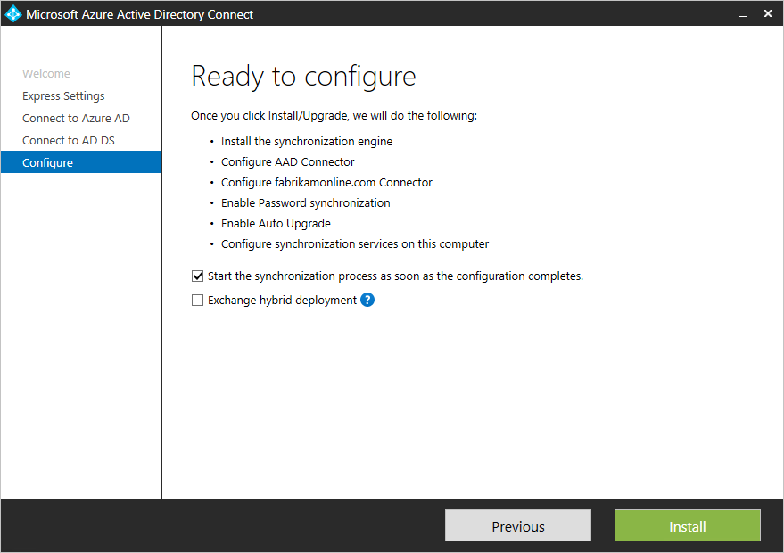

<properties
    pageTitle="Azure AD-verbinden: Erste Schritte mit express-Einstellungen | Microsoft Azure"
    description="Informationen Sie zum Herunterladen, installieren und starten Sie den Assistenten für Azure AD verbinden."
    services="active-directory"
    documentationCenter=""
    authors="andkjell"
    manager="femila"
    editor="curtand"/>

<tags
    ms.service="active-directory"
    ms.workload="identity"
    ms.tgt_pltfrm="na"
    ms.devlang="na"
    ms.topic="get-started-article"
    ms.date="09/13/2016"
    ms.author="billmath"/>

# Erste Schritte mit Azure AD Verbinden mit express-Einstellungen
Azure AD verbinden **Express-Einstellungen** wird verwendet, wenn Sie einen einzelnen Gesamtstruktur Suchtopologie und [Synchronisierung von Kennwörtern](../active-directory-aadconnectsync-implement-password-synchronization.md) für die Authentifizierung haben. **Express-Einstellungen** ist die Standardoption und für die am häufigsten bereitgestellte Szenario verwendet wird. Sie können nur ein paar kurze Mausklicks abwesend, um Ihre lokalen Verzeichnis in der Cloud zu erweitern.

Vorbereitung der Installation von Azure AD-Verbindung herstellen, vergewissern Sie sich zum [Herunterladen von Azure AD verbinden](http://go.microsoft.com/fwlink/?LinkId=615771) und Schließen der Voraussetzung Schritte im [Azure AD verbinden: Hardware und Voraussetzungen für](../active-directory-aadconnect-prerequisites.md).

Wenn express-Einstellungen entspricht nicht der Suchtopologie, finden Sie in anderen Szenarien [zugehörigen Dokumentationsdateien](#related-documentation) .

## Express-Installation von Azure AD-verbinden
Sie können Schritte in Aktion im Abschnitt [Videos](#videos) anzeigen.

1. Melden Sie sich als lokaler Administrator auf dem Server, Azure AD verbinden auf installiert werden sollen. Auf dem Server soll, werden die Synchronisierungsserver möchten.
2. Navigieren Sie zu, und doppelklicken Sie auf **AzureADConnect.msi**.
3. Aktivieren Sie auf dem Bildschirm Willkommen das Ihre an den Konditionen zur Lizenzierung, und klicken Sie auf **Weiter**.  
4. Klicken Sie auf **express-Einstellungen verwenden**, klicken Sie auf dem Bildschirm Express-Einstellungen.  

5. Klicken Sie auf Verbinden zum Bildschirm Azure AD-Geben Sie den Benutzernamen und das Kennwort für ein globaler Administrator für Ihre Azure AD aus. Klicken Sie auf **Weiter**.  
 Wenn Sie eine Fehlermeldung erhalten, und haben Probleme mit der Konnektivität, lesen Sie [Behandeln von Verbindungsproblemen](../active-directory-aadconnect-troubleshoot-connectivity.md).
6. Geben Sie auf mit dem AD DS-Bildschirm verbinden den Benutzernamen und das Kennwort für ein Enterprise-Administratorkonto ein. Sie können entweder NetBIOS- oder das FQDN-Format, d. h. FABRIKAM\administrator oder fabrikam.com\administrator Teil der Domäne eingeben. Klicken Sie auf **Weiter**.  

7. Die Seite [**Azure AD-Anmeldung Konfiguration**](../active-directory-aadconnect-user-signin.md#azure-ad-sign-in-configuration) zeigt nur, wenn Sie nicht in die [Voraussetzungen für](../active-directory-aadconnect-prerequisites.md) [Ihre Domänen überprüfen](../active-directory-add-domain.md) abgeschlossen haben.
  
Wenn Sie diese Seite angezeigt wird, überprüfen Sie dann jeder Domäne **Nicht hinzugefügt** und **Nicht überprüft**gekennzeichnet. Stellen Sie sicher, dass diese Domänen, die Sie verwenden in Azure AD überprüft wurden. Wenn Sie Domänen überprüft haben, klicken Sie auf das Symbol aktualisieren.
8. Klicken Sie auf die bereit zum Bildschirm konfigurieren klicken Sie auf **Installieren**.
    - Optional können Sie das Kontrollkästchen **Starten Sie den Synchronisierungsprozess, sobald die Konfiguration abgeschlossen ist** auf der Seite konfigurieren, deaktivieren. Sie sollten dieses Kontrollkästchen, wenn Sie zusätzliche Konfiguration, z. B. [Filtern](../active-directory-aadconnectsync-configure-filtering.md)tun möchten Aufheben der Markierung. Wenn Sie diese Option deaktivieren, wird der Assistent konfiguriert synchronisieren, aber bewirkt, dass den Scheduler deaktiviert. Es wird nicht ausgeführt, bis Sie manuell, indem Sie [den Installationsassistenten erneut](../active-directory-aadconnectsync-installation-wizard.md)aktivieren.
    - Wenn Sie in Ihrem lokalen Active Directory Exchange haben, müssen Sie auch eine Option zum Aktivieren der [**Exchange-hybridbereitstellung**](https://technet.microsoft.com/library/jj200581.aspx). Aktivieren Sie diese Option, wenn Sie beabsichtigen, Exchange-Postfächer sowohl in der Cloud und lokalen zur gleichen Zeit.

9. Wenn die Installation abgeschlossen ist, klicken Sie auf **Beenden**.
10. Nach Abschluss die Installation zum Melden Sie ab, und melden Sie sich erneut bevor Sie die Synchronisierung Dienst-Manager oder Synchronisierung Regel-Editor verwenden.

## Videos

Ein Video zur Verwendung von der express-Installations finden Sie unter:

>[AZURE.VIDEO azure-active-directory-connect-express-settings]

## Nächste Schritte
Jetzt, da Sie Azure AD verbinden installiert haben, können Sie [die Installation überprüfen und Zuweisen von Lizenzen](../active-directory-aadconnect-whats-next.md).

Weitere Informationen zu diesen Features, die bei der Installation aktiviert wurden: [Automatische Aktualisierung](../active-directory-aadconnect-feature-automatic-upgrade.md) [verhindern unbeabsichtigtes löscht](../active-directory-aadconnectsync-feature-prevent-accidental-deletes.md)und [Azure AD verbinden Dienststatus](../active-directory-aadconnect-health-sync.md).

Weitere Informationen zu diesen allgemeinen Themen: [Scheduler und wie Sie synchronisieren auslösen](../active-directory-aadconnectsync-feature-scheduler.md).

Erfahren Sie mehr über die [Integration von Ihrem lokalen Identitäten mit Azure Active Directory](../active-directory-aadconnect.md).

## Verwandte Dokumentation

Thema |  
--------- | ---------
Azure AD verbinden (Übersicht) | [Integrieren von Ihrem lokalen Identitäten in Azure Active Directory](../active-directory-aadconnect.md)
Verwenden von benutzerdefinierten Einstellungen installieren | [Benutzerdefinierte Installation von Azure AD-verbinden](active-directory-aadconnect-get-started-custom.md)
Upgrade von DirSync | [Aktualisieren von Azure Active Directory-Synchronisierungstool (DirSync)](active-directory-aadconnect-dirsync-upgrade-get-started.md)
Konten für die Installation verwendet | [Weitere Informationen zum Verbinden von Azure AD-Konten und Berechtigungen](active-directory-aadconnect-accounts-permissions.md)
