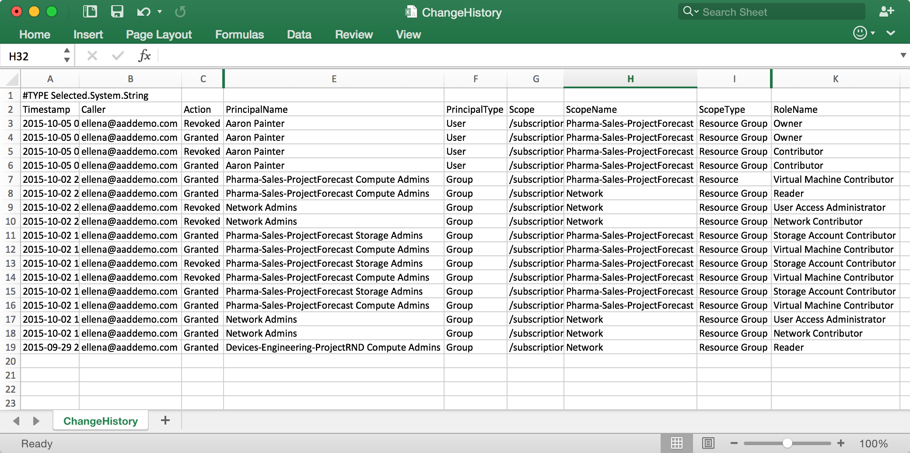

<properties
    pageTitle="Erstellen einen Access-Änderungsverlauf Bericht | Microsoft Azure"
    description="Generieren Sie Bericht, der alle Änderungen im Zugriff auf Ihre Azure-Abonnements mit rollenbasierte Access Control in den letzten 90 Tagen Listen."
    services="active-directory"
    documentationCenter=""
    authors="kgremban"
    manager="femila"
    editor=""/>

<tags
    ms.service="active-directory"
    ms.devlang="na"
    ms.topic="article"
    ms.tgt_pltfrm="na"
    ms.workload="identity"
    ms.date="08/03/2016"
    ms.author="kgremban"/>

# <a name="create-an-access-change-history-report"></a>Erstellen eines Access-Änderungsverlauf Berichts

Jederzeit gewährt oder hebt Access innerhalb Ihrer Abonnements, erhalten die Änderungen in Azure Ereignisse protokolliert. Sie können Berichten aus Access Änderungsverlauf in alle Änderungen der letzten 90 Tage finden Sie unter erstellen.

## <a name="create-a-report-with-azure-powershell"></a>Erstellen eines Berichts mit Azure PowerShell
Verwenden Sie zum Erstellen eines Access Änderungsverlauf-Berichts in PowerShell der `Get-AzureRMAuthorizationChangeLog` Befehl. Weitere Details zu diesem Cmdlet stehen in der [PowerShell-Katalog](https://www.powershellgallery.com/packages/AzureRM.Storage/1.0.6/Content/ResourceManagerStartup.ps1).

Wenn Sie diesen Befehl aufrufen, können Sie welche Eigenschaft der Arbeitsaufträge angeben, die gewünschte aufgelisteten, einschließlich der folgenden:

| Eigenschaft | Beschreibung |
| -------- | ----------- |
| **Aktion** | Gibt an, ob der Zugriff erteilt oder aufgehoben wurde |
| **Anrufer** | Der Besitzer der Access-Änderung verantwortlich |
| **Datum** | Datum und Uhrzeit, die Access geändert wurde |
| **DirectoryName** | Azure Active Directory-Verzeichnis |
| **' PrincipalName '** | Den Namen des Benutzers, der Gruppe oder einer Anwendung |
| **PrincipalType** | Gibt an, ob die Zuordnung für einen Benutzer, die Gruppe oder die Anwendung wurde |
| **RoleId** | Die GUID der Rolle, die erteilt oder widerrufen |
| **RoleName** | Die Rolle aus, die erteilt oder widerrufen |
| **ScopeName** | Den Namen des Abonnements, Ressourcengruppe oder Ressource |
| **ScopeType** | Gibt an, ob die Zuordnung Abonnement, Ressourcengruppe oder Ressource Umfang wurde |
| **SubscriptionId** | Die GUID des Azure-Abonnements |
| **SubscriptionName** | Der Name des Azure-Abonnements |

Dieses Beispielbefehl Listet alle Änderungen von Access in das Abonnement für die letzten sieben Tage:

```
Get-AzureRMAuthorizationChangeLog -StartTime ([DateTime]::Now - [TimeSpan]::FromDays(7)) | FT Caller,Action,RoleName,PrincipalType,PrincipalName,ScopeType,ScopeName
```


## <a name="create-a-report-with-azure-cli"></a>Erstellen eines Berichts mit Azure CLI
Verwenden Sie zum Erstellen eines Access-Änderungsverlauf Berichts in der Azure line Interface (CLI) der `azure role assignment changelog list` Befehl.

## <a name="export-to-a-spreadsheet"></a>In eine Kalkulationstabelle exportieren
Speichern Sie den Bericht, oder die Daten ändern, die Access-Änderungen in einer CSV-Datei exportieren. Sie können den Bericht dann in eine Kalkulationstabelle zur Überarbeitung anzeigen.



## <a name="see-also"></a>Siehe auch
- Erste Schritte mit [Azure_Role-Based Access Control](role-based-access-control-configure.md)
- Arbeiten Sie mit [benutzerdefinierten Rollen in Azure RBAC](role-based-access-control-custom-roles.md)
