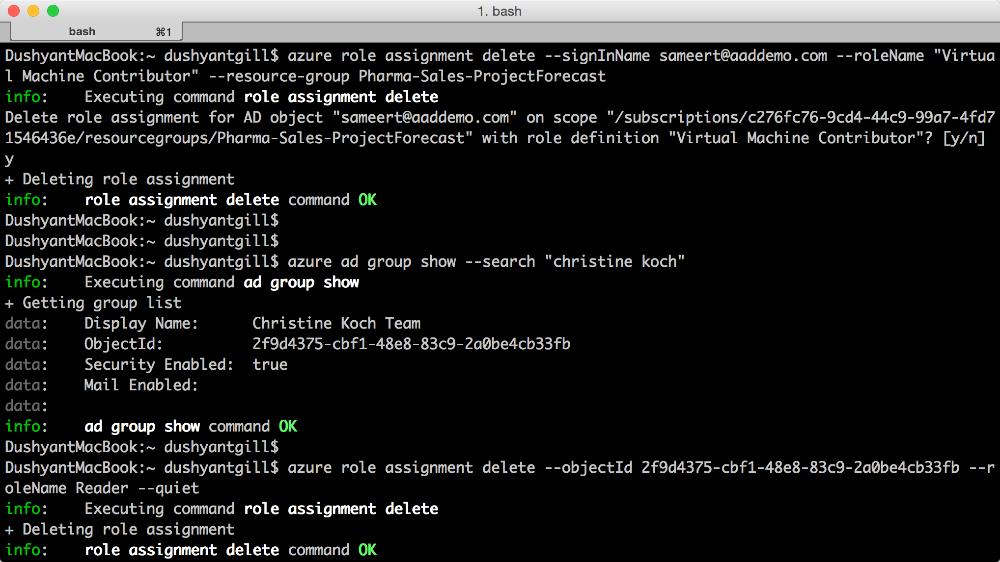
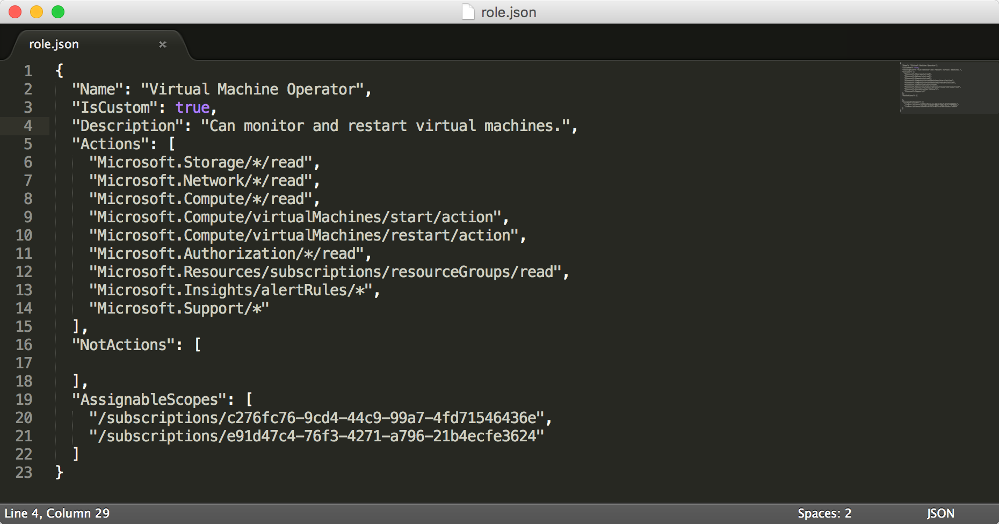

<properties
    pageTitle="Rollenbasierte Access Control (RBAC) mit Azure CLI verwalten | Microsoft Azure"
    description="Informationen Sie zum Verwalten von rollenbasierte Access Control (RBAC) mit der Azure Line Schnittstelle durch mit Rollen und Rolle Aktionen und die Bereiche Abonnement und Anwendung Rollen zuweisen."
    services="active-directory"
    documentationCenter=""
    authors="kgremban"
    manager="femila"
    editor=""/>

<tags
    ms.service="active-directory"
    ms.devlang="na"
    ms.topic="article"
    ms.tgt_pltfrm="na"
    ms.workload="identity"
    ms.date="07/22/2016"
    ms.author="kgremban"/>

# <a name="manage-role-based-access-control-with-the-azure-command-line-interface"></a>Verwalten von rollenbasierte Access Control mit der Azure Line-Benutzeroberfläche

> [AZURE.SELECTOR]
- [PowerShell](role-based-access-control-manage-access-powershell.md)
- [Azure CLI](role-based-access-control-manage-access-azure-cli.md)
- [REST-API](role-based-access-control-manage-access-rest.md)

Rollenbasierte Access Control (RBAC) im Azure-Portal und Azure Ressourcenmanager API können den Zugriff auf Ihr Abonnement und Ressourcen auf einer abgestimmte Ebene verwalten. Mit diesem Feature können Sie für Benutzer, Gruppen oder Dienst Hauptbenutzer Active Directory Access erteilen, indem Sie diese mit einem bestimmten Bereich einige Rollen zuweisen.

Bevor Sie die Azure line Interface (CLI) zum Verwalten von RBAC verwenden können, benötigen Sie Folgendes:

- Azure CLI Version 0.8.8 oder höher. Um die neueste Version zu installieren, und ordnen Sie sie Ihr Abonnement Azure, finden Sie unter [Installieren und Konfigurieren der CLI Azure](../xplat-cli-install.md).
- Azure Ressourcenmanager in Azure CLI. Weitere Informationen hierzu finden Sie in [mithilfe der Azure CLI mit den Ressourcen-Manager](../xplat-cli-azure-resource-manager.md) .

## <a name="list-roles"></a>Liste Rollen

### <a name="list-all-available-roles"></a>Liste aller verfügbare Rollen
Um eine Liste aller verfügbare Rollen verwenden Sie zu können:

        azure role list

Im folgenden Beispiel wird die Liste *aller verfügbaren Rollen*.

```
azure role list --json | jq '.[] | {"roleName":.properties.roleName, "description":.properties.description}'
```


### <a name="list-actions-of-a-role"></a>Listenaktionen einer Rolle
Um die Liste der Aktionen einer Rolle zu verwenden:

    azure role show "<role name>"

Im folgenden Beispiel wird die Aktionen der Rollen *Mitwirkender* und *Virtuellen Computern Mitwirkender* .

```
azure role show "contributor" --json | jq '.[] | {"Actions":.properties.permissions[0].actions,"NotActions":properties.permissions[0].notActions}'

azure role show "virtual machine contributor" --json | jq '.[] | .properties.permissions[0].actions'
```


##  <a name="list-access"></a>Liste von access
### <a name="list-role-assignments-effective-on-a-resource-group"></a>Liste Rolle Zuordnungen effektiven auf einer Ressourcengruppe
Um die rollenzuweisungen aufzulisten, die in einer Ressourcengruppe vorhanden sind, verwenden Sie ein:

    azure role assignment list --resource-group <resource group name>

Im folgenden Beispiel wird die rollenzuweisungen in der Gruppe *Pharma-Umsatz-Projecforcast* an.

```
azure role assignment list --resource-group pharma-sales-projecforcast --json | jq '.[] | {"DisplayName":.properties.aADObject.displayName,"RoleDefinitionName":.properties.roleName,"Scope":.properties.scope}'
```


### <a name="list-role-assignments-for-a-user"></a>Liste der rollenzuweisungen für einen Benutzer
Um die Liste der rollenzuweisungen für einen bestimmten Benutzer und die Aufgaben, die ein Benutzer Gruppen zugewiesen sind, verwenden Sie Folgendes:

    azure role assignment list --signInName <user email>

Sie können auch rollenzuweisungen anzeigen, die von Gruppen geerbt werden, indem Sie den Befehl ändern:

    azure role assignment list --expandPrincipalGroups --signInName <user email>

Im folgenden Beispiel wird die rollenzuweisungen, die gewährt werden, die *sameert@aaddemo.com* Benutzer. Dies umfasst die Rollen aus, die dem Benutzer direkt zugewiesen und Rollen aus, die aus Gruppen übernommen werden.

```
azure role assignment list --signInName sameert@aaddemo.com --json | jq '.[] | {"DisplayName":.properties.aADObject.DisplayName,"RoleDefinitionName":.properties.roleName,"Scope":.properties.scope}'

azure role assignment list --expandPrincipalGroups --signInName sameert@aaddemo.com --json | jq '.[] | {"DisplayName":.properties.aADObject.DisplayName,"RoleDefinitionName":.properties.roleName,"Scope":.properties.scope}'
```


##  <a name="grant-access"></a>Gewähren des Zugriffs
Wenn Sie Zugriff gewähren, nachdem Sie die Rolle festgestellt haben, die Sie zuweisen möchten, verwenden Sie Folgendes:

    azure role assignment create

### <a name="assign-a-role-to-group-at-the-subscription-scope"></a>Zuweisen einer Rolle zu Gruppe auf den Bereich Abonnement
Zum Zuweisen einer Rolle zu einer Gruppe auf den Bereich Abonnement verwenden Sie zu können:

    azure role assignment create --objectId  <group object id> --roleName <name of role> --subscription <subscription> --scope <subscription/subscription id>

Im folgenden Beispiel wird die Rolle *Leser* zugewiesen *Christine Kochs Projektteams* bei der Umfang *Abonnement* an.


### <a name="assign-a-role-to-an-application-at-the-subscription-scope"></a>Zuweisen einer Rolle zur Anwendung in den Bereich des Abonnements
Zuweisen eine Rolle zu einer Anwendung in den Bereich Abonnement verwenden Sie zu können:

    azure role assignment create --objectId  <applications object id> --roleName <name of role> --subscription <subscription> --scope <subscription/subscription id>

Im folgende Beispiel wird die Rolle " *Mitwirkender* " für eine *Azure AD* -Anwendung auf das ausgewählte Abonnement gewährt.

 

### <a name="assign-a-role-to-a-user-at-the-resource-group-scope"></a>Zuweisen einer Rolle an einen Benutzer bei der Ressource Gruppenbereich
Zuweisen eine Rolle zu eines Benutzers bei der Ressource Gruppenbereich verwenden Sie zu können:

    azure role assignment create --signInName  <user email address> --roleName "<name of role>" --resourceGroup <resource group name>

Im folgende Beispiel wird der Teilnehmerrolle *virtuellen Computers* zu gewährt *samert@aaddemo.com* Benutzer bei der Bereich *Pharma-Umsatz-ProjectForcast* Ressource Gruppe.


### <a name="assign-a-role-to-a-group-at-the-resource-scope"></a>Zuweisen einer Rolle zu einer Gruppe auf den Ressourcenbereich
Verwenden Sie zum Zuweisen einer Rolle zu einer Gruppe auf den Ressourcenbereich:

    azure role assignment create --objectId <group id> --role "<name of role>" --resource-name <resource group name> --resource-type <resource group type> --parent <resource group parent> --resource-group <resource group>

Im folgenden Beispiel wird die *virtuellen Computern* Teilnehmerrolle einer *Azure AD* -Gruppe in einem *Subnetz*gewährt.


##  <a name="remove-access"></a>Zugriff muss entfernt werden
Verwenden Sie zum Entfernen einer rollenzuweisung:

    azure role assignment delete --objectId <object id to from which to remove role> --roleName "<role name>"

Im folgende Beispiel entfernt die Zuordnung *Virtuellen Computern Mitwirkender* Rolle aus der *sammert@aaddemo.com* Benutzer auf die Ressourcengruppe *Pharma-Umsatz-ProjectForcast* .
Im Beispiel entfernt die rollenzuweisung aus einer Gruppe klicken Sie auf das Abonnement.



## <a name="create-a-custom-role"></a>Erstellen Sie eine benutzerdefinierte Rolle
Verwenden Sie zum Erstellen einer benutzerdefinierten Rolle:

    azure role create --inputfile <file path>

Im folgenden Beispiel wird eine benutzerdefinierte Rolle als *Operator virtuellen Computern*bezeichnet. Die benutzerdefinierte Rolle gewährt Zugriff auf alle gelesen Datenoperationen für *Microsoft.Compute*, *Microsoft.Storage*und *Microsoft.Network* Ressourcenanbieter und gewährt Zugriff auf starten, starten und Überwachen von virtuellen Computern. Die benutzerdefinierte Rolle kann in zwei Abonnements verwendet werden. In diesem Beispiel wird eine JSON-Datei als Eingabe.




## <a name="modify-a-custom-role"></a>Ändern Sie eine benutzerdefinierte Rolle

Wenn Sie eine benutzerdefinierte Rolle ändern möchten, verwenden Sie zuerst die `azure role show` Befehl zum Abrufen der Rollendefinition. Nehmen Sie zweites, die gewünschten Änderungen an der Rolle Definition-Datei ein. Verwenden Sie schließlich `azure role set` die geänderte Rollendefinition zu speichern.

    azure role set --inputfile <file path>

Im folgenden Beispiel wird die **Aktionen**und einer Azure Abonnement für die **AssignableScopes** der benutzerdefinierten virtuellen Computern Operator Rolle den Vorgang *Microsoft.Insights/diagnosticSettings/* hinzugefügt.


## <a name="delete-a-custom-role"></a>Löschen einer benutzerdefinierten Rolle

Verwenden Sie zum Löschen einer benutzerdefinierten Rolle zuerst die `azure role show` Befehl aus, um die **ID** der Rolle zu ermitteln. Verwenden Sie dann die `azure role delete` Befehl aus, um die Rolle löschen, indem Sie die **ID**angeben.

Im folgende Beispiel wird die benutzerdefinierte Rolle des *Virtuellen Computers Operator* entfernt.


## <a name="list-custom-roles"></a>Benutzerdefinierte Rollen Liste

Um Listen Sie die Funktionen, die für die Zuordnung mit einem Bereich verfügbar sind, verwenden Sie die `azure role list` Befehl.

Im folgenden Beispiel werden alle Rolle aus, die für die Zuordnung in das ausgewählte Abonnement verfügbar sind.

```
azure role list --json | jq '.[] | {"name":.properties.roleName, type:.properties.type}'
```


Im folgenden Beispiel steht nicht zur Verfügung die *Virtuellen Computern Operator* benutzerdefinierte Rolle im *Production4* -Abonnement, da dieser Abonnement nicht in der **AssignableScopes** der Rolle enthalten ist.

```
azure role list --json | jq '.[] | if .properties.type == "CustomRole" then .properties.roleName else empty end'
```


## <a name="rbac-topics"></a>RBAC Themen
[AZURE.INCLUDE [role-based-access-control-toc.md](../../includes/role-based-access-control-toc.md)]
