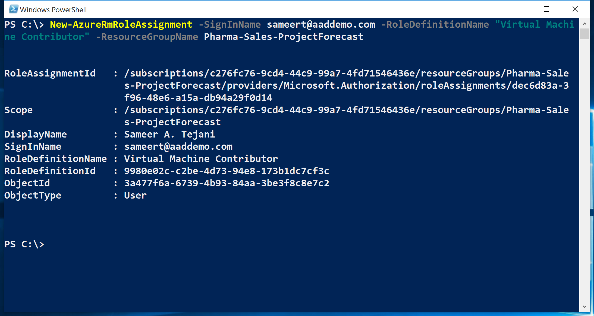

<properties
    pageTitle="Verwalten von rollenbasierte Access Control (RBAC) mit Azure PowerShell | Microsoft Azure"
    description="Informationen zum Verwalten von RBAC mit Azure PowerShell, einschließlich Rollen auflisten, Zuweisen von Rollen und Löschen von rollenzuweisungen."
    services="active-directory"
    documentationCenter=""
    authors="kgremban"
    manager="femila"
    editor=""/>

<tags
    ms.service="active-directory"
    ms.devlang="na"
    ms.topic="article"
    ms.tgt_pltfrm="na"
    ms.workload="identity"
    ms.date="07/22/2016"
    ms.author="kgremban"/>

# <a name="manage-role-based-access-control-with-azure-powershell"></a>Verwalten von Access rollenbasierte Steuerelement mit Azure PowerShell

> [AZURE.SELECTOR]
- [PowerShell](role-based-access-control-manage-access-powershell.md)
- [Azure CLI](role-based-access-control-manage-access-azure-cli.md)
- [REST-API](role-based-access-control-manage-access-rest.md)


Rollenbasierte Access Control (RBAC) im Azure-Portal und Azure Ressource Management-API können zum Verwalten des Zugriffs für Ihr Abonnement eine abgestimmte Ebene. Mit diesem Feature können Sie für Benutzer, Gruppen oder Dienst Hauptbenutzer Active Directory Access erteilen, indem Sie diese mit einem bestimmten Bereich einige Rollen zuweisen.

Bevor Sie zum Verwalten von RBAC PowerShell verwenden können, müssen Sie Folgendes:

- Azure PowerShell Version 0.8.8 oder höher. Um die neueste Version zu installieren, und ordnen Sie sie Ihr Abonnement Azure, finden Sie unter [Installieren und Konfigurieren von Azure PowerShell](../powershell-install-configure.md).

- Azure Ressourcenmanager Cmdlets. Installieren Sie die [Cmdlets Azure Ressourcenmanager](https://msdn.microsoft.com/library/mt125356.aspx) in PowerShell aus.

## <a name="list-roles"></a>Liste Rollen

### <a name="list-all-available-roles"></a>Liste aller verfügbare Rollen
Liste RBAC Rollen, die für die Zuordnung verfügbar sind, und verwenden Sie die Vorgänge prüfen, denen sie Zugriff gewähren `Get-AzureRmRoleDefinition`.

```
Get-AzureRmRoleDefinition | FT Name, Description
```


### <a name="list-actions-of-a-role"></a>Listenaktionen einer Rolle
Um die Aktionen für eine bestimmte Rolle aufzulisten, verwenden Sie `Get-AzureRmRoleDefinition <role name>`.

```
Get-AzureRmRoleDefinition Contributor | FL Actions, NotActions

(Get-AzureRmRoleDefinition "Virtual Machine Contributor").Actions
```


## <a name="see-who-has-access"></a>Anzeigen, wer zugreifen kann
In der Liste RBAC Access Zuordnungen verwenden `Get-AzureRmRoleAssignment`.

### <a name="list-role-assignments-at-a-specific-scope"></a>Liste der rollenzuweisungen mit einem bestimmten Bereich
Sie können alle Access-Aufgaben für eine angegebene Abonnement, Ressource oder Ressourcengruppe anzeigen. Wenn alle aktiven Aufgaben für eine Ressourcengruppe anzeigen möchten, verwenden Sie beispielsweise `Get-AzureRmRoleAssignment -ResourceGroupName <resource group name>`.

```
Get-AzureRmRoleAssignment -ResourceGroupName Pharma-Sales-ProjectForcast | FL DisplayName, RoleDefinitionName, Scope
```


### <a name="list-roles-assigned-to-a-user"></a>Ein Benutzer zugewiesenen Rollen der Liste
Um eine Liste aller Rollen, die einem angegebenen Benutzer zugewiesen sind und die Rollen, die den Gruppen zugewiesen sind, zu der der Benutzer gehört, verwenden Sie `Get-AzureRmRoleAssignment -SignInName <User email> -ExpandPrincipalGroups`.

```
Get-AzureRmRoleAssignment -SignInName sameert@aaddemo.com | FL DisplayName, RoleDefinitionName, Scope

Get-AzureRmRoleAssignment -SignInName sameert@aaddemo.com -ExpandPrincipalGroups | FL DisplayName, RoleDefinitionName, Scope
```


### <a name="list-classic-service-administrator-and-coadmin-role-assignments"></a>Klassische Dienstadministrator Liste und Coadmin rollenzuweisungen
In der Liste Access Zuordnungen für die klassischen Abonnement Unternehmensadministrator "und" Coadministrators, verwenden:

    Get-AzureRmRoleAssignment -IncludeClassicAdministrators

## <a name="grant-access"></a>Gewähren des Zugriffs
### <a name="search-for-object-ids"></a>Suchen nach Objekt-IDs
Um eine Rolle zuzuweisen, müssen Sie sowohl das Objekt (Benutzer, Gruppe oder Anwendung) und den Bereich zu identifizieren.

Wenn Sie nicht, dass die Abonnement-ID wissen, können Sie es in das Blade **Abonnements** auf das Portal Azure auffinden. Vorgehensweise zum Abfragen für die Abonnement-ID finden Sie unter [Get-AzureSubscription](https://msdn.microsoft.com/library/dn495302.aspx) auf MSDN.

Verwenden Sie die Objekt-ID für eine Gruppe Azure AD-, um:

    Get-AzureRmADGroup -SearchString <group name in quotes>

Verwenden Sie die Objekt-ID für eine Azure AD-Dienst Tilgungsanteile oder eine Anwendung, um:

    Get-AzureRmADServicePrincipal -SearchString <service name in quotes>

### <a name="assign-a-role-to-an-application-at-the-subscription-scope"></a>Zuweisen einer Rolle zur Anwendung in den Bereich des Abonnements
Zum Gewähren des Zugriffs zur Anwendung in den Bereich Abonnement verwenden Sie zu können:

    New-AzureRmRoleAssignment -ObjectId <application id> -RoleDefinitionName <role name> -Scope <subscription id>


### <a name="assign-a-role-to-a-user-at-the-resource-group-scope"></a>Zuweisen einer Rolle an einen Benutzer bei der Ressource Gruppenbereich
Um einem Benutzer bei der Ressource Gruppenbereich Zugriff gewähren möchten, verwenden Sie Folgendes:

    New-AzureRmRoleAssignment -SignInName <email of user> -RoleDefinitionName <role name in quotes> -ResourceGroupName <resource group name>



### <a name="assign-a-role-to-a-group-at-the-resource-scope"></a>Zuweisen einer Rolle zu einer Gruppe auf den Ressourcenbereich
Um zu einer Gruppe auf den Ressourcenbereich Zugriff gewähren möchten, verwenden Sie ein:

    New-AzureRmRoleAssignment -ObjectId <object id> -RoleDefinitionName <role name in quotes> -ResourceName <resource name> -ResourceType <resource type> -ParentResource <parent resource> -ResourceGroupName <resource group name>


## <a name="remove-access"></a>Zugriff muss entfernt werden
Zum Entfernen des Zugriffs für Benutzer, Gruppen und Applikationen verwenden Sie zu können:

    Remove-AzureRmRoleAssignment -ObjectId <object id> -RoleDefinitionName <role name> -Scope <scope such as subscription id>


## <a name="create-a-custom-role"></a>Erstellen Sie eine benutzerdefinierte Rolle
Verwenden Sie zum Erstellen einer benutzerdefinierten Rolle der `New-AzureRmRoleDefinition` Befehl.

Wenn Sie eine benutzerdefinierte Rolle mithilfe der PowerShell erstellen, müssen Sie mit einer der [integrierten Rollen](role-based-access-built-in-roles.md)zu starten. Bearbeiten Sie die Attribute zum Hinzufügen der *Aktionen*, *NotActions*oder *Bereiche* , die Sie möchten, und speichern Sie die Änderungen als neue Rolle.

Im folgenden Beispiel wird mit der Teilnehmerrolle *virtuellen Computern* startet und verwendet, die zum Erstellen einer benutzerdefinierten Rolle als *Operator virtuellen Computern*bezeichnet. Die neue Rolle gewährt Zugriff auf alle gelesen Datenoperationen für *Microsoft.Compute*, *Microsoft.Storage*und *Microsoft.Network* Ressourcenanbieter und gewährt Zugriff auf starten, starten Sie und virtuellen Computern überwachen. Die benutzerdefinierte Rolle kann in zwei Abonnements verwendet werden.

```
$role = Get-AzureRmRoleDefinition "Virtual Machine Contributor"
$role.Id = $null
$role.Name = "Virtual Machine Operator"
$role.Description = "Can monitor and restart virtual machines."
$role.Actions.Clear()
$role.Actions.Add("Microsoft.Storage/*/read")
$role.Actions.Add("Microsoft.Network/*/read")
$role.Actions.Add("Microsoft.Compute/*/read")
$role.Actions.Add("Microsoft.Compute/virtualMachines/start/action")
$role.Actions.Add("Microsoft.Compute/virtualMachines/restart/action")
$role.Actions.Add("Microsoft.Authorization/*/read")
$role.Actions.Add("Microsoft.Resources/subscriptions/resourceGroups/read")
$role.Actions.Add("Microsoft.Insights/alertRules/*")
$role.Actions.Add("Microsoft.Support/*")
$role.AssignableScopes.Clear()
$role.AssignableScopes.Add("/subscriptions/c276fc76-9cd4-44c9-99a7-4fd71546436e")
$role.AssignableScopes.Add("/subscriptions/e91d47c4-76f3-4271-a796-21b4ecfe3624")
New-AzureRmRoleDefinition -Role $role
```


## <a name="modify-a-custom-role"></a>Ändern Sie eine benutzerdefinierte Rolle
Um eine benutzerdefinierte Rolle ändern möchten, verwenden Sie zuerst die `Get-AzureRmRoleDefinition` Befehl zum Abrufen der Rollendefinition. Nehmen Sie zweites, die gewünschten Änderungen an der Rollendefinition. Verwenden Sie schließlich die `Set-AzureRmRoleDefinition` Befehl aus, um die geänderte Rollendefinition zu speichern.

Im folgenden Beispiel werden die `Microsoft.Insights/diagnosticSettings/*` Vorgang an die *Virtuellen Computern Operator* benutzerdefinierte Rolle.

```
$role = Get-AzureRmRoleDefinition "Virtual Machine Operator"
$role.Actions.Add("Microsoft.Insights/diagnosticSettings/*")
Set-AzureRmRoleDefinition -Role $role
```


Im folgenden Beispiel wird die zugeordnet werden Bereiche der benutzerdefinierten Rolle *Virtuellen Computern Operator* ein Azure-Abonnement hinzugefügt.

```
Get-AzureRmSubscription - SubscriptionName Production3

$role = Get-AzureRmRoleDefinition "Virtual Machine Operator"
$role.AssignableScopes.Add("/subscriptions/34370e90-ac4a-4bf9-821f-85eeedead1a2"
Set-AzureRmRoleDefinition -Role $role)
```


## <a name="delete-a-custom-role"></a>Löschen einer benutzerdefinierten Rolle

Verwenden Sie zum Löschen einer benutzerdefinierten Rolle der `Remove-AzureRmRoleDefinition` Befehl.

Im folgende Beispiel wird die benutzerdefinierte Rolle des *Virtuellen Computers Operator* entfernt.

```
Get-AzureRmRoleDefinition "Virtual Machine Operator"

Get-AzureRmRoleDefinition "Virtual Machine Operator" | Remove-AzureRmRoleDefinition
```


## <a name="list-custom-roles"></a>Benutzerdefinierte Rollen Liste
Um Listen Sie die Funktionen, die für die Zuordnung mit einem Bereich verfügbar sind, verwenden Sie die `Get-AzureRmRoleDefinition` Befehl.

Im folgenden Beispiel werden alle Rollen, die für die Zuordnung in das ausgewählte Abonnement verfügbar sind.

```
Get-AzureRmRoleDefinition | FT Name, IsCustom
```


Im folgenden Beispiel steht nicht zur Verfügung die *Virtuellen Computern Operator* benutzerdefinierte Rolle im *Production4* -Abonnement, da dieser Abonnement nicht in der **AssignableScopes** der Rolle enthalten ist.


## <a name="see-also"></a>Siehe auch
- [Mithilfe der Azure PowerShell mit Azure Ressourcenmanager](../powershell-azure-resource-manager.md)
[AZURE.INCLUDE [role-based-access-control-toc.md](../../includes/role-based-access-control-toc.md)]
