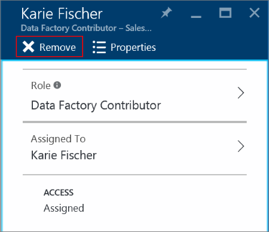

<properties
    pageTitle="Anzeigen von Azure Access ressourcenzuordnungen | Microsoft Azure"
    description="Anzeigen und Verwalten von allen Access Control rollenbasierte Aufgaben für alle Benutzer oder Gruppen in der Azure-portal"
    services="active-directory"
    documentationCenter=""
    authors="kgremban"
    manager="femila"
    editor="jeffsta"/>

<tags
    ms.service="active-directory"
    ms.devlang="na"
    ms.topic="article"
    ms.tgt_pltfrm="na"
    ms.workload="identity"
    ms.date="10/10/2016"
    ms.author="kgremban"/>

# Anzeigen von Access Zuordnungen für Benutzer und Gruppen im Azure-Portal - Public Preview-Version

> [AZURE.SELECTOR]
- [Verwalten des Zugriffs nach Benutzer oder Gruppe](role-based-access-control-manage-assignments.md)
- [Verwalten des Zugriffs von Ressourcen](role-based-access-control-configure.md)

Mit rollenbasierte Access Steuerelement (RBAC) in der Vorschau Azure Active Directory, können Sie Zugriff auf Ihre Azure Ressourcen verwalten. [Was ist in der Vorschau?](active-directory-preview-explainer.md)

Zugriff mit RBAC zugewiesen ist abgestimmte, da es zwei Möglichkeiten gibt, können Sie die Berechtigungen einzuschränken:

- **Bereich:** RBAC rollenzuweisungen sind auf eine bestimmte Abonnement, Ressourcengruppe oder Ressource beschränkt. Ein Benutzer erhält Zugriff auf eine einzelne Ressource kann keine anderen Ressourcen im selben Abonnement zugreifen.
- **Rolle:** Innerhalb des Bereichs der Zuordnung, Zugriff eingeschränkt ist noch weiter, indem Sie eine Rolle zuweisen. Rollen können auf hoher Ebene, wie Besitzer oder bestimmte, wie virtuellen Computern Reader sein.

Rollen können nur von innerhalb des Abonnements, Ressourcengruppe oder Ressource, die den Bereich für die Zuordnung ist zugeordnet werden. Aber Sie können alle Zuordnungen der Zugriff für einen bestimmten Benutzer oder eine Gruppe in einem einzigen Ort anzeigen.

Erhalten Sie weitere Informationen zum [Verwenden von rollenzuweisungen zum Verwalten des Zugriffs auf Ihre Abonnementressourcen Azure](role-based-access-control-configure.md).

##  Access-Zuordnungen anzeigen

Starten Sie zum Nachschlagen Access Zuordnungen für einen einzelnen Benutzer oder eine Gruppe in Azure Active Directory im [Azure-Portal](http://portal.azure.com).

1. Wählen Sie aus **Azure-Active Directory**. Wenn diese Option nicht in der Navigationsliste angezeigt wird, wählen Sie **Weitere Dienste** aus, und führen Sie einen Bildlauf nach unten durch **Azure Active Directory**.
2. Wählen Sie **Benutzer und Gruppen**, und klicken Sie dann entweder **alle Benutzer** oder **alle Gruppen**. In diesem Beispiel liegt der Schwerpunkt auf einzelne Benutzer.
    
3. Suchen Sie nach Name oder Benutzername für den Benutzer.
4. Wählen Sie auf dem Benutzer-Blade **Azure Ressourcen** ein. Alle Access-Aufgaben für diesen Benutzer angezeigt werden.

### Leseberechtigungen Sie für Zuordnungen anzeigen

Diese Seite zeigt nur die Access-Zuordnungen, die Berechtigung zum Lesen. Beispielsweise Lesezugriff A-Abonnement verfügen und wechseln Sie zu der Azure Ressourcen Blade eines Benutzers Zuordnungen überprüfen. Sie können ihre Access Zuordnungen für Abonnement A anzeigen, aber werden nicht angezeigt, dass sie auch Access Zuordnungen Abonnements b verfügt

## Access-Aufgaben löschen

Aus diesem Blade können Sie Access Zuordnungen löschen, die direkt an einen Benutzer oder eine Gruppe zugewiesen wurden. Wenn Access-Zuordnung von einer übergeordneten Gruppe geerbt wurde, müssen Sie rufen Sie die Ressource oder das Abonnement und Verwalten der Zuordnungs vorhanden.

1. Wählen Sie aus der Liste aller Access Zuordnungen für einen Benutzer oder eine Gruppe, die Sie löschen möchten.
2. Wählen Sie **Entfernen** und dann auf **Ja,** um zu bestätigen.
    

## Verwandte Themen

- Erste Schritte mit rollenbasierte Access Control zu [rollenzuweisungen zum Verwalten des Zugriffs auf Ihre Abonnementressourcen Azure-verwenden](role-based-access-control-configure.md)
- Finden Sie die [integrierten RBAC-Rollen](role-based-access-built-in-roles.md)
