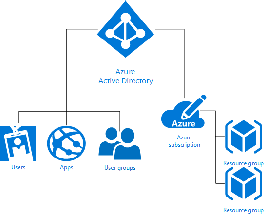

<properties
    pageTitle="Rollenbasierte Access Control | Microsoft Azure"
    description="Erste Schritte mit Azure rollenbasierte Access-Steuerelement im Portal Azure in Access-Verwaltung. Verwenden Sie zum Zuweisen von Berechtigungen in Ihrem Verzeichnis rollenzuweisungen ein."
    services="active-directory"
    documentationCenter=""
    authors="kgremban"
    manager="femila"
    editor=""/>

<tags
    ms.service="active-directory"
    ms.devlang="na"
    ms.topic="article"
    ms.tgt_pltfrm="na"
    ms.workload="identity"
    ms.date="08/03/2016"
    ms.author="kgremban"/>

# Erste Schritte mit Access Management Azure-Portal

Sicherheit Orientierung Unternehmen sollten konzentrieren zugewiesen Mitarbeiter die genauen Berechtigungen, die sie benötigen. Zu viele Berechtigungen stellt ein Konto Angriffen sicher zur Verfügung. Zu wenige Berechtigungen bedeutet, dass es sich bei Mitarbeiter ihrer Arbeit effizient erreicht werden können. Azure rollenbasierte Access Steuerelement (RBAC) können Sie dieses Problem zu beheben, indem Sie abgestimmte Access Management für Azure.

RBAC können Sie Aufgaben innerhalb Ihres Teams aufteilen und gewähren nur das Ausmaß des Zugriffs für Benutzer, die sie zum Erfüllen ihrer Aufgaben benötigen. Anstatt jeder uneingeschränkte Berechtigungen in der Azure-Abonnements oder von Ressourcen, können Sie nur bestimmte Aktionen zulässig sind. Verwenden Sie beispielsweise RBAC damit können einem Mitarbeiter Verwalten von virtuellen Computern in einem Abonnement, während eine andere SQL-Datenbanken innerhalb des gleichen Abonnements verwalten kann.

## Grundlagen der Verwaltung von Access in Azure
Jede Azure-Abonnement ist ein Verzeichnis von Azure Active Directory (AD) zugeordnet. Benutzer, Gruppen und Anwendungen aus dem Verzeichnis können Ressourcen im Azure-Abonnement verwalten. Weisen Sie diese mit der Azure-Portal, Azure Befehlszeile Tools und Azure Management APIs Zugriffsrechte.

Erteilen des Zugriffs von Benutzern, Gruppen und Anwendungen mit einem bestimmten Bereich die entsprechende RBAC-Rolle zuweisen. Der Bereich eine rollenzuweisung kann ein Abonnement, eine Ressourcengruppe oder eine einzelne Ressource sein. Eine Funktion mit einem übergeordneten Bereich zugewiesen gewährt auch Zugriff auf die darin enthaltenen Kinder. Ein Benutzer mit Zugriff auf eine Ressourcengruppe kann beispielsweise alle Ressourcen verwalten die darin, die wie Websites, virtuellen Computern und Subnetze enthaltenen.

RBAC-Rolle, die Sie zuweisen schreibt vor, welche Ressourcen der Benutzer, die Gruppe oder die Anwendung in diesem Bereich verwalten kann.

## Standardrollen
Azure RBAC besteht aus drei grundlegende Rollen, die auf alle Ressourcentypen anwenden:

- **Besitzer** hat Vollzugriff auf alle Ressourcen, einschließlich des rechts den Zugriff auf andere übertragen.
- **Mitwirkender** können erstellen und verwalten Sie alle Arten von Azure Ressourcen, aber nicht erteilen Zugriff auf andere.
- **Reader** können vorhandene Azure Ressourcen anzeigen.

Verwaltung von bestimmter Azure Ressourcen die restlichen RBAC-Rollen in Azure zulassen Beispielsweise kann Teilnehmerrolle für das virtuellen Computern den Benutzer zum Erstellen und Verwalten von virtuellen Computern. Es ist nicht sie haben Zugriff auf das virtuelle Netzwerk oder das Subnetz, dem den virtuellen Computern und besteht.

[Standardrollen RBAC](role-based-access-built-in-roles.md) Listet die Rollen in Azure verfügbar. Es gibt an, die Vorgänge und der Bereich, der Benutzern jede integrierte Rolle erteilt. Wenn Sie zum Definieren von eigenen Rollen für noch stärkere Kontrolle gefunden haben, finden Sie unter So erstellen Sie [benutzerdefinierte Rollen in Azure RBAC](role-based-access-control-custom-roles.md).

## Hierarchie- und Access Vererbung von Ressourcen
- Jedes **Abonnement** in Azure gehört mit nur einem Verzeichnis.
- Jede **Ressourcengruppe** gehört nur ein Abonnement.
- Jede **Ressource** gehört nur eine Ressourcengruppe.

Access, die Sie bei der übergeordnete Bereiche erteilen wird am untergeordneten Bereichen geerbt. Beispiel:

- Durch das Zuweisen von Reader Rollen zu einer Gruppe Azure AD-im Bereich Abonnement. Die Mitglieder dieser Gruppe können jeder Ressourcengruppe "und" Ressourcen in das Abonnement anzeigen.
- Sie weisen Teilnehmerrolle für das zur Anwendung am Umfang Ressource-Gruppe aus. Sie können Ressourcen aller Typen in dieser Ressourcengruppe, aber keine anderen Ressourcengruppen in das Abonnement verwalten.

## Azure RBAC im Vergleich zu klassischen Abonnement Administratoren
Klassische Abonnement Administratoren und co-Administratoren haben Vollzugriff auf die Azure-Abonnement. Sie können Ressourcen mithilfe der [Azure-Portal](https://portal.azure.com) mit Azure Ressourcenmanager APIs oder Modell zur klassischen Bereitstellung von [Azure klassischen Portal](https://manage.windowsazure.com) und Azure verwalten. Im Modell RBAC werden klassische Administratoren Besitzerrolle an den Abonnement Bereich zugewiesen.

Nur der Azure-Portal als auch die neuen Azure Ressourcenmanager APIs unterstützen Azure RBAC. Benutzer und Anwendungen, die RBAC-Rollen zugewiesen werden können keine klassischen Verwaltungsportal und das Modell klassischen Azure-Bereitstellung verwenden.

## Autorisierung für Management im Vergleich zu Datenoperationen
Azure RBAC unterstützt nur Management Vorgänge der Azure Ressourcen in der Azure-Portal und Azure Ressourcenmanager APIs. Es kann nicht alle Ebene Datenoperationen für Azure Ressourcen autorisieren. Sie können beispielsweise Autorisieren einer Person zu verwalten Speicher-Konten, aber nicht auf die Blobs oder Tabellen in einem Speicher-Konto kann nicht. Auf ähnliche Weise kann eine SQL-Datenbank verwaltet werden, aber darin keine Tabellen.

## Nächste Schritte
- Erste Schritte mit [rollenbasierte Access Control Azure-Portal](role-based-access-control-configure.md).
- Finden Sie die [integrierten RBAC-Rollen](role-based-access-built-in-roles.md)
- Definieren Sie eigene [benutzerdefinierte Rollen in Azure RBAC](role-based-access-control-custom-roles.md)
