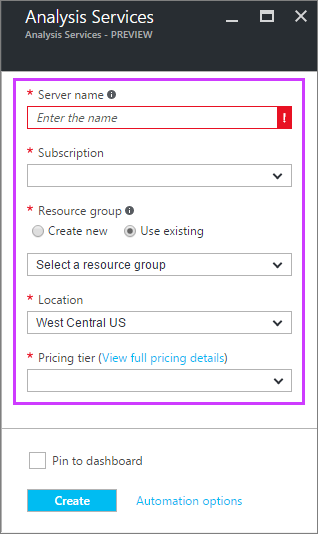

<properties
   pageTitle="Erstellen einen Analysis Services-Server in Azure | Microsoft Azure"
   description="Informationen Sie zum Erstellen einer Analysis Services-Server-Instanz in Azure."
   services="analysis-services"
   documentationCenter=""
   authors="minewiskan"
   manager="erikre"
   editor=""
   tags=""/>
<tags
   ms.service="analysis-services"
   ms.devlang="NA"
   ms.topic="article"
   ms.tgt_pltfrm="NA"
   ms.workload="na"
   ms.date="10/24/2016"
   ms.author="owend"/>

# Erstellen eines Analysis Services-Servers
In diesem Artikel führt Sie durch die Erstellung einer neuen Ressource der Analysis Services-Server in Ihrem Azure-Abonnement.

## Vorbemerkung
Um anzufangen, müssen Sie folgende Aktionen ausführen:

- **Azure-Abonnement**: Besuchen [Azure kostenlose Testversion](https://azure.microsoft.com/offers/ms-azr-0044p/) zum Erstellen eines Kontos.
- **Ressourcengruppe**: Verwenden eines bereits Ressourcengruppe oder [einen neuen erstellen](../azure-resource-manager/resource-group-overview.md).

> [AZURE.NOTE] Erstellen eines Analysis Services-Servers möglicherweise einen neuen berechenbaren Dienst. Weitere Informationen finden Sie unter Analysis Services Preise.

## Erstellen eines Analysis Services-Servers

1. Melden Sie sich mit dem [Azure-Portal](https://portal.azure.com)aus.

2. Klicken Sie auf **+ neue** > **Intelligence + Analytics** > **Analysis Services**.

3. Klicken Sie in der **Analysis Services** -Blade füllen Sie die erforderlichen Felder, und drücken Sie dann auf **Erstellen**.

    

    - **Server-Name**: Geben Sie einen eindeutigen Namen verwendet, um den Server verweisen.

    - **Abonnements**: Wählen Sie das Abonnement Abrechnung von diesem Server an.

    - **Ressourcengruppe**: Hierbei handelt es sich um Container eine Sammlung von Azure Ressourcen verwalten können. Weitere Informationen finden Sie unter [Ressourcengruppen](../resource-group-overview.md).

    - **Standort**: Diese Azure Datacenter Speicherort auf dem Server befinden. Wählen Sie einen Speicherort nächste Ihre größten Benutzerbasis.

    - **Preise Ebene**: Wählen Sie eine Preisgestaltung Stufe aus. Tabellarische Modelle bis zu 100 GB werden unterstützt. Sie können Ihre Preisgestaltung Ebene später jederzeit ändern.

4. Klicken Sie auf **Erstellen**.

Erstellen Sie in der Regel dauert weniger als einer Minute; häufig nur wenige Sekunden. Wenn Sie **zu Portal hinzufügen**ausgewählt haben, navigieren Sie zu Ihrer Portal für Ihren neuen Server finden Sie unter. Oder möchten, navigieren Sie zu **Weitere Dienste** > **Analysis Services** , um festzustellen, ob Ihr Server bereit ist. Aktualisieren Sie die Liste, wenn es nicht angezeigt wird.

 

## Nächste Schritte
Nachdem Sie Ihre Server erstellt haben, können Sie darauf [Bereitstellen ein Modells](analysis-services-deploy.md) mithilfe von SSDT oder SSMS.

Wenn ein Modell, das Sie auf dem Server bereitstellen auf lokale Datenquellen verbunden ist, müssen Sie ein [lokaler Daten Gateways](analysis-services-gateway.md) auf einem Computer in Ihrem Netzwerk zu installieren.
