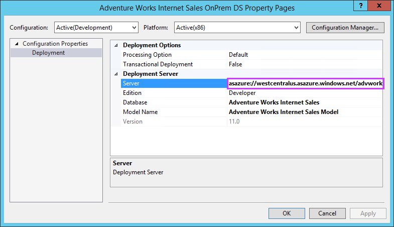
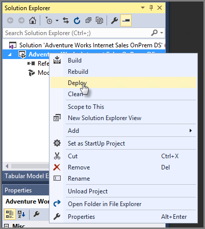
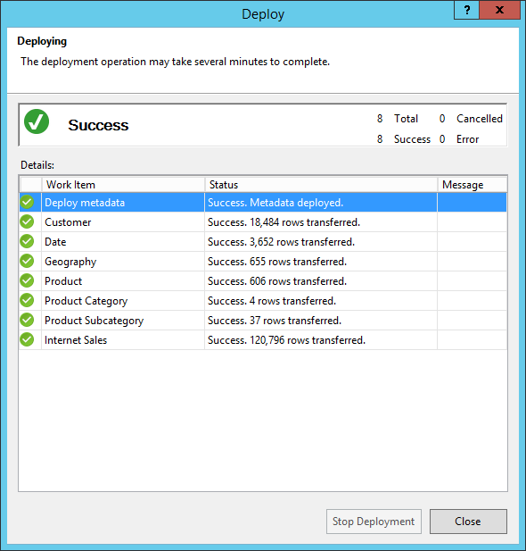

<properties
   pageTitle="Bereitstellen für Azure Analysis Services | Microsoft Azure"
   description="Erfahren Sie, wie ein Tabellenmodell auf einem Azure Analysis Services-Server bereitstellen."
   services="analysis-services"
   documentationCenter=""
   authors="minewiskan"
   manager="erikre"
   editor=""
   tags=""/>
<tags
   ms.service="analysis-services"
   ms.devlang="NA"
   ms.topic="article"
   ms.tgt_pltfrm="NA"
   ms.workload="na"
   ms.date="10/24/2016"
   ms.author="owend"/>

# Bereitstellen Sie für Azure Analysis Services

Nachdem Sie einen Server in Ihrem Abonnement Azure erstellt haben, können Sie mit eine tabellarischen Modelldatenbank darauf bereitgestellt. SQL Server Data Tools (SSDT) können Sie ein Tabellenmodell Projekt, das Sie gerade arbeiten, erstellen und bereitstellen. Alternativ können Sie SQL Server Management Studio (SSMS) zu einer vorhandenen tabellarischen Modelldatenbank aus Analysis Services-Instanz bereitstellen.

## Vorbemerkung
Um anzufangen, müssen Sie folgende Aktionen ausführen:

- **Analysis Services-Server** in Azure. Weitere Informationen finden Sie unter [Erstellen einer Analysis Services in Azure](analysis-services-create-server.md).
- **Tabellenmodell Projekt** in SSDT oder einer vorhandenen Tabellenmodell auf Analysis Services-Instanz Ebene Kompatibilität der 1200. Nie haben eine erstellt? Versuchen Sie es des [Adventure Works-Lernprogramm](https://msdn.microsoft.com/library/hh231691.aspx).
- **Lokale Gateway** – Wenn Sie eine oder mehrere Datenquellen lokalen im Netzwerk Ihrer Organisation sind, müssen Sie ein [Lokaler datenverwaltungsgateway](analysis-services-gateway.md)zu installieren. Das Gateway ist erforderlich, von der Server in der Cloud zu Ihrem lokalen Datenquellen Prozess und Aktualisieren von Daten im Modell hergestellt.

## Ein Tabellenmodell aus SSDT bereitstellen.
Um von SSDT bereitstellen, stellen Sie sicher, dass Sie die [neueste Version](https://msdn.microsoft.com/library/mt204009.aspx)aktualisierte 30 % September 2016 oder höher verwenden.

> [AZURE.TIP] Bevor Sie bereitstellen, stellen Sie sicher, dass die Daten in Tabellen verarbeitet werden können. In SSDT, klicken Sie auf **Modell** > **Prozess** > **Prozess alle**. Wenn die Verarbeitung fehlschlägt, bereitstellen zu können.

1. Bevor Sie bereitstellen, müssen Sie den Servernamen erhalten. **Azure** -Portal > Server > **Übersicht** > **Servernamen**, kopieren Sie den Namen des Servers.

    

2. In SSDT > **Lösung Explorer**mit der rechten Maustaste in des Projekts > **Eigenschaften**. Klicken Sie dann in der **Bereitstellung** > **Server** fügen Sie den Namen des Servers.   

    

3. **Lösung-Explorer**mit der rechten Maustaste **Eigenschaften**, und klicken Sie dann klicken Sie auf **Bereitstellen**. Sie möglicherweise aufgefordert, bei Azure anmelden.

    

    Bereitstellungsstatus wird sowohl im Ausgabefenster auch im bereitstellen.

    

Das ist alles schon!

## Mithilfe von XMLA-Skript
1. SSMS, mit der Maustaste der tabellarischen Modelldatenbank bereitstellen, klicken Sie auf **Skript**soll > **Skript Datenbank als** > **zu erstellen**, wählen Sie einen Speicherort.

2. Führen Sie die Abfrage, klicken Sie auf den Server-Instanz aus, die, der Sie bereitstellen möchten. Wenn Sie auf dem gleichen Server bereitstellen, müssen Sie zumindest die **Name** -Eigenschaft in der XMLA-Skript ändern.  

## Aber leider nicht geklappt

Wenn die Bereitstellung schlägt fehl, wenn Metadaten bereitstellen, ist es wahrscheinlich, da SSDT eine Verbindung zu Ihrem Server konnten nicht. Stellen Sie sicher, dass Sie auf dem Server mit SSMS zugreifen können. Stellen Sie sicher, dass die Eigenschaft Bereitstellungsserver für das Projekt korrekt ist.

Wenn die Bereitstellung für eine Tabelle fehlschlägt, ist es wahrscheinlich, da der Server mit einer Datenquelle herstellen konnten nicht. Ist die Datenquelle lokalen im Netzwerk Ihrer Organisation, müssen Sie ein [Lokaler datenverwaltungsgateway](analysis-services-gateway.md)zu installieren.

## Nächste Schritte

Jetzt, da Sie Ihre Tabellenmodell auf dem Server bereitgestellt haben, sind Sie bereit sind, das Herstellen einer Verbindung. Sie können das [Herstellen einer Verbindung mit SSMS mit](analysis-services-manage.md) , um ihn zu verwalten. Und Sie können [mithilfe eines Clienttools eine Verbindung herstellen](analysis-services-connect.md) , wie Power BI, Power BI-Desktop, oder Excel und Erstellen von Berichten starten.
