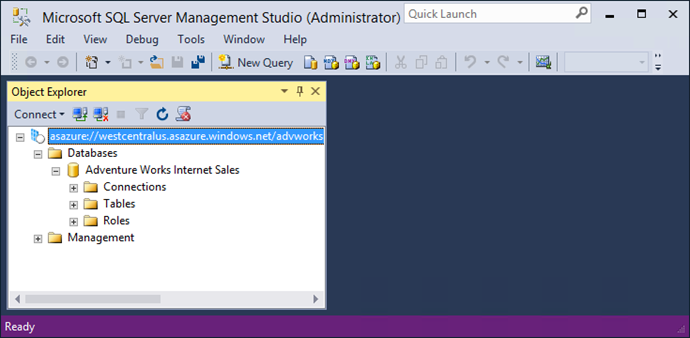

<properties
   pageTitle="Verwalten von Azure Analysis Services | Microsoft Azure"
   description="Informationen Sie zum Verwalten von eines Analysis Services-Servers in Azure."
   services="analysis-services"
   documentationCenter=""
   authors="minewiskan"
   manager="erikre"
   editor=""
   tags=""/>
<tags
   ms.service="analysis-services"
   ms.devlang="NA"
   ms.topic="article"
   ms.tgt_pltfrm="NA"
   ms.workload="na"
   ms.date="10/24/2016"
   ms.author="owend"/>

# <a name="manage-analysis-services"></a>Verwalten von Analysis Services

Nachdem Sie in Azure Analysis Services-Server erstellt haben, können einige Administration und Verwaltungsaufgaben, die Sie sofort oder irgendwann nach unten ständige ausführen müssen vorhanden sein. Führen Sie beispielsweise Verarbeitung an die Aktualisierungsdaten, steuern, wer Zugriff auf die Modelle auf dem Server oder Zustand des Servers überwachen kann. Einige Verwaltungsaufgaben können nur Azure-Portal andere in SQL Server Management Studio (SSMS) ausgeführt werden, und einige Aufgaben übertragen ausgeführt werden können.

## <a name="azure-portal"></a>Azure-portal
Das [Azure-Portal](http://portal.azure.com/) ist, wo Sie können erstellen und Löschen von Servern, Überwachen von Serverressourcen, Ändern der Größe, und verwalten, wer Zugriff auf Ihre Server hat.  Wenn Sie einige Probleme auftreten, können Sie auch eine Supportanfrage einreichen.


## <a name="sql-server-management-studio"></a>SQL Server Management Studio
Herstellen einer Verbindung mit dem Server in Azure verhält sich wie Herstellen einer Verbindung mit einem Server-Instanz aus, in der eigenen Organisation. Aus SSMS können Sie viele der Aufgaben wie Prozessdaten ausführen oder erstellen Sie ein Verarbeitungsskript, Verwalten von Rollen und PowerShell verwenden.



 Einer der vergrößern Unterschiede ist die Authentifizierung, die Sie verwenden, um die Verbindung zu Ihrem Server. Um zu Ihrem Azure Analysis Services-Server herstellen zu können, müssen Sie **Active Directory-Kennwortauthentifizierung**auswählen.

### <a name="to-connect-with-ssms"></a>Verbindung mit SSMS
1. Bevor Sie eine Verbindung herstellen, müssen Sie den Namen des Servers zu erhalten. **Azure** -Portal > Server > **Übersicht** > **Servernamen**, kopieren Sie den Namen des Servers.

    

2. In SSMS > **Objekt-Explorer**, klicken Sie auf **Verbinden** > **Analysis Services**.

3. Fügen Sie im Dialogfeld **mit Server verbinden** den Servernamen, und klicken Sie dann in **Authentifizierung**, wählen Sie eine der folgenden Aktionen aus:

    **Active Directory-integrierte Authentifizierung** einmaliges Anmelden mit Active Directory zu Azure Active Directory Federation verwenden.

    **Active Directory-Kennwortauthentifizierung** ein Organisations-Konto verwenden. Beispielsweise beim Herstellen einer Verbindung von nicht-Domäne Computer verknüpft.

    Hinweis: Wenn Sie Active Directory-Authentifizierung nicht angezeigt werden, müssen Sie möglicherweise in SSMS [Azure Active Directory-Authentifizierung aktivieren](#enable-azure-active-directory-authentication) .

    

Da den Server unter Azure mithilfe von SSMS verwalten ähnlich wie die Verwaltung von einem lokalen Server ist, wird nicht gezeigt, wechseln Sie in den Details finden Sie hier. Die gesamte Hilfe Sie müssen in [Analysis Services-Instanz Management](https://msdn.microsoft.com/library/hh230806.aspx) auf MSDN gefunden werden können.

## <a name="server-administrators"></a>Server-Administratoren
**Analysis Services-Administratoren** können in der Bibliothekssteuerungsblade für Ihren Server in Azure-Portal oder SSMS Sie Server-Administratoren verwalten. Analysis Services-Administratoren sind Datenbank Serveradministratoren mit Anzeigeberechtigungen für allgemeine Datenbank administrativen Aufgaben wie das Hinzufügen und Entfernen von Datenbanken und Verwalten von Benutzern. Standardmäßig wird der Benutzer, der vom Server Azure-Portal erstellt automatisch als eine Analysis Services-Administrator hinzugefügt

Sie sollten außerdem wissen:

-   Windows Live ID ist kein Identitätstyp unterstützten für Azure Analysis Services.  
-   Analysis Services-Administratoren müssen gültige Azure Active Directory-Benutzer.
-   Wenn einen Azure Analysis Services-Server über Azure Ressourcenmanager Vorlagen erstellen, nimmt Analysis Services-Administratoren ein JSON-Array der Benutzer, die als Administratoren hinzugefügt werden soll.

Analysis Services-Administratoren können von Ressourcenadministratoren Azure, unterscheiden die Ressourcen für Azure-Abonnements verwalten können. Dies unterhält Kompatibilität mit vorhandenen XMLA und TSML verwalten Verhaltensweisen in Analysis Services und zu Aufteilen des Aufgaben zwischen Azure ressourcenverwaltung und Analysis Services-Verwaltung.

Zum Anzeigen aller Rollen und Datentypen für die Ressource ein Azure Analysis Services zugreifen möchten, verwenden Sie Access Control (IAM) auf das Steuerelement Blade aus.

## <a name="database-users"></a>Datenbankbenutzer
Azure Analysis Services-Modell Datenbankbenutzer muss in Ihrem Azure-Active Directory. Für die Modelldatenbank angegebenen Benutzernamen müssen durch organisationsinterne e-Mail-Adresse oder UPN werden. Dies unterscheidet sich von der lokalen Modell Datenbanken die Benutzer durch die Windows-Domäne Benutzernamen zu unterstützen.

Sie können die Benutzer mithilfe von [rollenzuweisungen in Azure Active Directory](../active-directory/role-based-access-control-configure.md) oder mithilfe eines [Tabellarischen Modell Scripting Language](https://msdn.microsoft.com/library/mt614797.aspx) (TMSL) in SQL Server Management Studio hinzufügen.

**Beispiel TMSL-Skript**

```
{
  "createOrReplace": {
    "object": {
      "database": "SalesBI",
      "role": "Users"
    },
    "role": {
      "name": "Users",
      "description": "All allowed users to query the model",
      "modelPermission": "read",
      "members": [
        {
          "memberName": "user1@contoso.com",
          "identityProvider": "AzureAD"
        },
        {
          "memberName": "group1@contoso.com",
          "identityProvider": "AzureAD"
        }
      ]
    }
  }
}
```

## <a name="enable-azure-active-directory-authentication"></a>Aktivieren der Azure-Active Directory-Authentifizierung
Aktivieren das Feature der Azure-Active Directory-Authentifizierung für SSMS in der Registrierung, erstellen eine Textdatei namens EnableAAD.reg, und klicken Sie dann kopieren, und fügen Sie die folgenden:


```
Windows Registry Editor Version 5.00
[HKEY_CURRENT_USER\Software\Microsoft\Microsoft SQL Server\Microsoft Analysis Services\Settings]
"AS AAD Enabled"="True"
```

Speichern Sie, und führen Sie die Datei.


## <a name="next-steps"></a>Nächste Schritte
Wenn Sie bereits ein Tabellenmodell auf Ihrer neuen Server bereitgestellt haben, ist jetzt ein guter Zeitpunkt. Weitere Informationen finden Sie unter [Bereitstellen mit Azure Analysis Services](analysis-services-deploy.md).

Wenn Sie ein Modell auf dem Server bereitgestellt haben, sind Sie bereit sind, mithilfe einer Client oder im Browser eine Verbindung herstellen. Weitere Informationen finden Sie unter [Abrufen von Daten aus Azure Analysis Services-Server](analysis-services-connect.md).
