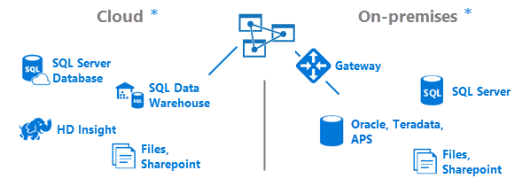
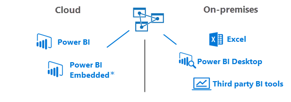

<properties
   pageTitle="Neuigkeiten Azure Analysis Services | Microsoft Azure"
   description="Erhalten Sie Überblick über Analysis Services in Azure."
   services="analysis-services"
   documentationCenter=""
   authors="minewiskan"
   manager="erikre"
   editor=""
   tags=""/>
<tags
   ms.service="analysis-services"
   ms.devlang="NA"
   ms.topic="article"
   ms.tgt_pltfrm="NA"
   ms.workload="na"
   ms.date="10/25/2016"
   ms.author="owend"/>

# Was ist Azure Analysis Services?

Basierend auf den bewährten Analytics-Engine in Microsoft SQL Server Analysis Services ermöglicht Azure Analysis Services unternehmensweite Daten in der Cloud modeling aus.

> [AZURE.IMPORTANT] Azure Analysis Services ist in der **Vorschau**. Es gibt einige Aktionen, die nicht noch gerade arbeiten. Achten Sie darauf, dass Sie Auschecken [Vorschau rechnen](#preview-expectations) weiter unten in diesem Artikel. Und achten Sie darauf, um unserem [Blog Azure Analysis Services](https://go.microsoft.com/fwlink/?linkid=830920) für die neuesten Informationen im Blick.

## Erstellen von SQL Server Analysis Services
Azure Analysis Services ist kompatibel mit der gleichen SQL Server 2016 Analysis Services Enterprise Edition Sie bereits vertraut sind. Azure Analysis Services unterstützt tabellarische Modellen Ebene Kompatibilität 1200. DirectQuery, Partitionen, Sicherheit auf Benutzerebene Zeile, bidirektionale Beziehungen und Übersetzungen werden alle unterstützt.

## Verwenden Sie die Tools, die Sie bereits kennen

Beim Erstellen von Datenmodellen für Azure Analysis Services verwenden Sie die gleichen wie für SQL Server Analysis Services-Tools. Erstellen und Bereitstellen von tabellarischen Modellen mithilfe der neuesten Versionen von [SQL Server Data Tools (SSDT)](https://msdn.microsoft.com/library/mt204009.aspx) oder mithilfe der [Powershell Azure](../powershell-install-configure.md) und [Azure Ressourcenmanager](../azure-resource-manager/resource-group-overview.md) Vorlagen in [SQL Server Management Studio (SSMS)](https://msdn.microsoft.com/library/mt238290.aspx)klicken.

## Verbinden mit Datenquellen
Datenmodelle befinden, die auf Servern herstellen von Verbindungen mit Datenquellen lokal in Ihrer Organisation oder in der Cloud Azure-Support. Kombinieren von Daten aus beiden lokalen und cloud-Datenquellen für ein Hybrid BI-Lösung.

Da der Server in der Cloud ist, ist das Herstellen einer Verbindung mit Datenquellen Cloud nahtlose. Bei der Verbindung mit Datenquellen lokalen gewährleistet der [lokalen datenverwaltungsgateway](analysis-services-gateway.md) schnelle und sichere Verbindungen mit dem Analysis Services-Server in der Cloud.  

 \*Einige Datenquellen werden in der Vorschau noch nicht unterstützt. Weitere Informationen finden Sie unter [Vorschau rechnen](#preview-expectations) weiter unten in diesem Artikel.

## Untersuchen von Daten von überall aus
Verbinden und von Ihren Servern aus zu überall [Abrufen von Daten](analysis-services-connect.md) . Azure Analysis Services unterstützt das Herstellen einer Verbindung von Power BI-Desktop, Excel, benutzerdefinierte apps und browserbasierte Tools.

 \*Power BI eingebettete ist noch nicht in der Vorschau unterstützt.

## Secure

#### Benutzerauthentifizierung
Benutzerauthentifizierung für Azure Analysis Services wird von [Azure Active Directory (AAD)](../active-directory/active-directory-whatis.md)behandelt. Bei dem Versuch, melden Sie sich mit einer Azure Analysis Services-Datenbank, verwenden Benutzer eine Organisation Kontoidentität mit Zugriff auf die Datenbank, die sie für den Zugriff auf ein. Diese Benutzeridentitäten müssen Mitglied Standard Azure Active Directory für das Abonnement, wo befindet sich der Azure Analysis Services-Server. [Verzeichnisintegration](https://technet.microsoft.com/library/jj573653.aspx) AAD und einem lokalen Active Directory ist eine großartige Möglichkeit zum Abrufen von Ihrem lokalen Benutzern den Zugriff auf eine Azure Analysis Services-Datenbank, aber nicht für alle Szenarien erforderlich ist.

Benutzer melden Sie sich mit den wichtigsten Benutzernamen (Benutzerprinzipalnamen) von ihrem Konto und ihr Kennwort. Wenn Sie mit einem lokalen Active Directory synchronisiert, ist UPN des Benutzers oft ihrer Organisation e-Mail-Adresse ein.

Berechtigungen für die Verwaltung von Azure Analysis Services-Server-Ressource werden durch das Zuweisen von Benutzern zu Rollen innerhalb Ihres Abonnements Azure behandelt. Standardmäßig haben Abonnement Administratoren Besitzerberechtigungen, die der Serverressource in Azure. Zusätzliche Benutzer können mithilfe von Azure Ressourcenmanager hinzugefügt werden.

#### Datenschutz
Azure Analysis Services nutzt Azure Blob-Speicher, um den Speicher und die Metadaten für Analysis Services-Datenbanken beizubehalten. Datendateien innerhalb Blob werden verschlüsselt Azure BLOB-Server Seite Verschlüsselung (SSE) verwenden. Beim direkten Abfragemodus zu verwenden, werden nur die Metadaten gespeichert. die tatsächlichen Daten erfolgt aus der Datenquelle zum Zeitpunkt der Abfrage.

#### Klicken Sie auf eine lokale Datenquelle
Sicheren Sie Zugriff auf Daten verbleiben lokal in Ihrer Organisation durch Installieren und Konfigurieren einer [lokalen datenverwaltungsgateway](analysis-services-gateway.md)erreicht werden können. Gateways bieten Zugriff auf Daten für direkte Abfrage und in-Memory-Modi. Wenn ein Azure Analysis Services-Modell mit einer lokalen Datenquelle verbunden ist, wird eine Abfrage zusammen mit den verschlüsselten Anmeldeinformationen für die lokale Datenquelle erstellt. Der Gateway-Cloud-Dienst analysiert die Abfrage und legt die Anforderung mit einer Azure Service. Lokale Gateways abfragt Azure Service Bus für ausstehende Anfragen. Das Gateway dann Ruft die Abfrage ab, die Anmeldeinformationen entschlüsselt und stellt eine Verbindung mit der Datenquelle für die Ausführung. Die Ergebnisse werden dann aus der Datenquelle mit dem Gateway zurück und weiter zu Azure Analysis Services-Datenbank gesendet.

Azure Analysis Services unterliegen den [Microsoft Online Services-Ausdrücke](http://www.microsoftvolumelicensing.com/DocumentSearch.aspx?Mode=3&DocumentTypeId=31) und die [Datenschutzbestimmungen für Microsoft Online Services](https://www.microsoft.com/privacystatement/OnlineServices/Default.aspx).
Um weitere Informationen zur Azure-Sicherheit finden Sie im [Microsoft-Trust Center](https://www.microsoft.com/trustcenter/Security/AzureSecurity).

## Anfordern von Hilfe
Azure Analysis Services ganz einfach einrichten und verwalten. Sie können sämtliche Informationen suchen, die Sie erstellen und Verwalten von einem Server hier müssen. Beim Erstellen eines Datenmodells für die Bereitstellung auf dem Server ganz ähnlich wie es ist für die Erstellung eines Datenmodells, die, das Sie mit einem lokalen Server bereitstellen. Es gibt eine umfassende Bibliothek von konzeptionelle, zu Vorgehensweisen, Lernprogramme und Bezug Artikeln bei [Analysis Services auf MSDN](https://msdn.microsoft.com/library/bb522607.aspx).

Wir haben auch eine Reihe von Videos hilfreich bei [Azure Analysis Services auf Channel 9](https://channel9.msdn.com/series/Azure-Analysis-Services).

Punkte sind schnell zu ändern. Sie können jederzeit die neueste Informationen zu den [Azure Analysis Services-Blog](https://go.microsoft.com/fwlink/?linkid=830920)erhalten.

## Community
Analysis Services verfügt über eine umfassende Community von Benutzern. Teilnehmen an der Unterhaltung [Azure Analysis Services](https://aka.ms/azureanalysisservicesforum)-Forum.

## Feedback
Haben Sie Vorschläge oder Featureanfragen? Achten Sie darauf, dass Ihre Kommentare auf [Azure Analysis Services Feedback](https://aka.ms/azureanalysisservicesfeedback)zu verlassen.

Haben Sie Vorschläge zur Dokumentation? Sie können mit Disqus am Ende jeder Artikel Kommentare hinzufügen.

## Vorschau entsprechend.
Azure Analysis Services gibt es zurzeit in der Vorschau. Es gibt ein paar Punkte, die, denen Sie kennen sollten.

##### Servermodi
Azure Analysis Services unterstützt derzeit tabellarischen Modus für tabellarischen Modellen Ebene Kompatibilität 1200. Multidimensional und Datamining Modus und PowerPivot für SharePoint-Modus werden nicht unterstützt.

##### Datenquellen
Für die Vorschau werden die folgenden Datenquellen in tabellarischen 1200 Modellen befinden, die auf einem Azure Analysis Services-Server unterstützt.

| **Cloud** | **Lokal** |
|--------------|------------|
| SQL-Datenbank | SqlServer |
| SQL Datawarehouse | APPS |
|      | Oracle |
|       | Teradata |

### Datenanbieter für die Datenquelle
Datenmodelle in Azure Analysis Services erfordern unterschiedliche Datenanbieter für die Verbindung mit Datenquellen als Datenmodelle in SQL Server Analysis Services. Daten Anbieter Anforderungen hängen davon ab, die Datenquelle wird in der Cloud oder lokalen und den Typ des Datenmodells. in-Memory oder direkte Abfrage. Weitere Informationen finden Sie unter [Datenquelle Verbindungen](analysis-services-datasource.md).

### Clientverbindungen
Power BI eingebettete ist noch nicht in der Vorschau unterstützt.

Excel-Arbeitsmappen mit live Verbindungen, um einen Azure Analysis Services-Server und gespeicherten auf OneDrive oder SharePoint Online werden nicht unterstützt.

## Nächste Schritte
Jetzt, wo Sie weitere Informationen zu Azure Analysis Services wissen, ist es Zeit, um anzufangen. Informationen zum [Erstellen eines Servers](analysis-services-create-server.md) in Azure und damit [ein Tabellenmodell bereitstellen](analysis-services-deploy.md) .
