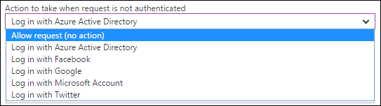

<properties
    pageTitle="Authentifizierung und Autorisierung für API Apps in Azure-App-Verwaltungsdienst | Microsoft Azure"
    description="Informationen Sie zu der Authentifizierung und Autorisierung Dienste, die App-Verwaltungsdienst Azure für Apps-API enthält."
    services="app-service\api"
    documentationCenter=".net"
    authors="tdykstra"
    manager="wpickett"
    editor=""/>

<tags
    ms.service="app-service-api"
    ms.workload="na"
    ms.tgt_pltfrm="na"
    ms.devlang="na"
    ms.topic="article"
    ms.date="05/23/2016"
    ms.author="rachelap"/>

# Authentifizierung und Autorisierung für API Apps in Azure-App-Verwaltungsdienst

## (Übersicht) 

> [AZURE.NOTE] In diesem Thema wird migriert zu einem konsolidierten [App-Authentifizierung / Autorisierung](../app-service/app-service-authentication-overview.md) Thema, das Web und Mobile Apps-API behandelt.

App-Verwaltungsdienst Azure bietet integrierte Authentifizierung und Autorisierung-Dienste, [die OAuth 2.0](#oauth) , und [Verbinden Sie OpenID](#oauth)implementieren. In diesem Artikel werden die Dienste und die verfügbaren Optionen für API-Apps in Azure-App-Dienst.

Das folgende Diagramm veranschaulicht einige Hauptmerkmale von App-Authentifizierung:

* Es vorverarbeitet eingehende Anfragen API, was bedeutet, dass sie mit allen Sprachen oder Framework von App-Dienst unterstützt funktioniert.
* Sie erfahren, die mehrere Optionen für die verbleibenden Authentifizierung arbeiten Sie in Ihrem eigenen Code tun möchten.
* Funktionsweise für Endbenutzer und Kontoauthentifizierung Dienst. 
* Es fünf Identitätsanbieter unterstützt: Azure Active Directory, Facebook, Google, Twitter und Microsoft Account.
* Es funktioniert genauso für API Apps, Web Apps und Mobile-Apps.

## Unabhängig von Sprache

Verarbeitung der App-Dienst Authentifizierung geschieht, bevor Anfragen Ihre app API erreichen, d. h., dass die Authentifizierungsfeatures funktionieren für API-apps, die in einer beliebigen Sprache oder Framework geschrieben wurde.  Ihre API kann basieren auf ASP.NET, Java, Node.js oder alle Framework, das App-Dienst unterstützt.

App-Dienst übergibt, klicken Sie auf das JSON-Web-Token (JWT) in der Kopfzeile Autorisierung einer HTTP-Anforderung und in allen Sprachen oder Framework geschriebenen Code erhalte die benötigten Informationen aus dem Token. Darüber hinaus ermöglicht App Dienst einfacher Zugriff auf die am häufigsten verwendeten Ansprüche angeben, indem Sie einige spezielle Header, beispielsweise die folgende:

* X-MS-CLIENT-TILGUNGSANTEILE-NAME
* X-MS-CLIENT-TILGUNGSANTEILE-ID
* X-MS-TOKEN-FACEBOOK-ACCESS-TOKEN
* X-MS-TOKEN-FACEBOOK-EXPIRES-ON
 
In einer .NET-API, können Sie mithilfe der `Authorize` Attribut und für abgestimmte Autorisierung können Sie ganz einfach schreiben Fehlercode basierend auf Ansprüche, da Ansprüche Informationen in .NET Klassen für Sie ausgefüllt wird.

## Mehrere Kennwortschutzoptionen

App-Dienst können verhindern, dass anonyme HTTP-Anfragen erreichen kann Ihre app API, auf alle Anfragen übergeben und überprüfen Sie die Token für Besprechungsanfragen, die diese enthalten kann, oder es kann über alle Anfragen lassen, ohne eine Aktion auf diese:

1. Lassen Sie nur authentifizierte Anfragen zu erreichen Ihre app API zu.

    Wenn eine anonyme Anforderung über einen Browser eingeht, App-Dienst werden leiten Sie an eine Anmeldeseite für-Authentifizierung (Azure AD, Google, Twitter, usw.), die Sie auswählen. 

    Mit dieser Option müssen Sie nicht gar Schreiben von Code für die Authentifizierung in Ihrer app und Autorisierungscode wird vereinfacht, da die wichtigsten Ansprüche in die HTTP-Header verfügbar sind.

2. Lassen Sie alle Anfragen erreicht haben Ihre app API aber Validierung von authentifizierten Anfragen und Authentifizierungsinformationen in die HTTP-Header übergeben zu.

    Diese Option bietet Ihnen eine größere Flexibilität bei der Behandlung von anonymer Anfragen, den Sie allerdings zum Schreiben von Code, wenn Sie verhindern, dass anonyme Benutzer Ihre API verwenden möchten. Da die am häufigsten verwendeten Ansprüche in der Kopfzeilen von HTTP-Anfragen übergeben werden, ist die Autorisierungscode relativ einfach.
    
3. Lassen Sie alle Anfragen zum Erreichen Ihrer API keine weiteren Aktionen in den Anforderungen Authentifizierungsinformationen zu.

    Diese Option bewirkt, dass die Vorgänge der Authentifizierung und Autorisierung vollständig bis zu Ihrer Anwendungscode.

Im [Portal Azure](https://portal.azure.com/), wählen Sie die Option werden sollen, klicken Sie auf der **Authentifizierung / Autorisierung** Blade.

Optionen 1 und 2 aktivieren Sie **App-Authentifizierung**, und wählen Sie in der Dropdownliste die **Aktion ausgeführt werden soll, wenn die Anforderung nicht authentifiziert ist** **Anmelden** oder **Zulassen Anforderung (keine Aktion)**.  Wenn Sie auf **Melden Sie sich**entscheiden, müssen Sie einen Authentifizierungsanbieter auswählen und die Anbieter konfigurieren.

Ausführliche Informationen zum Konfigurieren der Authentifizierung finden Sie unter [So konfigurieren Sie Ihre App-verwaltungsdienstanwendung Azure Active Directory Login verwenden](../app-service-mobile/app-service-mobile-how-to-configure-active-directory-authentication.md). Der Artikel bezieht sich auf API-apps als auch für mobile apps, und für die anderen Authentifizierungsanbieter auf Weitere Artikel verweist.
 
## Service-Kontoauthentifizierung

App-Authentifizierung funktioniert für interne Szenarien, z. B. zum Aufrufen von einem API-app zu einer anderen API-app. In diesem Szenario erhalten Sie ein Token mithilfe der Anmeldeinformationen für eine Dienstkontos anstelle des Endbenutzers Anmeldeinformationen an. Ein Dienstkonto ist auch bekannt als einen *Dienst Hauptbenutzer* in Azure Active Directory und Authentifizierung solche-Konto wird auch als ein Szenario Dienst. 

Schützen Sie für Szenarien Dienst die sogenannte API app mithilfe von Azure Active Directory und Bereitstellen Sie ein AAD Dienst Hauptbenutzer Autorisierungstoken, wenn Sie die app API aufrufen. Sie erhalten eine Token können, indem Sie den Kunden-ID und vor der Anwendung AAD geheim Client. Keine Inhalte nur Azure-Code ist erforderlich, wie verwendet, um für den Umgang mit der Mobile Services Zumo Token erfüllt werden. Ein Beispiel für dieses Szenario mit ASP.NET API apps wird durch das Lernprogramm [Dienst Hauptbenutzer Authentifizierung für API Apps](app-service-api-dotnet-service-principal-auth.md)abgedeckt.

Wenn ein Szenario Dienst ohne App-Authentifizierung verarbeitet werden soll, können Sie Client-Zertifikate oder Standardauthentifizierung verwenden. Informationen zu Client-Zertifikate in Azure finden Sie unter [How To konfigurieren TLS gemeinsamen Authentication für Web Apps](../app-service-web/app-service-web-configure-tls-mutual-auth.md). Informationen zur Standardauthentifizierung in ASP.NET finden Sie unter [Authentifizierung Filter im ASP.NET Web API 2](http://www.asp.net/web-api/overview/security/authentication-filters).

Dienst Kontoauthentifizierung aus einer App-Dienst Logik app zu einer API-app ist einen besonderen Fall, der in [Ihrer benutzerdefinierten API auf App-Verwaltungsdienst mit apps Logik gehostet verwenden](../app-service-logic/app-service-logic-custom-hosted-api.md)erläutert wird.

## Mobilen Client-Authentifizierung

Informationen zum Behandeln Authentifizierung von mobilen Clients finden Sie in der [Dokumentation zur Authentifizierung für mobile apps](../app-service-mobile/app-service-mobile-ios-get-started-users.md). App-Authentifizierung funktioniert genauso für mobile apps und API apps.
  
## Weitere Informationen

Weitere Informationen zu Authentifizierung und Autorisierung in Azure-App-Verwaltungsdienst finden Sie unter den folgenden Ressourcen:

* [Erweitern App-Dienst Authentifizierung / Autorisierung](/blog/announcing-app-service-authentication-authorization/)
* [So konfigurieren Sie Ihre App-verwaltungsdienstanwendung Azure Active Directory Login verwenden](../app-service-mobile/app-service-mobile-how-to-configure-active-directory-authentication.md) (Enthält Links bei anderen Authentifizierungsanbietern am oberen Rand der Seite). 

Weitere Informationen zu OAuth 2.0, OpenID verbinden und JSON Web Token (JWT) finden Sie unter den folgenden Ressourcen.

* [Erste Schritte mit OAuth 2.0] (http://shop.oreilly.com/product/0636920021810.do "Erste Schritte mit OAuth 2.0") 
* [Einführung in OAuth2, OpenID verbinden und JSON-Web Token (JWT) – PluralSight Kurs](http://www.pluralsight.com/courses/oauth2-json-web-tokens-openid-connect-introduction) 
* [Erstellen und Sichern von eine REST-API für mehrere Clients in ASP.NET - PluralSight Kurs](http://www.pluralsight.com/courses/building-securing-restful-api-aspdotnet)

Weitere Informationen zu Azure Active Directory finden Sie unter den folgenden Ressourcen.

* [Azure AD-Szenarien](http://aka.ms/aadscenarios)
* [Azure AD Leitfaden Entwickler](http://aka.ms/aaddev)
* [Azure AD-Beispiele](http://aka.ms/aadsamples)

## Nächste Schritte

In diesem Artikel weist Authentifizierung und Autorisierung Features der App-Dienst erläutert, die Sie für API apps verwenden können. Der erste Schritte Serie nächste Lernprogramm veranschaulicht, wie [Benutzerauthentifizierung App Service API Apps](app-service-api-dotnet-user-principal-auth.md)implementieren.
