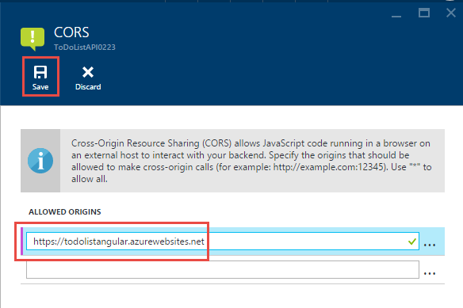

<properties
    pageTitle="Unterstützung für CORS in der App-Dienst | Microsoft Azure"
    description="Informationen Sie zum Support CORS in Azure Azure-App-Dienst verwenden."
    services="app-service\api"
    documentationCenter=".net"
    authors="tdykstra"
    manager="wpickett"
    editor=""/>

<tags
    ms.service="app-service-api"
    ms.workload="na"
    ms.tgt_pltfrm="dotnet"
    ms.devlang="na"
    ms.topic="get-started-article"
    ms.date="08/27/2016"
    ms.author="rachelap"/>

# Nutzen Sie JavaScript CORS mithilfe eine app API

App-Dienst bietet integrierten Unterstützung für [Cross Origin Ressource freigeben (CORS)](https://en.wikipedia.org/wiki/Cross-origin_resource_sharing), womit JavaScript-Clients können Sie in API apps Domain-übergreifende Anrufe an APIs, die gehostet werden, können. App-Dienst können Sie die CORS Zugriff auf Ihre API ohne Code in Ihre API konfigurieren.

Dieser Artikel enthält zwei Bereiche an:

* Im Abschnitt [zum Konfigurieren der CORS](#corsconfig) wird im Allgemeinen erläutert, wie CORS für alle API-app, Web app oder mobile-app zu konfigurieren. Gleichmäßig bezieht sich auf alle Framework, die von der App-Verwaltungsdienst, einschließlich .NET, Node.js und Java unterstützt werden. 

* Beginnend mit dem Abschnitt [.NET erste Schritte-Lernprogramme fortgesetzt werden kann](#tutorialstart) , ist der Artikel ein Lernprogramm, der veranschaulicht, dass CORS unterstützen, indem Sie auf was Sie in [der ersten API Apps erste Schritte-Lernprogramm haben](app-service-api-dotnet-get-started.md)erstellen. 

## Konfigurieren von CORS in Azure-App-Verwaltungsdienst

Sie können CORS Azure-Portal oder mithilfe der Tools [Ressourcenmanager Azure](../azure-resource-manager/resource-group-overview.md) konfigurieren.

#### Konfigurieren von CORS Azure-Portal

8. Wechseln Sie in einem Browser zum [Azure-Portal](https://portal.azure.com/).

2. Klicken Sie auf **App-Dienste**, und klicken Sie dann auf den Namen der app API.

    

10. Finden Sie in den **Einstellungen** Blade, das rechts neben dem Blade **API app** geöffnet wird im Abschnitt **API** , und klicken Sie dann auf **CORS**.

    

11. In den Text im Feld Geben Sie die URL oder URLs, die Sie JavaScript-Anrufe an stammen zulassen möchten.

    Wenn Sie Ihre JavaScript-Anwendung zu einer Web app mit dem Namen Todolistangular bereitgestellt, geben Sie beispielsweise "https://todolistangular.azurewebsites.net". Alternativ können Sie ein Sternchen (*), um anzugeben, dass alle Origin Domänen akzeptiert werden eingeben.

13. Klicken Sie auf **Speichern**.

    

    Nachdem Sie auf **Speichern**klicken, akzeptiert die app API JavaScript-Anrufe von den angegebenen URLs.

#### Konfigurieren von CORS mithilfe von Tools Azure Ressourcenmanager

Sie können auch CORS für eine app API mithilfe von [Azure Ressourcenmanager Vorlagen](../resource-group-authoring-templates.md) in Befehlszeile-Tools, wie z. B. [Azure PowerShell](../powershell-install-configure.md) und [Azure CLI](../xplat-cli-install.md)konfigurieren. 

Öffnen Sie ein Beispiel einer Ressourcenmanager Azure-Vorlage, die die Eigenschaft CORS legt fest, die [azuredeploy.json-Datei im Repository für dieses Lernprogramms der Stichprobe Anwendung](https://github.com/azure-samples/app-service-api-dotnet-todo-list/blob/master/azuredeploy.json)aus. Suchen Sie den Abschnitt der Vorlage, die wie im folgenden Beispiel aussieht:

        "cors": {
            "allowedOrigins": [
                "todolistangular.azurewebsites.net"
            ]
        }

## Sie fortfahren das erste Schritte-Lernprogramm für .NET

Wenn Sie die Node.js oder Java-überfordert Reihe für API apps folgen, haben Sie die erste Schritte Reihe abgeschlossen. Fahren Sie mit Abschnitt [Weitere Schritte](#next-steps) , um Vorschläge für weitere Kennenlernen API Apps zu finden.

Der Rest dieses Artikels ist eine Fortsetzung der .NET überfordert Serie und wird davon ausgegangen, dass Sie [das erste Lernprogramm](app-service-api-dotnet-get-started.md)erfolgreich abgeschlossen.

## Bereitstellen Sie das Projekt ToDoListAngular, um eine neue Web app

In [der ersten Lernprogramm](app-service-api-dotnet-get-started.md)haben Sie eine mittlere Ebene API-app und einer Daten Ebene API-app erstellt. In diesem Lernprogramm erstellen Sie eine einzelne Seite Anwendung (gesicherte KENNWORTAUTHENTIFIZIERUNG) Web app die Anrufe im mittleren Ebene API-app. Für die gesicherte KENNWORTAUTHENTIFIZIERUNG entwickelt Sie haben CORS mittleren Ebene API-App zu aktivieren. 

In der [Aufgabenliste Beispiel Anwendung](https://github.com/Azure-Samples/app-service-api-dotnet-todo-list)ist das Projekt ToDoListAngular einen einfachen AngularJS-Client, der das mittlere Ebene ToDoListAPI Web-API Projekt ruft an. JavaScript-Code in der Datei *app/scripts/todoListSvc.js* API aufgerufen, mit dem AngularJS HTTP-Anbieter. 

        angular.module('todoApp')
        .factory('todoListSvc', ['$http', function ($http) {

            $http.defaults.useXDomain = true;
            delete $http.defaults.headers.common['X-Requested-With']; 
        
            return {
                getItems : function(){
                    return $http.get(apiEndpoint + '/api/TodoList');
                },

                /* Get by ID, Put, and Delete methods not shown */

                postItem : function(item){
                    return $http.post(apiEndpoint + '/api/TodoList', item);
                }
            };
        }]);

### Erstellen einer neuen Web app für das Projekt ToDoListAngular

Die Vorgehensweise zum Erstellen einer neuen App-Dienst Web app und Bereitstellen eines Projekts auf Es ähnelt der zum [Erstellen und Bereitstellen einer API-app in das erste Lernprogramm in dieser Reihe](app-service-api-dotnet-get-started.md#createapiapp)gesehen haben. Der einzige Unterschied ist, dass sich die app **Web App** **API App**handelt.  Screenshots der Dialogfelder finden Sie unter 

1. Im- **Lösung-Explorer**mit der rechten Maustaste in des Projekts ToDoListAngular, und klicken Sie dann auf **Veröffentlichen**.

3.  Klicken Sie auf der Registerkarte **Profil** des **Web veröffentlichen** -Assistenten auf **Microsoft Azure-App-Dienst**.

5. Klicken Sie auf **neu**, klicken Sie im Dialogfeld **App-Dienst** .

3. Geben Sie im Dialogfeld **App-Verwaltungsdienst erstellen** der Registerkarte **Hosting** **Web App-Name** , der in der Domäne *azurewebsites.net* eindeutig ist. 

5. Wählen Sie das Azure **Abonnements** , die Sie mit arbeiten möchten.

6. Wählen Sie in der Dropdown-Liste **Ressourcengruppe** derselben Ressourcengruppe, die Sie zuvor erstellt haben.

4. Wählen Sie in der Dropdown-Liste **App-Serviceplan** derselben Plan, die, den Sie zuvor erstellt haben. 

7. Klicken Sie auf **Erstellen**.

    Visual Studio erstellt die Web app, ein Veröffentlichungsprofil dafür erstellt und zeigt den **Verbindung** Schritt des Assistenten **Web veröffentlichen** .

    Klicken Sie **Veröffentlichen** noch nicht. Im folgenden Abschnitt Konfigurieren Sie das neue Web-app, um die mittleren Ebene API app anrufen, die im App-Dienst ausgeführt wird. 

### Legen Sie die URL der mittleren Ebene in Web app-Einstellungen

1. Wechseln Sie zum [Azure-Portal](https://portal.azure.com/), und navigieren Sie zu dem Blade **Web App** für die Web-app, die Sie erstellt haben, um das TodoListAngular (front-End) Projekt hosten.

2. Klicken Sie auf **Einstellungen > Anwendungseinstellungen**.

3. Fügen Sie im Abschnitt **App-Einstellungen** die folgenden Schlüssel und Wert hinzu:

  	|Schlüssel|Wert|Beispiel
  	|---|---|---|
  	|toDoListAPIURL|https://{Your mittlere Ebene API app-Name} .azurewebsites .net|https://todolistapi0121.azurewebsites.NET|

4. Klicken Sie auf **Speichern**.

    Wenn der Code in Azure ausgeführt wird, wird dieser Wert die Localhost-URL, die in der Datei *Web.config* ist überschrieben. 

    Der Code, der den Einstellungswert erhält ist in *index.cshtml*:

        
        

    Der Code in *todoListSvc.js* verwendet die Einstellung:

        return {
            getItems : function(){
                return $http.get(apiEndpoint + '/api/TodoList');
            },
            getItem : function(id){
                return $http.get(apiEndpoint + '/api/TodoList/' + id);
            },
            postItem : function(item){
                return $http.post(apiEndpoint + '/api/TodoList', item);
            },
            putItem : function(item){
                return $http.put(apiEndpoint + '/api/TodoList/', item);
            },
            deleteItem : function(id){
                return $http({
                    method: 'DELETE',
                    url: apiEndpoint + '/api/TodoList/' + id
                });
            }
        };

### Bereitstellen von ToDoListAngular Webprojekt für das neue Web app

*  Klicken Sie in Visual Studio **Verbindung** Schritt im Assistenten **Web veröffentlichen** auf **Veröffentlichen**.

    Visual Studio Bereitstellen von ToDoListAngular Projekt auf das neue Web app und einen Browser, um die URL des Web app geöffnet. 

### Testen Sie die Anwendung ohne CORS aktiviert 

2. Öffnen Sie in Ihrem Browser Entwicklertools das Console-Fenster.

3. Klicken Sie im Browserfenster, in dem die AngularJS UI angezeigt, auf den Link **Aus der Liste** .

    JavaScript-Code versucht, die app mittleren Ebene API aufrufen, aber der Anruf schlägt fehl, da der front-End in eine andere Domäne als Back-End ausgeführt wird. Das Browserfenster Developer Tools Console zeigt eine Kreuz-Origin Fehlermeldung.

    

## Konfigurieren von CORS für die mittlere Ebene API-app

In diesem Abschnitt Konfigurieren Sie die Einstellung CORS in Azure für die mittlere Leiste ToDoListAPI API-app. Diese Einstellung ermöglicht die mittlere Ebene API app JavaScript Anrufe aus dem Web app empfangen werden sollen, die Sie für das Projekt ToDoListAngular erstellt.

8. Wechseln Sie in einem Browser zum [Azure-Portal](https://portal.azure.com/).

2. Klicken Sie auf **App-Dienste**, und klicken Sie dann auf die ToDoListAPI (mittlere Ebene) API-app.

    

10. Finden Sie in den **Einstellungen** Blade, das rechts neben dem Blade **API app** geöffnet wird im Abschnitt **API** , und klicken Sie dann auf **CORS**.

    

12. Geben Sie in das Textfeld die URL für die ToDoListAngular (front-End) Web app. Beispielsweise, wenn Sie das Projekt ToDoListAngular bei einer Web-app mit dem Namen todolistangular0121 bereitgestellt, Anrufe aus dem URL zulassen `https://todolistangular0121.azurewebsites.net`.

    Alternativ können Sie ein Sternchen (*), um anzugeben, dass alle Origin Domänen akzeptiert werden eingeben.

13. Klicken Sie auf **Speichern**.

    

    Nachdem Sie auf **Speichern**klicken, wird die app API JavaScript-Anrufe aus dem angegebenen URL akzeptieren. In diesem Screenshot akzeptiert die app ToDoListAPI0223 API JavaScript-Client Anrufe aus der ToDoListAngular Web app.

### Testen Sie die Anwendung mit CORS aktiviert

* Öffnen Sie einen Browser auf den HTTPS-URL des Web app an. 

    Diesmal die Anwendung können Sie anzeigen, hinzufügen, bearbeiten und Löschen von Aufgabenelementen. 

    

## App-Verwaltungsdienst CORS im Vergleich zu Web-API CORS

In einem Projekt Web-API können Sie das [Microsoft.AspNet.WebApi.Cors](https://www.nuget.org/packages/Microsoft.AspNet.WebApi.Cors/) NuGet-Paket, um Code anzugeben, welche Domänen Ihrer API akzeptieren von JavaScript ruft installieren.
 
Web API CORS Support ist flexibler als App-Dienst CORS Support. Code können Sie beispielsweise andere zulässigen Ursprung für andere Aktionsmethoden, angeben, während für App-Dienst CORS Sie eine Reihe von zulässigen Ursprung für alle API-app Methoden angeben.

> [AZURE.NOTE] Versuchen Sie nicht, Web API CORS sowohl die App-Dienst CORS in eine API-app verwenden. App-Verwaltungsdienst CORS dauert Vorrang und Web API CORS hat keine Auswirkung. Beispielsweise, wenn Sie eine Origin-Domäne in der App-Dienst aktivieren, und aktivieren alle Origin Domänen im Web-API Code, akzeptiert Ihre app Azure-API nur Anrufe aus der Domäne die angegebene Azure.

### Aktivieren von CORS im Web-API code

Die folgenden Schritte werden das Verfahren zum Aktivieren der Web-API CORS Support. Weitere Informationen finden Sie unter [Aktivieren von Cross-Origin Besprechungsanfragen in ASP.NET Web API 2](http://www.asp.net/web-api/overview/security/enabling-cross-origin-requests-in-web-api).

1. Installieren Sie in einem Projekt Web-API das [Microsoft.AspNet.WebApi.Cors](https://www.nuget.org/packages/Microsoft.AspNet.WebApi.Cors/) NuGet-Paket ein.

1. Einschließen einer `config.EnableCors()` Zeile des Codes in der Methode **Registrieren** der **WebApiConfig** -Klasse, wie im folgenden Beispiel gezeigt. 

        public static class WebApiConfig
        {
            public static void Register(HttpConfiguration config)
            {
                // Web API configuration and services
                
                // The following line enables you to control CORS by using Web API code
                config.EnableCors();
    
                // Web API routes
                config.MapHttpAttributeRoutes();
    
                config.Routes.MapHttpRoute(
                    name: "DefaultApi",
                    routeTemplate: "api/{controller}/{id}",
                    defaults: new { id = RouteParameter.Optional }
                );
            }
        }

1. In der Web-API Controller Hinzufügen einer `using` -Anweisung für die `System.Web.Http.Cors` Namespace, und Hinzufügen der `EnableCors` Attribut aus, um die Controller-Klasse oder einzelne Aktionsmethoden. Im folgenden Beispiel gilt für den gesamten Controller CORS Support.

        namespace ToDoListAPI.Controllers 
        {
            [HttpOperationExceptionFilterAttribute]
            [EnableCors(origins:"https://todolistangular0121.azurewebsites.net", headers:"accept,content-type,origin,x-my-header", methods: "get,post")]
            public class ToDoListController : ApiController
 
## Verwenden von Azure-API Management mit API-Apps

Wenn Sie mit einer app API Azure-API Management verwenden, konfigurieren Sie in der app API CORS bei API-Verwaltung. Weitere Informationen finden Sie unter den folgenden Ressourcen:

* [Azure-API Management Overview (video: CORS beginnt am 12:10)](https://azure.microsoft.com/documentation/videos/azure-api-management-overview/)
* [API Management cross-Domänenrichtlinien](https://msdn.microsoft.com/library/azure/dn894084.aspx#CORS)
 
## Behandlung von Problemen

Falls Sie ein Problem beim Durcharbeiten dieses Lernprogramms auftreten, sind hier einige Vorschläge zur Problembehandlung.

* Stellen Sie sicher, dass Sie die neueste Version des [Azure SDK für .NET für Visual Studio 2015](http://go.microsoft.com/fwlink/?linkid=518003)verwenden.

* Stellen Sie sicher, dass Sie eingegeben `https` der CORS-Einstellung, und stellen Sie sicher, dass Sie verwenden `https` zum Ausführen des Front-End-Web app.

* Stellen Sie sicher, dass Sie die Einstellung CORS eingegeben, in der mittleren Ebene API-app, die nicht in der Front-End-Web-app haben.

* Beachten Sie, dass die App-Dienst CORS Einstellung überschreiben Sie in der Anwendungscode den aktuellen Vorgang sind, wenn beim Konfigurieren von CORS in der Anwendungscode und den App-Verwaltungsdienst Azure. 

Weitere Informationen zu Visual Studio-Features, die Problembehandlung zu vereinfachen, finden Sie unter [Problembehandlung Azure-App-Verwaltungsdienst-apps in Visual Studio](../app-service-web/web-sites-dotnet-troubleshoot-visual-studio.md).

## Nächste Schritte 

In diesem Artikel wurde gezeigt, wie App Dienst CORS Support aktivieren, damit Kunden JavaScript-Code in eine andere Domäne eine API Publikums. Weitere Informationen zu API apps zu finden, lesen Sie die [Einführung in die Authentifizierung in der App-Dienst](../app-service/app-service-authentication-overview.md), und wechseln Sie dann zu der [Benutzerauthentifizierung für API apps](app-service-api-dotnet-user-principal-auth.md) Lernprogramm.
