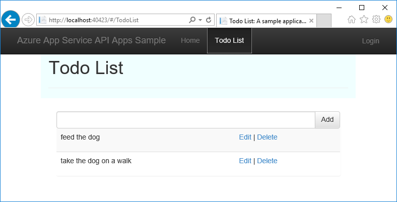
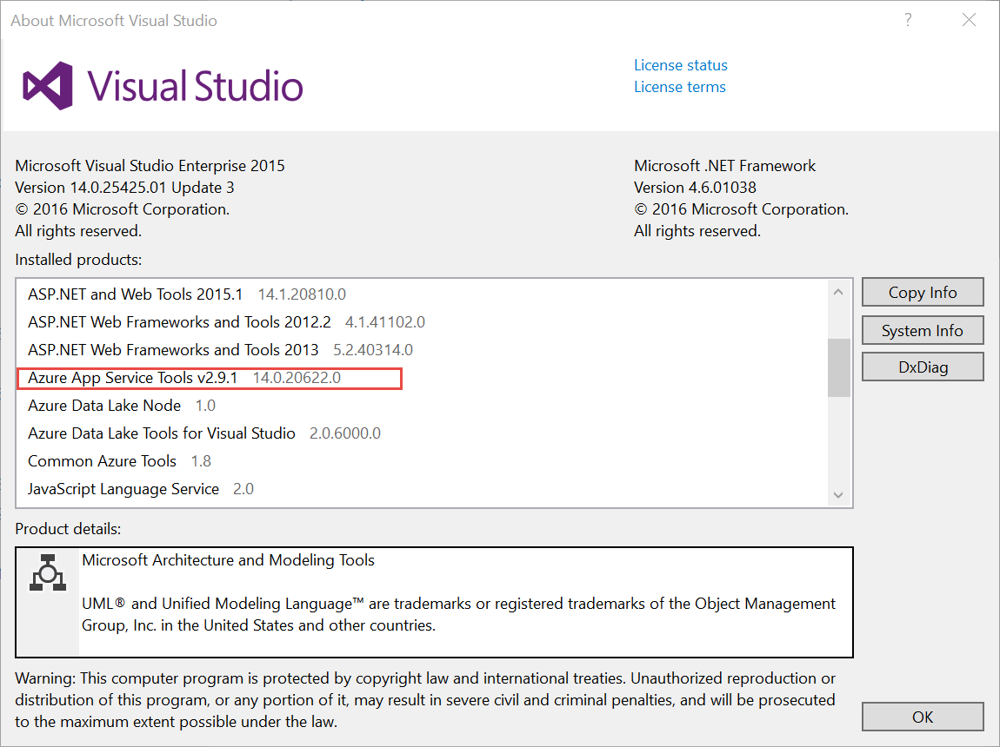
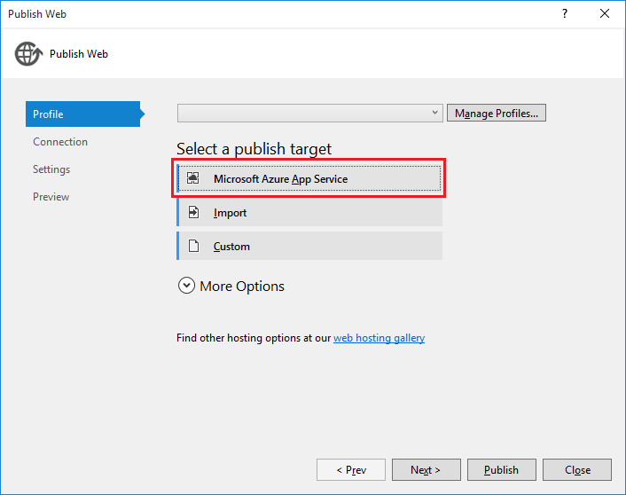
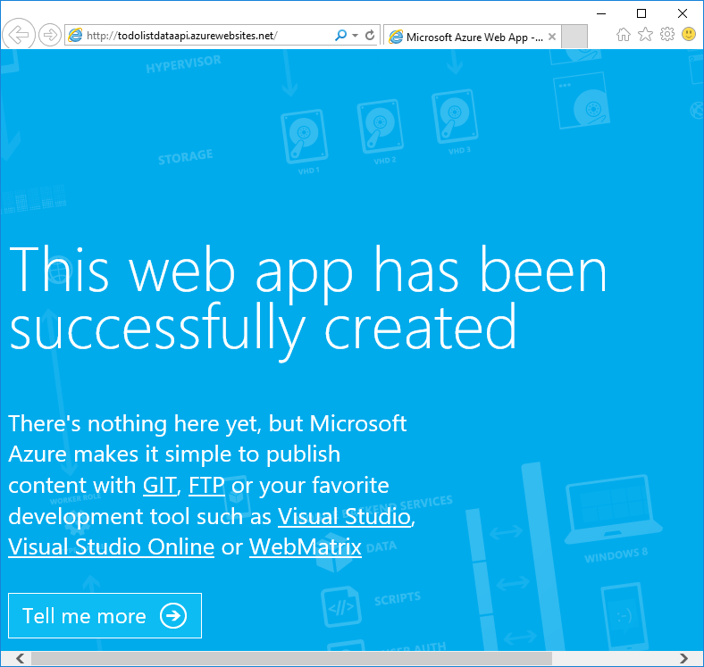
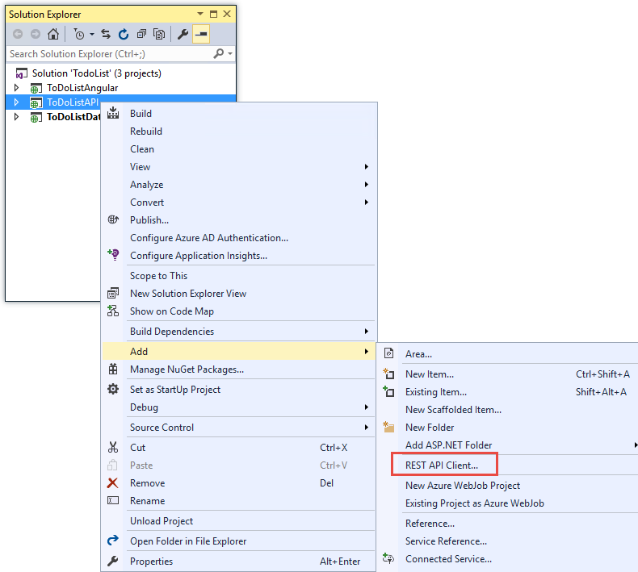
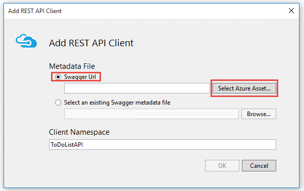
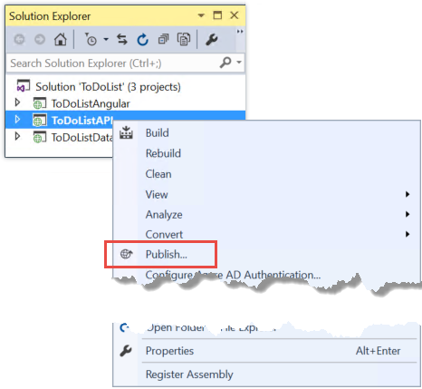
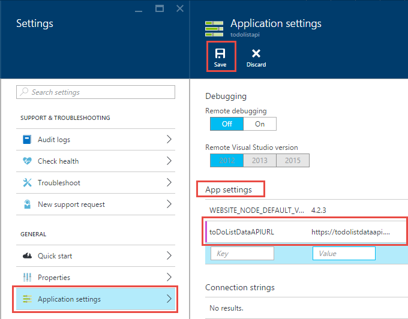

<properties
    pageTitle="Erste Schritte mit Apps-API und ASP.NET im App-Dienst | Microsoft Azure"
    description="Informationen Sie zum Erstellen und Bereitstellen eine ASP.NET API-app im App-Verwaltungsdienst Azure, mithilfe von Visual Studio 2015 nutzen."
    services="app-service\api"
    documentationCenter=".net"
    authors="tdykstra"
    manager="wpickett"
    editor=""/>

<tags
    ms.service="app-service-api"
    ms.workload="na"
    ms.tgt_pltfrm="dotnet"
    ms.devlang="na"
    ms.topic="hero-article"
    ms.date="09/20/2016"
    ms.author="rachelap"/>

# Erste Schritte mit Apps-API, ASP.NET und Swagger in Azure-App-Verwaltungsdienst

[AZURE.INCLUDE [selector](../../includes/app-service-api-get-started-selector.md)]

Dies ist der erste in einer Reihe von Lernprogrammen, die zeigen, wie Features von Azure-App-Dienst verwenden, die für die Entwicklung und hosting-APIs Rest hilfreich sind.  In diesem Lernprogramm wird Unterstützung für API Metadaten im Format Swagger behandelt.

Lernen Sie:

* So erstellen und Bereitstellen von [API apps](app-service-api-apps-why-best-platform.md) in Azure-App-Verwaltungsdienst mithilfe der Tools in Visual Studio 2015 integriert.
* So API Discovery automatisieren mithilfe des Swashbuckle NuGet-Pakets Swagger API Metadaten dynamisch generieren.
* So Swagger API Metadaten zum automatischen Generieren von Client-Code für eine app API verwenden.

## Beispiel-Anwendung (Übersicht)

In diesem Lernprogramm arbeiten Sie mit einer einfachen Aufgabe Liste Stichprobe Anwendung. Die Anwendung verfügt über eine einzelne Seite Anwendung (SP a) front-End, einer ASP.NET Web API mittleren Ebene und einer Datenebene ASP.NET Web API.

Hier ist ein Screenshot der front-End [AngularJS](https://angularjs.org/) aus.

Visual Studio-Lösung beinhaltet drei Projekte:

* **ToDoListAngular** - front-End: eine AngularJS gesicherte KENNWORTAUTHENTIFIZIERUNG, die die mittlere Ebene Anrufe.

* **ToDoListAPI** - der mittleren Ebene: einem ASP.NET Web API-Projekt, um Vorgänge auf Aufgabenelemente ausführen die Datenebene Aufrufe.

* **ToDoListDataAPI** - Datenebene: ein ASP.NET Web API-Projekt, das auf Aufgabenelemente Vorgänge ausführt.

Die Architektur mit drei Ebenen ist eine der vielen Architekturen, die Sie können mithilfe von Apps-API implementieren und werden hier nur zu Demo verwendet. Der Code in jede Ebene ist so einfach wie möglich, um zu veranschaulichen, API Apps-Features. Beispielsweise verwendet die Datenebene Serverarbeitsspeicher anstelle einer Datenbank als deren Dauerhaftigkeitsmechanismus.

In diesem Lernprogramm müssen Sie die beiden Web-API Projekte nach oben und in der Cloud auf App-Service-API apps ausgeführt.

In der Reihe das nächste Lernprogramm bereitstellt gesicherte KENNWORTAUTHENTIFIZIERUNG front-End in der Cloud.

## Erforderliche Komponenten

* ASP.NET Web API - Angenommen die zusammengehörenden Anweisungen, die Sie grundlegende Kenntnisse zum Arbeiten mit ASP.NET [Web API 2](http://www.asp.net/web-api/overview/getting-started-with-aspnet-web-api/tutorial-your-first-web-api) in Visual Studio.

* Azure-Konto - können Sie [ein Azure-Konto kostenlos öffnen](/pricing/free-trial/?WT.mc_id=A261C142F) oder [Vorteile für Abonnenten Visual Studio aktivieren](/pricing/member-offers/msdn-benefits-details/?WT.mc_id=A261C142F).

    Wenn Sie mit Azure-App-Verwaltungsdienst anzufangen, bevor Sie für ein Azure-Konto anmelden möchten, wechseln Sie zu [App-Verwaltungsdienst versuchen](http://go.microsoft.com/fwlink/?LinkId=523751). Vorhanden, können Sie eine app kurzlebige Starter sofort erstellen, in der App-Dienst – **keine Kreditkarte erforderlich**, und keine Zusagen.

* Visual Studio 2015 mit dem [Azure SDK für .NET](https://azure.microsoft.com/downloads/archive-net-downloads/) – das SDK installiert Visual Studio 2015 automatisch ein, wenn Sie noch nicht vorhanden ist.

    * Klicken Sie in Visual Studio auf Hilfe zu Microsoft Visual Studio ->, und stellen Sie sicher, dass Sie "Azure App-Verwaltungsdienst Tools v2.9.1" oder höher installiert sein.

    

    >[AZURE.NOTE] Je nachdem, wie viele der SDK Abhängigkeiten Sie bereits auf Ihrem Computer haben könnte Installieren des SDK langem aus eine halbe Stunde oder mehrere mehrere Minuten dauern.

## Herunterladen der Stichprobe-Anwendungs

1. Herunterladen des [Azure-Samples/app-service-api-dotnet-to-do-list](https://github.com/Azure-Samples/app-service-api-dotnet-todo-list) Repositorys.

    Klicken Sie auf die Schaltfläche **Herunterladen eines ZIP** oder Repository auf dem lokalen Computer klonen können.

2. Öffnen Sie die Aufgabenliste-Lösung in Visual Studio 2015 oder 2013 an.
   1. Sie müssen jede Lösung vertrauen.
        

3. Erstellen der Lösung (STRG + UMSCHALT + B), um die NuGet-Pakete wiederherstellen.

    Wenn Sie die Anwendung in Vorgang finden Sie vor der Bereitstellung möchten, können Sie es lokal ausführen. Vergewissern Sie sich, dass ToDoListDataAPI Ihres beim Start-Projekts ist, und führen Sie die Lösung. Sie müssen mit einer HTTP-Fehler 403 in Ihrem Browser finden Sie unter rechnen.

## Verwenden von Metadaten Swagger API und Benutzeroberfläche

Unterstützung für [Swagger](http://swagger.io/) 2.0-API Metadaten ist in Azure-App-Verwaltungsdienst integriert. Jede API-app kann ein URL-Endpunkts angeben, das Metadaten für die-API im Swagger JSON-Format zurückgibt. Client-Code generieren, kann die Metadaten, die von diesem Endpunkt zurückgegeben verwendet werden.

Ein Projekt ASP.NET Web API kann Swagger Metadaten mithilfe des [Swashbuckle](https://www.nuget.org/packages/Swashbuckle) NuGet-Pakets dynamisch generieren. Das Swashbuckle NuGet-Paket ist bereits in der ToDoListDataAPI und ToDoListAPI Projekte installiert, die Sie heruntergeladen haben.

In diesem Abschnitt des Lernprogramms prüfen Sie die generierten Swagger 2.0-Metadaten aus, und versuchen Sie, einen Testanruf Benutzeroberfläche, die auf die Metadaten Swagger basiert.

1. Legen Sie das ToDoListDataAPI-Projekt (**nicht** das Projekt ToDoListAPI) als die Startprojekt.

    

2. Drücken Sie F5, oder klicken Sie auf **Debuggen > Debuggen starten** auf das Projekt Debuggen-Modus ausgeführt werden.

    Im Browser wird geöffnet und zeigt die Fehlerseite HTTP 403.

3. Fügen Sie in der Adressleiste des Browsers `swagger/docs/v1` bis zum Ende der Zeile, und drücken Sie dann die EINGABETASTE. (Die URL ist `http://localhost:45914/swagger/docs/v1`.)

    Dies ist der Standard-URL von Swashbuckle verwendet, um Swagger 2.0 JSON-Metadaten für die-API zurückgegeben.

    Wenn Sie Internet Explorer verwenden, fordert mit der Browser eine *v1.json* -Datei nicht herunterladen.

    

    Wenn Sie Chrome, Firefox oder Kante verwenden, wird im Browser die JSON im Browserfenster. Verschiedene Browser JSON anders verarbeitet, und im Browserfenster möglicherweise nicht genau wie in diesem Beispiel aussehen.

    

    Im folgende Beispiel wird den ersten Abschnitt der Swagger Metadaten für die-API, mit der Definition für die Get-Methode. Diese Metadaten sind, was die Benutzeroberfläche Swagger veranlasst, die Sie in den folgenden Schritten verwenden, und Sie sie in einem späteren Abschnitt des Lernprogramms zum automatischen Generieren von Client-Code verwenden.

        {
          "swagger": "2.0",
          "info": {
            "version": "v1",
            "title": "ToDoListDataAPI"
          },
          "host": "localhost:45914",
          "schemes": [ "http" ],
          "paths": {
            "/api/ToDoList": {
              "get": {
                "tags": [ "ToDoList" ],
                "operationId": "ToDoList_GetByOwner",
                "consumes": [ ],
                "produces": [ "application/json", "text/json", "application/xml", "text/xml" ],
                "parameters": [
                  {
                    "name": "owner",
                    "in": "query",
                    "required": true,
                    "type": "string"
                  }
                ],
                "responses": {
                  "200": {
                    "description": "OK",
                    "schema": {
                      "type": "array",
                      "items": { "$ref": "#/definitions/ToDoItem" }
                    }
                  }
                },
                "deprecated": false
              },

4. Schließen Sie den Browser, und beenden Sie Visual Studio für das Debuggen.

5. Öffnen Sie im Projekt ToDoListDataAPI in **Lösung Explorer**die Datei *App_Start\SwaggerConfig.cs* und klicken Sie dann einen Bildlauf nach unten bis zum Linie 174 und kommentieren Sie den folgenden Code.

        /*
            })
        .EnableSwaggerUi(c =>
            {
        */

    Die *SwaggerConfig.cs* -Datei wird erstellt, wenn Sie das Paket Swashbuckle in einem Projekt installieren. Die Datei bietet eine Reihe von Methoden zum Swashbuckle konfigurieren.

    Der Code, den Sie nicht kommentiert haben ermöglicht die Swagger Benutzeroberfläche, die Sie in den folgenden Schritten verwenden. Wenn Sie ein Projekt Web-API mithilfe der API app-Projektvorlage erstellen, wird dieser Code aus Sicherheitsgründen, standardmäßig kommentiert.

6. Führen Sie das Projekt erneut aus.

7. Fügen Sie in der Adressleiste des Browsers `swagger` bis zum Ende der Zeile, und drücken Sie dann die EINGABETASTE. (Die URL ist `http://localhost:45914/swagger`.)

8. Wenn die Seite Swagger Benutzeroberfläche angezeigt wird, klicken Sie auf **Aufgabenliste** , um die verfügbaren Methoden anzuzeigen.

    

9. Klicken Sie auf die Schaltfläche "erster **erhalten** " in der Liste.

10. Geben Sie im Abschnitt **Parameter** ein Sternchen als der Wert der `owner` Parameter, und klicken Sie dann auf **Probieren Sie es einfach**.

    Wenn Sie in der nachfolgenden Lernprogramme Authentifizierung hinzufügen, wird die mittlere Ebene die ist-Benutzer-ID, mit der Datenebene bereitstellen. Jetzt werden alle Vorgänge Sternchen als deren Besitzer-ID verfügen, während der Ausführung der Anwendung ohne Authentifizierung aktiviert.

    

    Die Benutzeroberfläche Swagger Anrufe Aufgabenliste Get-Methode und zeigt die Antwortcode und JSON ergibt.

    

11. Klicken Sie auf **Bereitstellen**, und klicken Sie dann auf das Feld unter **Modellschema**.

    Durch Klicken auf das Modellschema prefills das Eingabefeld, in dem Sie den Parameterwert für die Post-Methode angeben können. (Wenn dies in Internet Explorer nicht funktioniert, verwenden Sie einen anderen Browser, oder geben Sie den Parameterwert manuell im nächsten Schritt.)  

    

12. Ändern die JSON in der `todo` Eingabeparameter Feld, damit es wie im folgenden Beispiel sieht so aus, oder Ersetzen durch einen eigenen Beschreibungstext:

        {
          "ID": 2,
          "Description": "buy the dog a toy",
          "Owner": "*"
        }

13. Klicken Sie auf, **Probieren Sie es einfach**.

    Die Aufgabenliste-API gibt einen HTTP-204 Antwortcode, der Vorgang erfolgreich war.

14. Klicken Sie auf die Schaltfläche erster **Abrufen** , und klicken Sie dann in diesem Abschnitt der Seite auf die Schaltfläche **Probieren Sie es einfach** .

    Antwort der Get-Methode enthält jetzt die neue Aufgabenelemente.

15. Optional: Versuchen auch einsetzen, löschen und Abrufen von ID Methoden.

16. Schließen Sie den Browser, und beenden Sie Visual Studio für das Debuggen.

Swashbuckle funktioniert mit jedes ASP.NET Web API-Projekt. Wenn Sie der zweiten Generation Swagger Metadaten zu einem vorhandenen Projekt hinzufügen möchten, installieren Sie das Paket Swashbuckle.

>[AZURE.NOTE] Swagger Metadaten enthält eine eindeutige ID für jeden Vorgang API. Standardmäßig kann Swashbuckle doppelte Swagger Vorgang IDs für die Web-API Controllermethoden generieren. Dies geschieht, wenn Ihr Controller HTTP-Methoden, wie überladen hat `Get()` und `Get(id)`. Informationen zur Behandlung von überladenen finden Sie unter [Anpassen Swashbuckle generierte API Definitionen](app-service-api-dotnet-swashbuckle-customize.md). Wenn Sie ein Projekt Web-API in Visual Studio mithilfe der Vorlage Azure-API App erstellen, ist die Datei *SwaggerConfig.cs* , eindeutige Vorgang IDs generiert, automatisch hinzugefügt.  

## Erstellen einer app API in Azure und Code darauf bereitstellen.

In diesem Abschnitt verwenden Sie Azure Tools, die in den Visual Studio **Web veröffentlichen** -Assistenten zum Erstellen einer neuen API-app in Azure integriert sind. Klicken Sie dann das Projekt ToDoListDataAPI mit der neuen API bereitstellen und die-API durch Ausführen der Benutzeroberfläche Swagger aufrufen.

1. Im- **Lösung-Explorer**mit der rechten Maustaste in des Projekts ToDoListDataAPI, und klicken Sie dann auf **Veröffentlichen**.

    

2.  Im **Profil** Schritt des Assistenten **Web veröffentlichen** klicken Sie auf **Microsoft Azure-App-Dienst**.

    

3. Melden Sie sich bei Ihrem Konto Azure, wenn Sie dies noch nicht getan haben, oder aktualisieren Sie Ihre Anmeldeinformationen ein, wenn diese abgelaufen sind.

4. Wählen Sie das Azure **Abonnements** , die Sie verwenden möchten, und klicken Sie dann auf **neu**, klicken Sie im Dialogfeld App-Dienst.

    

    Die Registerkarte **Hosting** des Dialogfelds **App-Verwaltungsdienst erstellen** wird angezeigt.

    Da Sie eine Project Web-API, die Swashbuckle installiert wurde bereitstellen, wird Visual Studio davon ausgegangen, dass Sie eine API-App erstellen möchten. Dies wird angezeigt, nach der **App-API Name** Titel und die Fakultät der Dropdownliste **Typ ändern** , für die **App API**festgelegt ist.

    

5. Geben Sie einen **Namen API-Anwendung** , die in der Domäne *azurewebsites.net* eindeutig ist. Sie können den Standardnamen übernehmen, den Visual Studio vorgeschlagen.

    Wenn Sie einen Namen, den eine andere Person bereits verwendet wurde eingeben, wird ein rotes Ausrufezeichen nach rechts.

    Kann ich die URL der app API `{API app name}.azurewebsites.net`.

6. Klicken Sie auf **neu**, und geben Sie "ToDoListGroup" oder einen anderen Namen, wenn Sie es vorziehen, in der Dropdownliste **Ressourcengruppe** .

    Eine Ressourcengruppe ist eine Sammlung von Azure Ressourcen wie API apps, Datenbanken, virtuellen Computern und So weiter. In diesem Lernprogramm verwenden empfiehlt es sich, eine neue Ressourcengruppe zu erstellen, da können sie leicht in einem Schritt Löschen aller Azure Ressourcen, die Sie für das Lernprogramm erstellen.

    In diesem Feld können Sie die vorhandene [Ressourcengruppe](../azure-resource-manager/resource-group-overview.md) auswählen oder einen neuen erstellen, indem Sie mit der Eingabe in einen Namen, der sich aus einer vorhandenen Ressourcengruppe in Ihrem Abonnement unterscheidet.

7. Klicken Sie auf die Schaltfläche " **neu** " neben der Dropdownliste **App Dienst planen** .

    Der Screenshot zeigt Beispielwerte für **API App-Name**, **Abonnement**und **Ressourcengruppe** – die Werte unterscheiden.

    

    In den folgenden Schritten erstellen Sie eine App Serviceplan für die neue Ressourcengruppe ein. Eine App Serviceplan gibt den berechnen Ressourcen, die Ihre app API ausgeführt wird, klicken Sie auf an. Beispielsweise, wenn Sie die kostenlose Ebene auswählen, während der Ausführung der app API auf freigegebenen virtuellen Computern, für einige kostenpflichtigen Ebenen, die sie auf dedizierten virtuellen Computern ausgeführt wird. Informationen zu App-Service-Pläne finden Sie unter [Übersicht über die App-Service-Pläne](../app-service/azure-web-sites-web-hosting-plans-in-depth-overview.md).

8. Geben Sie im Dialogfeld **Konfigurieren der App Dienst planen** Wenn Sie lieber "ToDoListPlan" oder einen anderen Namen.

9. Wählen Sie in der Dropdown-Liste **Speicherort** den Speicherort aus, der Ihnen am nächsten ist.

    Diese Einstellung gibt an, welche Azure Datacenter Ihre app ausgeführt wird. Wählen Sie eine Stelle in der Nähe [Wartezeit](http://www.bing.com/search?q=web%20latency%20introduction&qs=n&form=QBRE&pq=web%20latency%20introduction&sc=1-24&sp=-1&sk=&cvid=eefff99dfc864d25a75a83740f1e0090)minimiert werden.

10. Klicken Sie in der Dropdownliste **Größe** auf **frei**.

    In diesem Lernprogramm wird die kostenlose Preisgestaltung Ebene ausreichende Leistung bereitstellen.

11. Klicken Sie im Dialogfeld **Konfigurieren planen App Service** klicken Sie auf **OK**.

    

12. Klicken Sie im Dialogfeld **App-Verwaltungsdienst erstellen** auf **Erstellen**.

    

    Visual Studio erstellt die app API und ein Veröffentlichungsprofil, die alle erforderlichen Einstellungen für die app API enthält. Klicken Sie dann den **Web veröffentlichen** -Assistenten, die Sie verwenden möchten, um das Projekt bereitzustellen wird geöffnet.

    Der **Web veröffentlichen** -Assistent wird geöffnet, auf der Registerkarte **Verbindung** (siehe unten).

    Zeigen Sie auf der Registerkarte **Verbindung** die Einstellungen für **Server** und **Websitenamen** zu Ihrer Anwendung API aus. **Benutzername** und **Kennwort** sind Bereitstellung Anmeldeinformationen, die für Sie Azure erstellt wird. Nach der Bereitstellung öffnet Visual Studio einen Browser, um die **Ziel-URL** (die einzige Zweck der **Ziel-URL**ist).  

13. Klicken Sie auf **Weiter**.

    

    Die nächste Registerkarte ist die Registerkarte **Einstellungen** (siehe unten). Hier können Sie auf die Registerkarte erstellen Konfiguration, um einen Build Debuggen für das [Debuggen Remoteprozeduraufruf](../app-service-web/web-sites-dotnet-troubleshoot-visual-studio.md#remotedebug)bereitstellen ändern. Die Registerkarte enthält außerdem **Veröffentlichungsoptionen Datei**:

    * Entfernen Sie zusätzliche Dateien am Ziel
    * Während der Veröffentlichung Vorkompilieren
    * Ausschließen von Dateien aus dem Ordner App_Data

    In diesem Lernprogramm benötigten nicht bei der. Ausführliche erläuterungen ihrer Funktionsweise finden Sie unter [wie: Bereitstellen eines Web Project mithilfe von nur einem Klick Veröffentlichen in Visual Studio](https://msdn.microsoft.com/library/dd465337.aspx).

14. Klicken Sie auf **Weiter**.

    

    Als Nächstes wird die Registerkarte **Vorschau** (siehe unten), welche bietet Sie die Möglichkeit, welche Dateien finden Sie unter abgelegt werden aus Ihrem Projekt in der app API kopiert werden. Wenn Sie ein Projekt für eine app API, die Sie bereits Bereitstellen in einer früheren Version bereitgestellt, werden nur die geänderte Dateien kopiert. Wenn eine Liste der was kopiert werden soll, können Sie die Schaltfläche **Start Vorschau** klicken.

15. Klicken Sie auf **Veröffentlichen**.

    

    Visual Studio Bereitstellen des Projekts ToDoListDataAPI auf der neuen API-app. Im **Ausgabefenster** meldet erfolgreiche Bereitstellung und eine Seite "erfolgreich erstellt" wird in einem Browserfenster auf die URL der API-app geöffnet.

    

    

16. Fügen Sie hinzu "swagger", um die URL in der Adressleiste des Browsers ein, und drücken Sie dann die EINGABETASTE. (Die URL ist `http://{apiappname}.azurewebsites.net/swagger`.)

    Im Browser angezeigt, die gleichen Swagger Benutzeroberfläche, die Sie zuvor gesehen haben, aber es wird jetzt in der Cloud ausgeführt wird. Testen der Get-Methode, und Sie sehen, dass Sie wieder in die Standard 2 Aufgabenelemente sind. Die zuvor von Ihnen vorgenommenen Änderungen wurden im Speicher auf dem lokalen Computer gespeichert.

17. Öffnen Sie das [Azure-Portal](https://portal.azure.com/)an.

    Das Azure Portal ist eine Web-Oberfläche für die Verwaltung von Azure Ressourcen wie API apps.

18. Klicken Sie auf **Weitere Dienste > App Services**.

    

19. Das Blade **App Dienste** suchen Sie, und klicken Sie auf der neuen API-app. (Im Portal Azure sind Fenster, die nach rechts geöffnet *Blades*bezeichnet.)

    

    Öffnen Sie die beiden Blades. Eine Blade enthält einen Überblick über die API-app, und hat eine eine lange Liste mit Einstellungen, die Sie anzeigen und ändern können.

20. Das Blade **Einstellungen** finden Sie im Abschnitt **API** und dann auf **API Definition**.

    

    Das Blade **-API-Definition** können Sie die URL angeben, der Swagger 2.0-Metadaten im JSON-Format zurückgibt. Wenn Visual Studio API-app erstellt, wird die URL der API Definition auf den Standardwert für Swashbuckle generiert Metadaten, die Sie zuvor, gesehen haben also die app API Basis für den URL Pluszeichen `/swagger/docs/v1`.

    

    Wenn Sie eine app API Client-Code dafür generieren auswählen, ruft Visual Studio die Metadaten von diese URL ein.

## Für die Datenebene Client-Code generieren

Einer der Vorteile der Integration von Swagger in Azure-API apps ist automatische Code Generation. Generierte Client-Klassen vereinfachen das Schreiben von Code, die eine app API ruft.

Das Projekt ToDoListAPI enthält bereits den Clientcode generierten, jedoch in den folgenden Schritten Sie es löschen und neu zu generieren, um so führen Sie die Code Generation finden Sie unter.

1. Löschen Sie im Visual Studio- **Lösung Explorer**im Projekt ToDoListAPI *ToDoListDataAPI* Ordner ein. **Vorsicht: Löschen Sie nur den Ordner, nicht das ToDoListDataAPI Projekt.**

    

    Diesen Ordner wurde mit der Code der zweiten Generation Prozess, den Sie gerade aufzurufen, erstellt.

2. Mit der rechten Maustaste in des Projekts ToDoListAPI, und klicken Sie dann auf **Hinzufügen > REST API-Client**.

    

3. Klicken Sie im Dialogfeld **REST API Client hinzufügen** auf **Swagger URL**, und **Wählen Sie Azure-Anlage**klicken Sie dann auf.

    

4. Klicken Sie im Dialogfeld **App-Dienst** erweitern Sie die Ressourcengruppe aus, die Sie in diesem Lernprogramm verwenden, und wählen Sie Ihre app API zu, und klicken Sie dann auf **OK**.

    

    Beachten Sie, wenn Sie zum Dialogfeld **REST API Client hinzufügen** zurückzukehren, das Textfeld mit der Definition API URL-Wert eingefügt wurden, die Sie zuvor im Portal gesehen haben.

    

    >[AZURE.TIP] Eine alternative Möglichkeit zum Abrufen von Metadaten für Code Generation ist, geben Sie die URL im Dialogfeld Durchsuchen durchläuft direkt nicht. Oder wenn Sie Client-Code generieren, bevor für Azure bereitstellen möchten, konnte der Project Web-API lokal ausführen, wechseln Sie zu der URL, die Datei Swagger JSON bereitstellt, speichern Sie die Datei, und verwenden Sie die Option **vorhandene Datei Swagger Metadaten auswählen** .

5. Klicken Sie im Dialogfeld **REST API Client hinzufügen** klicken Sie auf **OK**.

    Visual Studio erstellt einen Ordner namens nach der app-API- und -Client-Klassen generiert.

    

6. Öffnen Sie im Projekt ToDoListAPI *Controllers\ToDoListController.cs* , um den Code in Zeile 40 anzuzeigen, die die-API ruft mithilfe des generierten Clients aus.

    Der folgende Ausschnitt zeigt, wie der Code gehörende Client und ruft die Get-Methode.

        private static ToDoListDataAPI NewDataAPIClient()
        {
            var client = new ToDoListDataAPI(new Uri(ConfigurationManager.AppSettings["toDoListDataAPIURL"]));
            return client;
        }

        public async Task<IEnumerable<ToDoItem>> Get()
        {
            using (var client = NewDataAPIClient())
            {
                var results = await client.ToDoList.GetByOwnerAsync(owner);
                return results.Select(m => new ToDoItem
                {
                    Description = m.Description,
                    ID = (int)m.ID,
                    Owner = m.Owner
                });
            }
        }

    Konstruktorparameters erhält die Endpunkt-URL aus der `toDoListDataAPIURL` app-Einstellung. In der Datei Web.config wird dieser Wert auf die lokale IIS Express-URL des Projekts API festgelegt, dass Sie die Anwendung lokal ausführen können. Wenn Sie den Konstruktorparameter weglassen, ist der standardmäßigen Endpunkt die URL, die Sie den Code aus generiert.

7. Ihre Clientklasse wird mit einem anderen Namen basierend auf Ihren app-Namen API generiert werden; Ändern Sie den Code in *Controllers\ToDoListController.cs* aus, damit der Typnamen übereinstimmt, was in Ihrem Projekt generiert wurde. Wenn Sie den Namen Ihrer API App ToDoListDataAPI071316, möchten Sie diesen Code ändern:

        private static ToDoListDataAPI NewDataAPIClient()
        {
            var client = new ToDoListDataAPI(new Uri(ConfigurationManager.AppSettings["toDoListDataAPIURL"]));

Um dies:

        private static ToDoListDataAPI071316 NewDataAPIClient()
        {
            var client = new ToDoListDataAPI071316(new Uri(ConfigurationManager.AppSettings["toDoListDataAPIURL"]));

## Erstellen einer app API zum Hosten der mittleren Ebene

Je früher Sie [die app Daten Ebene API erstellt haben und Code darauf bereitgestellt](#createapiapp).  Jetzt führen Sie dasselbe Verfahren, das für die mittlere Ebene API-app.

1. **Lösung-Explorer**, mit der Maustaste der mittleren Ebene ToDoListAPI project (nicht die Datenebene ToDoListDataAPI), und klicken Sie dann auf **Veröffentlichen**.

    

2.  Klicken Sie auf der Registerkarte **Profil** des **Web veröffentlichen** -Assistenten auf **Microsoft Azure-App-Dienst**.

3. Klicken Sie auf **neu**, klicken Sie im Dialogfeld **App-Dienst** .

4. Übernehmen Sie den Standardwert **API App-Name** der Registerkarte **Hosting** des Dialogfelds **App-Verwaltungsdienst erstellen** oder geben Sie einen Namen, der in der Domäne *azurewebsites.net* eindeutig ist.

5. Wählen Sie das Azure **Abonnements** , die Sie verwendet haben.

6. Wählen Sie in der Dropdownliste **Ressourcengruppe** derselben Ressourcengruppe, die Sie zuvor erstellt haben.

7. Wählen Sie in der Dropdownliste **App-Serviceplan** derselben Plan, die, den Sie zuvor erstellt haben. Es wird standardmäßig nach diesem Wert verwendet.

8. Klicken Sie auf **Erstellen**.

    Visual Studio erstellt die app API, für die Aktivität erstellt ein Veröffentlichungsprofil und zeigt den **Verbindung** Schritt des Assistenten **Web veröffentlichen** .

9.  Klicken Sie in der **Verbindung** Schritt des Assistenten **Web veröffentlichen** auf **Veröffentlichen**.

    Visual Studio das Projekt ToDoListAPI bereitstellt, mit der neuen API und einen Browser, um die URL der API-app geöffnet. Die Seite "erfolgreich erstellte" wird angezeigt.

## Konfigurieren der mittleren Ebene zum Aufrufen der Datenebene

Wenn Sie die mittleren Ebene API app jetzt aufgerufen, würde versucht, rufen Sie die Datenebene mit dem Localhost-URL, die immer noch in der Datei Web.config ist. In diesem Abschnitt geben Sie die Daten Ebene API app-URL in einer Umgebung Einstellung in der mittleren Ebene API app an. Wenn der Code in der mittleren Ebene API-app die Daten Ebene URL-Einstellung abruft, wird die Umgebung-Einstellung überschrieben was in der Datei Web.config ist.

1. Wechseln Sie zum [Azure-Portal](https://portal.azure.com/), und navigieren Sie zu der **App API** Blade für die API-app, die Sie erstellt haben, um das TodoListAPI (mittlere Ebene) Projekt hosten.

2. Klicken Sie in der API-App **Einstellungen** Blade **Anwendungseinstellungen**auf.

3. Führen Sie in der API-App **Anwendungseinstellungen** Blade einen Bildlauf nach unten bis zum Abschnitt **Einstellungen für die App** , und fügen Sie die folgenden Schlüssel und Wert hinzu. Der Wert wird die URL der ersten API App sein, die Sie in diesem Lernprogramm veröffentlicht.

  	| **Schlüssel** | toDoListDataAPIURL |
  	|---|---|
  	| **Wert** | https://{Your API app der Name der Datenebene} .azurewebsites .net |
  	| **Beispiel** | https://todolistdataapi.azurewebsites.NET |

4. Klicken Sie auf **Speichern**.

    

    Wenn der Code in Azure ausgeführt wird, wird dieser Wert nun die URL Localhost überschreiben, in der Datei Web.config ist.

## Test

1. Navigieren Sie in einem Browserfenster auf die URL der neuen mittleren Ebene API app, die Sie gerade für ToDoListAPI erstellt haben. Sie können es durch Klicken auf die URL in der API-app Hauptfenster vorher in das Portal erhalten.

2. Fügen Sie hinzu "swagger", um die URL in der Adressleiste des Browsers ein, und drücken Sie dann die EINGABETASTE. (Die URL ist `http://{apiappname}.azurewebsites.net/swagger`.)

    Im Browser zeigt die gleichen Swagger Benutzeroberfläche, die Sie zuvor für ToDoListDataAPI, aber jetzt gesehen haben `owner` ist kein erforderliches Feld für den Vorgang abrufen, da die mittleren Ebene API-app für Sie diesen Wert zur app-API Ebene Daten senden. (Wenn Sie die Lernprogramme Authentifizierung durchzuführen, senden die mittlere Ebene ist-Benutzer-IDs für die `owner` Parameter; für jetzt es ein Sternchen Programmieren ist.)

3. Testen Sie die Get-Methode und andere Methoden zum Überprüfen, dass die mittleren Ebene API app erfolgreich die app Daten Ebene API Aufrufen ist.

    

## Behandlung von Problemen

Falls Sie ein Problem auftreten, während Sie in diesem Lernprogramm hier durchgehen sind einige Vorschläge zur Problembehandlung:

* Stellen Sie sicher, dass Sie die neueste Version des [Azure SDK für .NET](http://go.microsoft.com/fwlink/?linkid=518003)verwenden.

* Zwei den Projektnamen aufgelistet sind ähnlich wie (ToDoListAPI, ToDoListDataAPI). Wenn Sie Punkte Ergebnis nicht gefällt, wie in den Anweisungen beschrieben, wenn Sie mit einem Projekt arbeiten, stellen Sie sicher, dass Sie das richtige Projekt geöffnet haben.

* Wenn Sie mit einem Unternehmensnetzwerk verbunden sind, und versuchen, über eine Firewall Azure App Dienst bereitstellen, stellen Sie sicher, dass die Ports 443 und 8172 für Web bereitstellen geöffnet sind. Wenn Sie diese Ports öffnen können, können Sie andere Methoden für die Bereitstellung verwenden.  Finden Sie unter [Ihre app Azure App-Verwaltungsdienst bereitstellen](../app-service-web/web-sites-deploy.md).

* Fehler "Routing muss eindeutig sein" – konnte diese erhalten Wenn Sie versehentlich falsche Projekt zu einer API-app bereitstellen, und klicken Sie dann den richtigen Arbeitsbereich zu später bereitstellen Um dies zu beheben, Bereitstellen das richtige Projekt zur API-app, und klicken Sie auf der Registerkarte **Einstellungen** des Assistenten **Web veröffentlichen** wählen **zusätzliche Dateien am Ziel entfernen**.

Nachdem Sie Ihre ASP.NET API app im App-Verwaltungsdienst Azure ausgeführt haben, möchten Sie möglicherweise weitere Informationen zu Visual Studio-Features, die Problembehandlung zu vereinfachen. Informationen zur Protokollierung remote Debuggen und vieles mehr, finden Sie unter [Problembehandlung Azure-App-Verwaltungsdienst-apps in Visual Studio](../app-service-web/web-sites-dotnet-troubleshoot-visual-studio.md).

## Nächste Schritte

Sie haben erfahren, wie vorhandene Web-API Projekte zu API apps bereitstellen, Clientcode für API apps generieren und API apps von .NET Clients nutzen. Zeigt das nächste Lernprogramm in dieser Reihe so [Verwenden Sie CORS um API apps von JavaScript-Clients nutzen](app-service-api-cors-consume-javascript.md).

Weitere Informationen zur Generierung von Code finden Sie unter Repository [Azure/AutoRest](https://github.com/azure/autorest) auf GitHub.com. Hilfe zu Problemen, die mit dem generierten Client öffnen Sie ein [Problem im AutoRest Repository](https://github.com/azure/autorest/issues)aus.

Wenn Sie völlig neue API app Projekte erstellen möchten, verwenden Sie die Vorlage **Azure-API-App** .

Die **Azure API App** -Projektvorlage entspricht der **leeren** ASP.NET 4.5.2 auswählen durch Klicken auf das Kontrollkästchen, um Unterstützung für Web-API hinzuzufügen, und installieren das Paket Swashbuckle NuGet Vorlage. Darüber hinaus fügt die Vorlage Swashbuckle Konfigurationscode zu verhindern, dass die Erstellung von doppelten Swagger Vorgang IDs hinzu. Nachdem Sie ein Projekt API App erstellt haben, können Sie bereitstellen es zu einer app API die gleiche Weise wie in diesem Lernprogramm haben Sie gesehen.
