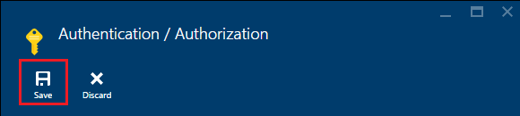
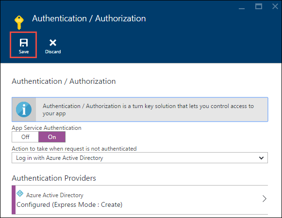

<properties
    pageTitle="Hauptbenutzer Service-Authentifizierung für API Apps in Azure-App-Verwaltungsdienst | Microsoft Azure"
    description="Erfahren Sie, wie Sie eine app API in Azure-App-Verwaltungsdienst für Dienst-Szenarien zu schützen."
    services="app-service\api"
    documentationCenter=".net"
    authors="tdykstra"
    manager="wpickett"
    editor=""/>

<tags
    ms.service="app-service-api"
    ms.workload="na"
    ms.tgt_pltfrm="dotnet"
    ms.devlang="na"
    ms.topic="article"
    ms.date="06/30/2016" 
    ms.author="rachelap"/>

# Hauptbenutzer Service-Authentifizierung für API Apps in Azure-App-Verwaltungsdienst

## (Übersicht)

In diesem Artikel wird erläutert, wie App-Authentifizierung für den *internen* Zugriff auf API-apps zu verwenden. Eine interne Szenario ist mit einer app API vor, der nur von eigenem Anwendungscode fungieren soll. Die empfohlene Vorgehensweise zum Implementieren dieses Szenario in App-Dienst besteht darin, Azure AD verwenden, die sogenannte API-app zu schützen. Sie rufen Sie die geschützte API-app mit einer Person Token, das Sie von Azure AD abrufen, durch die Bereitstellung der Anwendungsidentität (Service Hauptbenutzer) Anmeldeinformationen. Finden Sie bei der Verwendung von Azure AD alternativen im Abschnitt **Dienst - Authentifizierung** die [App-Verwaltungsdienst Azure-Authentifizierung (Übersicht)](../app-service/app-service-authentication-overview.md#service-to-service-authentication).

In diesem Artikel erfahren Sie:

* So Azure Active Directory (Azure AD) zu verwenden, um eine app API nicht authentifizierten Zugriff schützen.
* So eine geschützte API app aus einer app API, Web app oder mobile-app mit Azure AD-Dienst (app Identität) der Tilgungsanteile Anmeldeinformationen nutzen. Informationen dazu, wie Sie mit einer Logik app nutzen finden Sie unter [Verwenden der benutzerdefinierten API auf App-Verwaltungsdienst mit apps Logik gehostet](../app-service-logic/app-service-logic-custom-hosted-api.md).
* So sicherzustellen, dass die geschützte API app aus einem Browser von angemeldeten Benutzern aufgerufen werden kann.
* Wie um sicherzustellen, dass die geschützte API app nur nach einer bestimmten Azure aufgerufen werden kann, Active Directory-Dienst Tilgungsanteile.

Im Artikel umfasst zwei Bereiche an:

* Im Abschnitt [zum Konfigurieren der Dienst Hauptbenutzer Authentifizierung in Azure-App-Verwaltungsdienst](#authconfig) erläutert im Allgemeinen so konfigurieren Sie die Authentifizierung für eine beliebige app, API und so die geschützte API app nutzen. In diesem Abschnitt gilt gleichmäßig auf alle Framework von App-Verwaltungsdienst, einschließlich .NET, Node.js und Java unterstützt.

* Beginnend mit dem [Sie den Vorgang fortsetzen zu den Lernprogrammen .NET erste Schritte](#tutorialstart) -Abschnitt, schrittweise Anleitung des Lernprogramms Konfigurieren eines Szenarios "internen Zugriff" für eine .NET Stichprobe-Anwendung, die im App-Dienst. 

## Konfigurieren von Hauptbenutzer Dienstauthentifizierung in Azure-App-Verwaltungsdienst

Dieser Abschnitt enthält allgemeine Anweisungen aus, die auf eine beliebige app, API anwenden. Für bestimmte Schritte zur Anwendung Stichprobe führen Liste .NET wechseln Sie zu [die .NET API Apps zusammengehörenden Lernprogrammen fortgesetzt werden kann](#tutorialstart).

1. Navigieren Sie im [Azure-Portal](https://portal.azure.com/)zu Falz **Einstellungen** der API-app, die Sie schützen möchten, und suchen Sie den Abschnitt **Features** , und klicken Sie auf möchten **Authentifizierung / Autorisierung**.

    

3. In der **Authentifizierung / Autorisierung** Blade, **Klicken Sie auf**.

4. Wählen Sie in der Dropdownliste **Aktion ausgeführt werden soll, wenn die Anforderung nicht authentifiziert ist** **Melden Sie sich mit Azure Active Directory** .

5. Wählen Sie unter **Authentifizierungsanbieter** **Azure Active Directory**aus.

    

6. Konfigurieren das **Azure-Active Directory-Einstellungen** Blade zum Erstellen einer neuen Azure AD-Anwendung, oder verwenden Sie eine vorhandene Azure AD-Anwendung, wenn Sie bereits eine haben, die Sie verwenden möchten.

    Interne Szenarien beinhalten in der Regel API app eine app API aufrufen. Sie können separate Azure AD-Applikationen für jede API app oder nur eine Azure AD-Anwendung.

    Ausführliche Anweisungen diese Blade finden Sie unter [So konfigurieren Sie Ihre App-verwaltungsdienstanwendung Azure Active Directory Login verwenden](../app-service-mobile/app-service-mobile-how-to-configure-active-directory-authentication.md).

7. Wenn Sie mit der Authentifizierung Anbieter Konfiguration Blade fertig sind, klicken Sie auf **OK**.

7. In der **Authentifizierung / Autorisierung** Blade, klicken Sie auf **Speichern**.

    

Wenn dies der Fall, ermöglicht App-Dienst nur Anfragen aus Anrufer in den konfigurierten Azure AD-Mandanten. In der geschützten API-app ist keine Authentifizierung oder Autorisierung Code erforderlich. Das Person Token wird bei der app API zusammen mit häufig verwendeten Ansprüche in HTTP-Header übergeben, und Sie können diese Informationen im Code zu prüfen, ob Anfragen aus einer bestimmten Anrufer, wie etwa einen Dienst Tilgungsanteile sind lesen.

Dieses Feature Authentifizierung funktioniert für alle Sprachen, die App-Dienst unterstützt, einschließlich .NET, Node.js und Java, genauso. 

#### So nutzen die geschützte API-app

Anrufer muss ein Azure AD-Person Token mit API-Aufrufe unterstützen. Um eine Person Token mit Service Hauptbenutzer Anmeldeinformationen zu erhalten, wird der Anrufer Active Directory-Authentifizierung Library (ADAL für [.NET](https://www.nuget.org/packages/Microsoft.IdentityModel.Clients.ActiveDirectory), [Node.js](https://github.com/AzureAD/azure-activedirectory-library-for-nodejs)oder [Java](https://github.com/AzureAD/azure-activedirectory-library-for-java)) verwendet. Um ein Token zu erhalten, bietet der Code, der ADAL ruft ADAL die folgende Informationen:

* Der Name Ihrer Azure AD-Mandanten.
* Die Client-ID und Client geheim (app Schlüssel) der Azure AD-app mit dem Anrufer zugeordnet ist.
* Die Client-ID der Anwendung Azure AD-der geschützten API app zugeordnet. (Wenn nur eine Azure AD-Anwendung verwendet wird, ist dies die gleichen Client-ID als für die Anrufer.)

Diese Werte sind in Azure AD-Seiten des [Azure klassischen Portal](https://manage.windowsazure.com/)zur Verfügung.

Nachdem das Token erworben wurde, von der Anrufer mit HTTP-Anfragen in der Kopfzeile Autorisierung enthält.  App-Dienst das Token überprüft und ermöglicht die Besprechungsanfragen in der geschützten API app erreicht haben.

#### Wie Sie die app API vor dem Zugriff durch Benutzer in der gleichen Mandanten schützen

Person Token für Benutzer in der gleichen Mandanten gelten für die geschützte API app gültig.  Wenn Sie sicherstellen möchten, dass nur ein Dienst Tilgungsanteile die geschützte API app aufrufen kann, fügen Sie Code in der geschützten API-app in den folgenden Ansprüche aus dem Token überprüfen:

* `appid`sollten die Client-ID der Azure AD-Anwendung, die mit dem Anrufer verknüpft ist. 
* `oid`(`objectidentifier`) sollten die wichtigsten Dienst-ID des Anrufers. 

App-Dienst bietet außerdem die `objectidentifier` in der Kopfzeile X-MS-CLIENT-TILGUNGSANTEILE-ID beanspruchen.

### So verhindern, dass die app-API-Zugriff über einen Webbrowser

Wenn Sie nicht Ansprüche Code in der geschützten API app überprüfen und Verwendung einer separaten Azure AD-Anwendung, für die geschützte API-app, stellen Sie sicher, dass der Azure AD-Anwendungs Antworten URL nicht als Basis der API-app-URL ist. Wenn die Antwort-URL direkt mit der geschützten API verweist, konnte ein Benutzer in der gleichen Azure AD-Mandanten navigieren Sie zu der app API, melden Sie sich bei und die-API erfolgreich aufrufen.

## Fortsetzen der .NET API Apps zusammengehörenden Lernprogrammen

Wenn Sie die Node.js oder Java zusammengehörenden Lernprogrammen für API apps folgen, fahren Sie mit den [nächsten Schritten](#next-steps) Abschnitt. 

Der Rest dieses Artikels weiterhin die .NET API Apps zusammengehörenden Lernprogrammen und wird vorausgesetzt, dass Sie die [Benutzer-Authentifizierung Lernprogramm](app-service-api-dotnet-user-principal-auth.md) ausgeführt haben, und die Stichprobe Anwendung in Azure mit Benutzerauthentifizierung aktiviert haben.

## Einrichten von Authentifizierung in Azure

In diesem Abschnitt Sie App-Dienst so konfigurieren, dass die einzigen HTTP-Anfragen dies zulässt, um die app Daten Ebene API zu erreichen können nur über sind mit gültigen Azure AD Person Token. 

Im folgenden Abschnitt Konfigurieren Sie die app mittleren Ebene API zum Senden von Anwendungsanmeldeinformationen an Azure AD, erhalten eine Person Token zurück, und senden das Person Token zur app-API Ebene Daten. Dieses Verfahren wird im Diagramm dargestellt.

Wenn Sie Probleme auftreten, während Sie das Lernprogramm erfahren Sie, wie, finden Sie im Abschnitt [Problembehandlung](#troubleshooting) am Ende des Lernprogramms. 

1. Klicken Sie im [Azure-Portal](https://portal.azure.com/)an die Blade **Einstellungen** der API-app, die Sie erstellt haben, für die ToDoListDataAPI (Datenebene) API app navigieren Sie, und klicken Sie dann auf **Einstellungen**.

2. In den **Einstellungen** Blade finden Sie im Abschnitt **Features** , und klicken Sie dann auf **Authentifizierung / Autorisierung**.

    

3. In der **Authentifizierung / Autorisierung** Blade, **Klicken Sie auf**.

4. Wählen Sie in der Dropdownliste **Aktion ausgeführt werden soll, wenn die Anforderung nicht authentifiziert ist** **Melden Sie sich mit Azure Active Directory**.

    Dies ist die Einstellung, bei dem App-Verwaltungsdienst, um sicherzustellen, die nur Anfragen Reichweite der app API authentifiziert. Besprechungsanfragen, die gültige Person Token aufweisen, App-Dienst übergibt die Token entlang bei der app API und füllt HTTP-Header mit einem häufig verwendeten Ansprüchen Sie diese Informationen einfacher Code zur Verfügung stellen.

5. Klicken Sie unter **Authentifizierungsanbieter**auf **Azure Active Directory**.

    

6. Klicken Sie auf **Express**, in dem Blade **Azure-Active Directory-Einstellungen** .

    Mit der **Express** kann die Option Azure Anwendung AAD automatisch in Ihrem Azure AD- [Mandanten](https://msdn.microsoft.com/en-us/library/azure/jj573650.aspx#BKMK_WhatIsAnAzureADTenant)erstellen. 

    Sie müssen nicht so erstellen einen Mandanten, da jeder Azure-Konto automatisch eine verfügt.

7. Klicken Sie unter **Verwaltungsmodus**klicken Sie auf **Neues AD-App erstellen** , wenn Sie noch nicht ausgewählt ist.

    Im Portal angeschlossen ist, das **App erstellen** Eingabefeld mit einem Standardwert. Standardmäßig wird die Azure AD-Anwendung identisch mit der app API bezeichnet. Wenn Sie es vorziehen, können Sie einen anderen Namen eingeben.
    
    

    **Hinweis**: als Alternative können eine einzelne Azure AD für die app für einen API und der geschützten API app Anwendung. Wenn Sie diese Alternative ausgewählt haben, müssten Sie nicht hier die Option **Neues AD-App erstellen** , da Sie eine Anwendung Azure AD-bereits zuvor im Lernprogramm Authentifizierung Benutzer erstellt haben. In diesem Lernprogramm verwenden Sie Azure AD-Applikationen für die einen API-app und der geschützten API-app zu trennen.

8. Notieren Sie sich den Wert, der im Eingabefeld **App erstellen** . Sie können diese AAD Anwendung im klassischen Azure-Portal später nachschlagen.

7. Klicken Sie auf **OK**.

10. In der **Authentifizierung / Autorisierung** Blade, klicken Sie auf **Speichern**.

    

    App-Dienst erstellt eine Azure Active Directory-Anwendung für **einmaliges Anmelden URL** und **Antworten URL** automatisch an die URL der app API festgelegt. Der zweite Wert kann Benutzer in Ihrem Mandanten AAD anmelden und die app API zugreifen.

### Stellen Sie sicher, dass die app API geschützt ist

1. Wechseln Sie in einem Browser auf die URL der API-app: in vorher **API app** in der Azure-Portal, klicken Sie auf den Link unter **URL**. 

    Sie werden zur einen Anmeldebildschirm umgeleitet, weil nicht authentifizierte Anfragen nicht zulässig sind, um die app API zu erreichen. 

    Falls Ihr Browser auf die Benutzeroberfläche Swagger auftritt, Ihr Browser möglicherweise bereits angemeldet sein aktivieren – in diesem Fall ein InPrivate oder Incognito-Fenster zu öffnen und wechseln Sie zur URL Benutzeroberfläche Swagger.

18. Melden Sie sich mit den Anmeldeinformationen eines Benutzers Nachschlagen in Ihrem Mandanten AAD.

    Wenn Sie angemeldet sind, klicken Sie auf die Seite "erfolgreich erstellte" im Browser angezeigt wird.

## Konfigurieren Sie das Projekt ToDoListAPI zum Erfassen und senden das Azure AD-token

In diesem Abschnitt werden die folgenden Aufgaben ausführen:

* Hinzufügen von Code in der mittleren Ebene API-app, die Anwendungsanmeldeinformationen Azure AD-ein Token erfassen und senden es mit HTTP-Anfragen zur app-API Ebene Daten verwendet.
* Rufen Sie die Anmeldeinformationen, die Sie benötigen, von Azure AD.
* Geben Sie die Anmeldeinformationen in Azure-App-Verwaltungsdienst Runtime-Umgebung, die Einstellungen in der mittleren Ebene API app aus. 

### Konfigurieren Sie das Projekt ToDoListAPI zum Erfassen und senden das Azure AD-token

Nehmen Sie die folgenden Änderungen im Projekt in Visual Studio ToDoListAPI.

1. Entfernen Sie die Kommentarzeichen der gesamte Code in der Datei *ServicePrincipal.cs* .

    Dies ist der Code für .NET ADAL verwendet, um das Azure AD-Person Token zu erhalten.  Mehrere Werte, die Sie später in der Umgebung Azure Runtime festlegen werden verwendet. Hier ist der Code ein: 

        public static class ServicePrincipal
        {
            static string authority = ConfigurationManager.AppSettings["ida:Authority"];
            static string clientId = ConfigurationManager.AppSettings["ida:ClientId"];
            static string clientSecret = ConfigurationManager.AppSettings["ida:ClientSecret"];
            static string resource = ConfigurationManager.AppSettings["ida:Resource"];
        
            public static AuthenticationResult GetS2SAccessTokenForProdMSA()
            {
                return GetS2SAccessToken(authority, resource, clientId, clientSecret);
            }
        
            static AuthenticationResult GetS2SAccessToken(string authority, string resource, string clientId, string clientSecret)
            {
                var clientCredential = new ClientCredential(clientId, clientSecret);
                AuthenticationContext context = new AuthenticationContext(authority, false);
                AuthenticationResult authenticationResult = context.AcquireToken(
                    resource,
                    clientCredential);
                return authenticationResult;
            }
        }

    **Hinweis:** Dieser Code setzt die ADAL für .NET NuGet-Paket (Microsoft.IdentityModel.Clients.ActiveDirectory), die im Projekt bereits installiert ist. Wenn Sie dieses Projekt ganz neu erstellen, müssen Sie dieses Paket installieren zu können. Dieses Paket wird durch die neuen Project-Vorlage für API app nicht automatisch installiert.

2. In *Controller/ToDoListController*, entfernen Sie die Kommentarzeichen des Codes in der `NewDataAPIClient` Methode, die das Token HTTP hinzufügt in der Kopfzeile Autorisierung anfordert.

        client.HttpClient.DefaultRequestHeaders.Authorization =
            new AuthenticationHeaderValue("Bearer", ServicePrincipal.GetS2SAccessTokenForProdMSA().AccessToken);

3. Bereitstellen des Projekts ToDoListAPI. (Mit der rechten Maustaste in des Projekts, und klicken Sie auf **Veröffentlichen > Veröffentlichen**.)

    Visual Studio wird das Projekt bereitgestellt und öffnet einen Browser auf Basis der Web-app-URL. Hieraus sehen eine 403 Fehlerseite, also normalen Versuch, zu einer Web-API Basis-URL in einem Browser zu wechseln.

4. Schließen Sie den Browser.

### Azure AD-Konfigurationswerte abrufen

11. Wechseln Sie im [Azure klassischen-Portal](https://manage.windowsazure.com/)zu **Azure Active Directory**.

12. Klicken Sie auf der Registerkarte **Verzeichnis** auf Ihrem Mandanten AAD.

14. Klicken Sie auf **Anwendungen > Applikationen wurde von meiner Firma zugegriffen**, und klicken Sie dann auf das Häkchen.

15. Klicken Sie in der Liste der Programme klicken Sie auf den Namen der Azure für Sie erstellt, wenn Sie für die ToDoListDataAPI (Datenebene) API app-Authentifizierung aktiviert.

16. Klicken Sie auf die Registerkarte **Konfigurieren** .

5. Kopieren Sie den Wert für die **Client-ID** , und speichern Sie sie an, die Sie ihn später abrufen können. 

8. Kehren Sie in der klassischen Azure-Portal zu der Liste der **Programme wurde von meiner Firma zugegriffen**, und klicken Sie auf die AAD-Anwendung, die Sie erstellt haben, für die mittlere Ebene ToDoListAPI API-app (das Element, das Sie in der vorherigen Lernprogramm erstellt haben, nicht auf das Element, das Sie in diesem Lernprogramm erstellt haben).

16. Klicken Sie auf die Registerkarte **Konfigurieren** .

5. Kopieren Sie den Wert für die **Client-ID** , und speichern Sie sie an, die Sie ihn später abrufen können.

6. Wählen Sie unter **Tasten** **1 Jahr** aus der Dropdownliste **Wählen Sie eine Dauer** ein.

6. Klicken Sie auf **Speichern**.

    

7. Kopieren Sie den Schlüsselwert, und speichern Sie sie an, die Sie ihn später abrufen können.

    

### Konfigurieren von Azure AD-Einstellungen in der mittleren Ebene API-app Runtime-Umgebung

1. Wechseln Sie zum [Azure-Portal](https://portal.azure.com/), und navigieren Sie zu der **App API** Blade für die API-app, die das Projekt TodoListAPI (mittlere Ebene) hostet.

2. Klicken Sie auf **Einstellungen > Anwendungseinstellungen**.

3. Fügen Sie im Abschnitt **App-Einstellungen** die folgenden Schlüssel und Werte hinzu:

  	| **Schlüssel** | IDA: Zertifizierungsstelle |
  	|---|---|
  	| **Wert** | https://Login.microsoftonline.com/ {Ihren Namen Azure AD-Mandanten} |
  	| **Beispiel** | https://Login.microsoftonline.com/contoso.onmicrosoft.com |

  	| **Schlüssel** | IDA ClientId: |
  	|---|---|
  	| **Wert** | Client-ID, der einen Anwendung (mittlere Schicht - ToDoListAPI) |
  	| **Beispiel** | 960adec2-b74a-484a-960adec2-b74a-484a |

  	| **Schlüssel** | IDA: ClientSecret |
  	|---|---|
  	| **Wert** | App-Taste, der einen Anwendung (mittlere Schicht - ToDoListAPI) |
  	| **Beispiel** | e65e8fc9-5f6b-48e8-e65e8fc9-5f6b-48e8 |

  	| **Schlüssel** | IDA Ressourcen: |
  	|---|---|
  	| **Wert** | Client-ID, der sogenannte Anwendung (Datenebene - ToDoListDataAPI) |
  	| **Beispiel** | e65e8fc9-5f6b-48e8-e65e8fc9-5f6b-48e8 |

    **Hinweis**: für `ida:Resource`, sicherzustellen, dass Sie die sogenannte Anwendung **Client-ID** und nicht den **App-ID-URI**verwenden.

    `ida:ClientId`und `ida:Resource` unterscheiden sich Werte in diesem Lernprogramm, da Sie verwenden Azure AD-Applicaations für das mittlere und Datenebene trennen. Wenn Sie ein einzelnes verwenden wurden Azure AD-Anwendung für die einen API-app und der geschützten API-app, verwenden Sie den gleichen Wert in beiden `ida:ClientId` und `ida:Resource`.

    Der Code verwendet ConfigurationManager, um diese Werte zu erhalten, damit sie in der Datei Web.config des Projekts oder in der Azure Runtime-Umgebung gespeichert werden können. Während der ASP.NET-Anwendung Azure-App-Verwaltungsdienst ausgeführt wird, überschreiben umgebungseinstellungen automatisch aus Web.config Einstellungen aus. Umgebungseinstellungen sind im Allgemeinen eine [sicherer lässt sich vertrauliche Informationen im Vergleich zu einer Web.config-Datei speichern](http://www.asp.net/identity/overview/features-api/best-practices-for-deploying-passwords-and-other-sensitive-data-to-aspnet-and-azure).

6. Klicken Sie auf **Speichern**.

    

### Testen Sie die Anwendung

1. Wechseln Sie in einem Browser auf den HTTPS-URL der AngularJS front-End-Web app.

2. Klicken Sie auf die Registerkarte **Aufgabenliste** , und melden Sie sich mit den Anmeldeinformationen für einen Benutzer in Ihrem Azure AD-Mandanten. 

4. Hinzufügen von Aufgabenelemente, um sicherzustellen, dass die Anwendung funktioniert.

    

    Wenn die Anwendung nicht wie erwartet funktioniert, überprüfen Sie alle Einstellungen im Azure-Portal eingegebene erneut. Wenn alle Einstellungen korrekt zu sein scheinen, finden Sie im Abschnitt [Problembehandlung](#troubleshooting) später in diesem Lernprogramm aus.

## Schützen Sie die app-API-Zugriff über einen Webbrowser

In diesem Lernprogramm erstellt Sie eine Separate Azure AD-Anwendung, für die app API ToDoListDataAPI (Datenebene). Wie Sie gesehen haben Wenn App Dienst Anwendung AAD erstellt, wird auf eine Weise, in dem einen Benutzer zu der API-app-URL in einem Browser zu wechseln, und melden Sie sich bei die Anwendung AAD konfiguriert. Dies bedeutet, dass es für den Endbenutzer in Ihrem Azure AD-Mandanten nicht nur einen Dienst Hauptbenutzer, auf die API zugreifen möglich ist. 

Wenn Sie den Zugriff über einen Webbrowser ohne Code in der geschützten API app verhindern möchten, können Sie die **URL der Antworten** in der Anwendung AAD ändern, damit es von Basis-URL des app API unterscheidet. 

### Zugriff über einen Webbrowser deaktivieren

1. Das klassische Portal **Konfigurieren** Registerkarte für die AAD-Anwendung, die für die TodoListService erstellt wurde, ändern Sie den Wert in das Feld **Antwort-URL** , so, dass es sich um eine gültige URL, aber nicht die API-app-URL ist.
 
2. Klicken Sie auf **Speichern**.

### Stellen Sie sicher, dass ein Zugriff über einen Webbrowser funktioniert nicht mehr

Sie überprüft zuvor, dass Sie API-app-URL über einen Browser wechseln können, indem Sie mit den Anmeldeinformationen eines einzelnen Benutzers anmelden. In diesem Abschnitt überprüfen Sie, dass dies nicht mehr möglich ist. 

1. Rufen Sie in einem neuen Browserfenster die URL der app API erneut ein.

2. Melden Sie sich, wenn Sie dazu aufgefordert werden.

3. Anmeldung war erfolgreich, aber führt zu einer Seite zurück.

    Sie haben die app AAD, damit die Benutzer in den Mandanten AAD anmelden und Zugriff auf die API über einen Browser können nicht konfiguriert. Sie können weiterhin die app API zugreifen, mithilfe einer Hauptbenutzer Diensttoken, die Sie überprüfen können, indem Sie die Web-app-URL und weitere Aufgabenelemente hinzufügen.

## Einschränken des Zugriffs auf einen bestimmten Dienst Tilgungsanteile  

Nun alle Anrufer, die ein Token für einen Benutzer abrufen kann nach rechts oder Dienst Hauptbenutzer in Ihrem Azure AD-Mandanten kann die app TodoListDataAPI (Datenebene) API aufrufen. Möglicherweise möchten sicherstellen, dass die app Daten Ebene API nur Anrufe aus der TodoListAPI (mittlere Ebene) API-app und nur aus einer bestimmten Dienst Tilgungsanteile akzeptiert. 

Sie können diese Einschränkungen hinzufügen, durch das Hinzufügen von Code zum Überprüfen der `appid` und `objectidentifier` Ansprüche auf eingehende Anrufe.

In diesem Lernprogramm setzen Sie den Code, der app-ID und Dienst Hauptbenutzer ID direkt in Ihrem Controller-Aktionen überprüft.  Alternativen zum Verwenden einer benutzerdefinierten sind `Authorize` Attribut, oder diese Validierung Schritte müssen Ihre Start (z. B. OWIN Middleware) folgen. Ein Beispiel für letztere finden Sie unter [diese Anwendung](https://github.com/mohitsriv/EasyAuthMultiTierSample/blob/master/MyDashDataAPI/Startup.cs). 

Nehmen Sie die folgenden vor dem Projekt TodoListDataAPI.

2. Öffnen Sie die Datei *Controllers/TodoListController.cs* .

3. Kommentieren Sie die Zeilen, die festgelegt `trustedCallerClientId` und `trustedCallerServicePrincipalId`.

        private static string trustedCallerClientId = ConfigurationManager.AppSettings["todo:TrustedCallerClientId"];
        private static string trustedCallerServicePrincipalId = ConfigurationManager.AppSettings["todo:TrustedCallerServicePrincipalId"];

4. Heben Sie den Code in der Methode CheckCallerId. Diese Methode wird am Anfang jeder Methode Aktion im Controller aufgerufen. 

        private static void CheckCallerId()
        {
            string currentCallerClientId = ClaimsPrincipal.Current.FindFirst("appid").Value;
            string currentCallerServicePrincipalId = ClaimsPrincipal.Current.FindFirst("http://schemas.microsoft.com/identity/claims/objectidentifier").Value;
            if (currentCallerClientId != trustedCallerClientId || currentCallerServicePrincipalId != trustedCallerServicePrincipalId)
            {
                throw new HttpResponseException(new HttpResponseMessage { StatusCode = HttpStatusCode.Unauthorized, ReasonPhrase = "The appID or service principal ID is not the expected value." });
            }
        }

5. Erneut bereitstellen Sie das Projekt ToDoListDataAPI Azure App Dienst.

6. Wechseln Sie zu des AngularJS front-End Web app HTTPS-URL in Ihrem Browser, und klicken Sie in der Homepage auf die Registerkarte **Aufgabenliste** .

    Die Anwendung funktioniert nicht, da Anrufe an die Back-End weiß nicht sind. Der neue Code wird überprüft, tatsächliche Appid und Objectidentifier, aber noch keinen überprüfen sie anhand der richtigen Werte. Im Browser Developer Tools Console-Berichte, dass der Server einen HTTP 401 Fehler zurückgibt.

    

    In den folgenden Schritten konfigurieren Sie die erwarteten Werte ein.

8. Rufen Sie den Wert für den Dienst Tilgungsanteile mithilfe der Azure AD-PowerShell, für die Azure AD-Anwendung, die Sie für das Projekt TodoListWebApp erstellt.

    ein. Anweisungen zum Azure PowerShell installieren und Verbinden mit Ihrem Abonnement finden Sie unter [Verwenden von Azure PowerShell Azure Ressourcenmanager](../powershell-azure-resource-manager.md).

    b. Um eine Liste der Dienst Hauptbenutzer zu erhalten, führen Sie die `Login-AzureRmAccount` Befehl und dann die `Get-AzureRmADServicePrincipal` Befehl.

    c. Suchen Sie die Objectid für den Dienst Hauptbenutzer der Anwendung TodoListAPI, und speichern Sie es an einem Speicherort, den, dem Sie später kopieren können.

7. Navigieren Sie in der Azure-Portal an die API app Blade für die API-app, der Sie das Projekt ToDoListDataAPI bereitgestellt.

9. Klicken Sie auf **Einstellungen > Anwendungseinstellungen**.

3. Fügen Sie im Abschnitt **App-Einstellungen** die folgenden Schlüssel und Werte hinzu:

  	| **Schlüssel** | TODO:TrustedCallerServicePrincipalId |
  	|---|---|
  	| **Wert** | Hauptbenutzer Dienst-Id des aufrufen Anwendung |
  	| **Beispiel** | 4f4a94a4-6f0d-4072-4f4a94a4-6f0d-4072 |

  	| **Schlüssel** | TODO:TrustedCallerClientId |
  	|---|---|
  	| **Wert** | Client-ID des aufrufen Anwendung – kopiert haben, aus der TodoListAPI Azure AD-Anwendung |
  	| **Beispiel** | 960adec2-b74a-484a-960adec2-b74a-484a |

6. Klicken Sie auf **Speichern**.

    

6. In Ihrem Browser zurück zum der Web-app-URL, und klicken Sie in der Homepage auf die Registerkarte **Aufgabenliste** .

    Diesmal funktioniert die Anwendung wie erwartet, da die app vertrauenswürdigen Anrufer-ID und Dienst Hauptbenutzer-ID werden die erwarteten Werte.

    

## Erstellen der Projekte von Grund auf

Die beiden Web-API Projekte erstellt wurden unter Verwendung der Projektvorlage **Azure API App** , und ersetzen den standardmäßigen Werte Controller mit einer Aufgabenliste Controller. Erwerb Azure AD-Dienst Hauptbenutzer Token im Projekt ToDoListAPI an, wurde das [Active Directory Authentifizierung Bibliothek (ADAL) für .NET](https://www.nuget.org/packages/Microsoft.IdentityModel.Clients.ActiveDirectory/) NuGet-Paket installiert.
 
Informationen dazu, wie Sie mit einem Web-API Back-End wie ToDoListAngular Anwendung einseitige AngularJS zu erstellen, finden Sie unter [Hände auf Übung: Erstellen einer einzelnen Seite Anwendung (SPA) mit ASP.NET Web API und Angular.js](http://www.asp.net/web-api/overview/getting-started-with-aspnet-web-api/build-a-single-page-application-spa-with-aspnet-web-api-and-angularjs). Informationen zur Verwendung von Azure AD-Authentifizierungscode hinzufügen finden Sie unter [Schutz AngularJS einzelne Seite Apps mit Azure AD](../active-directory/active-directory-devquickstarts-angular.md).

## Behandlung von Problemen

[AZURE.INCLUDE [troubleshooting](../../includes/app-service-api-auth-troubleshooting.md)]

* Stellen Sie sicher, dass ToDoListAPI (mittlere Ebene) und ToDoListDataAPI (Datenebene) verwechselt werden nicht. Angenommen, in diesem Lernprogramm Sie Authentifizierung hinzufügen zur app-API Ebene von Daten **, aber die app-Taste muss stammen aus der Azure AD-Anwendung, die Sie für die app mittleren Ebene API erstellt**.

## Nächste Schritte

Dies ist das letzte Lernprogramm in der Apps-API Serie aus. 

Weitere Informationen zu Azure Active Directory finden Sie unter den folgenden Ressourcen.

* [Azure AD Leitfaden Entwickler](http://aka.ms/aaddev)
* [Azure AD-Szenarien](http://aka.ms/aadscenarios)
* [Azure AD-Beispiele](http://aka.ms/aadsamples)

    Im Beispiel [WebApp-WebAPI-OAuth2-AppIdentity-DotNet](http://github.com/AzureADSamples/WebApp-WebAPI-OAuth2-AppIdentity-DotNet) ähnelt was in diesem Lernprogramm, aber ohne App-Authentifizierung angezeigt wird.

Informationen über andere Methoden für die Bereitstellung von Visual Studio-Projekte auf API-apps mit Visual Studio oder durch die [Automatisierung der Bereitstellung](http://www.asp.net/aspnet/overview/developing-apps-with-windows-azure/building-real-world-cloud-apps-with-windows-azure/continuous-integration-and-continuous-delivery) von einer [Quelle Steuerelement System](http://www.asp.net/aspnet/overview/developing-apps-with-windows-azure/building-real-world-cloud-apps-with-windows-azure/source-control)finden Sie unter [Gewusst wie: Bereitstellen eine App-Verwaltungsdienst Azure-app](../app-service-web/web-sites-deploy.md).
