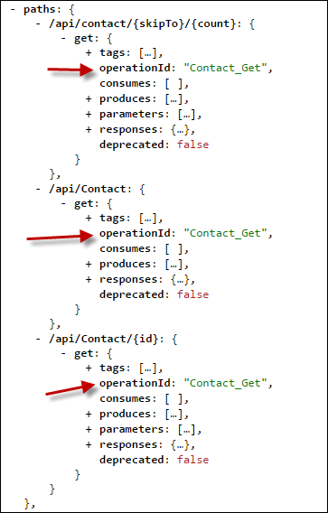
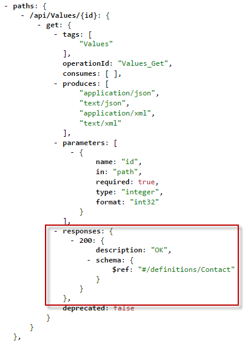
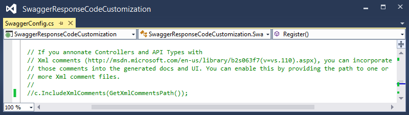
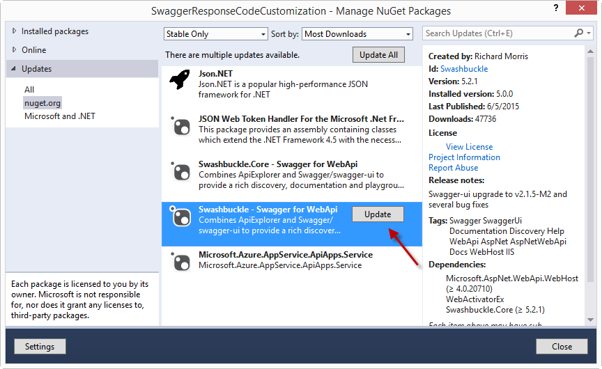

<properties 
    pageTitle="Anpassen der Swashbuckle generierte API Definitionen" 
    description="Informationen Sie zum Swagger-API Definitionen anpassen möchten, die von Swashbuckle für eine app API in Azure-App-Verwaltungsdienst generiert werden." 
    services="app-service\api" 
    documentationCenter=".net" 
    authors="bradygaster" 
    manager="wpickett" 
    editor="jimbe"/>

<tags 
    ms.service="app-service-api" 
    ms.workload="web" 
    ms.tgt_pltfrm="dotnet" 
    ms.devlang="na" 
    ms.topic="article" 
    ms.date="08/29/2016" 
    ms.author="rachelap"/>

# Anpassen der Swashbuckle generierte API Definitionen 

## (Übersicht)

In diesem Artikel wird erläutert, wie Swashbuckle, um allgemeine Szenarien zu behandeln, sollten Sie das Standardverhalten ändern anpassen:

* Swashbuckle generiert doppelte Vorgang Bezeichner für überladenen Controllermethoden
* Swashbuckle wird davon ausgegangen, dass die einzige gültige Antwort aus einer Methode HTTP 200 (OK) 
 
## Anpassen der Vorgang Bezeichner der zweiten generation

Swashbuckle generiert Swagger Vorgang Bezeichner durch Verketten Controllernamen und den Methodennamen. Dieses Muster führt zu einem Problem, wenn Sie mehrfach überladen einer Methode werden: Swashbuckle erzeugt Vorgang doppelten Ids, deren ungültige Swagger JSON.

Beispielsweise führt der folgende Controller Code Swashbuckle zum Generieren von drei Contact_Get Vorgang Ids zu.

Sie können das Problem manuell lösen, erteilen Sie eindeutige Namen, wie etwa bei diesem Beispiel wird die folgenden Methoden:

* Erhalten
* GetById
* GetPage

Die Alternative ist um Swashbuckle ausreicht automatisch generieren von eindeutigen Vorgang Ids zu erweitern.

Die folgenden Schritte zeigen, wie Swashbuckle anpassen, indem Sie die Verwendung der *SwaggerConfig.cs* -Datei, die im Projekt von der Visual Studio-API Apps Preview Project-Vorlage enthalten ist.  Sie können auch Swashbuckle in einem Projekt Web-API anpassen, die Sie für die Bereitstellung als app API konfigurieren.

1. Erstellen eines benutzerdefinierten `IOperationFilter` Implementierung 

    Die `IOperationFilter` Schnittstelle stellt einen Erweiterungspunkt für Swashbuckle-Benutzer, die verschiedene Aspekte des Prozesses Metadaten Swagger anpassen möchten. Der folgende Code veranschaulicht eine Methode zum Ändern des Verhaltens Id-Generierung des Vorgangs. Der Code fügt Parameternamen an den Namen des Vorgangs-Id an.  

        using Swashbuckle.Swagger;
        using System.Web.Http.Description;
        
        namespace ContactsList
        {
            public class MultipleOperationsWithSameVerbFilter : IOperationFilter
            {
                public void Apply(
                    Operation operation,
                    SchemaRegistry schemaRegistry,
                    ApiDescription apiDescription)
                {
                    if (operation.parameters != null)
                    {
                        operation.operationId += "By";
                        foreach (var parm in operation.parameters)
                        {
                            operation.operationId += string.Format("{0}",parm.name);
                        }
                    }
                }
            }
        }

2. Rufen Sie in der Datei *App_Start\SwaggerConfig.cs* , die `OperationFilter` Methode, um den neuen Swashbuckle verursachen `IOperationFilter` Implementierung.

        c.OperationFilter<MultipleOperationsWithSameVerbFilter>();

    

    Die *SwaggerConfig.cs* -Datei, die durch die Swashbuckle NuGet-Paket in abgelegt ist enthält viele auskommentierte Beispiele Erweiterungspunkte. Hier werden weitere Kommentare nicht angezeigt. 

    Nachdem Sie diese Änderung, stellen Sie Ihre `IOperationFilter` Implementierung verwendet wird, und bewirkt, dass eindeutige Vorgang Ids generiert werden soll.
 
    

    
## Antwortcodes als 200 zulassen

Standardmäßig Swashbuckle wird vorausgesetzt, eine Antwort HTTP 200 (OK) *nur* seriösen Antwort aus einer Web-API-Methode. In einigen Fällen möchten Sie möglicherweise andere Antwortcodes zurückzukehren, ohne dass des Clients eine Ausnahme auslösen.  Zum Beispiel veranschaulicht der folgende Code der Web-API ein Szenario, in dem den Client entweder eine 200 oder eine 404 als gültigen Antworten annehmen möchten.

    [ResponseType(typeof(Contact))]
    public HttpResponseMessage Get(int id)
    {
        var contacts = GetContacts();

        var requestedContact = contacts.FirstOrDefault(x => x.Id == id);

        if (requestedContact == null)
        {
            return Request.CreateResponse(HttpStatusCode.NotFound);
        }
        else
        {
            return Request.CreateResponse<Contact>(HttpStatusCode.OK, requestedContact);
        }
    }

In diesem Szenario gibt die Swagger, die Swashbuckle standardmäßig generiert nur eine seriösen HTTP Statuscode, HTTP 200.

Da Visual Studio die Definition Swagger API, zum Generieren von Code für den Client verwendet, Clientcode, eine Ausnahme für eine Antwort als eine HTTP 200 ausgelöst, wird erstellt. Im folgenden Code wird von einem C#-Client für diese Methode der Stichprobe Web-API generiert.

    if (statusCode != HttpStatusCode.OK)
    {
        HttpOperationException<object> ex = new HttpOperationException<object>();
        ex.Request = httpRequest;
        ex.Response = httpResponse;
        ex.Body = null;
        if (shouldTrace)
        {
            ServiceClientTracing.Error(invocationId, ex);
        }
        throw ex;
    } 

Swashbuckle bietet zwei Arten von der Liste der erwarteten HTTP-Antwort-Codes, die sie erzeugt, Anpassen von XML-Kommentaren oder die `SwaggerResponse` Attribut. Das Attribut einfacher ist, aber es ist jedoch nur in Swashbuckle 5.1.5 oder höher verfügbar. Die API Apps Preview-Vorlage Neues Projekt in Visual Studio 2013 umfasst Swashbuckle Version 5.0.0, damit, wenn Sie die Vorlage verwendet und keine Swashbuckle aktualisieren möchten, Ihre einzige Option ist von XML-Kommentaren. 

### Anpassen von XML-Kommentaren erwartete Antwort-codes

Verwenden Sie diese Methode, um Antwortcodes angeben, wenn Ihre Swashbuckle früher als 5.1.5 ist.

1. Fügen Sie zunächst die XML-Dokumentationskommentare über die Methoden, die, denen Sie für HTTP-Antwortcodes angeben möchten. Aufzeichnen der Stichprobe Web-API ergibt über angezeigte Aktion und die XML-Dokumentation darauf anwenden Code wie im folgenden Beispiel. 

        /// 

        /// Returns the specified contact.
        /// 

        /// <param name="id">The ID of the contact.</param>
        /// <returns>A contact record with an HTTP 200, or null with an HTTP 404.</returns>
        /// <response code="200">OK</response>
        /// <response code="404">Not Found</response>
        [ResponseType(typeof(Contact))]
        public HttpResponseMessage Get(int id)
        {
            var contacts = GetContacts();
        
            var requestedContact = contacts.FirstOrDefault(x => x.Id == id);
        
            if (requestedContact == null)
            {
                return Request.CreateResponse(HttpStatusCode.NotFound);
            }
            else
            {
                return Request.CreateResponse<Contact>(HttpStatusCode.OK, requestedContact);
            }
        }

1. Hinzufügen von Anweisungen in der *SwaggerConfig.cs* -Datei, um das direkte Swashbuckle, um das Verwenden von XML-Dokumentationsdatei.

    * Öffnen Sie *SwaggerConfig.cs* , und erstellen Sie eine Methode in der Klasse *SwaggerConfig* , um den Pfad zu der Dokumentation XML-Datei anzugeben. 

            private static string GetXmlCommentsPath()
            {
                return string.Format(@"{0}\XmlComments.xml", 
                    System.AppDomain.CurrentDomain.BaseDirectory);
            }

    * Führen Sie einen Bildlauf nach unten in der Datei *SwaggerConfig.cs* bis die auskommentierte Textzeile ähnlichen Code wie Screenshot unten angezeigt wird. 

        
    
    * Kommentieren Sie die Zeile aus, um die XML-Kommentare während der zweiten Generation Swagger Verarbeitung zu aktivieren. 
    
        
    
1. Um die XML-Dokumentation-Datei zu generieren, wechseln Sie in den Eigenschaften des Projekts, und aktivieren Sie die XML-Dokumentationsdatei wie im folgenden Screenshot dargestellt. 

     

Nachdem Sie diese Schritte ausführen, wider des JSON-Swagger von Swashbuckle generiert die HTTP-Antwort-Codes, die Sie in die XML-Kommentare angegeben haben. Im folgenden Screenshot wird dieser neuen JSON-Code veranschaulicht. 

Wenn Sie Visual Studio verwenden, um die Client-Code für Ihre REST-API erneut generieren, akzeptiert der C#-Code HTTP OK und nicht gefunden Statuscodes ohne das Auslösen einer Ausnahme, gleicht des verwendeten Codes Entscheidungen treffen, wie Sie die Eingabe eines Datensatzes null Kontakt zu behandeln. 

        if (statusCode != HttpStatusCode.OK && statusCode != HttpStatusCode.NotFound)
        {
            HttpOperationException<object> ex = new HttpOperationException<object>();
            ex.Request = httpRequest;
            ex.Response = httpResponse;
            ex.Body = null;
            if (shouldTrace)
            {
                ServiceClientTracing.Error(invocationId, ex);
            }
                throw ex;
        }

In [diesem GitHub Repository](https://github.com/Azure-Samples/app-service-api-dotnet-swashbuckle-swaggerresponse)kann der Code für diese Demo gefunden werden. Zusammen mit der Web-API ist Project Genehmigungsstatus XML-Dokumentationskommentare ein Projekt Console-Anwendung, die einen generierten Client für diese API enthält. 

### Anpassen der erwarteten Antwortcodes mit dem Attribut SwaggerResponse

Das Attribut [SwaggerResponse](https://github.com/domaindrivendev/Swashbuckle/blob/master/Swashbuckle.Core/Swagger/Annotations/SwaggerResponseAttribute.cs) ist in Swashbuckle 5.1.5 und höher verfügbar. Falls Sie eine frühere Version Ihres Projekts haben, beginnt in diesem Abschnitt erläutert, wie das Swashbuckle NuGet-Paket aktualisieren, damit Sie dieses Attribut verwenden können.

1. **Lösung-Explorer**mit der rechten Maustaste Web-API Projekt und dann auf **NuGet-Pakete verwalten**. 

    

1. Klicken Sie auf die Schaltfläche *Aktualisieren* neben der *Swashbuckle* NuGet-Paket. 

    

1. Fügen Sie die Attribute *SwaggerResponse* , um die Web-API Aktionsmethoden für die Sie gültige HTTP-Antwort-Codes angeben möchten. 

        [SwaggerResponse(HttpStatusCode.OK)]
        [SwaggerResponse(HttpStatusCode.NotFound)]
        [ResponseType(typeof(Contact))]
        public HttpResponseMessage Get(int id)
        {
            var contacts = GetContacts();

            var requestedContact = contacts.FirstOrDefault(x => x.Id == id);
            if (requestedContact == null)
            {
                return Request.CreateResponse(HttpStatusCode.NotFound);
            }
            else
            {
                return Request.CreateResponse<Contact>(HttpStatusCode.OK, requestedContact);
            }
        }

2. Hinzufügen eines `using` -Anweisung für das Attribut des Namespace:

        using Swashbuckle.Swagger.Annotations;
        
1. Navigieren Sie zu der URL */swagger/docs/v1* Ihres Projekts und die verschiedenen HTTP-Antwort-Codes ist in den JSON Swagger sichtbar. 

    

In [diesem GitHub Repository](https://github.com/Azure-Samples/API-Apps-DotNet-Swashbuckle-Customization-MultipleResponseCodes-With-Attributes)kann der Code für diese Demo gefunden werden. Zusammen mit der Web-API ist mit dem Attribut *SwaggerResponse* versehen Projekt ein Projekt Console-Anwendung, die einen generierten Client für diese API enthält. 

## Nächste Schritte

In diesem Artikel zeigt, wie die Art und Weise anpassen, die swashbuckle Vorgang-Ids und gültige Antwortcodes generiert. Weitere Informationen finden Sie unter [Swashbuckle auf GitHub](https://github.com/domaindrivendev/Swashbuckle).
 
