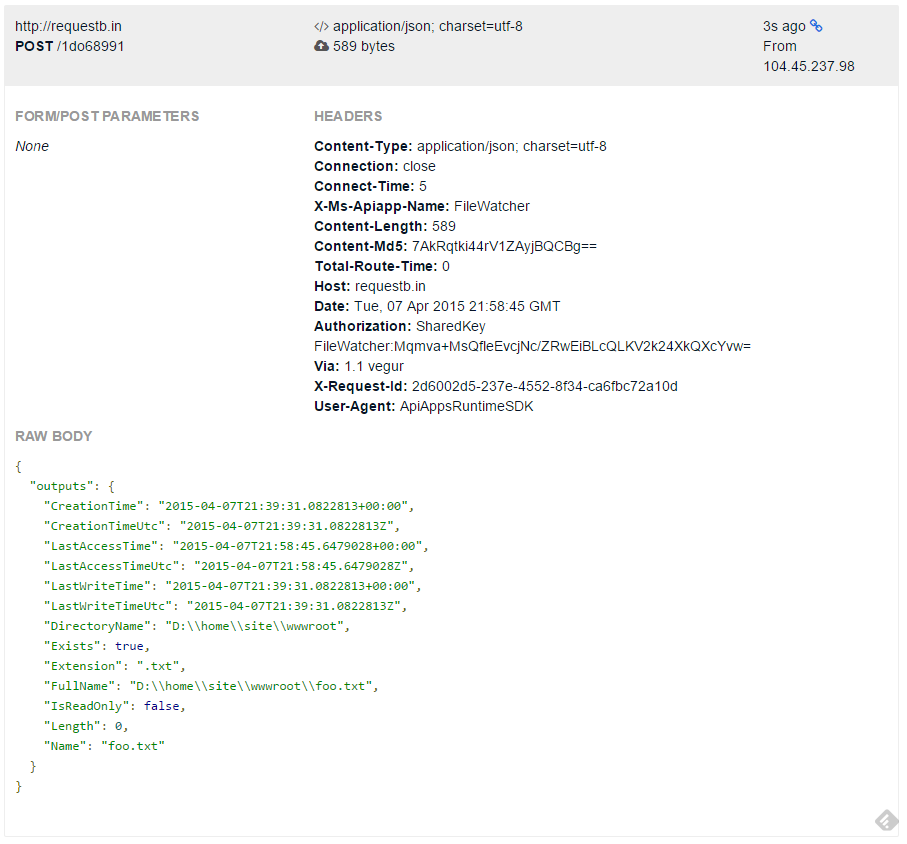
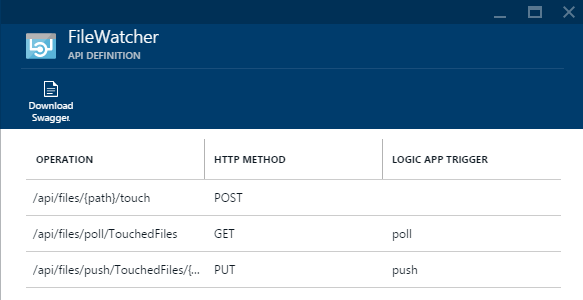
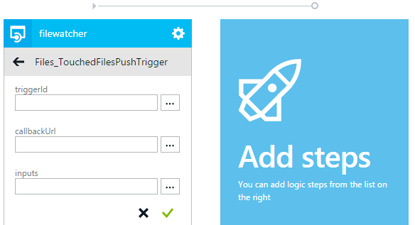

<properties 
    pageTitle="App-Verwaltungsdienst API app Trigger | Microsoft Azure" 
    description="Wie Trigger in einer App-API in Azure-App-Verwaltungsdienst implementiert wird." 
    services="logic-apps" 
    documentationCenter=".net" 
    authors="guangyang"
    manager="wpickett" 
    editor="jimbe"/>

<tags 
    ms.service="logic-apps" 
    ms.workload="na" 
    ms.tgt_pltfrm="dotnet" 
    ms.devlang="na" 
    ms.topic="article" 
    ms.date="08/25/2016" 
    ms.author="rachelap"/>

# Azure Service-API App app Trigger

>[AZURE.NOTE] Diese Version des Artikels gilt API apps 2014-12-01-Schema Vorschauversion aus.

## (Übersicht)

In diesem Artikel wird erläutert, wie API app Trigger implementieren und diese in einer app Logik nutzen.

Alle Codeausschnitte in diesem Thema werden aus der [FileWatcher API App Code Stichprobe](http://go.microsoft.com/fwlink/?LinkId=534802)kopiert. 

Notiz, die Sie für den Code in diesem Artikel zum Erstellen und Ausführen das folgenden Nuget-Paket herunterladen müssen: [http://www.nuget.org/packages/Microsoft.Azure.AppService.ApiApps.Service/](http://www.nuget.org/packages/Microsoft.Azure.AppService.ApiApps.Service/).

## Was sind die app Trigger API?

Es ist ein gängiges Szenario für eine app API ein Ereignis ausgelöst wird, so dass der app-API-Clients die entsprechende Aktion als Antwort auf das Ereignis nutzen können. Das REST-API Grundlage Verfahren, das dieses Szenario unterstützt wird einen API app Trigger bezeichnet. 

Angenommen, beispielsweise Ihre Client-Code wird mithilfe der [app Twitter-Connector-API](../app-service-logic/app-service-logic-connector-twitter.md) und Code muss eine Aktion basierend auf neuen Tweets, die bestimmte Wörter enthalten. In diesem Fall möglicherweise Sie eine Umfrage oder Pushbenachrichtigungen Trigger einrichten, um diesen Bedarf zu erleichtern.

## Umfrage Trigger im Vergleich zu Pushbenachrichtigungen trigger

Derzeit werden zwei Typen von Triggern unterstützt:

- Umfrage Trigger - Client fragt die app API für eine Benachrichtigung über ein Ereignis ausgelöst wurde Probleme 
- Pushbenachrichtigungen auslösen - Client wird von der app API benachrichtigt, wenn ein Ereignis ausgelöst wird 

### Umfrage auslösen

Eine Umfrage auslösen wird als eine normale REST-API implementiert und erwartet seiner Kunden (beispielsweise eine app Logik) es Umfrage, um eine Benachrichtigung zu erhalten. Während der Client Zustand beibehalten werden kann, ist der Umfrage Trigger selbst statusfrei. 

Die folgende Informationen in Bezug auf die Anfrage und Antwort Pakete veranschaulichen einige wichtige Aspekte des Vertrags Trigger Umfrage:

- Anfordern
    - HTTP-Methode: Abrufen
    - Parameter
        - TriggerState - ermöglicht dieser optionale Parameter Clients, geben Sie ihren Status, damit der Umfrage Trigger ordnungsgemäß entscheiden, ob Sie Benachrichtigung oder nicht zurückgeben kann auf den angegebenen Status basierend auf.
        - API-spezifische Parameter
- Antwort
    - Status Code **200** - Anforderung gültig ist, und es wird eine Benachrichtigung über den Trigger. Der Inhalt der Benachrichtigung werden im Antworttext an. Eine Kopfzeile "" Wiederholen "nach" in der Antwort gibt an, dass zusätzliche Benachrichtigungsdaten mit einem Anruf nachfolgende Anforderung abgerufen werden müssen.
    - Status Code **202** - Anforderung gültig ist, aber keine neuen Benachrichtigung aus der Trigger erfolgt.
    - Status Code **4xx** - Anforderung ist ungültig. Der Client sollte nicht die Anforderung wiederholen.
    - Status Code **5xx** - hat Anfrage ein interner Serverfehler und/oder ein vorübergehendes Problem geführt. Der Client sollte die Anforderung wiederholen.

Der folgende Codeausschnitt ist ein Beispiel für eine Umfrage Trigger implementiert wird.

    // Implement a poll trigger.
    [HttpGet]
    [Route("api/files/poll/TouchedFiles")]
    public HttpResponseMessage TouchedFilesPollTrigger(
        // triggerState is a UTC timestamp
        string triggerState,
        // Additional parameters
        string searchPattern = "*")
    {
        // Check to see whether there is any file touched after the timestamp.
        var lastTriggerTimeUtc = DateTime.Parse(triggerState).ToUniversalTime();
        var touchedFiles = Directory.EnumerateFiles(rootPath, searchPattern, SearchOption.AllDirectories)
            .Select(f => FileInfoWrapper.FromFileInfo(new FileInfo(f)))
            .Where(fi => fi.LastAccessTimeUtc > lastTriggerTimeUtc);

        // If there are files touched after the timestamp, return their information.
        if (touchedFiles != null && touchedFiles.Count() != 0)
        {
            // Extension method provided by the AppService service SDK.
            return this.Request.EventTriggered(new { files = touchedFiles });
        }
        // If there are no files touched after the timestamp, tell the caller to poll again after 1 mintue.
        else
        {
            // Extension method provided by the AppService service SDK.
            return this.Request.EventWaitPoll(new TimeSpan(0, 1, 0));
        }
    }

Klicken Sie zum Testen dieser Umfrage Triggers gehen Sie folgendermaßen vor:

1. Bereitstellen der App-API mit einer Einstellung Authentifizierung Bevölkerung **anonyme**an.
2. Rufen Sie den Vorgang **Tippen Sie auf** , um eine Datei zu berühren. Die folgende Abbildung zeigt eine Beispiel für eine Anforderung über Postman.
   
3. Rufen Sie den Umfrage Trigger mit dem **TriggerState** -Parameter auf einen Zeitstempel vor Schritt2 festgelegt. Die folgende Abbildung zeigt die Anfrage Stichprobe über Postman.
   

### Auslösen von Pushbenachrichtigungen

Pushbenachrichtigungen Trigger wird als eine normale REST-API implementiert, die Benachrichtigungen mit Clients legt, die benachrichtigt werden, wenn bestimmte Ereignisse ausgelöst registriert haben.

Die folgende Informationen in Bezug auf die Anfrage und Antwort Pakete veranschaulichen einige wichtige Aspekte des Vertrags Trigger Pushbenachrichtigungen.

- Anfordern
    - HTTP-Methode: Setzen
    - Parameter
        - TriggerId: erforderlich - undurchsichtig Zeichenfolge (beispielsweise eine GUID), die die Registrierung eines Triggers Pushbenachrichtigungen darstellt.
        - CallbackUrl: erforderlich - URL des Rückrufs aufgerufen wird, wenn das Ereignis ausgelöst wird. Aufrufen ist eine einfache Beitrag HTTP-Anruf.
        - API-spezifische Parameter
- Antwort
    - Status Code **200** - Anforderung erfolgreich Client registrieren.
    - Status Code **4xx** - Anforderung ist ungültig. Der Client sollte nicht die Anforderung wiederholen.
    - Status Code **5xx** - hat Anfrage ein interner Serverfehler und/oder ein vorübergehendes Problem geführt. Der Client sollte die Anforderung wiederholen.
- Rückruf
    - HTTP-Methode: Beitrag
    - Textkörper anfordern: Inhalt Benachrichtigung.

Der folgende Codeausschnitt ist ein Beispiel für einen Trigger Pushbenachrichtigungen implementiert wird:

    // Implement a push trigger.
    [HttpPut]
    [Route("api/files/push/TouchedFiles/{triggerId}")]
    public HttpResponseMessage TouchedFilesPushTrigger(
        // triggerId is an opaque string.
        string triggerId,
        // A helper class provided by the AppService service SDK.
        // Here it defines the input of the push trigger is a string and the output to the callback is a FileInfoWrapper object.
        [FromBody]TriggerInput<string, FileInfoWrapper> triggerInput)
    {
        // Register the trigger to some trigger store.
        triggerStore.RegisterTrigger(triggerId, rootPath, triggerInput);

        // Extension method provided by the AppService service SDK indicating the registration is completed.
        return this.Request.PushTriggerRegistered(triggerInput.GetCallback());
    }

    // A simple in-memory trigger store.
    public class InMemoryTriggerStore
    {
        private static InMemoryTriggerStore instance;

        private IDictionary<string, FileSystemWatcher> _store;

        private InMemoryTriggerStore()
        {
            _store = new Dictionary<string, FileSystemWatcher>();
        }

        public static InMemoryTriggerStore Instance
        {
            get
            {
                if (instance == null)
                {
                    instance = new InMemoryTriggerStore();
                }
                return instance;
            }
        }

        // Register a push trigger.
        public void RegisterTrigger(string triggerId, string rootPath,
            TriggerInput<string, FileInfoWrapper> triggerInput)
        {
            // Use FileSystemWatcher to listen to file change event.
            var filter = string.IsNullOrEmpty(triggerInput.inputs) ? "*" : triggerInput.inputs;
            var watcher = new FileSystemWatcher(rootPath, filter);
            watcher.IncludeSubdirectories = true;
            watcher.EnableRaisingEvents = true;
            watcher.NotifyFilter = NotifyFilters.LastAccess;

            // When some file is changed, fire the push trigger.
            watcher.Changed +=
                (sender, e) => watcher_Changed(sender, e,
                    Runtime.FromAppSettings(),
                    triggerInput.GetCallback());

            // Assoicate the FileSystemWatcher object with the triggerId.
            _store[triggerId] = watcher;

        }

        // Fire the assoicated push trigger when some file is changed.
        void watcher_Changed(object sender, FileSystemEventArgs e,
            // AppService runtime object needed to invoke the callback.
            Runtime runtime,
            // The callback to invoke.
            ClientTriggerCallback<FileInfoWrapper> callback)
        {
            // Helper method provided by AppService service SDK to invoke a push trigger callback.
            callback.InvokeAsync(runtime, FileInfoWrapper.FromFileInfo(new FileInfo(e.FullPath)));
        }
    }

Klicken Sie zum Testen dieser Umfrage Triggers gehen Sie folgendermaßen vor:

1. Bereitstellen der App-API mit einer Einstellung Authentifizierung Bevölkerung **anonyme**an.
2. Navigieren Sie zu [http://requestb.in/](http://requestb.in/) , eine RequestBin erstellen, die als Ihre URL Rückruf dienen soll.
3. Rufen Sie den Pushbenachrichtigungen Trigger mit einer GUID als **TriggerId** und die URL RequestBin als **CallbackUrl**an.
   
4. Rufen Sie den Vorgang **Tippen Sie auf** , um eine Datei zu berühren. Die folgende Abbildung zeigt eine Beispiel für eine Anforderung über Postman.
   
5. Überprüfen Sie die RequestBin, um zu bestätigen, dass der Rückruf Pushbenachrichtigungen Trigger mit Eigenschaft Ausgabe aufgerufen wird.
   

### Beschreiben Sie Trigger in API definition

Nach dem Trigger implementieren und Bereitstellen von der app API in Azure, navigieren Sie zu der vorher **-API-Definition** in der Vorschau Azure-Portal, und sehen Sie, dass Trigger in der Benutzeroberfläche, die durch die Swagger 2.0-API Definition der app API gesteuert wird, automatisch erkannt werden.

Wenn Sie klicken auf die Schaltfläche **Swagger herunterladen** und die JSON-Datei öffnen, sehen Sie ähnlich wie der folgende Ergebnisse:

    "/api/files/poll/TouchedFiles": {
      "get": {
        "operationId": "Files_TouchedFilesPollTrigger",
        ...
        "x-ms-scheduler-trigger": "poll"
      }
    },
    "/api/files/push/TouchedFiles/{triggerId}": {
      "put": {
        "operationId": "Files_TouchedFilesPushTrigger",
        ...
        "x-ms-scheduler-trigger": "push"
      }
    }

Die Erweiterung **X-ms-Scheduler-Trigger** ist wie Trigger-API-Definition beschrieben sind, und wird automatisch vom API app Gateway hinzugefügt, wenn die Definition API über das Gateway anfordern, wenn die Anforderung an eine der folgenden Kriterien. (Sie können auch diese Eigenschaft manuell hinzufügen.)

- Umfrage auslösen
    - Wenn die HTTP-Methode **GET**ist.
    - Wenn Sie die Eigenschaft **OperationId** **Auslösen**Zeichenfolge enthält.
    - Wenn die **Parameter** -Eigenschaft ein Parameters mit einem **Name** -Eigenschaft auf **TriggerState**festgelegt enthält.
- Auslösen von Pushbenachrichtigungen
    - Ist die HTTP-Methode **setzen**.
    - Wenn Sie die Eigenschaft **OperationId** **Auslösen**Zeichenfolge enthält.
    - Wenn die **Parameter** -Eigenschaft ein Parameters mit einem **Name** -Eigenschaft auf **TriggerId**festgelegt enthält.

## Verwenden von API app Triggern Logik Apps

### Hinzufügen und Konfigurieren von API app Trigger im Logik apps-Designer

Wenn Sie eine app Logik in derselben Ressourcengruppe als API-app erstellen, werden Sie es den Zeichenbereich-Designer hinzugefügt, einfach, indem Sie darauf. Die folgenden Bilder verdeutlichen dies:

## Optimieren der API app Trigger für Logik apps

Nachdem Sie eine app API Trigger hinzugefügt, gibt es ein paar Punkte, die Sie ergreifen können, um das verbessern, wenn die app API in einer app Logik verwenden.

Beispielsweise sollte der **TriggerState** Parameter für Umfrage Trigger auf den folgenden Ausdruck in der app Logik festgelegt werden. Dieser Ausdruck sollte der letzten Aufrufen des Triggers aus der app Logik auswerten und dieser Wert zurückgegeben.  

    @coalesce(triggers()?.outputs?.body?['triggerState'], '')

Hinweis: Eine Erläuterung der Funktionen im vorstehenden Ausdruck verwendet wird, finden Sie in der Dokumentation auf [Logik App Workflow Definition Language](https://msdn.microsoft.com/library/azure/dn948512.aspx).

App-Benutzer Logik müssten Expression über für den Parameter **TriggerState** beim Verwenden des Triggers bieten. Es ist möglich, diesen Wert vom app-Designer Logik durch die Erweiterung Eigenschaft **X-ms-Scheduler-Empfehlungen**voreingestellte aufweisen.  So, dass der Parameter selbst im Designer nicht angezeigt wird, kann die **X-ms-Sichtbarkeit** Extension-Eigenschaft auf einen Wert des *internen* festgelegt werden.  Der folgende Ausschnitt zeigt, dass.

    "/api/Messages/poll": {
      "get": {
        "operationId": "Messages_NewMessageTrigger",
        "parameters": [
          {
            "name": "triggerState",
            "in": "query",
            "required": true,
            "x-ms-visibility": "internal",
            "x-ms-scheduler-recommendation": "@coalesce(triggers()?.outputs?.body?['triggerState'], '')",
            "type": "string"
          }
        ]
        ...
        "x-ms-scheduler-trigger": "poll"
      }
    }

Für Pushbenachrichtigungen Trigger muss der **TriggerId** -Parameter die app Logik eindeutig identifizieren. Empfiehlt es sich lautet, diese Eigenschaft auf den Namen des Workflows festzulegen, mithilfe des folgenden Ausdrucks:

    @workflow().name

Die **X-ms-Scheduler-Empfehlungen** und **X-ms-Sichtbarkeit** Erweiterungseigenschaften in deren abgegrenzt API verwenden, kann die API-app, die Logik app-Designer dieser Ausdruck für den Benutzer automatisch festgelegt vermitteln.

        "parameters":[  
          {  
            "name":"triggerId",
            "in":"path",
            "required":true,
            "x-ms-visibility":"internal",
            "x-ms-scheduler-recommendation":"@workflow().name",
            "type":"string"
          },

### Add-in-API Definition Erweiterungseigenschaften

Zusätzliche Metadateninformationen – wie etwa die Erweiterung Eigenschaften **X-ms-Scheduler-Empfehlungen** und die **X-ms-Sichtbarkeit** - hinzugefügt werden kann, in der Definition API in einem der beiden folgenden Arten: statische oder dynamische.

Für statische Metadaten können Sie direkt bearbeiten die Datei */metadata/apiDefinition.swagger.json* in Ihrem Projekt und die Eigenschaften manuell hinzufügen.

Für API apps dynamische Metadaten verwenden können Sie die Datei SwaggerConfig.cs, um einen Vorgang Filter hinzufügen, der folgenden Erweiterungen hinzufügen können bearbeiten.

    GlobalConfiguration.Configuration 
        .EnableSwagger(c =>
            {
                ...
                c.OperationFilter<TriggerStateFilter>();
                ...
            }

So sieht ein Beispiel für wie diese Klasse implementiert werden kann, um dem Szenario dynamische Metadaten zu erleichtern.

    // Add extension properties on the triggerState parameter
    public class TriggerStateFilter : IOperationFilter
    {

        public void Apply(Operation operation, SchemaRegistry schemaRegistry, System.Web.Http.Description.ApiDescription apiDescription)
        {
            if (operation.operationId.IndexOf("Trigger", StringComparison.InvariantCultureIgnoreCase) >= 0)
            {
                // this is a possible trigger
                var triggerStateParam = operation.parameters.FirstOrDefault(x => x.name.Equals("triggerState"));
                if (triggerStateParam != null)
                {
                    if (triggerStateParam.vendorExtensions == null)
                    {
                        triggerStateParam.vendorExtensions = new Dictionary<string, object>();
                    }

                    // add 2 vendor extensions
                    // x-ms-visibility: set to 'internal' to signify this is an internal field
                    // x-ms-scheduler-recommendation: set to a value that logic app can use
                    triggerStateParam.vendorExtensions.Add("x-ms-visibility", "internal");
                    triggerStateParam.vendorExtensions.Add("x-ms-scheduler-recommendation",
                                                           "@coalesce(triggers()?.outputs?.body?['triggerState'], '')");
                }
            }
        }
    }
 
