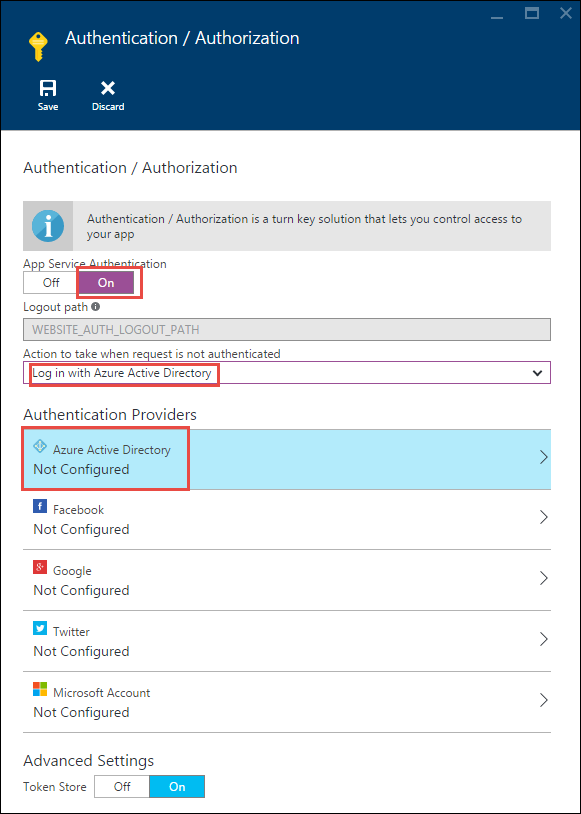

<properties
    pageTitle="Benutzerauthentifizierung für API Apps in Azure-App-Verwaltungsdienst | Microsoft Azure"
    description="Informationen Sie zum Gewähren des Zugriffs auf authentifizierte Benutzer nur eine API-app im App-Verwaltungsdienst Azure schützen."
    services="app-service\api"
    documentationCenter=".net"
    authors="tdykstra"
    manager="wpickett"
    editor=""/>

<tags
    ms.service="app-service-api"
    ms.workload="na"
    ms.tgt_pltfrm="dotnet"
    ms.devlang="na"
    ms.topic="article"
    ms.date="06/30/2016"
    ms.author="rachelap"/>

# Benutzerauthentifizierung für API Apps in Azure-App-Verwaltungsdienst

## (Übersicht)

In diesem Artikel wird gezeigt, wie eine app Azure-API schützen, sodass nur authentifizierte Benutzer aufgerufen werden können. Der Artikel wird vorausgesetzt, dass Sie die [App-Verwaltungsdienst Azure-Authentifizierung (Übersicht)](../app-service/app-service-authentication-overview.md)gelesen haben.

Lernen Sie:

* So konfigurieren Sie einen Authentifizierungsanbieter mit Details für Azure Active Directory (Azure AD).
* So eine geschützte API app mithilfe der [Active Directory Authentifizierung Bibliothek (ADAL) bei Verwendung von JavaScript](https://github.com/AzureAD/azure-activedirectory-library-for-js)zu nutzen.

Im Artikel umfasst zwei Bereiche an:

* Im Abschnitt [Benutzerauthentifizierung in Azure-App-Verwaltungsdienst konfigurieren](#authconfig) im Allgemeinen erläutert, wie Benutzerauthentifizierung für eine beliebige app, API konfigurieren und gleichmäßig gilt für alle Framework von App-Verwaltungsdienst, einschließlich .NET, Node.js und Java unterstützt.

* Beginnend mit dem Abschnitt [zu den Lernprogrammen .NET API Apps zu erhalten](#tutorialstart) , die Führungslinien Artikel Sie durch die Konfiguration von einer Stichprobe-Anwendungs mit einem .NET back-End und ein AngularJS Vorderseite beenden, dass für die Benutzerauthentifizierung Azure Active Directory verwendet. 

## So konfigurieren Sie die Benutzerauthentifizierung in Azure-App-Verwaltungsdienst

Dieser Abschnitt enthält allgemeine Anweisungen aus, die auf eine beliebige app, API anwenden. Für bestimmte Schritte zur Anwendung Stichprobe führen Liste .NET wechseln Sie zur [weiteren .NET erste Schritte-Lernprogramme](#tutorialstart).

1. Im [Portal Azure](https://portal.azure.com/), navigieren Sie zu **Einstellungen** Falz API-app, die Sie verwenden möchten, schützen, finden im Abschnitt **Features** , und klicken Sie dann auf **Authentifizierung / Autorisierung**.

    

3. In der **Authentifizierung / Autorisierung** Blade, **Klicken Sie auf**.

4. Wählen Sie eine der Optionen aus der Dropdownliste die **Aktion ausgeführt werden soll, wenn die Anforderung nicht authentifiziert wird** .

    * Wenn Sie nur authentifizierten Anrufe an Ihre app API erreichen möchten, wählen Sie eine der Optionen **in... melden** . Dieser Option können Sie zum Schutz der app API ohne Code, die in diese ausgeführt wird.

    * Wenn Sie alle Anrufe an Ihre app API erreichen möchten, wählen Sie **Zulassen Anforderung (keine Aktion)**. Sie können diese Option verwenden, nicht authentifizierte Anrufern Wahl der Authentifizierungsanbieter leiten. Mit dieser Option müssen Sie Code schreiben, um die Autorisierung zu behandeln.

    Weitere Informationen finden Sie unter [Authentifizierung und Autorisierung für API Apps in Azure-App-Dienst](app-service-api-authentication.md#multiple-protection-options).

5. Wählen Sie eine oder mehrere der **Authentifizierungsanbieter**.

    Die Abbildung zeigt die Optionen, die alle Anrufer von Azure AD authentifiziert werden müssen.
 
    

    Wenn Sie einen Authentifizierungsanbieter auswählen, zeigt im Portal eine Blade Konfiguration für den ausgewählten Anbieter. 

    Wenn Sie ausführliche Anweisungen, die erläutern, wie die Authentifizierung Anbieter Konfiguration Blades konfigurieren, finden Sie unter [So konfigurieren Sie Ihre App-verwaltungsdienstanwendung Azure Active Directory Login verwenden](../app-service-mobile/app-service-mobile-how-to-configure-active-directory-authentication.md). (Der Hyperlink führt zu einem Artikel über Azure AD, aber der Artikel selbst enthält Registerkarten, die für die anderen Authentifizierungsanbieter zu Artikeln verknüpft.)

7. Wenn Sie mit der Authentifizierung Anbieter Konfiguration Blade fertig sind, klicken Sie auf **OK**.

7. In der **Authentifizierung / Autorisierung** Blade, klicken Sie auf **Speichern**.

Wenn dies der Fall, authentifiziert App-Dienst alle API-Aufrufe, bevor sie die app API erreichen. Die Authentifizierungsdienste ist für alle Sprachen, die App-Dienst unterstützt, einschließlich .NET, Node.js und Java. 

Authentifizierten API Anrufe, enthält der Anrufer Authentifizierung Entwicklers OAuth 2.0 Person Token in der Kopfzeile Autorisierung des HTTP-Anfragen an. Das Token kann mithilfe der Authentifizierungsanbieter SDK erworben werden.

## Die Lernprogramme .NET API Apps fortgesetzt werden kann

Wenn Sie die Node.js oder Java-Lernprogramme für API apps folgen, fahren Sie mit der nächsten Artikel [Dienst Hauptbenutzer Authentifizierung für API apps](app-service-api-dotnet-service-principal-auth.md). 

Wenn Sie die .NET zusammengehörenden Lernprogrammen für API apps folgen und die Stichprobe Anwendung bereits bereitgestellt werden, haben wie in der [ersten](app-service-api-dotnet-get-started.md) und [zweiten](app-service-api-cors-consume-javascript.md) Lernprogrammen geleitet, gehen Sie zum Abschnitt [in der App-Dienst und Azure AD-Authentifizierung einrichten](#azureauth) .

Wenn dieses Lernprogramms führen, ohne die erste und die zweite Lernprogramme vertraut werden soll, führen Sie die folgenden Schritte aus, die mit einem automatisierten Vorgang zum Bereitstellen der Anwendung Stichprobe Schritte erläutert.

>[AZURE.NOTE] Die folgenden Schritte aus, die mit dem gleichen Anfangspunkt erhalten Sie, als wäre Sie die ersten beiden Lernprogramme, mit einer Ausnahme hat: Visual Studio wissen nicht bereits, welche Web app oder API-app, die für jedes Projekt bereitgestellt wird. Dies bedeutet, dass Sie nicht genaue Anweisungen in diesem Lernprogramm müssen, die erläutern, wie die richtigen Ziele bereitgestellt. Wenn Sie nicht mit herauszufinden, wie führen Sie die Schritte auf Ihrer eigenen vertraut sind, empfiehlt sich die zusammengehörenden Lernprogrammen aus der [ersten Lernprogramm](app-service-api-dotnet-get-started.md) als zu beginnen Sie mit dieser Vorgang automatisierte Bereitstellung folgen.

1. Stellen Sie sicher, dass Sie alle erforderlichen Komponenten aufgeführt, die in der [ersten Lernprogramm](app-service-api-dotnet-get-started.md)haben. Zusätzlich zu den erforderlichen Komponenten aufgeführt wird in diesen Lernprogrammen Authentifizierung davon ausgegangen, dass Sie mit der App-Dienst Web apps und API-apps in Visual Studio und Azure-Portal gearbeitet haben.

2. Klicken Sie auf die Schaltfläche **bereitstellen zu Azure** in der [Aufgabenliste Beispieldatei Repository Infos zu](https://github.com/azure-samples/app-service-api-dotnet-todo-list/blob/master/readme.md) den API-apps und der Web app bereitstellen. Notieren Sie die Azure Ressourcengruppe, die erstellt wird wie folgt können höher Web app und API-app-Namen nachschlagen.
 
3. Herunterladen, oder um den Code zu erhalten, den Sie lokal in Visual Studio arbeiten mit der [Aufgabenliste Beispiel Repository](https://github.com/Azure-Samples/app-service-api-dotnet-todo-list) klonen.

## In der App-Dienst und Azure AD-Authentifizierung einrichten

Sie verfügen nun über die Anwendung in Azure-App-Dienst ausgeführt werden, ohne dass die Benutzer authentifiziert werden müssen. In diesem Abschnitt fügen Sie Authentifizierung hinzu, indem Sie die folgenden Aufgaben ausführen:

* Konfigurieren Sie App Dienst Azure Active Directory (Azure AD) Authentifizierung erforderlich ist, für das Anrufen von der mittleren Ebene API app.
* Erstellen einer Azure AD-Anwendung.
* Konfigurieren Sie die Azure AD-Anwendung, das Person Token nach der Anmeldung an AngularJS front-End zu senden. 

Wenn Sie Probleme auftreten, während Sie das Lernprogramm erfahren Sie, wie, finden Sie im Abschnitt [Problembehandlung](#troubleshooting) am Ende des Lernprogramms. 
 
### Konfigurieren der Authentifizierung für die mittlere Ebene API-app

1. Navigieren Sie im [Azure-Portal](https://portal.azure.com/)an die Blade **Einstellungen** der API-app, die Sie erstellt haben, für das Projekt ToDoListAPI, finden Sie im Abschnitt **Features** , und klicken Sie dann auf **Authentifizierung / Autorisierung**.

    

3. In der **Authentifizierung / Autorisierung** Blade, **Klicken Sie auf**.

4. Wählen Sie in der Dropdownliste **Aktion ausgeführt werden soll, wenn die Anforderung nicht authentifiziert ist** **Melden Sie sich mit Azure Active Directory**.

    Diese Option wird sichergestellt, dass keine Unauathenticated Anfragen die app API erreicht werden. 

5. Klicken Sie unter **Authentifizierungsanbieter**auf **Azure Active Directory**.

    

6. Klicken Sie in das Blade **Azure-Active Directory-Einstellungen** auf **Express**

    

    Mit der Option **Express** können App Dienst Anwendung Azure AD-automatisch in Ihrem Azure AD- [Mandanten](https://msdn.microsoft.com/en-us/library/azure/jj573650.aspx#BKMK_WhatIsAnAzureADTenant)erstellen. 

    Sie müssen nicht so erstellen einen Mandanten, da jeder Azure-Konto automatisch eine verfügt.

7. Klicken Sie unter **Verwaltungsmodus**klicken Sie auf **Neues AD-App erstellen** , wenn Sie noch nicht ausgewählt ist, und notieren Sie den Wert, der in das Textfeld **App erstellen** ; Sie können diese AAD Anwendung im klassischen Azure-Portal später nachschlagen.

    

    Azure erstellt automatisch eine Azure AD-Anwendung mit dem angegebenen Namen in Ihrem Azure AD-Mandanten. Standardmäßig wird die Azure AD-Anwendung identisch mit der app API bezeichnet. Wenn Sie es vorziehen, können Sie einen anderen Namen eingeben.
 
7. Klicken Sie auf **OK**.

7. In der **Authentifizierung / Autorisierung** Blade, klicken Sie auf **Speichern**.

    

Jetzt können nur Benutzer in Ihrem Azure AD-Mandanten die app API aufrufen.

### Optional: Testen der app API

1. Wechseln Sie in einem Browser auf die URL der API-app: in vorher **API app** in der Azure-Portal, klicken Sie auf den Link unter **URL**.  

    Sie werden zur einen Anmeldebildschirm umgeleitet, weil nicht authentifizierte Anfragen nicht zulässig sind, um die app API zu erreichen.

    Wenn Ihr Browser zur Seite "erfolgreich erstellt" geht, im Browser möglicherweise bereits angemeldet sein aktivieren – in diesem Fall ein InPrivate oder Incognito-Fenster zu öffnen und wechseln Sie zu der API-app-URL.

2. Melden Sie sich unter Verwendung von Anmeldeinformationen für einen Benutzer in Ihrem Azure AD-Mandanten.

    Wenn Sie angemeldet sind, klicken Sie auf die Seite "erfolgreich erstellte" im Browser angezeigt wird.

9. Schließen Sie den Browser.

### Konfigurieren Sie die Azure AD-Anwendung

Wenn Sie Azure AD-Authentifizierung konfiguriert, Azure AD-Anwendung von App-Dienst für Sie erstellt. Standardmäßig die neuen Azure AD wurde Anwendung so konfiguriert, dass das Person Token der API-app-URL bereitstellen wird. In diesem Abschnitt Konfigurieren Sie die Azure AD-Anwendung, um die Person Token zum AngularJS front-End statt direkt auf der mittleren Ebene API app bereitstellen. AngularJS front-End senden das Token bei der app API an, wenn sie die app API ruft.

>[AZURE.NOTE] Stufen Sie den Prozess als einfach wie möglich, die in diesem Lernprogramm wird eine einzelne Azure AD verwendet werden soll Anwendung für das front-End und der Mitte API app. Eine weitere Möglichkeit besteht darin, zwei Azure AD-Anwendungen verwenden. In diesem Fall müssen Sie die front-End Azure AD-Anwendung die Berechtigung zum Azure AD-Anwendung der mittleren Ebene aufrufen. Dieser Ansatz mehrere Anwendung legen Sie eine detaillierte Kontrolle über die Berechtigungen für jede Ebene fest.

11. Wechseln Sie im [Azure klassischen-Portal](https://manage.windowsazure.com/)zu **Azure Active Directory**.

    Sie müssen das klassische-Portal zu verwenden, weil bestimmte Azure Active Directory-Einstellungen, denen benötigten Zugriff auf noch nicht im aktuellen Azure-Portal verfügbar sind.

12. Klicken Sie auf der Registerkarte **Verzeichnis** auf Ihrem Mandanten AAD.

    

14. Klicken Sie auf **Anwendungen > Applikationen wurde von meiner Firma zugegriffen**, und klicken Sie dann auf das Häkchen.

    Möglicherweise müssen auch auf das Zeichenblatt, um die neue Anwendung finden Sie unter aktualisieren.

15. Klicken Sie in der Liste der Programme klicken Sie auf den Namen der Azure für Sie erstellt, wenn Sie für Ihre app-API-Authentifizierung aktiviert.

    

16. Klicken Sie auf **Konfigurieren**.

    

17. Legen Sie auf die URL für Ihre AngularJS Web app keine nachgestellten Schrägstrich **Anmelden URL** ein.

    Beispiel: https://todolistangular.azurewebsites.net

    

17. Legen Sie **Antwort-URL** die URL für Ihre Web-app keine nachgestellten Schrägstrich.

    Beispiel: https://todolistsangular.azurewebsites.net

16. Klicken Sie auf **Speichern**.

    

15. Klicken Sie am unteren Rand der Seite, auf **Manifest verwalten > Download Manifest**.

    

17. Laden Sie die Datei an einem Speicherort, wo Sie es bearbeiten können.

16. Suchen Sie in der heruntergeladenen Manifestdatei, für die `oauth2AllowImplicitFlow` Eigenschaft. Ändern Sie den Wert dieser Eigenschaft von `false` zu `true`, und speichern Sie die Datei.

    Diese Einstellung ist für den Zugriff aus einer JavaScript-Anwendung einseitige erforderlich. Es ermöglicht das Oauth 2.0 Person Token das URL-Fragment zurückgegeben werden sollen.

16. Klicken Sie auf **Manifest verwalten > Upload Manifest**, und Laden Sie die Datei, die Sie im vorherigen Schritt aktualisiert.

    

17. Kopieren Sie den Wert für die **Client-ID** , und speichern sie ein anderes, die Sie ihn später abrufen können.

## Konfigurieren Sie das Projekt ToDoListAngular, um die Verwendung der Authentifizierung

In diesem Abschnitt ändern Sie die front-End AngularJS, dass Active Directory Authentifizierung Bibliothek (ADAL) für JS zum Erfassen von einer Person Token für den Benutzer angemeldet aus Azure AD verwendet. Code wird das Token in HTTP-Anfragen an der mittleren Ebene gesendet enthalten, wie in der folgenden Abbildung gezeigt. 

Nehmen Sie die folgenden Änderungen an Dateien im Projekt ToDoListAngular an.

1. Öffnen Sie die Datei *index.html* .

2. Kommentieren Sie die Zeilen, in denen die Active Directory Authentifizierung Bibliothek (ADAL) für JS Skripts verwiesen.

        
        

1. Öffnen Sie die Datei *app/scripts/app.js* .

2. Kommentieren Sie den Codeblock für "ohne Authentifizierung" gekennzeichnet, und entfernen Sie die Kommentarzeichen Sie des Zeitraums Code für "mit Authentifizierung" markiert.

    Diese Änderung verweist auf die ADAL JS-Authentifizierungsanbieter und von Konfigurationswerten, die ihn enthält. In den folgenden Schritten legen Sie die Konfigurationswerte für Ihre app API und Azure AD-Anwendung.

8. In den Code, setzt die `endpoints` Variable, legt die API URL auf die URL der API-app, die Sie für das Projekt ToDoListAPI erstellt, und legen die Azure AD-ID auf die Client-ID, die Sie in der klassischen Azure-Portal kopiert haben.

    Der Code ist nun ähnlich wie im folgenden Beispiel.

        var endpoints = {
            "https://todolistapi0121.azurewebsites.net/": "1cf55bc9-9ed8-4df31cf55bc9-9ed8-4df3"
        };

9. In den Anruf an `adalProvider.init`, legen `tenant` an Ihren Mandanten Namen und `clientId` gleichen Wert, die Sie im vorherigen Schritt verwendet.

    Der Code ist nun ähnlich wie im folgenden Beispiel.

        adalProvider.init(
            {
                instance: 'https://login.microsoftonline.com/', 
                tenant: 'contoso.onmicrosoft.com',
                clientId: '1cf55bc9-9ed8-4df31cf55bc9-9ed8-4df3',
                extraQueryParameter: 'nux=1',
                endpoints: endpoints
            },
            $httpProvider
            );

    Diese ändert sich in `app.js` angeben, dass der einen Code und die sogenannte-API in der gleichen Azure AD-Anwendung sind.

1. Öffnen Sie die Datei *app/scripts/homeCtrl.js* .

2. Kommentieren des Codeblocks für "ohne Authentifizierung" gekennzeichnet, und entfernen Sie die Kommentarzeichen des Zeitraums Code für "mit Authentifizierung" markiert.

1. Öffnen Sie die Datei *app/scripts/indexCtrl.js* .

2. Kommentieren Sie den Codeblock für "ohne Authentifizierung" gekennzeichnet, und entfernen Sie die Kommentarzeichen Sie des Zeitraums Code für "mit Authentifizierung" markiert.

### Bereitstellen des Projekts ToDoListAngular in Azure

8. Im- **Lösung-Explorer**mit der rechten Maustaste in des Projekts ToDoListAngular, und klicken Sie dann auf **Veröffentlichen**.

9. Klicken Sie auf **Veröffentlichen**.

    Visual Studio wird das Projekt bereitgestellt und öffnet einen Browser auf Basis der Web-app-URL. Hieraus sehen eine 403 Fehlerseite, also normalen Versuch, zu einer Web-API Basis-URL in einem Browser zu wechseln.

    Sie müssen immer noch eine Änderung zur app-API mittleren Ebene vornehmen, bevor Sie die Anwendung zu testen.

10. Schließen Sie den Browser.

## Konfigurieren Sie das Projekt ToDoListAPI, um die Verwendung der Authentifizierung

Das Projekt ToDoListAPI aktuell sendet "*" als die `owner` Wert ToDoListDataAPI. In diesem Abschnitt ändern Sie den Code, um die ID des Benutzers angemeldet zu senden.

Nehmen Sie die folgenden Änderungen im Projekt ToDoListAPI an.

1. Öffnen Sie die Datei *Controllers/ToDoListController.cs* , und heben Sie die Zeile in jeder Aktionsmethode, festlegt `owner` auf Azure Active Directory `NameIdentifier` Wert beanspruchen. Beispiel:

        owner = ((ClaimsIdentity)User.Identity).FindFirst(ClaimTypes.NameIdentifier).Value;

    **Wichtig**: nicht entfernen Sie die Kommentarzeichen-Code in die `ToDoListDataAPI` Methode; Sie erhalten, die später für den Dienst Hauptbenutzer Authentifizierung Lernprogramm durchführen.

### Bereitstellen des Projekts ToDoListAPI in Azure

8. Im- **Lösung-Explorer**mit der rechten Maustaste in des Projekts ToDoListAPI, und klicken Sie dann auf **Veröffentlichen**.

9. Klicken Sie auf **Veröffentlichen**.

    Visual Studio wird das Projekt bereitgestellt und öffnet einen Browser auf Basis der API-app-URL.

10. Schließen Sie den Browser.

### Testen Sie die Anwendung

9. Rufen Sie die URL des Web app, **Verwenden Sie HTTPS und nicht HTTP**.

8. Klicken Sie auf der Registerkarte **Aufgabenliste** .

    Sie werden aufgefordert, sich anmelden.

9. Melden Sie sich mit den Anmeldeinformationen eines Benutzers in Ihrem Mandanten AAD.

10. Die Seite **Aufgabenliste** wird angezeigt.

    

    Keine Aufgabenelemente angezeigt werden, da Sie jetzt, bis sie alle für Besitzer wurden "*". Jetzt fordert der mittleren Ebene Elemente für den Benutzer angemeldet, und keine noch erstellt wurden.

11. Fügen Sie neue Aufgabenelemente, um sicherzustellen, dass die Anwendung funktioniert.

12. In einem anderen Browserfenster, rufen Sie die URL des Swagger-Benutzeroberfläche für die ToDoListDataAPI-API app, und klicken Sie auf **Aufgabenliste > erste**. Geben Sie ein Sternchen für die `owner` Parameter, und klicken Sie dann auf **Probieren Sie es einfach**.

    Die Antwort zeigt, dass bei der neuen Aufgabenelemente den tatsächlichen Azure AD-Benutzer-ID in der Eigenschaft Besitzer.

    

## Erstellen der Projekte von Grund auf

Die beiden Web-API Projekte erstellt wurden unter Verwendung der Projektvorlage **Azure API App** , und ersetzen den standardmäßigen Werte Controller mit einer Aufgabenliste Controller. 

Informationen dazu, wie Sie die Anwendung einseitige AngularJS mit einem Web-API 2 Back-End erstellen, finden Sie unter [Hände auf Übung: Erstellen einer einzelnen Seite Anwendung (SPA) mit ASP.NET Web API und Angular.js](http://www.asp.net/web-api/overview/getting-started-with-aspnet-web-api/build-a-single-page-application-spa-with-aspnet-web-api-and-angularjs). Informationen zur Verwendung von Azure AD-Authentifizierungscode hinzufügen finden Sie unter den folgenden Ressourcen:

* [Sichern von AngularJS einzelne Seite Apps mit Azure AD-](../active-directory/active-directory-devquickstarts-angular.md).
* [Einführung in ADAL JS Version 1](http://www.cloudidentity.com/blog/2015/02/19/introducing-adal-js-v1/)

## Behandlung von Problemen

[AZURE.INCLUDE [troubleshooting](../../includes/app-service-api-auth-troubleshooting.md)]

* Stellen Sie sicher, dass ToDoListAPI (mittlere Ebene) und ToDoListDataAPI (Datenebene) verwechselt werden nicht. Angenommen, stellen Sie sicher, dass Sie die app nicht der Datenebene mittleren Ebene API Authentifizierung hinzugefügt. 
* Stellen Sie sicher, dass der AngularJS Quellcode der mittleren Ebene API app-URL (ToDoListAPI, nicht ToDoListDataAPI) und die richtige Azure verweist auf AD-Client-ID an. 

## Nächste Schritte

In diesem Lernprogramm haben Sie Verwendung von App-Authentifizierung für eine app API und wie Sie die app API aufrufen, indem Sie mit der ADAL JS-Bibliothek. In den nächsten Lernprogramm erfahren so [sicheren Zugriff auf Ihre app API für Dienst - Szenarien](app-service-api-dotnet-service-principal-auth.md).

