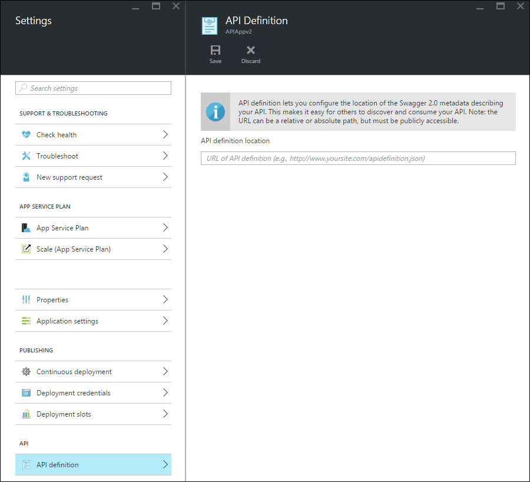

<properties
    pageTitle="App-Dienst-API Apps Metadaten API Discovery und Code zur Erstellung | Microsoft Azure"
    description="Hier erfahren Sie, wie API Apps in Azure-App-Verwaltungsdienst Swagger Metadaten API Suche und Code Generation zu erleichtern."
    services="app-service\api"
    documentationCenter=".net"
    authors="tdykstra"
    manager="wpickett"
    editor=""/>

<tags
    ms.service="app-service-api"
    ms.workload="na"
    ms.tgt_pltfrm="na"
    ms.devlang="na"
    ms.topic="article"
    ms.date="08/30/2016"
    ms.author="rachelap"/>

# App-Dienst-API Apps Metadaten für API Suche und Code der zweiten generation 

Unterstützung für [Swagger 2.0](http://swagger.io/) -API Metadaten ist in App Service-API Apps integriert. Sie müssen nicht Swagger verwenden, aber wenn Sie es verwenden, können Sie nutzen API Apps-Features, die Suche und Verbrauch zu erleichtern.   

## Swagger Endpunkt

Sie können einen Endpunkt angeben, der Swagger 2.0 JSON-Metadaten für eine app API in einer Eigenschaft der app API bereitstellt. Der Endpunkt kann relativ zu den Basis-URL der API-app oder eine absolute URL sein. Absolute URLs können außerhalb der app API zeigen. 

Viele untergeordneten Clients (z. B. Visual Studio Code Generation und PowerApps "hinzufügen API" Fluss), die URL muss öffentlich zugängliche (nicht von einem Benutzer oder Dienstauthentifizierung geschützt). Das heißt, wenn Sie mithilfe der App-Service-Authentifizierung sind und die Definition API aus innerhalb der app ähneln verfügbar machen möchten, müssen Sie die Authentifizierungsoption zu verwenden, können anonyme Datenverkehr an Ihre API erreicht haben. Weitere Informationen finden Sie unter [Authentifizierung und Autorisierung für App-Service-API-Apps](app-service-api-authentication.md).

### Portal blade

Im [Portal Azure](https://portal.azure.com/) kann die Endpunkt-URL angezeigt und auf das Blade **-API-Definition** geändert werden.

### Azure Ressourcenmanager-Eigenschaft

Sie können die URL des API-Definition für eine app API auch mithilfe der [Ressource Explorer](https://resources.azure.com/) oder [Azure Ressourcenmanager Vorlagen](../resource-group-authoring-templates.md) Befehlszeile-Tools, wie z. B. [Azure PowerShell](../powershell-install-configure.md) und [Azure CLI](../xplat-cli-install.md)konfigurieren. 

**Ressourcen-Explorer**, wechseln Sie zur **Abonnements > {Ihr Abonnement} > ResourceGroups > {Ressourcengruppe} > Anbieter > Microsoft.Web > Websites > {Ihrer Website} > Config > Web**, dann sehen Sie die `apiDefinition` Eigenschaft:

        "apiDefinition": {
          "url": "https://contactslistapi.azurewebsites.net/swagger/docs/v1"
        }

Ein Beispiel für eine Ressourcenmanager Azure-Vorlage, die legt die `apiDefinition` Eigenschaft, öffnen Sie die [azuredeploy.json-Datei in der Aufgabenliste Beispiel-Anwendung](https://github.com/azure-samples/app-service-api-dotnet-todo-list/blob/master/azuredeploy.json). Suchen Sie den Abschnitt der Vorlage, die den JSON-Beispiel gezeigten aussieht.

### Standardwert

Wenn Sie Visual Studio verwenden, um eine API-app erstellen, der API Definition-Endpunkt automatisch auf der Basis der API app-plus-URL festgelegt `/swagger/docs/v1`. Dies ist der Standard-URL, die das [Swashbuckle](https://www.nuget.org/packages/Swashbuckle) NuGet-Paket wird verwendet, um dynamisch generierten Swagger Metadaten für ein Projekt ASP.NET Web API dienen. 

## Code der zweiten generation

Einer der Vorteile der Integration von Swagger in Azure-API apps ist automatische Code Generation. Generierte Client-Klassen vereinfachen das Schreiben von Code, die eine app API ruft.

Sie können Client-Code für eine app API mit Visual Studio oder über die Befehlszeile generieren. Informationen zur Verwendung von Client-Klassen in Visual Studio für ein Projekt ASP.NET Web API zu generieren finden Sie unter [Erste Schritte mit Apps API und ASP.NET](app-service-api-dotnet-get-started.md#codegen). Informationen darüber, wie Sie vorgehen müssen sie über die Befehlszeile für alle unterstützten Sprachen finden Sie unter der Infodatei des Repositorys [Azure/Autorest](https://github.com/azure/autorest) auf GitHub.com.
 
## Nächste Schritte

Ein schrittweises Lernprogramm, das hilft Ihnen beim Erstellen, bereitstellen und nutzen eine app API finden Sie unter [Erste Schritte mit API Apps in Azure-App-Dienst](app-service-api-dotnet-get-started.md).

Wenn Sie Azure-API Management mit Apps-API verwenden, können Sie Metadaten Swagger, Ihre API in API Management importieren. Weitere Informationen finden Sie unter [So importieren Sie die Definition einer API mit Operationen in Azure-API Management](../api-management/api-management-howto-import-api.md). 
