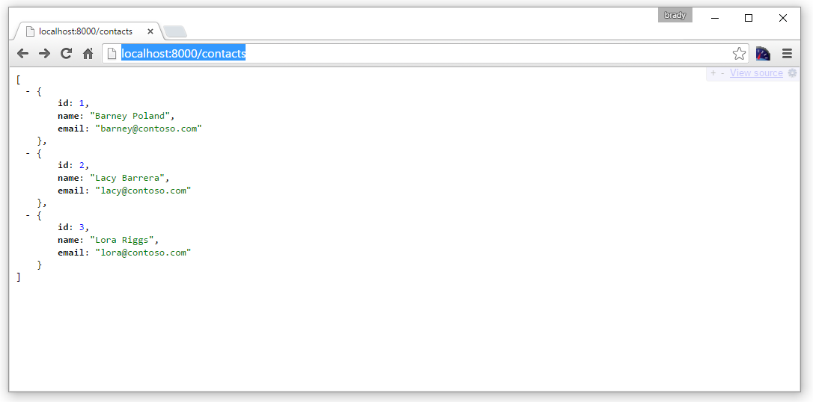
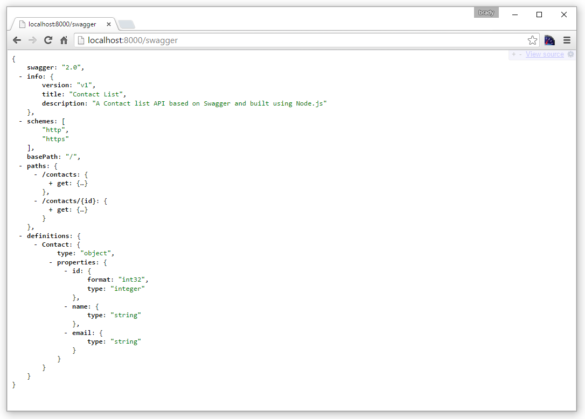

<properties
    pageTitle="Node.js API app im App-Verwaltungsdienst Azure | Microsoft Azure"
    description="Informationen Sie zum Erstellen einer Node.js REST-API und auf einer API-app im App-Verwaltungsdienst Azure bereitgestellt."
    services="app-service\api"
    documentationCenter="node"
    authors="bradygaster"
    manager="wpickett"
    editor=""/>

<tags
    ms.service="app-service-api"
    ms.workload="web"
    ms.tgt_pltfrm="na"
    ms.devlang="node"
    ms.topic="get-started-article"
    ms.date="05/26/2016"
    ms.author="rachelap"/>

# Erstellen einer Node.js REST-API, und stellen Sie es mit einer API Azure

[AZURE.INCLUDE [app-service-api-get-started-selector](../../includes/app-service-api-get-started-selector.md)]

In diesem Lernprogramm erfahren zum Erstellen einer einfachen [Node.js](http://nodejs.org) API, und stellen es in einer [API app](app-service-api-apps-why-best-platform.md) im [App-Verwaltungsdienst Azure](../app-service/app-service-value-prop-what-is.md) mithilfe von [Git](http://git-scm.com). Können Sie eine beliebige Betriebssystem, das Node.js ausgeführt werden kann, und Sie Ihre gesamte Arbeit mit Befehlszeilentools wie cmd.exe führen oder bash werden.

## Erforderliche Komponenten

1. Microsoft Azure-Konto ([ein kostenloses Konto hier öffnen](https://azure.microsoft.com/pricing/free-trial/))
1. [Node.js](http://nodejs.org) installiert (in diesem Beispiel wird davon ausgegangen, dass Sie Node.js Version 4.2.2 haben)
2. [Git](https://git-scm.com/) installiert
1. [GitHub](https://github.com/) -Konto

Während der App-Dienst viele Methoden zum Bereitstellen von Codes zu einer app API unterstützt, wird in diesem Lernprogramm zeigt die Methode Git und setzt voraus, dass Sie grundlegende Kenntnisse zum Arbeiten mit Git verfügen. Informationen über andere Methoden für die Bereitstellung finden Sie unter [Bereitstellen Ihre app Azure-App-Verwaltungsdienst](../app-service-web/web-sites-deploy.md).

## Abrufen des Stichprobe Codes

1. Öffnen einer Command Line Interface, die Befehle Node.js und Git ausgeführt werden können.

1. Navigieren Sie zu einem Ordner, den Sie für eine lokale Git Repository und datenbeschriftungsreihe [GitHub Repository mit dem Beispielcode](https://github.com/Azure-Samples/app-service-api-node-contact-list)verwenden können.

        git clone https://github.com/Azure-Samples/app-service-api-node-contact-list.git

    Die Stichprobe-API bietet zwei Endpunkte: eine Get-Anforderung zu `/contacts` gibt eine Liste der Namen und e-Mail-Adressen im JSON-Format, während `/contacts/{id}` gibt nur den ausgewählten Kontakt.

## Scaffold (automatischen generieren) Node.js Code auf der Grundlage Swagger Metadaten

[Swagger](http://swagger.io/) ist ein Dateiformat für Metadaten, die eine REST-API zu beschreiben. App-Verwaltungsdienst Azure bietet eine [integrierte Unterstützung für Swagger Metadaten](app-service-api-metadata.md). In diesem Abschnitt des Lernprogramms Modelle ein API Entwicklung Workflows, in dem Sie Swagger Metadaten zuerst erstellen und verwenden, die zum Scaffold (automatischen generieren) Server-Code für die-API. 

>[AZURE.NOTE] Wenn Sie Informationen zum Scaffold Node.js Code aus einer Swagger-Metadaten-Datei nicht möchten, können Sie diesen Abschnitt überspringen. Wenn Sie nur Beispiel-Code für eine neue API app bereitstellen möchten, wechseln Sie direkt zum [Erstellen einer app API in Azure](#createapiapp) Abschnitt.

### Installieren und Ausführen von Swaggerize

1. Führen Sie die folgenden Befehle, die **yo** **Generator swaggerize** NPM Module und Global zu installieren.

        npm install -g yo
        npm install -g generator-swaggerize

    Swaggerize ist ein Tool, Server-Code für eine API beschrieben, indem Sie eine Datei mit Metadaten Swagger generiert. Die Swagger-Datei, die Sie verwenden möchten heißt *api.json* und befindet sich im Ordner des Repositorys, die Sie geklont *Starten* .

2. Navigieren Sie zu dem Ordner *zu starten* , und führen Sie dann die `yo swaggerize` Befehl. Swaggerize wird eine Reihe von Fragen stellen.  Für **dieses Projekt aufrufen, was**"ContactList", für den **Pfad zum Dokument swagger**Geben Sie, "api.json", und für **Express, zufrieden sind, oder Restify**, geben Sie "express".

        yo swaggerize

    
    
    **Hinweis**: Wenn Sie in diesem Schritt genannten Fehler auftreten, wird im nächste Schritt erläutert, wie das Problem zu lösen.

    Swaggerize erstellt einen Anwendungsordner, Gerüste Ereignishandler und Konfigurationsdateien und generiert eine Datei **package.json** . Die Ansicht express-Engine dient zum Generieren der Hilfeseite Swagger.  

3. Wenn die `swaggerize` Befehl fehlschlägt, mit einem "unerwartetes Token" oder "Ungültige Escape-Zeichen" zurück, korrigieren Sie die Ursache des Fehlers durch Bearbeiten der Datei generierten *package.json* . In der `regenerate` Linie unter `scripts`, ändern Sie den umgekehrten Schrägstrich, der *api.json* zu einem Schrägstrich, vorausgeht, damit die Zeile wie im folgenden Beispiel aussieht:

        "regenerate": "yo swaggerize --only=handlers,models,tests --framework express --apiPath config/api.json"

1. Navigieren Sie zu dem Ordner, der den scaffolded Code (in diesem Fall den Unterordner */start/ContactList* ) enthält.

1. Führen Sie `npm install`.
    
        npm install
        
2. Installieren Sie das **Jsonpath** NPM-Modul. 

        npm install --save jsonpath
        
    

1. Installieren Sie das **swaggerize-Benutzeroberfläche** NPM-Modul. 

        npm install --save swaggerize-ui
        
    

### Anpassen des scaffolded Codes

1. Kopieren Sie den Ordner **Bibliothek** aus dem Ordner **zu starten** , in der Scaffolder erstellt **ContactList** Ordner. 

1. Ersetzen Sie den Code in der Datei **handlers/contacts.js** mit den folgenden Code ein. 

    Dieser Code verwendet die JSON-Daten in der **lib/contacts.json** -Datei, die durch **lib/contactRepository.js**bereitgestellt werden gespeichert. Der neue contacts.js Code reagiert auf HTTP-Anfragen erhalten alle Kontakte und Zurücksenden als eine JSON-Nutzlast. 

        'use strict';
        
        var repository = require('../lib/contactRepository');
        
        module.exports = {
            get: function contacts_get(req, res) {
                res.json(repository.all())
            }
        };

1. Ersetzen Sie den Code in der Datei **handlers/contacts/{id}.js** mit dem Fofllowing Code ein. 

        'use strict';

        var repository = require('../../lib/contactRepository');
        
        module.exports = {
            get: function contacts_get(req, res) {
                res.json(repository.get(req.params['id']));
            }    
        };

1. Ersetzen Sie den Code in **server.js** mit den folgenden Code ein. 

    Die Änderungen an der Datei server.js vorgenommen werden mithilfe von Kommentaren, damit Sie sehen können, die geänderte Hervorhebung. 

        'use strict';

        var port = process.env.PORT || 8000; // first change

        var http = require('http');
        var express = require('express');
        var bodyParser = require('body-parser');
        var swaggerize = require('swaggerize-express');
        var swaggerUi = require('swaggerize-ui'); // second change
        var path = require('path');

        var app = express();

        var server = http.createServer(app);

        app.use(bodyParser.json());

        app.use(swaggerize({
            api: path.resolve('./config/api.json'), // third change
            handlers: path.resolve('./handlers'),
            docspath: '/swagger' // fourth change
        }));

        // change four
        app.use('/docs', swaggerUi({
          docs: '/swagger'  
        }));

        server.listen(port, function () { // fifth and final change
        });

### Testen der API lokal ausgeführt

1. Aktivieren des Servers mit der Befehlszeile ausführbare Datei Node.js an. 

        node server.js

1. Wenn Sie **Http://localhost:8000/Kontakte**suchen, die JSON-Ausgabe der Kontaktliste angezeigt (oder Sie werden aufgefordert, hängt von Ihrem Browser herunterladen). 

    

1. Wenn Sie **Http://localhost:8000/Kontakte/2**suchen, sehen Sie den Kontakt, die durch die ID-Wert dargestellt werden.

    

1. Über den **Endpunkt/swagger** werden die Swagger JSON-Daten verarbeitet:

    

1. Die Benutzeroberfläche Swagger wird über den Endpunkt **/docs** verarbeitet werden. Rich-HTML-Client-Features können Sie in der Benutzeroberfläche des Swagger um Ihrer API zu testen.

    

## Erstellen einer neuen API-App

In diesem Abschnitt verwenden Sie zum Erstellen einer neuen API-App in Azure Azure-Portal. Diese app API stellt die berechnen Ressourcen zum Ausführen des Codes Azure vermitteln. In späteren Abschnitten werden Sie mit der neuen API Code bereitstellen.

1. Navigieren Sie zu der [Azure-Portal](https://portal.azure.com/)an. 

1. Klicken Sie auf **Neu > Web + Mobile > App-API**. 

    

4. Geben Sie einen **App-Name** , der in der *azurewebsites.net* -Domäne, beispielsweise NodejsAPIApp sowie eine Nummer, damit sie eindeutig eindeutig ist. 

    Beispielsweise ist der Name `NodejsAPIApp`, werden die URL `nodejsapiapp.azurewebsites.net`.

    Wenn Sie einen Namen, den eine andere Person bereits verwendet wurde eingeben, wird ein rotes Ausrufezeichen nach rechts.

6. Klicken Sie in der Dropdownliste **Ressourcengruppe** klicken Sie auf **neu**, und geben Sie in **Name für neue Ressourcengruppe** "NodejsAPIAppGroup" oder einen anderen Namen auf Wunsch. 

    Eine [Ressourcengruppe](../azure-resource-manager/resource-group-overview.md) ist eine Sammlung von Azure Ressourcen wie API apps, Datenbanken und virtuellen Computern an. In diesem Lernprogramm verwenden empfiehlt es sich, eine neue Ressourcengruppe zu erstellen, da können sie leicht in einem Schritt Löschen aller Azure Ressourcen, die Sie für das Lernprogramm erstellen.

4. Klicken Sie auf **App-Dienst Plan/Stelle**, und klicken Sie dann auf **Neu erstellen**.

    

    In den folgenden Schritten erstellen Sie eine App Serviceplan für die neue Ressourcengruppe ein. Eine App Serviceplan gibt den berechnen Ressourcen, die Ihre app API ausgeführt wird, klicken Sie auf an. Beispielsweise, wenn Sie die kostenlose Ebene auswählen, während der Ausführung der app API auf freigegebenen virtuellen Computern, für einige kostenpflichtigen Ebenen, die sie auf dedizierten virtuellen Computern ausgeführt wird. Informationen zu App-Service-Pläne finden Sie unter [Übersicht über die App-Service-Pläne](../app-service/azure-web-sites-web-hosting-plans-in-depth-overview.md).

5. Geben Sie in das Blade **App Dienst planen** Wenn Sie es vorziehen "NodejsAPIAppPlan" oder einen anderen Namen.

5. Wählen Sie in der Dropdown-Liste **Speicherort** den Speicherort aus, der Ihnen am nächsten ist.

    Diese Einstellung gibt an, welche Azure Datacenter Ihre app ausgeführt wird. In diesem Lernprogramm können Sie eine beliebige Region auswählen, und es wird keinen auffällig Unterschied machen. Aber, dass für eine app Herstellung den Server so nah wie möglich an die Clients sein, die darauf, um die [Wartezeit](http://www.bing.com/search?q=web%20latency%20introduction&qs=n&form=QBRE&pq=web%20latency%20introduction&sc=1-24&sp=-1&sk=&cvid=eefff99dfc864d25a75a83740f1e0090)minimieren zugreifen.

5. Klicken Sie auf **Preise Ebene > Alle anzeigen > F1 kostenlose**.

    In diesem Lernprogramm wird die kostenlose Preisgestaltung Ebene ausreichende Leistung bereitstellen.

    

6. Das Blade **App Dienst planen** klicken Sie auf **OK**.

7. Klicken Sie auf das Blade **API App** **Erstellen**.

## Richten Sie Ihre neue API-app für Bereitstellung Git

Sie werden von Code bei der app API bereitzustellen, indem Commit zu einem Git Repository in Azure-App-Dienst. In diesem Abschnitt des Lernprogramms erstellen Sie die Anmeldeinformationen und Git Repository in Azure, die Sie für die Bereitstellung verwenden möchten.  

1. Nachdem Sie Ihre app API erstellt wurde, klicken Sie auf **App Services > {Ihre app API}** von der Homepage des Portals. 

    Im Portal zeigt die Blades **API App** und **Einstellungen** .

    

1. Führen Sie in den **Einstellungen** Blade einen Bildlauf nach unten bis zum Abschnitt **für die Veröffentlichung** , und klicken Sie dann auf **Bereitstellung Anmeldeinformationen**.
 
3. Geben Sie in der Blade- **Bereitstellung Anmeldeinformationen festlegen** einen Benutzernamen und ein Kennwort ein, und klicken Sie dann auf **Speichern**.

    Sie verwenden diese Anmeldeinformationen für die Veröffentlichung von Node.js Codes zu Ihrer Anwendung API. 

    

1. Klicken Sie in das Blade **Einstellungen** auf **Bereitstellung Quelle > Quelle auswählen > lokalen Git Repository**, klicken Sie dann auf **OK**.

    

1. Nachdem Sie Ihre Git Repository Blade Änderungen zum Anzeigen von der aktiven Bereitstellungen erstellt wurde. Da das Repository neu ist, müssen Sie keine aktiven Bereitstellungen in der Liste aus. 

    

1. Kopieren Sie die Git Repository-URL ein. Navigieren Sie zu dem Blade für Ihre neue API App hierfür, und schauen Sie sich im Abschnitt **Essentials** des Blades. Beachten Sie die **Git Klonen URL** im Abschnitt **Essentials** . Wenn Sie auf diese URL zeigen, sehen Sie ein Symbol auf der rechten Seite, die die URL in die Zwischenablage zu kopieren, wird ein. Klicken Sie auf dieses Symbol, um die URL zu kopieren.

    

    **Hinweis**: Sprachmodule benötigen Sie die URL im nächsten Abschnitt so stellen Sie sicher, speichern Sie ihn dort für den Pearsonschen Git klonen.

Jetzt, da Sie API App mit einem Git Repository sichern sie verfügen, können Sie Code in das Repository Bereitstellen des Codes bei der app API drücken. 

## Bereitstellen von API Code in Azure

In diesem Abschnitt erstellen Sie ein lokales Git Repository, das Ihre Servercode für die-API enthält, und klicken Sie dann Sie Pushbenachrichtigungen Code aus diesem Repository zum Repository in Azure, die Sie zuvor erstellt haben.

1. Kopieren der `ContactList` Ordner an einem Speicherort, die Sie für eine neue lokale Git Repository verwenden können. Wenn Sie den ersten Teil des Lernprogramms haben, kopieren Sie `ContactList` aus der `start` Ordner; Kopieren Sie andernfalls `ContactList` aus der `end` Ordner.

1. Der Befehl Zeichentool navigieren Sie zu den neuen Ordner, und führen Sie den folgenden Befehl aus, um eine neue lokale Git Repository zu erstellen. 

        git init

     

1. Führen Sie den folgenden Befehl ein Git remote für Ihre app API Repository hinzufügen. 

        git remote add azure YOUR_GIT_CLONE_URL_HERE

    **Hinweis**: Ersetzen Sie die Zeichenfolge "YOUR_GIT_CLONE_URL_HERE" mit Ihren eigenen Git Klonen URL, die Sie zuvor kopiert haben. 

1. Führen Sie die folgenden Befehle einen Commit zu erstellen, der gesamte Code enthält. 

        git add .
        git commit -m "initial revision"

    

1. Führen Sie den Befehl Code an Azure übertragen. Wenn Sie zur Eingabe eines Kennworts aufgefordert werden, geben Sie das Schema aus, das Sie zuvor in der Azure-Portal erstellt haben.

        git push azure master

    Dadurch wird eine Bereitstellung zu Ihrer Anwendung API ausgelöst.  

1. Navigieren Sie zurück zu den **Bereitstellungen** Blade für Ihre app API in Ihrem Browser, und Sie sehen, dass die Bereitstellung stattfindet. 

    

    Der Befehl-Oberfläche gibt gleichzeitig den Status der Bereitstellung wieder, während der aktuellen Vorgänge. 

    

    Nach dem Abschluss der bereitstellungs gibt das **Bereitstellungen** Blade die erfolgreiche Bereitstellung von die Änderungen Code Ihre App API wieder. 

## Testen Sie mit der Ausführung im Azure API
 
3. Kopieren Sie die **URL** im Abschnitt **Essentials** Ihre App API Blade. 

    

1. Mit einem REST-API-Client, wie z. B. Postman oder Fiddler (oder Ihrem Webbrowser), geben Sie die URL Ihrer Kontakte API Anruf, also die `/contacts` Endpunkt der app API. Kann ich die URL`https://{your API app name}.azurewebsites.net/contacts`

    Wenn Sie eine GET-Anforderung an diesen Endpunkt registrieren, erhalten Sie die JSON-Ausgabe der app API.

    

2. Wechseln Sie in einem Browser zu der `/docs` Endpunkt, um die Benutzeroberfläche Swagger während der Ausführung in Azure zu testen.

Jetzt, da Sie kontinuierlichen Bereitstellung eingerichtet haben, können Code vorzunehmen und einfach, indem Sie drücken Commit an Ihre Azure Git Repository für Azure bereitstellen.

## Nächste Schritte

An diesem Punkt haben Sie erfolgreich eine App API erstellt haben und Node.js-API Code bereitgestellt, damit. Im nächsten Lernprogramm gezeigt so [API apps von JavaScript-Clients unter Verwendung des CORS nutzen](app-service-api-cors-consume-javascript.md).
