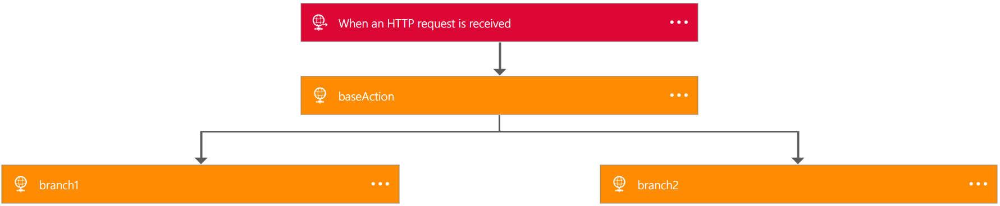

<properties 
    pageTitle="Verfassen Sie Logik App Definitionen | Microsoft Azure" 
    description="Erfahren Sie, wie die JSON-Definition für Logik apps schreiben" 
    authors="jeffhollan" 
    manager="erikre" 
    editor="" 
    services="logic-apps" 
    documentationCenter=""/>

<tags
    ms.service="logic-apps"
    ms.workload="integration"
    ms.tgt_pltfrm="na"
    ms.devlang="na"
    ms.topic="article"
    ms.date="07/25/2016"
    ms.author="jehollan"/>
    
# <a name="author-logic-app-definitions"></a>Autor Logik App Definitionen
In diesem Thema veranschaulicht, wie [Azure Logik Apps](app-service-logic-what-are-logic-apps.md) Definitionen, also eine einfache, deklaratives JSON-Sprache. Wenn Sie noch nicht getan, schauen Sie sich [zum Erstellen einer neuen Logik app](app-service-logic-create-a-logic-app.md) zuerst. Sie können auch den [vollständigen Referenzmaterial der Definitionssprache auf der MSDN-](http://aka.ms/logicappsdocs)lesen.

## <a name="several-steps-that-repeat-over-a-list"></a>Mehrere Schritte, die über eine Liste wiederholen

Sie können den [Typ Foreach](app-service-logic-loops-and-scopes.md) zum Wiederholen über ein Array von bis zu 10 k Elemente, und führen eine Aktion für jede nutzen.

## <a name="a-failure-handling-step-if-something-goes-wrong"></a>Einen Schritt Fehlerbehandlung, wenn ein Problem auftritt

Möchten Sie häufig einen *Schritt Behebung* schreiben können – Logik, die ausgeführt wird, wenn Fehler bei **und nur, wenn**eine oder mehrere der Ihre Anrufe,. In diesem Beispiel wir sind Abrufen von Daten aus einer Vielzahl von Stellen, wenn der Anruf fehlschlägt, möchte aber zum Übermitteln einer Nachricht an einen anderen, damit ich später nach unten, dass der Ausfall nachverfolgen können:  

```
{
    "$schema": "https://schema.management.azure.com/providers/Microsoft.Logic/schemas/2016-06-01/workflowdefinition.json#",
    "contentVersion": "1.0.0.0",
    "parameters": {
    },
    "triggers": {
        "manual": {
            "type": "manual"
        }
    },
    "actions": {
        "readData": {
            "type": "Http",
            "inputs": {
                "method": "GET",
                "uri": "http://myurl"
            }
        },
        "postToErrorMessageQueue": {
            "type": "ApiConnection",
            "inputs": "...",
            "runAfter": {
                "readData": ["Failed"]
            }
        }
    },
    "outputs": {}
}
```

Umso wiederzuverwenden der `runAfter` -Eigenschaft an die `postToErrorMessageQueue` sollten nur nach Ausführen `readData` **fehlgeschlagen**ist.  Dies kann auch eine Liste der möglichen Werte sein, also `runAfter` könnte `["Succeeded", "Failed"]`.

Schließlich, da Sie jetzt den Fehler behandelt haben, markieren Sie wir nicht mehr ausführen als **fehlgeschlagen**. Wie Sie hier sehen können, denn dieser Instanz **erfolgreich beendet** , obwohl Sie einen Schritt fehlgeschlagen, habe ich den Schritt, um diesen Fehler zu behandeln.

## <a name="two-or-more-steps-that-execute-in-parallel"></a>Zwei (oder mehr) Schritte, die parallel ausgeführt werden soll.

Mehrere Aktionen Ausführung parallel, haben die `runAfter` muss Eigenschaft zur Laufzeit entspricht. 

```
{
    "$schema": "https://schema.management.azure.com/providers/Microsoft.Logic/schemas/2016-06-01/workflowdefinition.json#",
    "contentVersion": "1.0.0.0",
    "parameters": {},
    "triggers": {
        "manual": {
            "type": "manual"
        }
    },
    "actions": {
        "readData": {
            "type": "Http",
            "inputs": {
                "method": "GET",
                "uri": "http://myurl"
            }
        },
        "branch1": {
            "type": "Http",
            "inputs": "...",
            "runAfter": {
                "readData": ["Succeeded"]
            }
        },
        "branch2": {
            "type": "Http",
            "inputs": "...",
            "runAfter": {
                "readData": ["Succeeded"]
            }
        }
    },
    "outputs": {}
}
```

Wie im Beispiel oben beide `branch1` und `branch2` festgelegt sind, dass nach dem Ausführen `readData`. Daher werden beide der folgenden Verzweigungen parallel ausführen:



Sie können sehen, dass der Zeitstempel für beide Verzweigungen identisch ist. 

## <a name="join-two-parallel-branches"></a>Teilnehmen an zwei parallele Verzweigungen

Sie können zwei Aktionen, die festgelegt wurden, parallel ausführen durch Hinzufügen von Elementen zu teilnehmen die `runAfter` Eigenschaft, die über ähnelt.

```
{
    "$schema": "https://schema.management.azure.com/providers/Microsoft.Logic/schemas/2016-04-01-preview/workflowdefinition.json#",
    "actions": {
        "readData": {
            "inputs": {
                "method": "GET",
                "uri": "http://myurl"
            },
            "runAfter": {},
            "type": "Http"
        },
        "branch1": {
            "inputs": {
                "method": "GET",
                "uri": "http://myurl"
            },
            "runAfter": {
                "readData": [
                    "Succeeded"
                ]
            },
            "type": "Http"
        },
        "branch2": {
            "inputs": {
                "method": "GET",
                "uri": "http://myurl"
            },
            "runAfter": {
                "readData": [
                    "Succeeded"
                ]
            },
            "type": "Http"
        },
        "join": {
            "inputs": {
                "method": "GET",
                "uri": "http://myurl"
            },
            "runAfter": {
                "branch1": [
                    "Succeeded"
                ],
                "branch2": [
                    "Succeeded"
                ]
            },
            "type": "Http"
        }
    },
    "contentVersion": "1.0.0.0",
    "outputs": {},
    "parameters": {},
    "triggers": {
        "manual": {
            "inputs": {
                "schema": {}
            },
            "kind": "Http",
            "type": "Request"
        }
    }
}
```


## <a name="mapping-items-in-a-list-to-some-different-configuration"></a>Zuordnen von Elementen in einer Liste zu einige andere Konfiguration

Anschließend wird angenommen, dass wir vollständig unterschiedliche Inhalte abhängig von einem Wert einer Eigenschaft abrufen möchten. Erstellen wir eine Karte Werte an Ziele als Parameter:  

```
{
    "$schema": "https://schema.management.azure.com/providers/Microsoft.Logic/schemas/2016-06-01/workflowdefinition.json#",
    "contentVersion": "1.0.0.0",
    "parameters": {
        "specialCategories": {
            "defaultValue": ["science", "google", "microsoft", "robots", "NSA"],
            "type": "Array"
        },
        "destinationMap": {
            "defaultValue": {
                "science": "http://www.nasa.gov",
                "microsoft": "https://www.microsoft.com/en-us/default.aspx",
                "google": "https://www.google.com",
                "robots": "https://en.wikipedia.org/wiki/Robot",
                "NSA": "https://www.nsa.gov/"
            },
            "type": "Object"
        }
    },
    "triggers": {
        "manual": {
            "type": "manual"
        }
    },
    "actions": {
        "getArticles": {
            "type": "Http",
            "inputs": {
                "method": "GET",
                "uri": "https://ajax.googleapis.com/ajax/services/feed/load?v=1.0&q=http://feeds.wired.com/wired/index"
            },
            "conditions": []
        },
        "getSpecialPage": {
            "type": "Http",
            "inputs": {
                "method": "GET",
                "uri": "@parameters('destinationMap')[first(intersection(item().categories, parameters('specialCategories')))]"
            },
            "conditions": [{
                "expression": "@greater(length(intersection(item().categories, parameters('specialCategories'))), 0)"
            }],
            "forEach": "@body('getArticles').responseData.feed.entries"
        }
    }
}
```

In diesem Fall wir zunächst eine Liste von Artikeln, und klicken Sie dann im zweite Schritt sucht in einer Zuordnung, basierend auf der Kategorie, die als Parameter, welche URL zum Abrufen des Inhalts von definiert wurde. 

Zwei Elemente hier achten: die [`intersection()`](https://msdn.microsoft.com/library/azure/mt643789.aspx#intersection) Funktion wird verwendet, um zu überprüfen, um festzustellen, ob die Kategorie stimmt mit einem der bekannten Kategorien definiert. Zweites, sobald wir die Kategorie abrufen, wir können ziehen Sie das Element der Karte mit eckigen Klammern: `parameters[...]`. 

## <a name="working-with-strings"></a>Arbeiten mit Zeichenfolgen

Es gibt verschiedene Funktionen, die zum Bearbeiten der Zeichenfolge verwendet werden können. Sehen wir uns ein Beispiel, in dem wir haben eine Zeichenfolge, die wir an einem System übergeben möchten, aber wir sind nicht sicher, dass Zeichen Codierung ordnungsgemäß verarbeitet werden. Eine Möglichkeit besteht darin, base64 diese Zeichenfolge codieren. Jedoch vermieden werden sollten in einer URL Escapezeichen nun wir einige Zeichen zu ersetzen. 

Wir möchten auch eine Teilzeichenfolge von der der Reihenfolge der benennen, da die ersten 5 Zeichen nicht verwendet werden.

```
{
    "$schema": "https://schema.management.azure.com/providers/Microsoft.Logic/schemas/2016-06-01/workflowdefinition.json#",
    "contentVersion": "1.0.0.0",
    "parameters": {
        "order": {
            "defaultValue": {
                "quantity": 10,
                "id": "myorder1",
                "orderer": "NAME=Stèphén__Šīçiłianö"
            },
            "type": "Object"
        }
    },
    "triggers": {
        "manual": {
            "type": "manual"
        }
    },
    "actions": {
        "order": {
            "type": "Http",
            "inputs": {
                "method": "GET",
                "uri": "http://www.example.com/?id=@{replace(replace(base64(substring(parameters('order').orderer,5,sub(length(parameters('order').orderer), 5) )),'+','-') ,'/' ,'_' )}"
            }
        }
    },
    "outputs": {}
}
```

Arbeiten auf inside out:

1. Abrufen der [`length()`](https://msdn.microsoft.com/library/azure/mt643789.aspx#length) des Auftraggebers des Namens, gibt dies wieder die Gesamtzahl der Zeichen

2. Subtrahieren von 5 (da wir eine kürzere Zeichenfolge möchten)

3. Machen Sie tatsächlich die [`substring()`](https://msdn.microsoft.com/library/azure/mt643789.aspx#substring) . Zunächst am Index `5` und den Rest der Zeichenfolge wechseln.

4. Diese Teilzeichenfolge zum Konvertieren einer [`base64()`](https://msdn.microsoft.com/library/azure/mt643789.aspx#base64) Zeichenfolge

5. [`replace()`](https://msdn.microsoft.com/library/azure/mt643789.aspx#replace)alle der `+` mit Zeichen`-`

6. [`replace()`](https://msdn.microsoft.com/library/azure/mt643789.aspx#replace)alle der `/` mit Zeichen`_`

## <a name="working-with-date-times"></a>Arbeiten mit Datum Zeiten

Zeitangaben können nützlich sein, besonders, wenn Sie versuchen, Daten aus einer Datenquelle abrufen, die die **Trigger**nicht unterstützt.  Zeitangaben können Sie auch ermitteln, wie lange die verschiedenen Schritte aufzeichnen sind. 

```
{
    "$schema": "https://schema.management.azure.com/providers/Microsoft.Logic/schemas/2016-06-01/workflowdefinition.json#",
    "contentVersion": "1.0.0.0",
    "parameters": {
        "order": {
            "defaultValue": {
                "quantity": 10,
                "id": "myorder1"
            },
            "type": "Object"
        }
    },
    "triggers": {
        "manual": {
            "type": "manual"
        }
    },
    "actions": {
        "order": {
            "type": "Http",
            "inputs": {
                "method": "GET",
                "uri": "http://www.example.com/?id=@{parameters('order').id}"
            }
        },
        "timingWarning": {
            "actions" {
                "type": "Http",
                "inputs": {
                    "method": "GET",
                    "uri": "http://www.example.com/?recordLongOrderTime=@{parameters('order').id}&currentTime=@{utcNow('r')}"
                },
                "runAfter": {}
            }
            "expression": "@less(actions('order').startTime,addseconds(utcNow(),-1))"
        }
    },
    "outputs": {}
}
```

In diesem Beispiel werden Extrahieren der `startTime` der im vorherigen Schritt. Wir werden beim Abrufen der aktuellen Uhrzeit und eine Sekunde Abzug:[`addseconds(..., -1)`](https://msdn.microsoft.com/library/azure/mt643789.aspx#addseconds) (Sie können andere Zeiteinheiten wie `minutes` oder `hours`). Schließlich können wir diese beiden Werte vergleichen. Ist die erste kleiner Ausdruck als die zweite, und klicken Sie dann bedeutet dies, dass mehr als eine Sekunde abgelaufen ist, da die Reihenfolge ersten wurde platziert. 

Beachten Sie auch, dass wir Zeichenfolge Formatierungsprogramme zum Formatieren von Datumswerten verwenden können: in der Abfragezeichenfolge, die ich mit [`utcnow('r')`](https://msdn.microsoft.com/library/azure/mt643789.aspx#utcnow) können Sie die RFC1123 zu gelangen. Alle Datum Formatierung [auf MSDN beschrieben ist](https://msdn.microsoft.com/library/azure/mt643789.aspx#utcnow). 

## <a name="using-deployment-time-parameters-for-different-environments"></a>Zeitpunkt der Bereitstellung Parameter verwenden für die verschiedenen Umgebungen

Es ist einen Bereitstellung Lebenszyklus haben, müssen Sie eine Entwicklungsumgebung, staging-Umgebung, und klicken Sie dann einer Umgebung für die Herstellung üblich. Alle diese Sie möglicherweise die gleiche Definition, sondern verwenden Sie andere Datenbanken, z. b. Ebenso sollten Sie die gleiche Definition über viele verschiedener Regionen für hohe Verfügbarkeit verwenden, aber jede Instanz app Logik zur Datenbank des Bereichs sprechen werden soll. 

Beachten Sie, dass dies sich unterscheidet von den verschiedene Parametern zur *Laufzeit*für aufzeichnen, sollten Sie verwenden die `trigger()` funktionieren wie über Hervorhebung. 

Sie können eine sehr einfache Definition, wie diese starten:

```
{
    "$schema": "https://schema.management.azure.com/providers/Microsoft.Logic/schemas/2016-06-01/workflowdefinition.json#",
    "contentVersion": "1.0.0.0",
    "parameters": {
        "uri": {
            "type": "string"
        }
    },
    "triggers": {
        "manual": {
            "type": "manual"
        }
    },
    "actions": {
        "readData": {
            "type": "Http",
            "inputs": {
                "method": "GET",
                "uri": "@parameters('uri')"
            }
        }
    },
    "outputs": {}
}
```

Klicken Sie dann in der tatsächlichen `PUT` anfordern für die app Logik können Sie den Parameter bereitstellen `uri`. Beachten Sie, wie es ist nicht mehr ein Standardwert aus, die für diesen Parameter in der app-Nutzlast Logik erforderlich ist:

```
{
    "properties": {},
        "definition": {
          // Use the definition from above here
        },
        "parameters": {
            "connection": {
                "value": "https://my.connection.that.is.per.enviornment"
            }
        }
    },
    "location": "westus"
}
``` 

In jeder Umgebung kann dann für einen anderen Wert Bereitstellen der `connection` Parameter. 

Finden Sie die [REST-API-Dokumentation](https://msdn.microsoft.com/library/azure/mt643787.aspx) für alle Optionen, die Sie für das Erstellen und Verwalten von apps Logik haben. 
