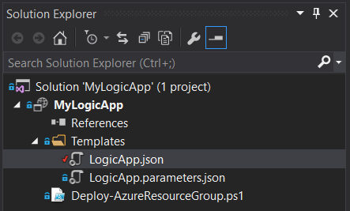

<properties 
    pageTitle="Erstellen von Logik Apps in Visual Studio | Microsoft Azure" 
    description="Erstellen eines Projekts in Visual Studio erstellen und Bereitstellen Ihrer app Logik." 
    authors="jeffhollan" 
    manager="erikre" 
    editor="" 
    services="logic-apps" 
    documentationCenter=""/>

<tags
    ms.service="logic-apps"
    ms.workload="integration"
    ms.tgt_pltfrm="na"
    ms.devlang="na"
    ms.topic="article"
    ms.date="10/18/2016"
    ms.author="jehollan"/> 
    
# Erstellen und Bereitstellen von Logik Apps in Visual Studio

Obwohl das [Azure-Portal](https://portal.azure.com/) Ihnen eine hervorragende Möglichkeit entwerfen und Verwalten Ihrer apps Logik, sollten Sie auch entwerfen und Ihre app Logik Visual Studio stattdessen bereitstellen.  Logik Apps gehört zum Konfigurieren eine Rich-Tools für Visual Studio dem Sie eine Logik app mithilfe des Designers erstellen können, keine Bereitstellung und Automatisierung Vorlagen und in jeder Umgebung bereitstellen.  

## Installationsschritte

Nachfolgend finden Sie die Schritte zum Installieren und Konfigurieren von Visual Studio-Tools für die Logik Apps.

### Erforderliche Komponenten

- [Visual Studio 2015](https://www.visualstudio.com/downloads/download-visual-studio-vs.aspx)
- [Aktuelle Azure SDK](https://azure.microsoft.com/downloads/) (2.9.1 oder höher)
- [Azure PowerShell] (https://github.com/Azure/azure-powershell#installation)
- Zugriff auf das Web beim Verwenden des eingebetteten-Designers

### Installieren von Visual Studio-Tools für Logik Apps

Sobald Sie die Software installiert haben, 

1. Öffnen Sie Visual Studio 2015 im Menü **Extras** , und wählen Sie **Extensions und Updates**
1. Wählen Sie die Kategorie **Online** online suchen
1. Suchen Sie nach **Apps Logik** der **Azure Logik Apps-Tools für Visual Studio** angezeigt wird
1. Klicken Sie auf die Schaltfläche " **Download** " zum Herunterladen und installieren die Erweiterung
1. Starten Sie Visual Studio nach der installation

> [AZURE.NOTE] Sie können auch die Erweiterung direkt aus [diesen Link](https://visualstudiogallery.msdn.microsoft.com/e25ad307-46cf-412e-8ba5-5b555d53d2d9) herunterladen.

Nach der Installation des Projekts Azure Ressourcengruppe mit dem Logik App-Designer verwenden können.

## Erstellen eines Projekts

1. Wechseln Sie im Menü **Datei** , und wählen Sie **neu** >  **Projekt** (oder wechseln Sie zum **Hinzufügen** und wählen Sie dann auf **Neues Projekt** , um es in eine vorhandene Lösung hinzufügen):  

1. Klicken Sie im Dialogfeld Suchen Sie **Cloud**, und wählen Sie dann auf **Azure Ressourcengruppe**. Geben Sie einen **Namen** ein, und klicken Sie dann auf **OK**.
    

1. Wählen Sie die Vorlage **Logik app** aus. Dadurch wird eine leere Logik app Bereitstellungsvorlage zunächst erstellt.
    

1. Wenn Sie Ihre **Vorlage**ausgewählt haben, drücken Sie **OK**.

    Jetzt wird Projekt app Logik zu Ihrer Lösung hinzugefügt. Datei mit dem Explorer Lösung sollte angezeigt werden:  

    

## Verwenden des Logik App-Designers

Nachdem Sie ein Projekt Azure Ressourcengruppe, die eine app Logik enthält haben, können Sie den Designer in Visual Studio zur Unterstützung bei der Erstellung des Workflows öffnen.  Der Designer erfordert Verbindung zum Internet, um die Abfrage die Verbinder für verfügbaren Eigenschaften und Daten (beispielsweise, wenn den Verbinder Dynamics CRM Online verwenden, Designer wird eine Abfrage Ihrer CRM-Instanz aus, um die Liste der verfügbaren benutzerdefinierte und Standardeigenschaften).

1. Mit der rechten Maustaste auf die `<template>.json` Datei, und wählen Sie **Öffnen mit Logik App-Designer** (oder `Ctrl+L`)
1. Wählen Sie das Abonnement, Ressourcengruppe und einen Speicherort für die Vorlage für die Bereitstellung
    - Es ist wichtig, beachten Sie, dass beim Entwerfen einer app Logik **API Verbindung** Ressourcen während des Entwurfs für Eigenschaften Abfragen erstellen.  Die Ressourcengruppe ausgewählt werden die Ressourcengruppe verwendet, um diese Verbindungen-Entwurfszeit zu erstellen.  Sie können anzeigen oder alle Verbindungen API vertraut Azure-Portal an, und Suchen nach **API Verbindungen**zu ändern.
    
1. Der Designer Rendern sollte basierend auf der Definition in der `<template>.json` Datei.
1. Sie können jetzt erstellen und Ihre app Logik entwerfen und Änderungen werden in der Vorlage für die Bereitstellung aktualisiert.
    

Außerdem sehen Sie `Microsoft.Web/connections` Ressourcen, die die Ressourcendatei für alle Verbindungen für die app Logik Funktion erforderlichen hinzugefügt werden.  Diese Verbindungseigenschaften können nach der Bereitstellung von in- **API Verbindungen** Azure-Portal festlegen, wenn Sie bereitstellen, und verwaltet werden.

### Wechseln zu den JSON-Code-Ansicht

Sie können die Registerkarte **Code-Ansicht** auf den unteren Rand des Designers zum Umschalten auf die JSON-Darstellung der app Logik auswählen.  Maustaste wieder zu der vollständigen JSON-Ressource wechseln, die `<template>.json` Datei und dann auf **Öffnen**.

### Speichern die app Logik

Sie können die app Logik im jederzeit über die Schaltfläche " **Speichern** " Speichern oder `Ctrl+S`.  Wenn es Fehler Logik App zur Zeit, die Sie speichern, werden sie im Fenster **Ausgaben** von Visual Studio angezeigt.

## Bereitstellen von der app Logik

Nachdem Sie Ihre app konfiguriert haben, können Sie schließlich direkt in Visual Studio in nur wenigen Schritten bereitstellen. 

1. Mit der rechten Maustaste auf das Projekt in der Lösung-Explorer, und wechseln Sie zum **Bereitstellen** > **Neue Bereitstellung...** 
     

2. Sie werden aufgefordert, Anmeldung bei Ihrer Azure-Abonnements. 

3. Jetzt müssen Sie die Details der Ressourcengruppe auswählen, die Sie die app Logik bereitstellen möchten. 
    

     > [AZURE.NOTE]    Achten Sie darauf, um die richtigen Vorlage und Parameter-Dateien für die Ressourcengruppe (beispielsweise wenn Sie in einer Umgebung für die Herstellung bereitstellen, wählen Sie die Datei der Herstellung werden soll) zu markieren. 
4. Wählen Sie die Schaltfläche bereitstellen
 
    
6. Der Status der Bereitstellung wird im **Ausgabefenster (möglicherweise müssen **Azure Provisioning**auswählen.** 
    

Sie können in der Zukunft überarbeiten Ihre app Logik im Datenquellen-Steuerelement und verwenden Sie Visual Studio bereitstellen neuere Versionen. 

> [AZURE.NOTE] Wenn Sie die Definition der Azure-Portal direkt ändern, wird das nächste Mal von Visual Studio diese Änderungen bereitstellen überschrieben.

## Nächste Schritte

- Um mit Logik Apps anzufangen, führen Sie das Lernprogramm [Erstellen Sie eine App Logik](app-service-logic-create-a-logic-app.md) aus.  
- [Allgemeine Beispiele anzeigen und Szenarien](app-service-logic-examples-and-scenarios.md)
- [Sie können Automatisieren von Geschäftsprozessen mit Logik Apps](http://channel9.msdn.com/Events/Build/2016/T694) 
- [Erfahren Sie, wie Ihre Systeme mit Logik Apps integriert werden soll.](http://channel9.msdn.com/Events/Build/2016/P462)