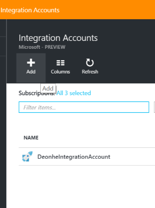
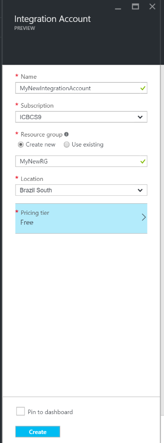
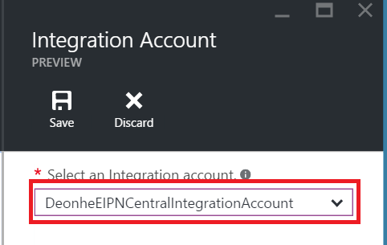

<properties 
    pageTitle="Übersicht über die Integration von Konten und der Enterprise-Integration Pack | Microsoft Azure-App-Verwaltungsdienst | Microsoft Azure" 
    description="Erfahren Sie alles über Integration Konten, die Enterprise-Integration Pack und Logik apps" 
    services="logic-apps" 
    documentationCenter=".net,nodejs,java"
    authors="msftman" 
    manager="erikre" 
    editor="cgronlun"/>

<tags 
    ms.service="logic-apps" 
    ms.workload="integration" 
    ms.tgt_pltfrm="na" 
    ms.devlang="na" 
    ms.topic="article" 
    ms.date="07/08/2016" 
    ms.author="deonhe"/>

# Übersicht über die Integration von Konten

## Was ist ein Integration-Konto?
Ein Konto Integration ist ein Azure-Konto, mit dem Enterprise-Integration apps Elemente, einschließlich Schemas, Karten, Zertifikate, Partner und Vereinbarungen verwalten kann. Ein Integration-Konto verwenden, um ein Schema, Karte oder das Zertifikat zugreifen, beispielsweise müssen alle Integration-app, die Sie erstellen.

## Erstellen Sie ein Konto integration 
1. Wählen Sie **Durchsuchen**   
  
2. Geben Sie in das Suchfeld der Filters **Integration** , und wählen Sie **Integration Konten** aus der Liste der Suchergebnisse     
   
3. Wählen Sie die Schaltfläche " *Hinzufügen* " aus dem Menü am oberen Rand der Seite      
  
4. Geben Sie den **Namen**ein, wählen Sie das **Abonnement** zu verwenden, Erstellen einer neuen **Ressourcengruppe** oder wählen Sie eine vorhandene Ressourcengruppe aus, wählen Sie einen **Speicherort** , wo Ihr Konto Integration wird gehostet werden, wählen Sie eine **Ebene Preise**und wählen Sie die Schaltfläche **Erstellen** .   

  An diesem Punkt wird das Konto Integration in den Speicherort bereitgestellt werden, die Sie ausgewählt haben. Dies sollte innerhalb einer Minute abgeschlossen.    
  
5. Aktualisieren Sie die Seite. Ihr neues Integration Konto aufgeführt wird angezeigt. Herzlichen Glückwunsch!  
 

## Verknüpfen eine Firma Integration zu einer app Logik
In der Reihenfolge für Ihre apps Logik zum Zugriff auf Karten, Schemas, Agreements und andere Elemente, die sich in Ihrem Konto Integration befinden, müssen Sie zuerst das Konto Integration zu Ihrer Anwendung Logik verknüpfen.

### Hier sind die Schritte zum Verknüpfen von einem Konto Integration zu einer app Logik 

#### Erforderliche Komponenten
- Ein Konto integration
- Eine app Logik

>[AZURE.NOTE]Achten Sie darauf, dass Ihr Integration-Konto und Logik app **derselben Azure Stelle** sind, bevor Sie beginnen

1. Wählen Sie **Verknüpfung** aus dem Menü der app Logik  
   
2. Wählen Sie das **Konto Integration** Element aus dem Blade Einstellungen  
   
3. Wählen Sie das gewünschte link zu der app aus, **Wählen Sie ein Konto Integration** Dropdown-Listenfeld Logik Integration-Konto  
   
4. Speichern Sie Ihre Arbeit  
   
5. Es wird eine Benachrichtigung angezeigt, die angibt, dass Ihr Konto Integration zu Ihrer Anwendung Logik verknüpft wurde, und dass alle Elemente in Ihrem Konto Integration jetzt Ihre app Logik zur Verfügung stehen.  
   

Jetzt, da Ihr Konto Integration zu Ihrer Anwendung Logik verknüpft ist, können Sie Sie wechseln Sie zu Ihrer Anwendung Logik und B2B Verbinder wie die XML-Überprüfung, Flatfile/codieren oder Transformation verwenden, um apps mit B2B Features zu erstellen.  
    
## So löschen Sie ein Konto Integration?
1. Wählen Sie **Durchsuchen**  
    
2. Geben Sie in das Suchfeld der Filters **Integration** , und wählen Sie **Integration Konten** aus der Liste der Suchergebnisse     
   
3. Wählen Sie das **Konto Integration** , die Sie löschen möchten.  
  
4. Wählen Sie den Link **Löschen** , der Sie im Menü befindet   
  
5. Bestätigen Sie das    

## So verschieben Sie ein Konto Integration?
Sie können ein Konto Integration einfach ein neues Abonnement zu einer neuen Ressourcengruppe verschieben. Wenn Sie Ihr Konto Integration wechseln müssen, gehen Sie folgendermaßen vor:

>[AZURE.IMPORTANT] Sie müssen alle Skripts, um die neue Ressourcen-IDs zu verwenden, nachdem Sie ein Konto Integration verschieben aktualisieren.

1. Wählen Sie **Durchsuchen**  
    
2. Geben Sie in das Suchfeld der Filters **Integration** , und wählen Sie **Integration Konten** aus der Liste der Suchergebnisse     
   
3. Wählen Sie das **Konto Integration** , die Sie löschen möchten.  
  
4. Wählen Sie den Link mit **Verschieben** , der Sie im Menü befindet   
  
5. Bestätigen Sie das    

## Nächste Schritte
- [Erfahren Sie mehr über das Enterprise-Integration Pack] (./app-service-logic-enterprise-integration-overview.md "Erfahren Sie mehr über Pack für Enterprise-Integration")  
- [Erfahren Sie mehr über agreements] (./app-service-logic-enterprise-integration-agreements.md "Erfahren Sie mehr über Enterprise-Integration Verträgen")  

 