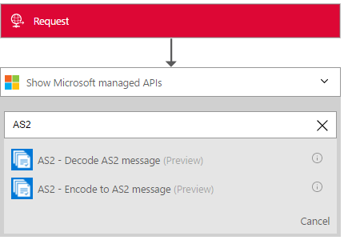

<properties 
    pageTitle="Erfahren Sie mehr über Enterprise Integration Pack entschlüsseln AS2 Nachricht Connctor | Microsoft Azure-App-Verwaltungsdienst | Microsoft Azure" 
    description="Informationen Sie zum Verwenden von Partner mit der apps Enterprise Integration Pack und Logik" 
    services="logic-apps" 
    documentationCenter=".net,nodejs,java"
    authors="padmavc" 
    manager="erikre" 
    editor=""/>

<tags 
    ms.service="logic-apps" 
    ms.workload="integration" 
    ms.tgt_pltfrm="na" 
    ms.devlang="na" 
    ms.topic="article" 
    ms.date="08/15/2016" 
    ms.author="padmavc"/>

# Erste Schritte mit AS2 Nachricht entschlüsseln

Verbinden Sie mit entschlüsseln AS2 Nachricht Sicherheit und Zuverlässigkeit beim Übertragen von Nachrichten herstellen. Es stellt digitalen Signieren, entschlüsseln und Empfangsbestätigungen über der Nachricht Anordnung Benachrichtigungen (MDN).

## Herstellen der Verbindungs

### Erforderliche Komponenten

* Ein Azure-Konto; Sie können ein [kostenloses Konto](https://azure.microsoft.com/free) erstellen.

* AS2 entschlüsseln Nachricht Verbinder verwenden, ist eine Integration-Konto erforderlich. Anzeigen von Details zum Erstellen eines [Integration-Konto](./app-service-logic-enterprise-integration-create-integration-account.md), [Partnern](./app-service-logic-enterprise-integration-partners.md) und eine [AS2 Vertrag](./app-service-logic-enterprise-integration-as2.md)

### Verbinden Sie mit entschlüsseln AS2-Nachricht mithilfe der folgenden Schritte:

1. [Erstellen einer App Logik](./app-service-logic-create-a-logic-app.md) enthält ein Beispiel.

2. Alle Trigger keinen dieser Verbinder. Verwenden Sie andere Trigger, um die App Logik, wie z. B. eine Anforderung Trigger starten.  Hinzufügen eines Triggers im Logik App-Designer und eine Aktion hinzufügen.  Wählen Sie Microsoft anzeigen verwalteten APIs in der Dropdown-Liste, und geben Sie "AS2" in das Suchfeld ein.  Wählen Sie AS2 – AS2 Nachricht entschlüsseln

    

3. Wenn Sie alle Verbindungen mit Integration Konto zuvor erstellt haben, werden Sie für die Details der Verbindung aufgefordert.

    

4. Geben Sie die Details der Integration-Konto an.  Eigenschaften mit einem Sternchen sind erforderlich

  	| Eigenschaft   | Details |
  	| --------   | ------- |
  	| Verbindungsnamen *    | Geben Sie einen beliebigen Namen für die Verbindung |
  	| Integration Konto * | Geben Sie den Namen des Kontos Integration. Achten Sie darauf, dass Ihr Integration-Konto und Logik app an derselben Stelle Azure sind |

    Sobald Sie fertig sind, suchen Sie die Verbindungsdetails ähnlich wie der folgende

    

5. Wählen Sie **Erstellen**
    
6. Beachten Sie, dass die Verbindung erstellt wurde.  Jetzt, fahren Sie mit den anderen Schritten in der App Logik

     

7. Wählen Sie Text und Überschriften aus Anforderung Ausgaben

     

## Die AS2 entschlüsseln geschieht Folgendes

* Verarbeitet AS2/HTTP-Header
* Überprüft die Signatur (falls konfiguriert)
* Die Nachrichten entschlüsselt, (falls konfiguriert)
* Die Nachricht dekomprimiert, (falls konfiguriert)
* Gleicht einer empfangenen MDN mit der ursprünglichen ausgehenden Nachricht
* Aktualisiert und Datensätzen in der Datenbank Nachweisbarkeit entspricht
* Schreibt Datensätze für AS2 Statusberichte
* Die Ausgabe Nutzlast Inhalte sind base64-codierte
* Bestimmt, ob ein MDN erforderlich ist, und gibt an, ob die MDN synchroner sollten oder asynchrone auf Konfiguration in AS2-Vertrag basierend
* Generiert ein synchrones oder asynchrones-MDN (auf der Grundlage der Vereinbarung Konfigurationen)
* Legt den Korrelationskoeffizienten Token und Eigenschaften auf die MDN

##Probieren Sie es für sich selbst

Warum nicht Probieren Sie es aus. Klicken Sie auf [hier](https://azure.microsoft.com/documentation/templates/201-logic-app-as2-send-receive/) bereitstellen eine app voll funktionsfähiges Logik der eigenen mit den Logik Apps AS2-Features 

## Nächste Schritte

[Erfahren Sie mehr über das Enterprise-Integration Pack] (./app-service-logic-enterprise-integration-overview.md "Erfahren Sie mehr über Pack für Enterprise-Integration") 