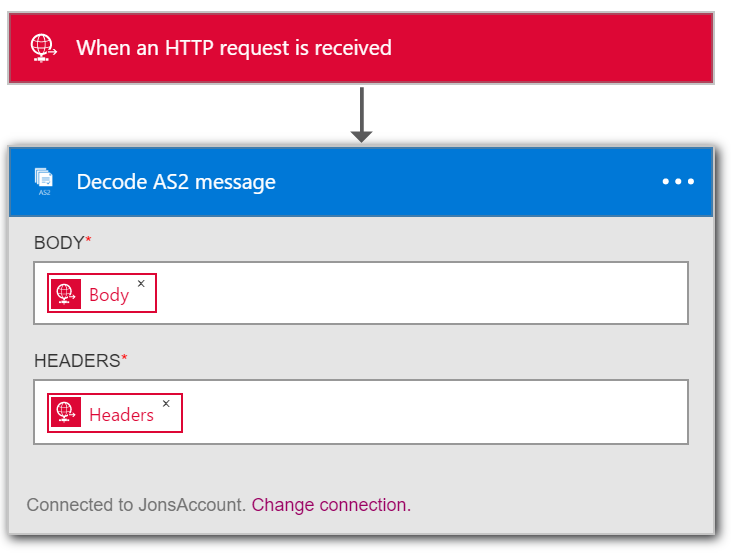
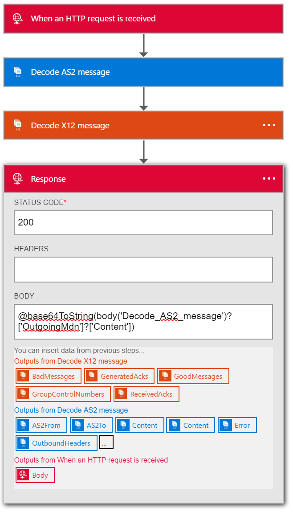

<properties 
    pageTitle="Erstellen von B2B Lösungen mit Enterprise Integration Pack | Microsoft Azure-App-Verwaltungsdienst | Microsoft Azure" 
    description="Informationen Sie zum Empfangen von Daten mit den B2B-Features des Packs Enterprise-Integration" 
    services="logic-apps" 
    documentationCenter=".net,nodejs,java"
    authors="msftman" 
    manager="erikre" 
    editor="cgronlun"/>

<tags 
    ms.service="logic-apps" 
    ms.workload="integration" 
    ms.tgt_pltfrm="na" 
    ms.devlang="na" 
    ms.topic="article" 
    ms.date="07/08/2016" 
    ms.author="deonhe"/>

# Informationen Sie zum Empfangen von Daten mit den B2B-Features des Packs Enterprise-Integration#

## (Übersicht) ##

Dieses Dokument ist Teil der Logik Apps Enterprise Integration Packs. Schauen Sie sich die Übersicht erfahren Sie mehr über die [Funktionen des Enterprise Integration Packs](./app-service-logic-enterprise-integration-overview.md).

## Erforderliche Komponenten ##

Verwenden Sie den AS2 und X12 Aktionen Sprachmodule benötigen Sie ein Konto der Enterprise-Integration

[So erstellen Sie ein Enterprise-Integration-Konto](./app-service-logic-enterprise-integration-accounts.md)

## So verwenden Sie die Logik Apps B2B Verbinder ##

Sobald Sie ein Konto Integration erstellt und Partner hinzugefügt haben und Vereinbarungen, damit Sie die zum Erstellen einer App Logik bereit sind, das einen Business zu Business (B2B) Workflow implementiert.

In diesem Schritt bei Schritt sehen Sie, wie die AS2 und X12 verwendet Aktionen eine Business zu Business Logik App zu erstellen, die Daten von einem Handelspartner empfängt.

1. Erstellen eines neuen app Logik und [Verknüpfen Sie es mit Ihrem Konto Integration](./app-service-logic-enterprise-integration-accounts.md).  
2. Hinzufügen eines Triggers **Anforderung – Wenn ein HTTP-Anforderung empfangen wird** zu Ihrer Anwendung Logik  
  
3. Hinzufügen der Aktion **Entschlüsseln AS2** vom ersten Auswählen eines **eine Aktion hinzufügen**  
  
4. Geben Sie in das Suchfeld der Word- **as2** akzeptieren, um alle Aktionen auf den Filtern, die Sie verwenden möchten.  
  
6. Wählen Sie die Aktion **AS2 - entschlüsseln AS2-Nachricht**  
  
7. Wie dargestellt, fügen Sie im **Textkörper** , die Sie ausführen, werden als Eingabe. Wählen Sie in diesem Beispiel den Hauptteil der HTTP-Anforderung, die die Logik app ausgelöst wurde. Alternativ können Sie einen Ausdruck, um die Überschriften im Feld**Kopfzeilen** Eingabemethoden eingeben:

    @triggerOutputs()['headers']

8. Fügen Sie die **Überschriften** , die für AS2 erforderlich sind. Diese werden im Header HTTP-Anforderung. Wählen Sie in diesem Beispiel die Kopfzeilen der HTTP-Anforderung, die die Logik app ausgelöst wurde.
9. Fügen Sie nun die Aktion entschlüsseln X12 Nachricht, indem Sie das **Hinzufügen einer Aktion** erneut auswählen  
   
10. Geben Sie in das Suchfeld der Word- **X12** akzeptieren, um alle Aktionen auf den Filtern, die Sie verwenden möchten.  
  
11. Wählen Sie aus der **X12-entschlüsseln X12 Nachricht** Aktion, die sie mit der Logik hinzufügen  
  
12. Sie müssen jetzt die Eingabe in diese Aktion angeben, die die Ausgabe der obigen AS2 Aktion werden. Der eigentlichen Nachrichteninhalt befindet sich in einem JSON-Objekt, und base64-codierte ist. Daher müssen Sie einen Ausdruck angeben, wie die Eingabe also Geben Sie den folgenden Ausdruck im Eingabefeld **X12 Plane Datei Nachricht an ENTSCHLÜSSELN**  

    @base64ToString(body('Decode_AS2_message')?['AS2Message']?['Content'])  

13. Dieser Schritt wird die X12 entschlüsseln, Daten von der Handel Partner erhalten haben, und eine Anzahl von Elementen in ein JSON-Objekt ausgegeben werden. Um den Partner wissen, der die Bestätigung der Daten lassen können Sie wieder eine Antwort mit der AS2 Nachricht Anordnung Benachrichtigung (MDN) in eine HTTP-Antwortaktion senden.  
14. Hinzufügen der **Antwort** Aktion durch **Hinzufügen einer Aktion** auswählen   
  
15. Geben Sie in das Suchfeld der Word- **Antwort** akzeptieren, um alle Aktionen auf den Filtern, die Sie verwenden möchten.  
  
16. Wählen Sie die Aktion **Antwort** hinzufügen  
  
17. Festlegen **der Antwort Nachrichtenfeld** mithilfe des folgenden Ausdrucks in der MDN zugreifen, die Ausgabe der Aktion **Entschlüsseln X12 Nachricht**  

    @base64ToString(body('Decode_AS2_message')?['OutgoingMdn']?['Content'])  

  
18. Speichern Sie Ihre Arbeit  
  

Jetzt sind Sie fertig Ihre app B2B Logik einrichten. In einer realen Anwendung, möglicherweise gespeichert werden sollen die decodierten X12 Daten in einer LOB-Anwendung oder einen benutzerdefinierten Datenspeicher. Sie können ganz einfach weitere Aktionen, um die Aktion oder Schreiben von benutzerdefinierten APIs auf, um eine Verbindung mit Ihrer eigenen LOB-Anwendung, und verwenden diese APIs in Ihrer app Logik hinzufügen.

## Features und Verwenden von Fällen ##

- Die AS2 X12 entschlüsseln und Codieren von Aktionen gestattet Ihnen empfangen von Daten aus und Senden von Daten an trading Partner mit Protokolle nach Industriestandard Logik apps verwenden  
- AS2 und X12 können mit oder ohne miteinander Datenaustausch mit Partnern nach Bedarf
- Die Aktionen B2B ganz einfach Partner und Vereinbarungen in das Konto Integration erstellen und diese in einer app Logik nutzen  
- Durch Verlängern der Logik app mit anderen Aktionen können senden und Empfangen von Daten an und von anderen Anwendungen und Dienste wie z. B. Vertrieb  

## Weitere Informationen ##

[Erfahren Sie mehr über das Enterprise-Integration Pack](./app-service-logic-enterprise-integration-overview.md)  