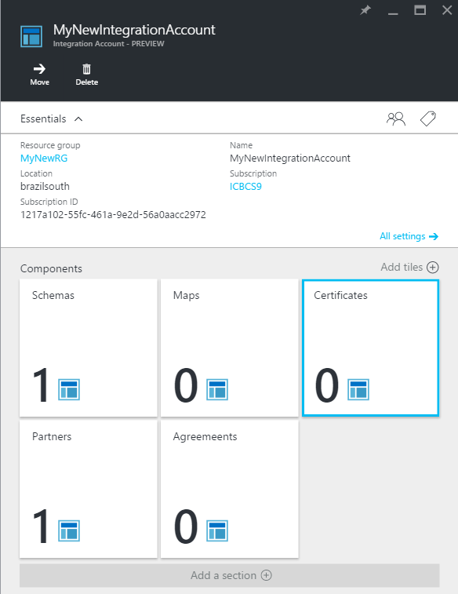

<properties
    pageTitle="Verwendung von Zertifikaten mit Enterprise Integration Pack | Microsoft Azure"
    description="Informationen Sie zum Verwenden von Zertifikaten mit dem Enterprise-Integration Pack und Logik Apps"
    services="logic-apps"
    documentationCenter=".net,nodejs,java"
    authors="msftman"
    manager="erikre"
    editor="cgronlun"/>

<tags
    ms.service="logic-apps"
    ms.workload="integration"
    ms.tgt_pltfrm="na"
    ms.devlang="na"
    ms.topic="article"
    ms.date="09/06/2016"
    ms.author="deonhe"/>

# Erfahren Sie mehr über Zertifikate und Pack für Enterprise-Integration

## (Übersicht)
Enterprise-Integration verwendet Zertifikate B2B Kommunikation gesichert. Sie können in Ihrer Enterprise Integration apps zwei Arten von Zertifikaten verwenden:

- Öffentliche Zertifikate von einer Zertifizierungsstelle (CA) gekauft werden müssen.
- Private Zertifikate aus, die Sie selbst ausgeben können. Diese Zertifikate werden manchmal als selbstsignierten Zertifikaten bezeichnet.

## Was sind Zertifikate?
Zertifikate sind digitale Dokumente zu überprüfen, ob die Identität des den Teilnehmern in elektronische Kommunikation und sichere, die auch Kommunikation.

## Gründe für die Verwendung von Zertifikaten
Manchmal müssen B2B Kommunikation vertraulich behandelt werden. Enterprise-Integration verwendet Zertifikate, um diese Informationen auf zwei Arten sichern:

- Indem Sie den Inhalt von Nachrichten verschlüsseln
- Durch das digitale Signieren von Nachrichten  

## Wie hochladen Sie Zertifikate?

### Öffentliche Zertifikate
Um ein *Zertifikat für Öffentliche* in Ihrer apps Logik mit B2B-Funktionen verwenden zu können, müssen Sie zuerst das Zertifikat in Ihr Konto Integration hochladen. Um ein *selbst signiertes Zertifikat*verwenden zu können, müssen andererseits, Sie zuerst [Azure Schlüssel Tresor](../key-vault/key-vault-get-started.md "erfahren Sie mehr über die Taste Tresor")hochladen.

Nachdem Sie ein Zertifikat hochgeladen haben, ist es zur Verfügung, mit deren Hilfe Sie Ihre Nachrichten B2B zu sichern, wenn Sie ihre Eigenschaften in den [Vereinbarungen](./app-service-logic-enterprise-integration-agreements.md) definieren, die Sie erstellen.  

Hier sind die detaillierten Schritte für das Hochladen Ihrer öffentlichen Zertifikate in Ihr Konto Integration, nach der Anmeldung Azure-Portal an:

1. Wählen Sie **Durchsuchen**.  
      

2. Geben Sie in das Suchfeld der Filters **Integration** , und wählen Sie dann in der Ergebnisliste **Integration-Konten** .     
    

3. Wählen Sie das Integration-Konto, das Sie das Zertifikat hinzufügen möchten.  
      

4.  Wählen Sie die Kachel **Zertifikate** aus.  
    

5. Die **Zertifikate** Blade, das geöffnet wird, wählen Sie die Schaltfläche **Hinzufügen** .
    

6. Geben Sie einen **Namen** für das Zertifikat, und wählen Sie dann auf den Zertifikattyp. (In diesem Beispiel verwendet wir den Zertifikattyp der öffentlichen.) Wählen Sie dann das Ordnersymbol auf der rechten Seite des Textfelds, das **Zertifikat** ein.

7. Wenn die Datei Datumsauswahl geöffnet wird, suchen Sie, und wählen Sie die Zertifikatsdatei, die mit Ihrem Konto Integration hochgeladen werden soll.

8. Wählen Sie das Zertifikat aus, und wählen Sie dann **OK** aus, in der Datei Datumsauswahl. Überprüft, und das Zertifikat bei Ihrem Konto Integration hochlädt.

8. Wählen Sie schließlich die Schaltfläche **OK** klicken Sie auf das Blade **Zertifikat hinzufügen** aus.  
      

9. In wird Sie über eine Minute um eine Benachrichtigung angezeigt, die angibt, dass der Zertifikat Upload abgeschlossen ist.

10. Wählen Sie die Kachel **Zertifikate** aus. Sie sollten das neu hinzugefügte Zertifikat angezeigt werden.  
      

### Private Zertifikate
Sie können in Ihr Konto Integration privaten Zertifikate hochladen, indem Sie die folgenden Schritte aus:  

1. [Hochladen Ihrer privaten Schlüssel zum Schlüssel Tresor] (../key-vault/key-vault-get-started.md "Erfahren Sie mehr über die wichtigsten Tresor").  

    > [AZURE.TIP] Sie müssen das Feature Logik Apps der App-Verwaltungsdienst zum Ausführen von Vorgängen auf-Taste Tresor Azure autorisieren. Sie können die Logik Apps Dienst Tilgungsanteile mithilfe des folgenden PowerShell-Befehls Zugriff gewähren:`Set-AzureRmKeyVaultAccessPolicy -VaultName 'TestcertKeyVault' -ServicePrincipalName '7cd684f4-8a78-49b0-91ec-6a35d38739ba' -PermissionsToKeys decrypt, sign, get, list`  

2. Erstellen Sie ein privates Zertifikat.  

3. Laden Sie das private Zertifikat bei Ihrem Konto Integration hoch.

Nachdem Sie die vorstehenden Schritte ergriffen haben, können Sie das private Zertifikat, Vereinbarungen zu erstellen.

Dies sind die detaillierten Schritte für Ihre privaten Zertifikate in Ihr Konto Integration hochladen, nach der Anmeldung Azure-Portal an:  

1. Wählen Sie **Durchsuchen**.  
        

2. Geben Sie in das Suchfeld der Filters **Integration** , und wählen Sie dann in der Ergebnisliste **Integration-Konten** .     
      

3. Wählen Sie das Integration-Konto, das Sie das Zertifikat hinzufügen möchten.  
      

4. Wählen Sie die Kachel **Zertifikate** aus.  
      

5. Die **Zertifikate** Blade, das geöffnet wird, wählen Sie die Schaltfläche **Hinzufügen** .
    

6. Geben Sie einen **Namen** für das Zertifikat, und wählen Sie dann auf den Zertifikattyp. (In diesem Beispiel verwendet wir den Zertifikattyp der öffentlichen.) Wählen Sie dann das Ordnersymbol auf der rechten Seite des Textfelds, das **Zertifikat** ein.

7. Wenn die Datei Datumsauswahl geöffnet wird, suchen Sie, und wählen Sie die Zertifikatsdatei, die mit Ihrem Konto Integration hochgeladen werden soll.

8. Nachdem Sie das Zertifikat ausgewählt haben, wählen Sie **OK** im Auswahltool für Datei. Diese Aktion prüft das Zertifikat und lädt diese in Ihr Konto Integration.

9. Wählen Sie schließlich die Schaltfläche **OK** klicken Sie auf das Blade **Zertifikat hinzufügen** aus.  
      

10. In wird Sie über eine Minute um eine Benachrichtigung angezeigt, die angibt, dass der Zertifikat Upload abgeschlossen ist.

11. Wählen Sie die Kachel **Zertifikate** aus. Sie sollten das neu hinzugefügte Zertifikat angezeigt werden.
      

Nachdem Sie ein Zertifikat hochgeladen haben, ist es zur Verfügung, mit deren Hilfe Sie Ihre Nachrichten B2B zu sichern, wenn Sie ihre Eigenschaften in [Vereinbarungen](./app-service-logic-enterprise-integration-agreements.md)definieren.  

## Nächste Schritte
- [Erstellen Sie eine Logik app, die B2B-Funktionen verwendet](./app-service-logic-enterprise-integration-b2b.md)  
- [Erstellen eines B2B-Vertrags](./app-service-logic-enterprise-integration-agreements.md)  
- [Erfahren Sie mehr über die Taste Tresor] (../key-vault/key-vault-get-started.md "Erfahren Sie mehr über die wichtigsten Tresor")  
