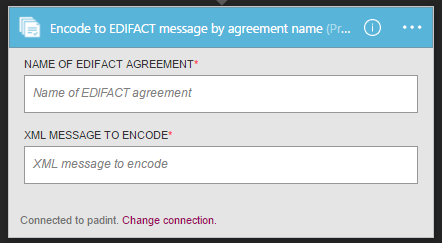
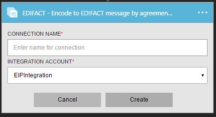
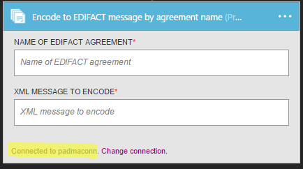
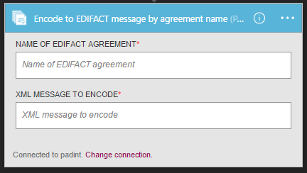
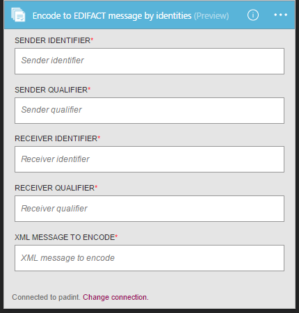

<properties 
    pageTitle="Erfahren Sie mehr über Enterprise Integration Pack codieren EDIFACT Nachricht Connctor | Microsoft Azure-App-Verwaltungsdienst | Microsoft Azure" 
    description="Informationen Sie zum Verwenden von Partner mit der apps Enterprise Integration Pack und Logik" 
    services="logic-apps" 
    documentationCenter=".net,nodejs,java"
    authors="padmavc" 
    manager="erikre" 
    editor=""/>

<tags 
    ms.service="logic-apps" 
    ms.workload="integration" 
    ms.tgt_pltfrm="na" 
    ms.devlang="na" 
    ms.topic="article" 
    ms.date="08/15/2016" 
    ms.author="padmavc"/>

# Erste Schritte mit codieren EDIFACT-Nachricht

Überprüft, ob EDI und Partner-spezifische Eigenschaften 

## Herstellen der Verbindungs

### Erforderliche Komponenten

* Ein Azure-Konto; Sie können ein [kostenloses Konto](https://azure.microsoft.com/free) erstellen.

* Codieren EDIFACT Nachricht Verbinder verwenden, ist eine Integration-Konto erforderlich. Anzeigen von Details zum Erstellen einer [Integration-Konto](./app-service-logic-enterprise-integration-create-integration-account.md), [Partnern](./app-service-logic-enterprise-integration-partners.md) und [EDIFACT Vertrag](./app-service-logic-enterprise-integration-edifact.md)

### Verbinden Sie mit entschlüsseln EDIFACT-Nachricht mithilfe der folgenden Schritte:

1. [Erstellen einer App Logik](./app-service-logic-create-a-logic-app.md) enthält ein Beispiel.

2. Alle Trigger keinen dieser Verbinder. Verwenden Sie andere Trigger, um die App Logik, wie z. B. eine Anforderung Trigger starten.  Hinzufügen eines Triggers im Logik App-Designer und eine Aktion hinzufügen.  Wählen Sie Microsoft anzeigen verwalteten APIs in der Dropdown-Liste, und geben Sie "EDIFACT" in das Suchfeld ein.  Wählen Sie entweder codieren EDIFACT Nachricht namentlich Vertrag oder Codieren von Identitäten EDIFACT-Nachricht ein.

      

3. Wenn Sie alle Verbindungen mit Integration Konto zuvor erstellt haben, werden Sie für die Details der Verbindung aufgefordert.

      

4. Geben Sie die Informationen zur Integration-Konto an.  Eigenschaften mit einem Sternchen sind erforderlich

  	| Eigenschaft | Details |
  	| -------- | ------- |
  	| Verbindungsnamen * | Geben Sie einen beliebigen Namen für die Verbindung |
  	| Integration Konto * | Geben Sie den Namen des Kontos Integration. Achten Sie darauf, dass Ihr Integration-Konto und Logik app an derselben Stelle Azure sind 

    Sobald Sie fertig sind, suchen Sie die Verbindungsdetails ähnlich wie der folgende

    
    
5. Wählen Sie **Erstellen**
    
6. Beachten Sie, dass die Verbindung erstellt wurde

    
    
#### Codieren Sie EDIFACT namentlich Vertrag

7.  Bieten Sie EDIFACT Vertrag Namen und XML-Nachricht codieren.

    
    
#### Codieren von EDIFACT Nachricht durch Identitäten

7. Stellen Sie Sender-ID, Kennung Absender, Empfänger Bezeichner und Empfänger Kennung wie in den Vertrag EDIFACT konfiguriert.  Wählen Sie XML-Nachricht codieren

    
    
## Codieren von EDIFACT bedeutet folgen

* Beheben Sie den Vertrag durch den Abgleich der Absender Kennung und Bezeichner und Empfänger Kennung und Bezeichner
* Serialisiert die EDI Interchange, Konvertieren von XML-codierte Nachrichten in EDI Transaktionssätze im Austausch an.
* Gültig für Transaktion festlegen Header und-Nachspann Segmente
* Generiert eine Interchange Steuerelement Zahl, eine Gruppe Steuerelement Zahl und eine Transaktion festgelegte Steuerelement Anzahl für jeden ausgehenden Austausch
* Trennzeichen in die Nutzlastdaten ersetzt
* Überprüft, ob EDI und Partner-spezifische Eigenschaften
    * Schema Überprüfung der Elemente Transaktion-Set-Daten gegen das Nachrichtenschema.
    * EDI-Überprüfung auf Datenelemente Transaktion-festlegen.
    * Erweiterte Validierung auf Datenelemente Transaktion-set
* Generiert ein XML-Dokument für jede Transaktion.
* Eine Bestätigung technischen und/oder funktionellen anfordert, (falls konfiguriert).
    * Als eine technische Bestätigung zeigt die Nachricht CONTRL Bestätigung der ein Austausch an.
    * Als ein funktionsübergreifendes Bestätigung gibt die Nachricht CONTRL Annahme oder Ablehnung der empfangenen Interchange, einer Gruppe oder einer Nachricht mit einer Liste von Fehlern oder nicht unterstützte Funktionen

## Nächste Schritte

[Erfahren Sie mehr über das Enterprise-Integration Pack] (./app-service-logic-enterprise-integration-overview.md "Erfahren Sie mehr über Pack für Enterprise-Integration") 