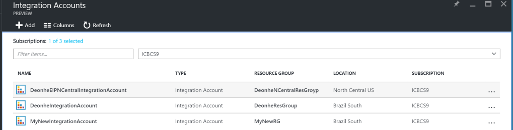
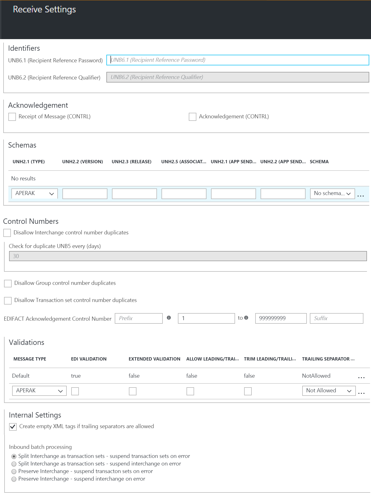

<properties 
    pageTitle="Enterprise-Integration in EDIFACT | Microsoft Azure" 
    description="Erfahren Sie, wie mit EDIFACT Vereinbarungen Logik apps erstellen" 
    services="logic-apps" 
    documentationCenter=".net,nodejs,java"
    authors="jeffhollan" 
    manager="erikre" 
    editor="cgronlun"/>

<tags 
    ms.service="app-service-logic" 
    ms.workload="integration" 
    ms.tgt_pltfrm="na" 
    ms.devlang="na" 
    ms.topic="article" 
    ms.date="07/26/2016" 
    ms.author="jonfan"/>

# Enterprise-Integration in EDIFACT 

> [AZURE.NOTE] Diese Seite enthält die EDIFACT-Features, Logik Apps. Informationen zu X12 finden Sie [hier](app-service-logic-enterprise-integration-x12.md).

## Erstellen eines EDIFACT-Vertrags 
Bevor Sie EDIFACT Nachrichten austauschen können, müssen Sie einen EDIFACT Vertrag erstellen und in Ihr Konto Integration speichern. Die folgenden Schritte führt Sie durch den Vorgang des Erstellens eines EDIFACT-Lizenzvertrag.

### Was müssen erfüllt sein, bevor Sie loslegen
- Ein [Konto Integration](./app-service-logic-enterprise-integration-accounts.md) in Ihr Abonnement Azure definiert  
- Mindestens zwei [Partner](./app-service-logic-enterprise-integration-partners.md) bereits in Ihrem Konto Integration definiert.  

>[AZURE.NOTE]Wenn Sie einen Vertrag erstellen, muss der Inhalt in den Nachrichten, die Sie, die erhalten/senden werden, an und von den Partner den Vertragstyp übereinstimmen.    

Nachdem Sie [ein Konto Integration erstellt](./app-service-logic-enterprise-integration-accounts.md) und [Partner hinzugefügt](./app-service-logic-enterprise-integration-partners.md)haben, können Sie einen EDIFACT Vertrag erstellen, mit folgenden Schritten:  

### Aus Azure Homepage des Portals

Nachdem Sie melden Sie sich bei der [Azure-Portal](http://portal.azure.com "Azure-Portal"):  
1. Wählen Sie im Menü auf der linken Seite **Durchsuchen** .  

>[AZURE.TIP]Wenn Sie den Link **Durchsuchen** angezeigt werden, müssen Sie zuerst das Menü zu erweitern. Wählen Sie zunächst den **Anzeigen des Menüs** Link, der bei befindet oben links im Menü reduzierte.  

    
2. Geben Sie in das Suchfeld der Filters *Integration* ein, und wählen Sie **Integration Konten** aus der Liste der Ergebnisse.       
    
3. Wählen Sie in der **Integration Konten** Blade, das angezeigt wird das Integration-Konto, in dem Sie den Vertrag erstellt werden. Wenn Sie nicht angezeigt werden, eine Integration Konten Listen, [Erstellen Sie eine erste](./app-service-logic-enterprise-integration-accounts.md "All about integration accounts").  
  
4.  Wählen Sie die Kachel **Vereinbarungen** aus. Wenn Sie die Kachel Vereinbarungen angezeigt werden, fügen Sie es zuerst.   
     
5. Wählen Sie die Schaltfläche **Hinzufügen** in den Vereinbarungen Blade, das geöffnet wird.  
  
6. Geben Sie einen **Namen** für Ihr Vertrag und wählen Sie dann den **Vertragstyp** für EDIFACT, **Host Partner**, **Host Identität**, **Gast Partner**, **Gast Identität**, in das Vereinbarungen Blade, das geöffnet wird.  
  
7. Nachdem Sie die Vertrag Eigenschaften festgelegt haben, wählen Sie **Einstellungen erhalten** so konfigurieren, wie Nachrichten, die über dieses Vertrags empfangen werden, behandelt werden sollen.  
8. Das Steuerelement Einstellungen erhalten ist in den folgenden Abschnitten, einschließlich Bezeichnern, Bestätigung, Schemas, Steuerelement Zahlen, Überprüfung, internen Einstellungen und Stapelverarbeitung unterteilt. Konfigurieren Sie diese Eigenschaften basierend auf Ihrer Vereinbarung mit den Partner, die Sie Austauschen von Nachrichten mit werden. Hier ein Überblick über diese Steuerelemente, die so konfiguriert werden, basierend auf wie dieses Vertrags zu identifizieren und eingehende Nachrichten verarbeitet werden soll:  
  
9. Wählen Sie die Schaltfläche **OK** , um die Einstellungen zu speichern.  

### Bezeichner

|Eigenschaft|Beschreibung |
|---|---|
|UNB6.1 (Empfänger Bezug Kennwort)|Geben Sie einen alphanumerischen Wert im Bereich zwischen 1 und 14 Zeichen.|
|UNB6.2 (Empfänger Bezug Kennung)|Geben Sie einen alphanumerischen Wert mit mindestens ein Zeichen und bis zu zwei Zeichen aus.|

### Danksagungen 

|Eigenschaft|Beschreibung |
|----|----|
|Der Empfang einer Nachricht (CONTRL)|Aktivieren Sie dieses Kontrollkästchen, um eine Bestätigung der technischen (CONTRL) an den Absender Interchange zurückzukehren. Die Bestätigung wird an den basierend auf der senden-Einstellungen für den Vertrag Interchange-Absender gesendet.|
|Bestätigung (CONTRL)|Aktivieren Sie dieses Kontrollkästchen, um einer Bestätigung der funktionsübergreifendes (CONTRL) an den Absender Interchange die Bestätigung zurück an den basierend auf der senden-Einstellungen für den Vertrag Interchange-Absender gesendet wird.|

### Mithilfe von Schemas

|Eigenschaft|Beschreibung |
|----|----|
|UNH2.1 (TYP)|Wählen Sie eine Transaktion festlegen.|
|UNH2.2 (VERSION)|Geben Sie die Versionsnummer der Nachricht ein. (Minimum, um ein Zeichen; Maximum, drei Zeichen).|
|UNH2.3 (VERÖFFENTLICHTE VERSION)|Geben Sie die Versionsnummer der Nachricht ein. (Minimum, um ein Zeichen; Maximum, drei Zeichen).|
|UNH2.5 (ZUGEORDNETEN ZUGEORDNETEN CODE)|Geben Sie den zugeordneten Code ein. (Maximal sechs Zeichen. Alphanumerische muss).|
|UNG2.1 (APP ABSENDER-ID)|Geben Sie einen alphanumerischen Wert mit mindestens ein Zeichen und maximal 35 Zeichen.|
|UNG2.2 (APP ABSENDER CODE KENNUNG)|Geben Sie einen alphanumerischen Wert mit bis zu vier Zeichen.|
|SCHEMA|Wählen Sie das zuvor hochgeladene Schema, die, das Sie von Ihrem zugeordneten Integration-Konto verwenden möchten.|

### Steuerelement Zahlen

|Eigenschaft|Beschreibung |
|----|----|
|Verbieten Sie Interchange Steuerelement Zahl Duplikate|Wählen Sie dieses Kontrollkästchen, um doppelte Austauschvorgänge blockieren aus. Wenn ausgewählt, überprüft der EDIFACT entschlüsseln Aktion an, dass die Interchange Steuerelement Anzahl (UNB5) für den Austausch empfangenen keine zuvor verarbeitete Interchange Steuerelement Zahl entspricht. Wenn eine Übereinstimmung gefunden wird, und klicken Sie dann die der Interchange wird nicht verarbeitet werden.
|Suchen nach doppelten UNB5 alle (Tage)|Wenn Sie sich doppelte Interchange Steuerelement Zahlen verbieten entschieden, können Sie die Anzahl der Tage angeben, an denen die Überprüfung ausgeführt wird, den entsprechenden Wert für die Option **doppelte UNB5 alle (Tage) überprüfen** zugewiesen.|
|Gruppe Steuerelement Zahl Duplikate verbieten|Aktivieren Sie dieses Kontrollkästchen zu blockierenden Austauschvorgänge mit doppelten Gruppe Steuerelement Zahlen (UNG5).|
|Verbieten Sie Transaktion festlegen Steuerelement Zahl Duplikate|Aktivieren Sie dieses Kontrollkästchen zu blockierenden Austauschvorgänge mit doppelte Transaktion festlegen Steuerelement Zahlen (UNH1).|
|EDIFACT Bestätigung Steuerelement Zahl|Wenn die Transaktion festlegen Bezug Zahlen in eine Bestätigung zu verwendende festlegen möchten, geben Sie einen Wert für das Präfix, einen Zellbereich Bezug Zahlen und ein Suffix ein.|

### Validierungen

|Eigenschaft|Beschreibung |
|----|----|
|Nachrichtentyp|Geben Sie den Nachricht. Wie jede Zeile Überprüfung abgeschlossen ist, wird automatisch ein anderes hinzugefügt. Wenn keine Regeln angegeben sind, markiert die Zeile als Standard für die Überprüfung verwendet wird.|
|EDI-Überprüfung|Aktivieren Sie dieses Kontrollkästchen zum Ausführen einer EDI-Überprüfung auf Datentypen gemäß der Definition durch die EDI-Eigenschaften im Schema, Länge Einschränkungen, leeren Datenelemente und nachfolgende Trennzeichen aus.|
|Erweiterte Prüfung|Aktivieren Sie dieses Kontrollkästchen aktivieren erweiterten (XSD) Überprüfung der des Absenders Interchange empfangenen Austauschvorgänge aus. Dies umfasst die Überprüfung von Feldlänge, Optionalität und wiederholen zählen zusätzlich zur Überprüfung des XSD-Datentyps.|
|Zulassen von führenden/abschließenden Nullen|Wählen Sie **Zulassen** dürfen führenden/abschließenden Nullen; **"NotAllowed" an** nicht dürfen führenden/nachfolgende Nullen oder Kürzen des Zeilenabstands **kürzen** und nachfolgende Nullen.|
|Kürzen Sie führenden/abschließenden Nullen|Aktivieren Sie das Kontrollkästchen alle führenden oder nachgestellten Nullen kürzen|
|Nachfolgende Trennzeichen Richtlinie|Wählen Sie **Nicht zulässig** ist nicht zulassen nachfolgende Trennzeichen und Trennzeichen ein Austausch des Absenders Interchange erhalten möchten. Wenn der Austausch nachfolgende Trennzeichen und Trennzeichen enthält, wird die ungültige deklariert. Wählen Sie **Optional** Austauschvorgänge mit oder ohne nachfolgende Trennzeichen und Trennzeichen annehmen. Wählen Sie **obligatorisch** an, wenn die empfangenen Interchange nachfolgende Trennzeichen und Trennzeichen enthalten muss.|

### Interner Einstellungen

|Eigenschaft|Beschreibung |
|----|----|
|Erstellen Sie leeren XML-Tags, wenn nachfolgende Trennzeichen zulässig sind|Aktivieren Sie das Kontrollkästchen Interchange Absender leere XML-Tags für nachfolgende Trennzeichen enthalten sein.|
|Eingehende Batchverarbeitung Verarbeitung|Optionen umfassen Folgendes:  **Geteilte Interchange als Transaktionssätze - aussetzen Transaktionssätze Fehler**: analysiert jede Transaktion ein Austausch in einem separaten XML-Dokument durch die Anwendung von des entsprechenden Umschlags zum Satz Transaktion festgelegt. Mit dieser Option Wenn Sie einen oder mehrere Transaktionssätze im Austausch fehlgeschlagener Überprüfung, werden dann nur diese Transaktion Mengen unterbrochen wird. Geteilte Interchange als Transaktionssätze - aussetzen Interchange Fehler: analysiert jede Transaktion ein Austausch in einem separaten XML-Dokument festlegen, indem Sie den entsprechenden Umschlag anwenden. Mit dieser Option, wenn eine oder mehrere Transaktion im Austausch legt ein Fehler treten Sie auf, Überprüfung, und klicken Sie dann die gesamte Interchange angehalten wird.  **Beibehalten Interchange - Transaktionssätze Fehler anhalten**: intakt der Interchange, einem XML-Dokument für den Austausch des gesamten gespeicherten erstellen. Mit dieser Option, wenn eine oder mehrere Transaktion Gruppen im Austausch Überprüfung fehlgeschlagener, werden dann nur diese Transaktion Mengen unterbrochen, während alle anderen Transaktionssätze verarbeitet werden.  **Beibehalten Interchange - Interchange Fehler anhalten**: intakt der Interchange, einem XML-Dokument für den Austausch des gesamten gespeicherten erstellen. Mit dieser Option, wenn eine oder mehrere Transaktion im Austausch legt ein Fehler treten Sie auf, Überprüfung, und klicken Sie dann die gesamte Interchange unterbrochen ist.|

Der Vertrag ist bereit, eingehende Nachrichten verarbeitet, die an den Einstellungen entsprechen, die Sie ausgewählt haben.

So konfigurieren Sie die Einstellungen, die für Partner gesendete Nachrichten zu verarbeiten  
10. Wählen Sie **Senden Einstellungen** so konfigurieren, wie Nachrichten, die über dieses Vertrags gesendet werden, behandelt werden sollen.  

Das Steuerelement senden Einstellungen ist in den folgenden Abschnitten, einschließlich Bezeichnern, Bestätigung, Schemas, Umschläge, Zeichensätzen und Trennzeichen, Steuerelement Zahlen und Validierung unterteilt. 

Hier ist eine Ansicht dieser Steuerelemente ein. Treffen Sie die Grundlage, wie Nachrichten verarbeitet Partnern über dieses Vertrags gesendete werden soll:   
    
11. Wählen Sie die Schaltfläche **OK** , um die Einstellungen zu speichern.  

### Bezeichner
|Eigenschaft|Beschreibung |
|----|----|
|UNB1.2 (Syntax Version)|Wählen Sie einen Wert zwischen **1** und **4**ein.|
|UNB2.3 (Reverse Weiterleitung Absenderadresse)|Geben Sie einen alphanumerischen Wert mit mindestens ein Zeichen und maximal 14 Zeichen.|
|UNB3.3 (Routingadresse Empfänger Reverse)|Geben Sie einen alphanumerischen Wert mit mindestens ein Zeichen und maximal 14 Zeichen.|
|UNB6.1 (Empfänger Bezug Kennwort)|Geben Sie einen alphanumerischen Wert mit mindestens einer und maximal 14 Zeichen.|
|UNB6.2 (Empfänger Bezug Kennung)|Geben Sie einen alphanumerischen Wert mit mindestens ein Zeichen und bis zu zwei Zeichen aus.|
|UNB7 (Anwendung Verweis-ID)|Geben Sie einen alphanumerischen Wert mit mindestens ein Zeichen und maximal 14 Zeichen|

### Bestätigung
|Eigenschaft|Beschreibung |
|----|----|
|Der Empfang einer Nachricht (CONTRL)|Aktivieren Sie dieses Kontrollkästchen, wenn der gehostete Partner erwartet erhalten, wenn Sie erhalten eine Bestätigung der technische (CONTRL). Diese Einstellung gibt an, dass der gehostete Partner, wer die Nachricht gesendet wird, eine Bestätigung des Partners Gast anfordert.|
|Bestätigung (CONTRL)|Aktivieren Sie dieses Kontrollkästchen, wenn der gehostete Partner erwartet, erhalten eine Bestätigung der funktionsübergreifendes (CONTRL). Diese Einstellung gibt an, dass der gehostete Partner, wer die Nachricht gesendet wird, eine Bestätigung des Partners Gast anfordert.|
|Generieren von SG1/SG4 Schleife für zulässigen Transaktion Mengen|Wenn Sie eine funktionsübergreifendes Bestätigung anfordern möchten, aktivieren Sie dieses Kontrollkästchen auf der zweiten Generation von SG1/SG4 Schleifen funktionsübergreifendes CONTRL Danksagungen für zulässigen Transaktion Mengen erzwingen.|

### Mithilfe von Schemas
|Eigenschaft|Beschreibung |
|----|----|
|UNH2.1 (TYP)|Wählen Sie eine Transaktion festlegen.|
|UNH2.2 (VERSION)|Geben Sie die Versionsnummer der Nachricht ein.|
|UNH2.3 (VERÖFFENTLICHTE VERSION)|Geben Sie die Versionsnummer der Nachricht ein.|
|SCHEMA|Wählen Sie das Schema zu verwenden. Mithilfe von Schemas befinden sich in Ihrem Konto Integration. Um Ihre Schemas zugreifen zu können, müssen Sie zuerst verknüpfen Sie Ihr Konto Integration zu Ihrer Anwendung Logik.|

### Umschläge
|Eigenschaft|Beschreibung |
|----|----|
|UNB8 (Prioritätscode Processing)|Geben Sie einen alphabetischen zurück, der nicht mehr als ein Zeichen lang ist.|
|UNB10 (Kommunikation Vertrag)|Geben Sie einen alphanumerischen Wert mit mindestens ein Zeichen und maximal 40 Zeichen.|
|UNB11 (Indikator testen)|Aktivieren Sie dieses Kontrollkästchen, um anzugeben, dass die generierten Interchange Testdaten|
|Anwenden von MEDICO-Segment (Service Zeichenfolge Ratschläge)|Aktivieren Sie dieses Kontrollkästchen zum Generieren einer MEDICO Segment für den Austausch gesendet werden.|
|Anwenden von UNG Segmente (Funktion Gruppenkopf)|Wählen Sie dieses Kontrollkästchen, um die Gruppierung Segmente in der Funktionsgruppenkopfzeile in die an den Partner Gast gesendeten Nachrichten zu erstellen. Die folgenden Werte werden verwendet, um die UNG Segmente zu erstellen:  Geben Sie für **UNG1**einen alphanumerischen Wert mit mindestens ein Zeichen und maximal sechs Zeichen.  Geben Sie für **UNG2.1**einen alphanumerischen Wert mit mindestens ein Zeichen und maximal 35 Zeichen.  Geben Sie für **UNG2.2**einen alphanumerischen Wert mit bis zu vier Zeichen.  Geben Sie für **UNG3.1**einen alphanumerischen Wert mit mindestens ein Zeichen und maximal 35 Zeichen.  Geben Sie für **UNG3.2**einen alphanumerischen Wert mit bis zu vier Zeichen.  Geben Sie für **UNG6**einen alphanumerischen Wert mit mindestens einer und bis zu drei Zeichen.  Geben Sie für **UNG7.1**einen alphanumerischen Wert mit mindestens ein Zeichen und bis zu drei Zeichen.  Geben Sie für **UNG7.2**einen alphanumerischen Wert mit mindestens ein Zeichen und bis zu drei Zeichen.  Geben Sie für **UNG7.3**einen alphanumerischen Wert mit mindestens 1 Zeichen und maximal 6 Zeichen.  Geben Sie für **UNG8**einen alphanumerischen Wert mit mindestens ein Zeichen und maximal 14 Zeichen.|

### Zeichensätzen und Trennzeichen
Andere als das Zeichen festlegen möchten, können Sie eine andere Gruppe von Trennzeichen für jeden Nachricht verwendet werden eingeben. Wenn ein Zeichensatz für eine bestimmte Nachrichtenschema nicht angegeben ist, wird die Standardgruppe von Zeichen verwendet.

|Eigenschaft|Beschreibung |
|----|----|
|UNB1.1 (System Identifier)|Markieren Sie den EDIFACT-Zeichensatz auf ausgehenden Austausch angewendet werden soll.|
|Schema|Wählen Sie ein Schema aus der Dropdownliste aus. Wie jede Zeile abgeschlossen ist, wird eine neue Zeile hinzugefügt werden. Wählen Sie für das ausgewählte Schema die Trennzeichen einzurichten, verwendet werden:  **Komponente Elementtrennzeichen** – EINGABETASTE ein einzelnes Zeichen, composite Datenelemente zu trennen.  **Daten Elementtrennzeichen** – EINGABETASTE ein einzelnes Zeichen, um einfache Datenelemente in zusammengesetzte Datenelemente zu trennen.    **Ersatzzeichen** – aktivieren Sie dieses Kontrollkästchen, wenn die Nutzlast, die Daten enthält, die Zeichen werden auch als Daten, Segment oder Komponente Trennzeichen verwendet. Sie können dann ein Ersatzzeichen eingeben. Wenn die ausgehende EDIFACT Nachricht generiert wird, werden alle Instanzen von Trennzeichen in die Nutzlastdaten mit dem angegebenen Zeichen ersetzt.  **Segmentabschlusszeichen** – EINGABETASTE ein einzelnes Zeichen an das Ende einer EDI-Segments.  **Suffix** – wählen Sie das Zeichen, das mit dem Bezeichner Segment verwendet wird. Wenn Sie ein Suffix festlegen, kann das Segment End Datenelement leer sein. Wenn das Segmentabschlusszeichen leer ist, müssen Sie ein Suffix festlegen.|

### Steuerelement Zahlen
|Eigenschaft|Beschreibung |
|----|----|
|UNB5 (Interchange-Steuerelement Zahl)|Geben Sie ein Präfix, einem Wertebereich für die Anzahl der Interchange-Steuerelement und ein Suffix ein. Diese Werte werden verwendet, um einen ausgehenden Austausch zu generieren. Das Präfix und Suffix sind optional; die Nummer des Steuerelements ist erforderlich. Die Anzahl der Steuerelement wird für jede neue Nachricht erhöht; Das Präfix und Suffix werden nicht geändert.|
|UNG5 (Gruppieren Steuerelement Zahl)|Geben Sie ein Präfix, einem Wertebereich für die Anzahl der Interchange-Steuerelement und ein Suffix ein. Diese Werte werden in der Gruppe Steuerelement Zufallszahl generieren, verwendet. Das Präfix und Suffix sind optional; die Nummer des Steuerelements ist erforderlich. Die Anzahl der Steuerelement wird für jede neue Nachricht erhöht, bis der Maximalwert erreicht ist; Das Präfix und Suffix werden nicht geändert.|
|UNH1 (Kopfzeile Verweisnummer an Nachricht)|Geben Sie ein Präfix, einem Wertebereich für die Anzahl der Interchange-Steuerelement und ein Suffix ein. Diese Werte werden mit der Nachricht Kopfzeile Bezug Zufallszahl generieren, verwendet. Das Präfix und Suffix sind optional; die Anzahl der Bezug ist erforderlich. Die Nummer wird für jede neue Nachricht erhöht; Das Präfix und Suffix werden nicht geändert.|

### Validierungen
|Eigenschaft|Beschreibung |
|----|----|
|Nachrichtentyp|Durch Auswahl dieser Option ermöglicht eine Validierung auf der Interchange-Empfänger. Diese Validierung führt EDI-Überprüfung Transaktion-Set Datenelemente Überprüfen von Datentypen, Länge Einschränkungen und leeren Datenelemente und Schulung Trennzeichen.|
|EDI-Überprüfung|Aktivieren Sie dieses Kontrollkästchen zum Ausführen einer EDI-Überprüfung auf Datentypen gemäß der Definition durch die EDI-Eigenschaften im Schema, Länge Einschränkungen, leeren Datenelemente und nachfolgende Trennzeichen aus.|
|Erweiterte Prüfung|Durch Auswahl dieser Option ermöglicht erweiterte Prüfung der des Absenders Interchange empfangenen Austauschvorgänge. Dies umfasst die Überprüfung von Feldlänge, Optionalität und wiederholen zählen zusätzlich zur Überprüfung des XSD-Datentyps. Sie können die Erweiterung Überprüfung aktivieren, ohne EDI-Überprüfung, aktivieren oder umgekehrt.|
|Zulassen Sie führende/nachfolgende Nullen|Diese Option gibt an, dass eine EDI Interchange erhalten von der Partei nicht Überprüfung fehlschlägt, wenn ein Datenelement ein Austausch EDI nicht der Länge Anforderung aufgrund von oder nachgestellte Leerzeichen entspricht, aber seine Länge Anforderung entsprechen, wenn sie entfernt werden.|
|Kürzen Sie führenden/abschließenden Nullen|Durch Auswahl dieser Option wird die führenden und nachfolgenden Nullen kürzen.|
|Nachfolgende Trennzeichen|Diese Option gibt an, ein EDI Interchange erhalten von der Partei nicht Überprüfung fehlschlägt, wenn ein Datenelement ein Austausch EDI nicht da (oder nachfolgende) führende Nullen oder nachgestellte Leerzeichen ihrer Anforderung Länge entspricht, aber seine Länge Anforderung entsprechen, wenn sie entfernt werden.  Wählen Sie **Nicht zulässig** ist nicht zulassen nachfolgende Trennzeichen und Trennzeichen ein Austausch des Absenders Interchange erhalten möchten. Wenn der Austausch nachfolgende Trennzeichen und Trennzeichen enthält, wird die ungültige deklariert.  Wählen Sie **Optional** Austauschvorgänge mit oder ohne nachfolgende Trennzeichen und Trennzeichen annehmen.  Wählen Sie **obligatorisch** an, wenn die empfangenen Interchange nachfolgende Trennzeichen und Trennzeichen enthalten muss.|

Wählen Sie nach dem **OK** aus, klicken Sie auf das Blade öffnen:  
12. Wählen Sie die Kachel **Vereinbarungen** auf das Konto Integration Blade und den neu hinzugefügten Vertrag aufgeführt werden angezeigt.  
   

## Weitere Informationen
- [Erfahren Sie mehr über das Enterprise-Integration Pack] (./app-service-logic-enterprise-integration-overview.md "Erfahren Sie mehr über Pack für Enterprise-Integration")  
