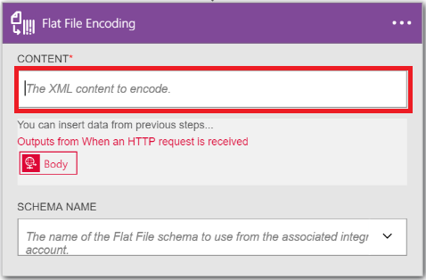
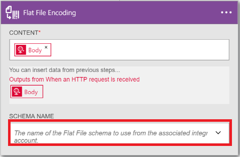

<properties
    pageTitle="Sie lernen, wie verschlüsseln oder entschlüsseln flache Dateien mithilfe der Enterprise-Integration Pack und Logik apps | Microsoft Azure-App-Verwaltungsdienst | Microsoft Azure"
    description="Verwenden der Features von apps für Enterprise-Integration Pack und Logik zum Verschlüsseln oder entschlüsseln flache Dateien"
    services="app-service\logic"
    documentationCenter=".net,nodejs,java"
    authors="msftman"
    manager="erikre"
    editor="cgronlun"/>

<tags 
    ms.service="logic-apps" 
    ms.workload="integration" 
    ms.tgt_pltfrm="na" 
    ms.devlang="na" 
    ms.topic="article" 
    ms.date="07/08/2016" 
    ms.author="deonhe"/>

# Enterprise-Integration in flachen Dateien

## (Übersicht)

Möglicherweise möchten XML-Inhalt codieren, bevor Sie sie an eine Business-Partner in einem Business-to-Business-Szenario (B2B) senden. In einer von der Logik Apps-Features des Diensts App Azure vorgenommene Logik app können Sie Codierung Verbinder Flatfile Aktion verwenden. Die Logik-app, die Sie erstellen kann deren XML aus einer Vielzahl von Datenquellen, einschließlich aus einer HTTP-Anforderung auslösen, aus einer anderen Anwendung oder einen der vielen [Verbinder](../connectors/apis-list.md)gerade von Inhalt erhalten. Weitere Informationen zu Logik apps finden Sie unter der [Logik apps Dokumentation](./app-service-logic-what-are-logic-apps.md "erfahren Sie mehr über Logik apps").  

## So erstellen Sie die Flatfile Codierung Verbinder

Wie folgt vor, um einer Flatfile Codierung Verbinder zu Ihrer Anwendung Logik hinzuzufügen.

1. Erstellen eines app Logik und [Verknüpfen Sie es mit Ihrem Konto Integration](./app-service-logic-enterprise-integration-accounts.md "erhalten grundlegende Informationen zu einer Firma Integration einer app Logik verknüpfen"). Dieses Konto enthält das Schema, die, das zum Codieren von XML-Daten verwendet werden soll.  
2. Hinzufügen eines Triggers **Anforderung – Wenn ein HTTP-Anforderung empfangen wird** zu Ihrer Anwendung Logik.  
    
3. Fügen Sie die Aktion, wie folgt Codierung Flatfile hinzu:

    ein. Wählen Sie **das Pluszeichen** aus.

    b. Wählen Sie den Link zum **Hinzufügen einer Aktion** (wird angezeigt, nachdem Sie auf das Pluszeichen (+) ausgewählt haben).

    c. Geben Sie in das Suchfeld *flachen* um alle Aktionen auf den zu filtern, die Sie verwenden möchten.

    d. Wählen Sie die Option **Flachen Datei Codierung** aus der Liste aus.   
   
4. Wählen Sie im Dialogfeld **Flachen Datei Codierung** im Textfeld **Inhalt** aus.  
  
5. Wählen Sie das Texttag als der Inhalte, die codiert werden soll. Das Tag Textkörper wird das Feld "Inhalte" aufgefüllt.     
  
6. Wählen Sie im Listenfeld **Namen Schema** aus, und wählen Sie das Schema aus, die, das Sie verwenden, um die Eingabe der Inhalte codieren möchten.    
  
7. Speichern Sie Ihrer Arbeit an.   
  

Jetzt sind Sie fertig den Flatfile Codierung Verbinder einrichten. In einer realen Anwendung möchten Sie möglicherweise die codierten Daten in einer Line-of-Business-Anwendung, wie z. B. Vertrieb zu speichern. Oder Sie können die codierte Daten, die eine trading partner senden. Sie können eine Aktion, um die Ausgabe der Codierung Aktion Vertrieb oder Ihrem Handelspartner, mithilfe einer der bereitgestellten Connectors problemlos hinzufügen.

Sie können nun den Verbinder testen, indem er eine Anforderung an den HTTP-Endpunkt und einschließlich des XML-Inhalts in den Textkörper der Anfrage.  

## So erstellen Sie die Flatfile Decodierung Verbinder

>[AZURE.NOTE] Wenn Sie diese Schritte ausgeführt haben, müssen Sie eine Schemadatei in Integration Konto bereits hochgeladen haben.

1. Hinzufügen eines Triggers **Anforderung – Wenn ein HTTP-Anforderung empfangen wird** zu Ihrer Anwendung Logik.  
    
2. Fügen Sie die Aktion, wie folgt Decodierung Flatfile hinzu:

    ein. Wählen Sie **das Pluszeichen** aus.

    b. Wählen Sie den Link zum **Hinzufügen einer Aktion** (wird angezeigt, nachdem Sie auf das Pluszeichen (+) ausgewählt haben).

    c. Geben Sie in das Suchfeld *flachen* um alle Aktionen auf den zu filtern, die Sie verwenden möchten.

    d. Wählen Sie die Option **Flachen Datei Decodierung** aus der Liste aus.   
   
- Wählen Sie **das Inhaltssteuerelement** aus. Dies erzeugt eine Liste des Inhalts aus früheren Schritte, die Sie als Inhalt entschlüsseln verwenden können. Beachten Sie, dass der *Textkörper* aus der eingehenden HTTP-Anforderung als Inhalt um zu entschlüsseln verwendet werden. Sie können auch den Inhalt, der direkt in das Steuerelement **Inhalt** Entschlüsseln eingeben.     
- Wählen Sie das *Text* -Tag. Beachten Sie, dass die Textkörper Kategorie jetzt in **das Inhaltssteuerelement** ist.
- Wählen Sie den Namen des Schemas, die Sie verwenden, um den Inhalt entschlüsseln möchten. Das folgende Bildschirmabbild zeigt, dass *OrderFile* den Schemanamen der ausgewählten ist. Dieser Schemaname hatte zuvor berücksichtigt Integration hochgeladen wurde.

     
- Speichern Sie Ihrer Arbeit an.  
    

Jetzt sind Sie Fertig zum Einrichten Ihrer Flatfile Decodierung Verbinder. In einer realen Anwendung möchten Sie möglicherweise die decodierten Daten in einer Line-of-Business-Anwendung, wie z. B. Vertrieb zu speichern. Sie können eine Aktion, um die Ausgabe der Decodierung Aktion zu Vertrieb problemlos hinzufügen.

Sie können nun den Verbinder testen, indem er eine Anforderung an den HTTP-Endpunkt und einschließlich der XML-Inhalte, die Sie in den Textkörper der Anfrage entschlüsseln möchten.  

## Nächste Schritte
- [Erfahren Sie mehr über das Enterprise-Integration Pack] (./app-service-logic-enterprise-integration-overview.md "Erfahren Sie mehr über Enterprise Integration Pack").  
