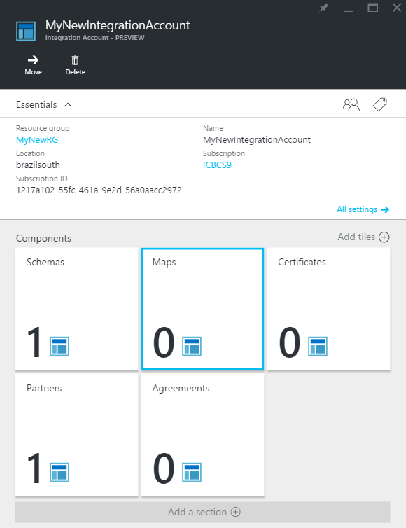
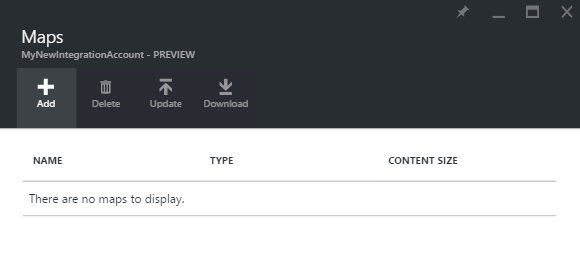
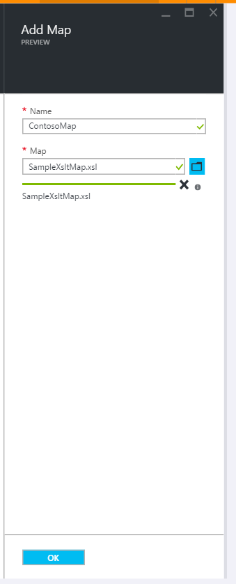
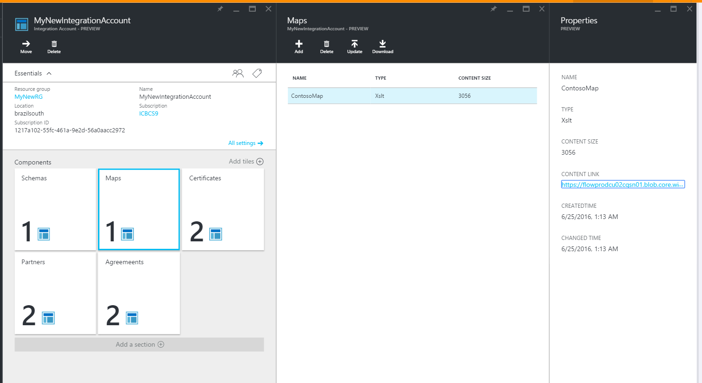
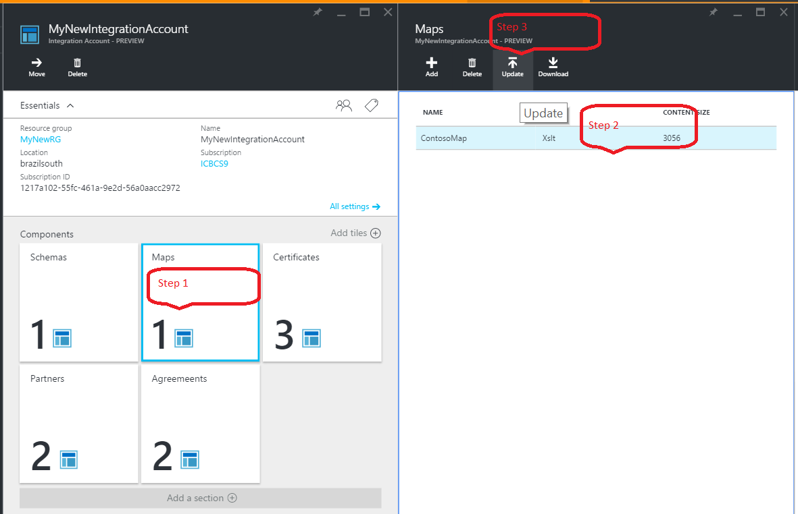
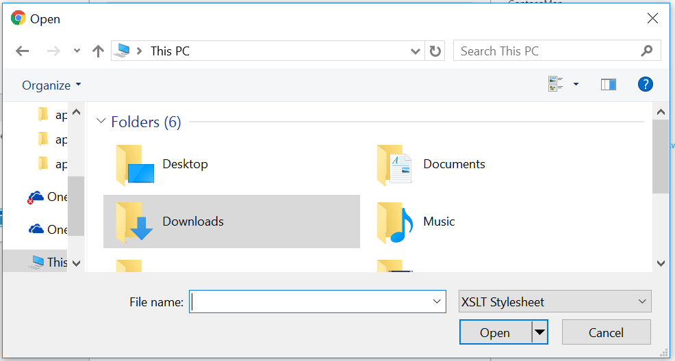
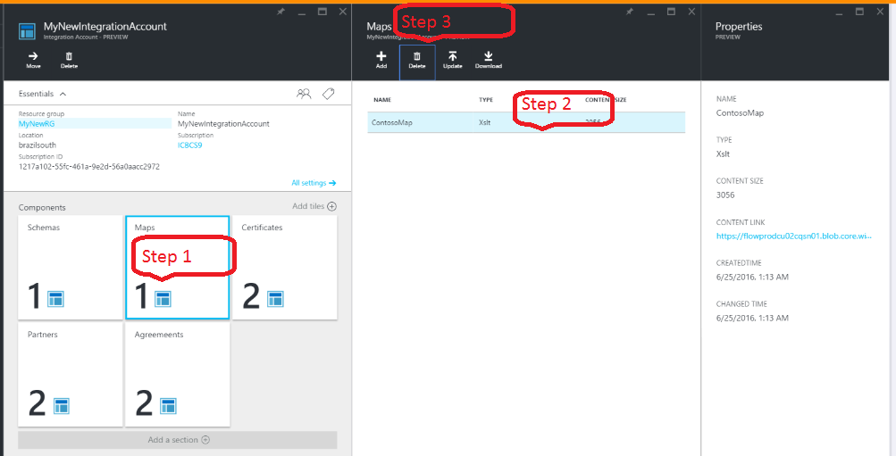
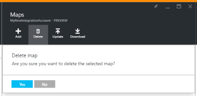

<properties 
    pageTitle="Übersicht über Zuordnungen Enterprise Integration Pack | Microsoft Azure-App-Verwaltungsdienst | Microsoft Azure" 
    description="Informationen Sie zum Verwenden von Karten mit der apps Enterprise Integration Pack und Logik" 
    services="logic-apps" 
    documentationCenter=".net,nodejs,java"
    authors="msftman" 
    manager="erikre" 
    editor="cgronlun"/>

<tags 
    ms.service="logic-apps" 
    ms.workload="integration" 
    ms.tgt_pltfrm="na" 
    ms.devlang="na" 
    ms.topic="article" 
    ms.date="07/08/2016" 
    ms.author="deonhe"/>

# Informationen Sie zu Karten und das Enterprise-Integration Pack

## (Übersicht)
Enterprise-Integration verwendet Karten, um die XML-Daten von einem Format in ein anderes Format umwandeln. 

## Was ist ein Schema?
Ein Schema ist ein XML-Dokument, die definiert, welche Daten in einem Dokument in ein anderes Format umgewandelt werden soll. 

## Gründe für die Verwendung von Karten
Angenommen, Sie regelmäßig erhalten B2B Bestellungen oder Rechnungen aus einem Kunden, der das Format YYYMMDD für Datumsangaben verwendet. In Ihrer Organisation speichern Sie jedoch Datumsangaben im Format MMDDYYY. Ein Schema zu *Transformieren* des Datumsformats YYYMMDD können in der MMDDYYY vor dem Speichern die Reihenfolge oder einer neuen Rechnung Details in der Datenbank des Kunden Aktivität.

## Wie kann ich ein Schema erstellen?
[Enterprise-Integration Pack](./app-service-logic-enterprise-integration-overview.md "erfahren Sie mehr über das Enterprise-Integration Pack") für Visual Studio 2015 ermöglicht Biztalk Integration Projekte erstellt werden.  Erstellen einer Karte Integration-Datei können Sie Elemente zwischen zwei XML-Schema-Dateien visuell zuordnen.  Nachdem Sie dieses Projekt erstellt haben, wird ein XSLT-Dokument ausgegeben.

## Zum Hochladen einer Karte?
Vom Azure-Portal:  
1. Wählen Sie **Durchsuchen**  
    
2. Geben Sie in das Suchfeld der Filters **Integration** , und wählen Sie **Integration Konten** aus der Liste der Suchergebnisse     
   
3. Wählen Sie das **Konto Integration** , in dem Sie die Karte hinzufügen  
  
4.  Wählen Sie die Kachel **Karten**  
  
5. Wählen Sie die Schaltfläche **Hinzufügen** in den Karten Blade, das geöffnet wird  
  
6. Geben Sie einen **Namen** für Ihre Karte, um die Karte Datei hochladen, und wählen Sie dann das Ordnersymbol rechts neben dem Text-Feld **zuordnen** . Nachdem der Uploadvorgang abgeschlossen ist, wählen Sie die Schaltfläche **OK** aus.  
  
7. Die Karte ist jetzt in Ihr Konto Integration hinzugefügt wird. Sie erhalten eine Benachrichtigung auf dem Bildschirm, die den Erfolg oder Fehler hinzufügen der Karte Datei angibt. Nachdem Sie die Benachrichtigung erhalten, wählen Sie die Kachel **Karten** , wird die neu hinzugefügte Karte in das Blade Karten angezeigt:    
  

## So bearbeiten Sie eine Karte?
Um ein Schema zu bearbeiten, müssen Sie eine neue Zuordnungsdatei mit den Änderungen hochladen, die Sie wünschen. Sie können zuerst herunterladen die Karte und bearbeiten kann. 

Wie folgt vor, um ein neues Schema hochladen, das ein vorhandenes Schema ersetzt:  
1. Wählen Sie die Kachel **Karten**  
2. Wählen Sie die Karte zu bearbeiten, wenn das Blade Karten angezeigt wird  
3. Wählen Sie in der Blade **Karten** die Verknüpfung **Aktualisieren**  
   
4. Wählen Sie die Karte gewünschte Datei zum Hochladen von mithilfe des Datei Auswahldialogfelds, das angezeigt wird, und klicken Sie dann wählen Sie im Auswahltool für Datei **Öffnen**   
   
5. Sie erhalten eine Benachrichtigung Popup nach die Karte hochgeladen wird.    

## So löschen Sie ein Schema?
1. Wählen Sie die Kachel **Karten**  
2. Wählen Sie die Karte zu löschen, wenn das Blade Karten angezeigt wird  
3. Wählen Sie den Link **Löschen**    
   
4. Bestätigen Sie, die Sie wirklich ausgefüllt werden sollen, um die Karte zu löschen.  
   

## Nächste Schritte
- [Erfahren Sie mehr über das Enterprise-Integration Pack] (./app-service-logic-enterprise-integration-overview.md "Erfahren Sie mehr über Pack für Enterprise-Integration")  
- [Erfahren Sie mehr über agreements] (./app-service-logic-enterprise-integration-agreements.md "Erfahren Sie mehr über Enterprise-Integration Verträgen")  
- [Erfahren Sie mehr über können] (./app-service-logic-enterprise-integration-transform.md "Wandelt Sie erhalten grundlegende Informationen zu Enterprise-integration")  
