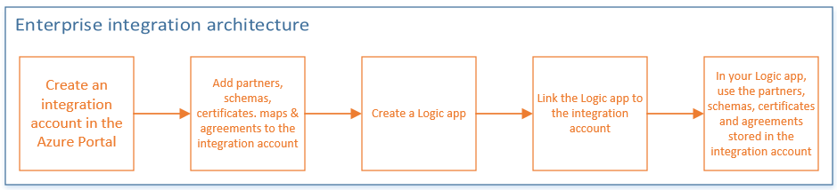

<properties 
    pageTitle="Übersicht über Enterprise-Integration | Microsoft Azure-App-Verwaltungsdienst | Microsoft Azure" 
    description="Verwenden der Features für Enterprise-Integration Business Process und Integration Szenarien mit Logik apps unterstützen" 
    services="logic-apps" 
    documentationCenter=".net,nodejs,java"
    authors="msftman" 
    manager="erikre" 
    editor="cgronlun"/>

<tags 
    ms.service="logic-apps" 
    ms.workload="integration" 
    ms.tgt_pltfrm="na" 
    ms.devlang="na" 
    ms.topic="article" 
    ms.date="09/08/2016" 
    ms.author="deonhe"/>

# Übersicht über das Enterprise-Integration Pack

## Was ist das Enterprise-Integration Pack?
Enterprise-Integration-Pack ist Microsoft Cloud-basierte Lösung für das nahtlos Business-to-Business (B2B) Kommunikation aktivieren. Das Pack verwendet Protokolle nach Industriestandard einschließlich [AS2](./app-service-logic-enterprise-integration-as2.md), [X12](./app-service-logic-enterprise-integration-x12.md)und [EDIFACT](./app-service-logic-enterprise-integration-edifact.md) zum Austauschen von Nachrichten zwischen Business-Partner zur Verfügung. Verwenden die Verschlüsselung und digitale Signaturen können optional Nachrichten gesichert werden. 

Das Pack kann Organisationen, die für unterschiedliche Protokolle und Nachrichten elektronisch Exchange, indem die verschiedenen Formate in ein Format, das beiden Organisationen Systeme interpretieren und für Maßnahmen ergreifen können umwandelt formatiert. 

Wenn Sie mit BizTalk Server oder Dienste von Microsoft Azure BizTalk vertraut sind, werden Sie feststellen, dass es benutzerfreundliche Enterprise Integration von features, da die meisten Konzepte ähneln. Ein wesentlicher Unterschied ist, dass Enterprise-Integration Integration Konten verwendet, um die Speicherung und Verwaltung von Elementen zur Kommunikation B2B zu vereinfachen. 

Architektur, basiert das Enterprise-Integration Pack für **Integration Konten** , in denen alle Elemente gespeichert, die zum Entwerfen, bereitstellen und Verwalten Ihrer apps B2B verwendet werden können. Ein Konto Integration ist im Grunde einen cloudbasierten Container, in dem Sie Elemente wie Schemas, Partner, Zertifikate, Karten und Vereinbarungen speichern. Diese Elemente können dann Logik Apps B2B Workflows erstellen verwendet werden. Bevor Sie die Elemente in einer app Logik verwenden können, müssen Sie Ihr Konto Integration zu Ihrer Anwendung Logik zu verknüpfen. Nach dem verknüpfen können, wird Ihre app Logik auf Elemente für die Integration-Konto zugreifen.  

## Warum sollten Sie Enterprise-Integration verwenden?
- Enterprise-Integration können Sie alle Ihre Elemente an einem Ort, also Ihr Konto Integration zu speichern. 
- Sie können die Logik apps-Engine und alle zugehörigen Verbinder B2B Workflows erstellen und integrieren mit 3rd Party SaaS Applications, lokalen apps sowie benutzerdefinierte Applikationen nutzen
- Sie können auch Azure Funktionen nutzen zu können

## Erste Schritte mit Enterprise-Integration wie?
Sie können erstellen und verwenden das Enterprise-Integration Pack über den Logik apps-Designer im **Portal Azure**B2B-apps verwalten.  

[PowerShell](https://msdn.microsoft.com/library/azure/mt652195.aspx "Logik apps PowerShell Themen") können Sie auch Ihre Logik apps verwalten. 

Hier finden Sie eine Übersicht über die Schritte müssen Sie durchführen, bevor Sie apps im Azure-Portal erstellen können:   

## Was sind einige häufige Szenarien?

Enterprise-Integration unterstützt diese Branchenstandards:   

- EDI - Electronic Data Interchange  
- EAI - Integration der Enterprise-Anwendung  

## Hier sind die Voraussetzungen für den Einstieg
- Ein Azure-Abonnement mit einem Konto integration
- Visual Studio 2015 zum Erstellen von Karten und schemas
- [Integration von Microsoft Azure Logik Apps Enterprise-Tools für Visual Studio 2015 2.0](https://aka.ms/vsmapsandschemas)  

## Probieren Sie es
Bereitstellen eine voll funktionsfähiges Stichprobe AS2 [Probieren Sie es jetzt](https://github.com/Azure/azure-quickstart-templates/tree/master/201-logic-app-as2-send-receive) senden und Empfangen von Logik app, die Features B2B Logik Apps verwendet.

## Weitere Informationen:
- [Agreements] (./app-service-logic-enterprise-integration-agreements.md "Erfahren Sie mehr über Enterprise-Integration Verträgen")
- [Szenarien für Business-to-Business (B2B)] (./app-service-logic-enterprise-integration-b2b.md "Informationen zum Erstellen von Logik-apps mit B2B-features")  
- [Zertifikate] (./app-service-logic-enterprise-integration-certificates.md "Erfahren Sie mehr über Zertifikate für Enterprise-integration")
- [Codierung/Decodierung Flatfile] (./app-service-logic-enterprise-integration-flatfile.md "Informationen zum Codieren und Entschlüsseln Flatfile Inhalt")  
- [Integration von Konten] (./app-service-logic-enterprise-integration-accounts.md "Erfahren Sie mehr über die Integration von Konten")
- [Karten] (./app-service-logic-enterprise-integration-maps.md "Erfahren Sie mehr über Enterprise-Integration zugeordnet ist.")
- [Partner] (./app-service-logic-enterprise-integration-partners.md "Erfahren Sie mehr über Partner für Enterprise-integration")
- [Mithilfe von Schemas] (./app-service-logic-enterprise-integration-schemas.md "Erfahren Sie mehr über Schemas für Enterprise-integration")
- [XML-Nachricht Überprüfung] (./app-service-logic-enterprise-integration-xml.md "Informationen zum Überprüfen von XML-Nachrichten mit Logik apps")
- [XML transformieren] (./app-service-logic-enterprise-integration-transform.md "Erfahren Sie mehr über Enterprise-Integration zugeordnet ist.")
- [Enterprise-Integration von Verbindern] (../connectors/apis-list.md "Erfahren Sie mehr über Enterprise Integration Pack Verbinder")

