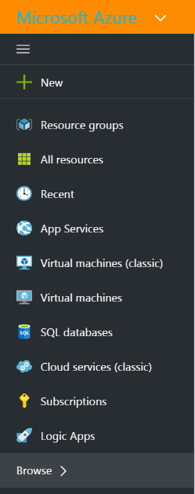
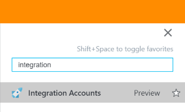
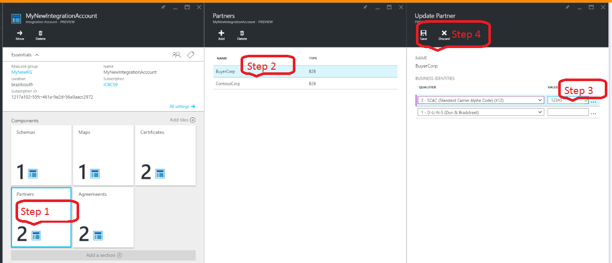
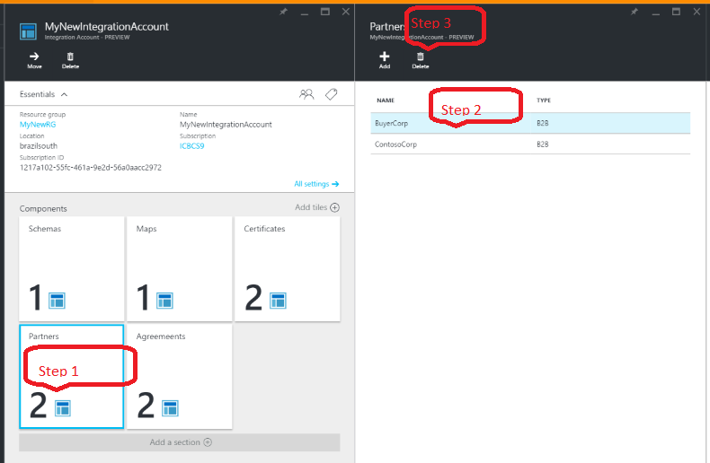

<properties 
    pageTitle="Erfahren Sie mehr über Partner und Enterprise Integration Pack | Microsoft Azure-App-Verwaltungsdienst | Microsoft Azure" 
    description="Informationen Sie zum Verwenden von Partner mit der apps Enterprise Integration Pack und Logik" 
    services="logic-apps" 
    documentationCenter=".net,nodejs,java"
    authors="msftman" 
    manager="erikre" 
    editor="cgronlun"/>

<tags 
    ms.service="logic-apps" 
    ms.workload="integration" 
    ms.tgt_pltfrm="na" 
    ms.devlang="na" 
    ms.topic="article" 
    ms.date="07/08/2016" 
    ms.author="deonhe"/>

# Erfahren Sie mehr über Partner und Pack für Enterprise-Integration

## (Übersicht)
Vor dem ein Partners erstellen können, müssen Sie und die Organisation, der Sie eine Geschäftsbeziehung unterhalten möchten Informationen gemeinsam nutzen, mit deren Hilfe Sie sowohl identifizieren und überprüfen Sie die Nachrichten, die vom miteinander gesendet werden. Nachdem Sie diese Diskussion haben und Sie mit Ihrer geschäftlichen Beziehung zu beginnen können, können Sie zum Erstellen eines *Partners* in Ihr Konto Integration.

## Was ist ein Partner?
Partner sind die Personen, die in Business-To-Business (B2B) messaging und Transaktionen teilnehmen. 

## Wie werden Partner verwendet?
Partner werden verwendet, um die Vereinbarungen zu erstellen. Ein Vertrag definiert die Details der Nachrichten, die zwischen Partner ausgetauscht werden sollen. 

Bevor Sie einen Vertrag erstellen können, müssen Sie mindestens zwei Partner bei Ihrem Konto Integration hinzugefügt haben. Einer der Partner eine Vereinbarung muss Ihrer Organisation sein. Der Partner, der Ihre Organisation darstellt wird als **Host Partner**bezeichnet. Der zweite Partner würde die anderen Organisation darstellen, mit der Ihre Organisation Nachrichten austauscht. Der zweite Partner wird als **Gast Partner**bezeichnet. Des Partners Gast kann ein anderes Unternehmen, oder sogar eine Abteilung innerhalb der eigenen Organisation handeln.  

Nachdem Sie die Partner hinzugefügt haben, verwenden Sie diese Partner zur Verfügung, um einen Vertrag erstellen. 

Empfangen Sie, und senden Sie die Einstellungen ausgerichteten aus der Sicht des Partners gehostet werden. Die Einstellungen für empfangen eine Vereinbarung beispielsweise bestimmen, wie der gehostete Partner von einem Partner Gast gesendete Nachrichten erhält. Die Einstellungen Senden der Vereinbarung ebenso anzugeben, wie der gehostete Partner Nachrichten an den Partner Gast sendet.

## Zum Erstellen eines Partners?
Vom Azure-Portal:  
1. Wählen Sie **Durchsuchen**  
    
2. Geben Sie in das Suchfeld der Filters **Integration** , und wählen Sie **Integration Konten** aus der Liste der Suchergebnisse     
   
3. Wählen Sie das **Konto Integration** , dem Sie die Partner hinzufügen möchten  
  
4.  Wählen Sie die Kachel für **Partner**  
  
5. Wählen Sie die Schaltfläche **Hinzufügen** in den Partner Blade, das geöffnet wird  
  
6. Geben Sie einen **Namen** für Ihr Partner, und klicken Sie dann der **Kennung **, wählen Sie schließlich Geben Sie einen **Wert**. Der Wert wird verwendet, um Dokumente zu identifizieren, die in Ihrer apps gehören.  
  
7. Wählen Sie *das Glockensymbol Benachrichtigung, um den Fortschritt der Partner Erstellungsprozess anzuzeigen* .  
  
8. Wählen Sie die Kachel für **Partner zur Verfügung** . Dabei wird die Kachel aktualisiert und sollten Sie die Anzahl der Partner erhöhen angezeigt wird, wurde den neuen Partner über die entsprechenden erfolgreich hinzugefügt.    
  
10. Nachdem Sie die Kachel Partner ausgewählt haben, wird auch den neu hinzugefügten Partner angezeigt, in dem Partner Blade angezeigt.    
  

## Zum Bearbeiten eines Partners

Wie folgt vor, um eines Partners zu bearbeiten, das bereits in Ihrem Konto Integration:  
1. Wählen Sie die Kachel für **Partner**  
2. Wählen Sie den Partner zu bearbeiten, wenn das Blade Partner angezeigt wird  
3. Klicken Sie auf die Kachel **Update Partner** nehmen Sie die Änderungen, die Sie benötigen  
4. Wenn Sie Ihre Änderungen sind, wählen Sie den Link **Speichern** , sonst aus, wählen Sie den Link **verwerfen** , um die Änderungen verwerfen.  
  

## Zum Löschen eines Partners
1. Wählen Sie die Kachel für **Partner**  
2. Wählen Sie den Partner zu bearbeiten, wenn das Blade Partner angezeigt wird  
3. Wählen Sie den Link **Löschen**    
   

## Nächste Schritte
- [Erfahren Sie mehr über agreements] (./app-service-logic-enterprise-integration-agreements.md "Erfahren Sie mehr über Enterprise-Integration Verträgen")  

