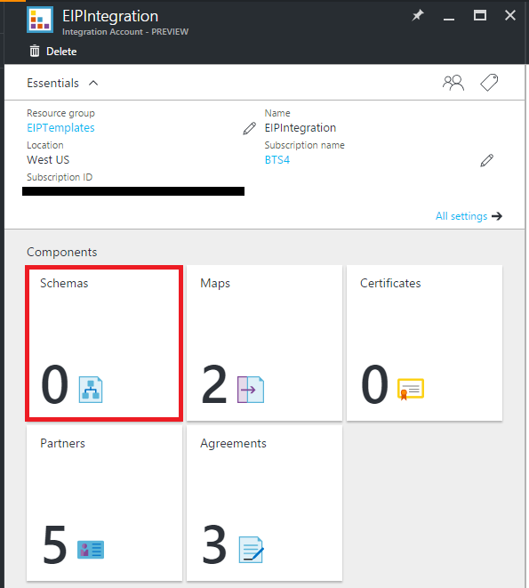
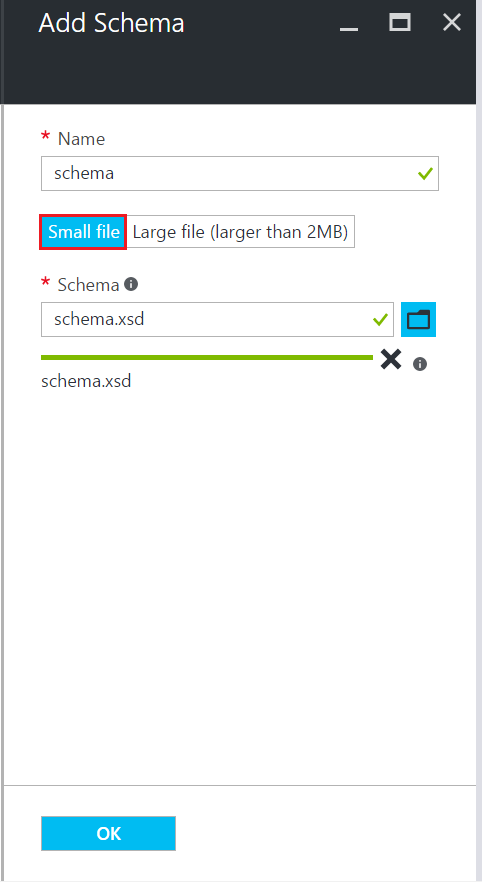
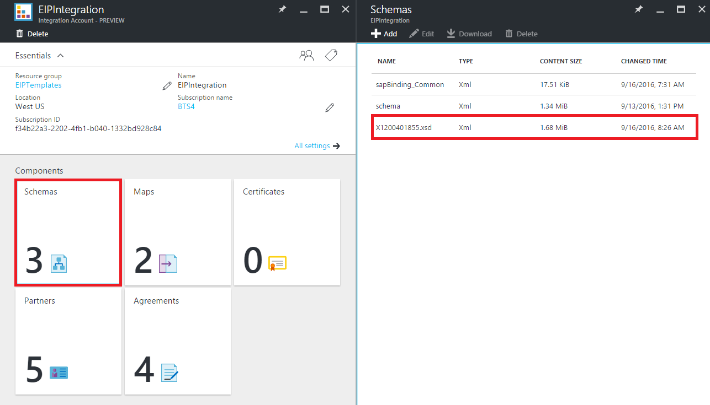
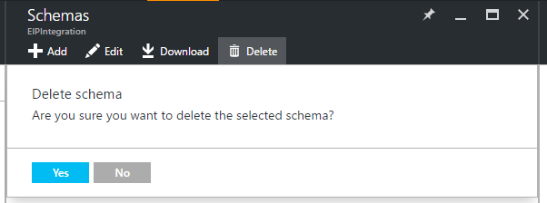

<properties
    pageTitle="Übersicht über Schemas und die Enterprise-Integration Pack | Microsoft Azure"
    description="Informationen Sie zum Verwenden von Schemas mit der apps Enterprise Integration Pack und Logik"
    services="logic-apps"
    documentationCenter=".net,nodejs,java"
    authors="msftman"
    manager="erikre"
    editor="cgronlun"/>

<tags
    ms.service="logic-apps"
    ms.workload="integration"
    ms.tgt_pltfrm="na"
    ms.devlang="na"
    ms.topic="article"
    ms.date="07/29/2016"
    ms.author="deonhe"/>

# Erfahren Sie mehr über Schemas und das Paket für die Enterprise-Integration  

## Warum ist verwenden ein Schema?
Verwenden Sie Schemas, um zu bestätigen, dass XML-Dokumente, die Sie erhalten, mit der erwarteten Daten in einem vordefinierten Format gültig sind. Schemas werden verwendet, um Nachrichten zu überprüfen, die in einem Szenario B2B ausgetauscht werden.

## Fügen Sie ein schema
Vom Azure-Portal:  

1. Wählen Sie **Weitere Dienste**.  
    

2. Klicken Sie in das Suchfeld der Filters Geben Sie **Integration ein**, und wählen Sie aus der Ergebnisliste **Integration-Konten** .     
  
3. Wählen Sie die **Integration-Konto** , dem Sie das Schema hinzufügen.    
  

4. Wählen Sie die Kachel **Schemas** aus.  
  

### Hinzufügen einer Schemadatei kleiner als 2 MB  

1. Wählen Sie in den **Schemas** Blade, das (aus den vorherigen Schritten) geöffnet wird **Hinzufügen**aus.  
  

2. Geben Sie einen Namen für Ihr Schema aus. Wählen Sie dann das Ordnersymbol neben dem Textfeld **Schema** zum Hochladen der Schemadatei aus. Nachdem der Uploadvorgang abgeschlossen ist, wählen Sie **OK**aus.    
  

### Hinzufügen einer Schemadatei größer als 2 MB (bis zu einem Maximum von 8 MB)  

Die Verarbeitung hierfür hängt die Blob Container Zugriffsebene: **Öffentliche** oder **keine anonymen Zugriff**. Wählen Sie den gewünschten Blob-Container diese Zugriffsebene, im **Speicher-Explorer Azure** **Blob-Container**, klicken Sie unter ermitteln. Wählen Sie **Sicherheit**, und wählen Sie die Registerkarte **Zugriffsebene** aus.

1. Wenn Access die Blob-Sicherheitsstufe **öffentlich**ist, gehen Sie folgendermaßen vor.  
    

    ein. Hochladen Sie das Schema zu Speicher, und kopieren Sie den URI.  
      

    b. Wählen Sie im **Schema hinzufügen** **große Datei**, und Bereitstellen Sie den URI im Textfeld **URI Inhalte** .  
      

2. Wenn Access die Blob-Sicherheitsstufe **keine anonymer Zugriff**ist, gehen Sie folgendermaßen vor.  
    

    ein. Laden Sie das Schema auf Speicher.  
    

    b. Generieren einer freigegebenen Access-Signatur für das Schema an.  
    

    c. Wählen Sie in **Schema hinzufügen** **große Datei**und geben Sie die gemeinsamen Zugriff Signatur in das Textfeld **Inhalt URI** URI an.  
      

3. Falz **Schemas** das EIP Integration-Konto sollten Sie jetzt neu hinzugefügte Schema angezeigt.  

  

## Bearbeiten von schemas
1. Wählen Sie die Kachel **Schemas** aus.  
2. Wählen Sie das Schema aus dem Blade **Schemas** bearbeiten, die geöffnet werden soll.
3. Klicken Sie auf das Blade **Schemas** wählen Sie **Bearbeiten**aus.  
    
4. Wählen Sie die Schemadatei aus, die Sie mithilfe der Datei Datumsauswahl im daraufhin angezeigten Dialogfeld bearbeiten möchten.
5. Wählen Sie im Auswahltool für Datei auf **Öffnen** .  
  
6. Sie erhalten eine Benachrichtigung, die angibt, dass der Upload erfolgreich war.  

## Löschen von schemas
1. Wählen Sie die Kachel **Schemas** aus.  
2. Wählen Sie das Schema aus dem Blade **Schemas** löschen, die geöffnet werden soll.  
3. Klicken Sie auf das Blade **Schemas** wählen Sie **Löschen**aus.
  

4. Wählen Sie **Ja**, um die Auswahl zu bestätigen.  
  
5. Beachten Sie, dass die Liste der Schemas in das Blade **Schemas** aktualisiert, und das Schema aus, das Sie gelöscht haben, wird nicht mehr aufgelistet.  
    

## Nächste Schritte

- [Erfahren Sie mehr über das Enterprise-Integration Pack] (./app-service-logic-enterprise-integration-overview.md "Erfahren Sie mehr über das Enterprise-Integration Pack").  
