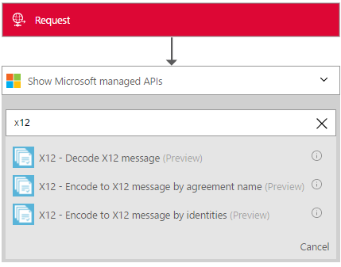

<properties 
    pageTitle="Erfahren Sie mehr über Enterprise Integration Pack entschlüsseln X12 Nachricht Connctor | Microsoft Azure-App-Verwaltungsdienst | Microsoft Azure" 
    description="Informationen Sie zum Verwenden von Partner mit der apps Enterprise Integration Pack und Logik" 
    services="logic-apps" 
    documentationCenter=".net,nodejs,java"
    authors="padmavc" 
    manager="erikre" 
    editor=""/>

<tags 
    ms.service="logic-apps" 
    ms.workload="integration" 
    ms.tgt_pltfrm="na" 
    ms.devlang="na" 
    ms.topic="article" 
    ms.date="08/15/2016" 
    ms.author="padmavc"/>

# Erste Schritte mit entschlüsseln X12 Nachricht

Überprüft, ob EDI und Partner-spezifische Eigenschaften, generiert XML-Dokument für jede Transaktion und Bestätigung für verarbeiteten Transaktion.

## Herstellen der Verbindungs

### Erforderliche Komponenten

* Ein Azure-Konto; Sie können ein [kostenloses Konto](https://azure.microsoft.com/free) erstellen.

* Entschlüsseln X12 Nachricht Verbinder verwenden, ist eine Integration-Konto erforderlich. Anzeigen von Details zum Erstellen eines [Kontos Integration](./app-service-logic-enterprise-integration-create-integration-account.md), [Partner](./app-service-logic-enterprise-integration-partners.md) und [X12 Vertrag](./app-service-logic-enterprise-integration-x12.md)

### Verbinden Sie mit entschlüsseln X12 Nachricht mithilfe der folgenden Schritte:

1. [Erstellen einer App Logik](./app-service-logic-create-a-logic-app.md) zeigt anhand eines Beispiels

2. Alle Trigger keinen dieser Verbinder. Verwenden Sie andere Trigger, um die App Logik, wie z. B. eine Anforderung Trigger starten.  Hinzufügen eines Triggers im Logik App-Designer und eine Aktion hinzufügen.  Wählen Sie Microsoft anzeigen verwalteten APIs in der Dropdown-Liste, und geben Sie dann "X12" in das Suchfeld ein.  Wählen Sie X12 – entschlüsseln X12 Nachricht

      

3. Wenn Sie alle Verbindungen mit Integration Konto zuvor erstellt haben, werden Sie für die Details der Verbindung aufgefordert.

        

4. Geben Sie die Details der Integration-Konto an.  Eigenschaften mit einem Sternchen sind erforderlich

  	| Eigenschaft | Details |
  	| -------- | ------- |
  	| Verbindungsnamen * | Geben Sie einen beliebigen Namen für die Verbindung |
  	| Integration Konto * | Geben Sie den Namen des Kontos Integration. Achten Sie darauf, dass Ihr Integration-Konto und Logik app an derselben Stelle Azure sind |

    Sobald Sie fertig sind, suchen Sie die Verbindungsdetails ähnlich wie der folgende
    
     

5. Wählen Sie **Erstellen**
    
6. Beachten Sie, dass die Verbindung erstellt wurde.

     

7. Select X12 Plane Datei Nachricht entschlüsseln

     

## X12 entschlüsseln Features folgen

* Überprüft den Umschlag gegen trading Partner-Vertrag
* Generiert ein XML-Dokument für jede Transaktion.
* Überprüft, ob EDI und Partner-spezifische Eigenschaften
    * EDI-strukturelle Überprüfung und erweiterten Schema Überprüfung
    * Überprüfung von die Struktur des Umschlags Interchange.
    * Schema Überprüfung des Umschlags gegen das Schema steuern.
    * Schema Überprüfung der Elemente Transaktion-Set-Daten gegen das Nachrichtenschema.
    * Überprüfung auf Datenelemente Transaktion-Set EDI 
* Überprüft, ob die Zahlen Interchange, Gruppen- und Transaktion festlegen Steuerelement nicht Duplikate
    * Überprüft die Interchange-Steuerelement-Nummern mit zuvor empfangenen Austauschvorgänge.
    * Überprüft die Gruppe Steuerelement Anzahl für andere Gruppe Steuerelement Zahlen im Austausch.
    * Überprüft, dass die Transaktion Steuerelement Anzahl für andere Transaktion festlegen Steuerelement Zahlen in dieser Gruppe festzulegen.
* Wandelt die gesamte Interchange das Arbeiten mit XML 
    * Geteilte Interchange als Transaktionssätze - aussetzen Transaktionssätze Fehler: analysiert jede Transaktion ein Austausch in einem separaten XML-Dokument festlegen. Wenn eine oder mehrere Transaktion im Austausch setzt ein Fehler auftreten, Überprüfung, X12 entschlüsseln ausgesetzt nur diese Transaktion Mengen.
    * Geteilte Interchange als Transaktionssätze - aussetzen Interchange Fehler: analysiert jede Transaktion ein Austausch in einem separaten XML-Dokument festlegen.  Wenn eine oder mehrere Transaktion im Austausch setzt ein Fehler auftreten, Überprüfung, X12 entschlüsseln ausgesetzt die gesamte Interchange.
    * Beibehalten Interchange - aussetzen Transaktionssätze Fehler: ein XML-Dokument für den Austausch des gesamten gespeicherten erstellt. X12 entschlüsseln ausgesetzt nur diese Transaktion Mengen, die fehlgeschlagener Überprüfung, während Sie den Vorgang fortsetzen, alle anderen Transaktion zu verarbeiten legt
    * Beibehalten Interchange - aussetzen Interchange Fehler: ein XML-Dokument für den Austausch des gesamten gespeicherten erstellt. Wenn eine oder mehrere Transaktion im Austausch setzt ein Fehler auftreten, Überprüfung, X12 entschlüsseln ausgesetzt die gesamte Interchange 
* Wird eine Bestätigung technischen und/oder funktionellen generiert (falls konfiguriert).
    * Eine technische Bestätigung wird Kopfzeile Überprüfung generiert wird. Die Technische Bestätigung Berichten des Status der Verarbeitung von einer Interchange Kopf- und Anhänger vom Empfänger Adresse.
    * Ein funktionsübergreifendes Bestätigung wird Textkörper Überprüfung generiert wird. Die funktionsübergreifendes Bestätigung Berichte jeden Fehler bei der Verarbeitung empfangenen Dokuments

## Nächste Schritte

[Erfahren Sie mehr über das Enterprise-Integration Pack] (./app-service-logic-enterprise-integration-overview.md "Erfahren Sie mehr über Pack für Enterprise-Integration") 

