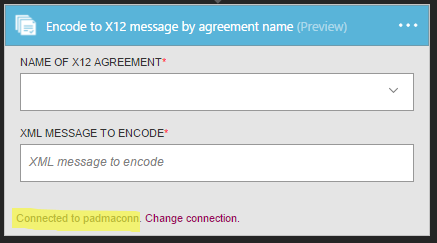

<properties 
    pageTitle="Erfahren Sie mehr über Enterprise Integration Pack codieren X12 Nachricht Connctor | Microsoft Azure-App-Verwaltungsdienst | Microsoft Azure" 
    description="Informationen Sie zum Verwenden von Partner mit der apps Enterprise Integration Pack und Logik" 
    services="logic-apps" 
    documentationCenter=".net,nodejs,java"
    authors="padmavc" 
    manager="erikre" 
    editor=""/>

<tags 
    ms.service="logic-apps" 
    ms.workload="integration" 
    ms.tgt_pltfrm="na" 
    ms.devlang="na" 
    ms.topic="article" 
    ms.date="08/15/2016" 
    ms.author="padmavc"/>

# Erste Schritte mit codieren X12 Nachricht

Überprüft EDI und Partner-spezifische Eigenschaften, wandelt die XML-codierte Nachrichten in EDI Transaktionssätze im Austausch und eine Bestätigung technischen und/oder funktionellen angefordert

## Herstellen der Verbindungs

### Erforderliche Komponenten

* Ein Azure-Konto; Sie können ein [kostenloses Konto](https://azure.microsoft.com/free) erstellen.

* Codieren X12 Nachricht Verbinder verwenden, ist eine Integration-Konto erforderlich. Anzeigen von Details zum Erstellen eines [Kontos Integration](./app-service-logic-enterprise-integration-create-integration-account.md), [Partner](./app-service-logic-enterprise-integration-partners.md) und [X12 Vertrag](./app-service-logic-enterprise-integration-x12.md)

### Verbinden Sie mit codieren X12 Nachricht mithilfe der folgenden Schritte:

1. [Erstellen einer App Logik](./app-service-logic-create-a-logic-app.md) zeigt anhand eines Beispiels

2. Alle Trigger keinen dieser Verbinder. Verwenden Sie andere Trigger, um die App Logik, wie z. B. eine Anforderung Trigger starten.  Hinzufügen eines Triggers im Logik App-Designer und eine Aktion hinzufügen.  Wählen Sie Microsoft anzeigen verwalteten APIs in der Dropdown-Liste, und geben Sie dann "X12" in das Suchfeld ein.  Wählen Sie entweder X12-codieren X12 Nachricht namentlich Vertrag oder X12-X 12-Nachricht durch Identitäten codieren.  

     

3. Wenn Sie alle Verbindungen mit Integration Konto zuvor erstellt haben, werden Sie für die Details der Verbindung aufgefordert.

     

4. Geben Sie die Details der Integration-Konto an.  Eigenschaften mit einem Sternchen sind erforderlich

  	| Eigenschaft | Details |
  	| -------- | ------- |
  	| Verbindungsnamen * | Geben Sie einen beliebigen Namen für die Verbindung |
  	| Integration Konto * | Geben Sie den Namen des Kontos Integration. Achten Sie darauf, dass Ihr Integration-Konto und Logik app an derselben Stelle Azure sind |

    Sobald Sie fertig sind, suchen Sie die Verbindungsdetails ähnlich wie der folgende

     

5. Wählen Sie **Erstellen**

6. Beachten Sie, dass die Verbindung erstellt wurde.

     

#### X12-codieren X12 Nachricht namentlich Vertrag

7. Wählen Sie X12 Vertrag aus der Dropdown-Listen und XML-Nachricht codieren.

     

#### X12-codieren X12 Nachricht durch Identitäten

7.  Sender-ID, Kennung Absender, Empfänger Bezeichner und Empfänger Kennung angeben, wie in der X12 konfiguriert Vertrag.  Wählen Sie XML-Nachricht codieren

     

## Codieren von X12 Folgen dieses Features:

* Vertrag Auflösung durch den Abgleich Absender und Empfänger Kontexteigenschaften.
* Serialisiert die EDI Interchange, Konvertieren von XML-codierte Nachrichten in EDI Transaktionssätze im Austausch an.
* Gültig für Transaktion festlegen Header und-Nachspann Segmente
* Generiert eine Interchange Steuerelement Zahl, eine Gruppe Steuerelement Zahl und eine Transaktion festgelegte Steuerelement Anzahl für jeden ausgehenden Austausch
* Trennzeichen in die Nutzlastdaten ersetzt
* Überprüft, ob EDI und Partner-spezifische Eigenschaften
    * Schema Überprüfung der Elemente Transaktion-Set-Daten gegen das Schema Nachricht
    * EDI-Überprüfung auf Datenelemente Transaktion-festlegen.
    * Erweiterte Validierung auf Datenelemente Transaktion-set
* Eine Bestätigung technischen und/oder funktionellen anfordert, (falls konfiguriert).
    * Eine technische Bestätigung wird Kopfzeile Überprüfung generiert wird. Die Technische Bestätigung Berichten des Status der Verarbeitung von einer Interchange Kopf- und Anhänger vom Empfänger Adresse
    * Ein funktionsübergreifendes Bestätigung wird Textkörper Überprüfung generiert wird. Die funktionsübergreifendes Bestätigung Berichte jeden Fehler bei der Verarbeitung empfangenen Dokuments

## Nächste Schritte

[Erfahren Sie mehr über das Enterprise-Integration Pack] (./app-service-logic-enterprise-integration-overview.md "Erfahren Sie mehr über Pack für Enterprise-Integration") 

