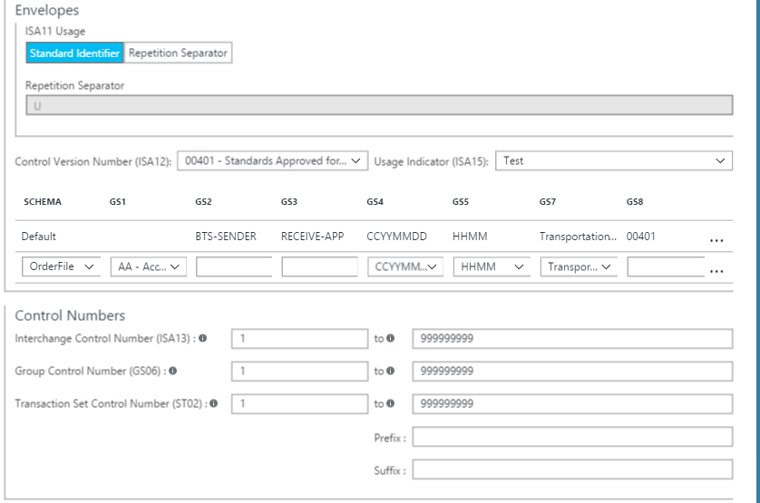
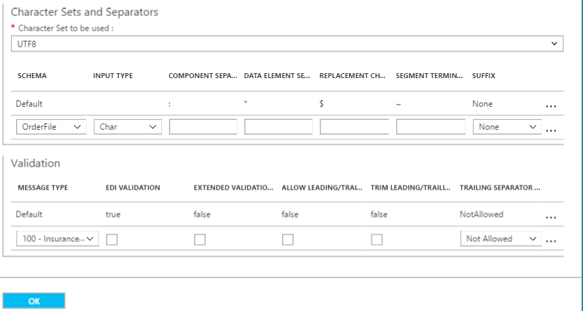

<properties 
    pageTitle="Übersicht über X12 und das Enterprise-Integration Pack | Microsoft Azure-App-Verwaltungsdienst | Microsoft Azure" 
    description="Informationen zum Verwenden von X12 Vereinbarungen Logik apps erstellen" 
    services="logic-apps" 
    documentationCenter=".net,nodejs,java"
    authors="msftman" 
    manager="erikre" 
    editor="cgronlun"/>

<tags 
    ms.service="app-service-logic" 
    ms.workload="integration" 
    ms.tgt_pltfrm="na" 
    ms.devlang="na" 
    ms.topic="article" 
    ms.date="07/08/2016" 
    ms.author="deonhe"/>

# Enterprise-Integration in X12 

>[AZURE.NOTE]Diese Seite behandelt die X12 Features von Logik Apps. Informationen zum EDIFACT klicken Sie auf [hier](app-service-logic-enterprise-integration-edifact.md).

## Erstellen einer X12 Vertrag 
Bevor Sie X12 austauschen können Nachrichten, die Sie zum Erstellen einer X12 müssen Servicevertrag und in Ihr Konto Integration speichern. Die folgenden Schritte führen Sie durch die Erstellung einer X12 Vertrag.

### Was müssen erfüllt sein, bevor Sie loslegen
- Ein [Konto Integration](./app-service-logic-enterprise-integration-accounts.md) in Ihr Abonnement Azure definiert  
- Mindestens zwei [Partner](./app-service-logic-enterprise-integration-partners.md) bereits in Ihrem Konto Integration definiert.  

>[AZURE.NOTE]Wenn Sie einen Vertrag erstellen, muss der Inhalt der Datei Vertrag den Vertragstyp übereinstimmen.    

Nachdem Sie [ein Konto Integration erstellt](./app-service-logic-enterprise-integration-accounts.md) und [Partner hinzugefügt](./app-service-logic-enterprise-integration-partners.md)haben, können Sie eine X12 erstellen Vertrag, indem Sie wie folgt vor:  

### Aus Azure Homepage des Portals

Nachdem Sie melden Sie sich bei der [Azure-Portal](http://portal.azure.com "Azure-Portal"):  
1. Wählen Sie im Menü auf der linken Seite **Durchsuchen** .  

>[AZURE.TIP]Wenn Sie den Link **Durchsuchen** angezeigt werden, müssen Sie zuerst das Menü zu erweitern. Wählen Sie zunächst den **Anzeigen des Menüs** Link, der bei befindet oben links im Menü reduzierte.  

    
2. Geben Sie in das Suchfeld der Filters *Integration* ein, und wählen Sie **Integration Konten** aus der Liste der Ergebnisse.       
    
3. Wählen Sie in der **Integration Konten** Blade, das angezeigt wird das Integration-Konto, in dem Sie den Vertrag erstellt werden. Wenn Sie keine Integration Konten Listen, sehen [Erstellen Sie eine erste](./app-service-logic-enterprise-integration-accounts.md "All about integration accounts").  
  
4.  Wählen Sie die Kachel **Vereinbarungen** aus. Wenn Sie die Kachel Vereinbarungen angezeigt werden, fügen Sie es zuerst.   
     
5. Wählen Sie die Schaltfläche **Hinzufügen** in den Vereinbarungen Blade, das geöffnet wird.  
  
6. Geben Sie einen **Namen** für Ihr Vertrag und wählen Sie dann den **Vertragstyp**, **Host Partner**, **Host Identität**, **Gast Partner**, **Gast Identität**, in das Vereinbarungen Blade, das geöffnet wird.  
  
7. Nachdem Sie die empfangen Einstellungseigenschaften festgelegt haben, wählen Sie die Schaltfläche **OK** aus.  
Lassen Sie uns fortsetzen:  
8. Wählen Sie **Einstellungen erhalten** so konfigurieren, wie Nachrichten, die über dieses Vertrags empfangen werden, behandelt werden sollen.  
9. Das Steuerelement Einstellungen erhalten ist in den folgenden Abschnitten, einschließlich Bezeichnern, Bestätigung, Schemas, Umschläge, Steuerelement Zahlen, Validierungen und internen Einstellungen unterteilt. Konfigurieren Sie diese Eigenschaften basierend auf Ihrer Vereinbarung mit den Partner Sie Austauschen von Nachrichten mit werden. Hier ein Überblick über diese Steuerelemente, die so konfiguriert werden, basierend auf wie dieses Vertrags zu identifizieren und eingehende Nachrichten verarbeitet werden soll:  
  

  
10. Wählen Sie die Schaltfläche **OK** , um die Einstellungen zu speichern.  

### Bezeichner

|Eigenschaft|Beschreibung |
|---|---|
|ISA1 (Autorisierung Kennung)|Wählen Sie den Wert der Autorisierung Qualifikation aus der Dropdownliste aus.|
|ISA2|Optional. Geben Sie die Informationswert Autorisierung. Ist der Wert für ISA1 eingegebene als 00, geben Sie mindestens ein beliebiges alphanumerisches Zeichen und einen Höchstwert von 10.|
|ISA3 (Sicherheit Kennung)|Wählen Sie den Wert der Sicherheit Qualifikation aus der Dropdownliste aus.|
|ISA4|Optional. Geben Sie den Wert der Sicherheit Informationen ein. Ist der Wert für ISA3 eingegebene als 00, geben Sie mindestens ein beliebiges alphanumerisches Zeichen und einen Höchstwert von 10.|

### Danksagungen 

|Eigenschaft|Beschreibung |
|----|----|
|TA1 erwartet|Aktivieren Sie dieses Kontrollkästchen, um eine Bestätigung der technischen (TA1) an den Absender Interchange zurückzukehren. Diese Danksagungen an basierend auf der senden-Einstellungen für den Vertrag Interchange Absender gesendet.|
|Anlagen erwartet|Aktivieren Sie dieses Kontrollkästchen, um ein funktionsübergreifendes (Anlagen) Bestätigung an den Absender Interchange zurückzukehren. Wählen Sie dann, ob die bereitgestellten 997 oder 999 basierend auf dem Schemaversionen, die, denen Sie beim Arbeiten mit, angezeigt werden soll. Diese Danksagungen an basierend auf der senden-Einstellungen für den Vertrag Interchange Absender gesendet.|
|Einbeziehen von AK2/IK2 Schleife|Aktivieren Sie dieses Kontrollkästchen Aktivieren der zweiten Generation der AK2 Schleifen in funktionsübergreifendes Danksagungen für zulässigen Transaktion Mengen an. Hinweis: Dieses Kontrollkästchen aktiviert ist, nur, wenn Sie das Kontrollkästchen Anlagen erwartet ausgewählt haben.|

### Mithilfe von Schemas

Wählen Sie ein Schema für jede Transaktionstyp (ST1) und Absender-Anwendung (GS2) aus. Der Verkaufspipeline empfangen löst die eingehende Nachricht durch Vergleichen der Werte für ST1 und GS2 in der eingehenden Nachricht mit den Werten, die Sie hier festlegen, und das Schema der eingehenden Nachricht mit dem Schema, dass Sie hier festlegen.

|Eigenschaft|Beschreibung |
|----|----|
|Version|Wählen Sie die X12 Version|
|Art des Geschäfts (ST01)|Wählen Sie die Art des Geschäfts aus.|
|Absender-Anwendung (GS02)|Wählen Sie die Anwendung Absender|
|Schema|Wählen Sie die Schemadatei aus, die Sie uns möchten. Schemadateien befinden sich in Ihrem Konto Integration.|

### Umschläge

|Eigenschaft|Beschreibung |
|----|----|
|ISA11 Verwendung|Verwenden Sie dieses Feld, um das Trennzeichen in einer Gruppe von Transaktion anzugeben:  Wählen Sie die standardmäßige Kennung die dezimale Notation der verwenden "." erhalten Sie statt der dezimale Notation des eingehenden Dokuments in das EDI Verkaufspipeline aus.  Wählen Sie Wiederholung Trennzeichen das Trennzeichen für wiederholte Vorkommen des ein einfaches Datenelement oder eine wiederholte Datenstruktur angeben. Beispielsweise wird (^) als Trennzeichen für Wiederholung normalerweise verwendet. HIPAA-Schemas können Sie nur (^) verwenden.|

### Steuerelement Zahlen

|Eigenschaft|Beschreibung |
|----|----|
|Verbieten Sie Interchange Steuerelement Zahl Duplikate|Aktivieren Sie diese Option, um doppelte Austauschvorgänge blockieren. Wenn ausgewählt, überprüft das BizTalk-Portal an, dass die Interchange Steuerelement Anzahl (ISA13) für den Austausch empfangenen nicht die Anzahl der Interchange-Steuerelements übereinstimmt. Wenn eine Übereinstimmung gefunden wird, sind die Verkaufspipeline empfangen den Austausch nicht verarbeiten. Wenn Sie sich doppelte Interchange Steuerelement Zahlen verbieten entschieden, können Sie die Anzahl der Tage angeben, die Überprüfung durch benennen den entsprechenden Wert für die Kontrollkästchen für die doppelten ISA13 alle X Tage ausgeführt wird.|
|Gruppe Steuerelement Zahl Duplikate verbieten|Aktivieren Sie diese Option, um Austauschvorgänge mit doppelten Gruppe Steuerelement Zahlen blockieren.|
|Verbieten Sie Transaktion festlegen Steuerelement Zahl Duplikate|Aktivieren Sie diese Option, um Austauschvorgänge mit doppelte Transaktion festlegen Steuerelement Zahlen blockieren.|

### Validierungen

|Eigenschaft|Beschreibung |
|----|----|
|Nachrichtentyp|Geben Sie EDI-Nachricht, wie 850-Bestellung oder Bestätigung 999-Implementierung.|
|EDI-Überprüfung|Führt EDI-Überprüfung Datentypen durch die EDI-Eigenschaften im Schema, Länge Einschränkungen, leeren Datenelemente und nachfolgende Trennzeichen definiert.|
|Erweiterte Prüfung|Ist der Datentyp kein EDI, Überprüfung auf Anforderung im Element ist, und Wiederholung, Enumerationen und Element Länge datenüberprüfung (min/Max) zulässig.|
|Zulassen von führenden/abschließenden Nullen|Zusätzlichen Speicherplatz und 0 (null), die von führenden oder nachgestellten Zeichen lang aufbewahrt. Sie werden nicht entfernt.|
|Nachfolgende Trennzeichen Richtlinie|Generiert nachfolgende Trennzeichen für den Austausch empfangen. Optionen gehören "NotAllowed" an, Optional und obligatorisch.|

### Interner Einstellungen

|Eigenschaft|Beschreibung |
|----|----|
|Konvertieren Sie implizite Dezimal-Format Nn Basis 10 Zahlenwert für|Wandelt eine Zahl EDI, die mit dem Format Nn in einen zur Basis 10 numerischen Wert in der zwischen-XT für XML im Portal BizTalk angegeben ist.|
|Erstellen Sie leeren XML-Tags, wenn nachfolgende Trennzeichen zulässig sind|Aktivieren Sie das Kontrollkästchen Interchange Absender leere XML-Tags für nachfolgende Trennzeichen enthalten sein.|
|Eingehende Batchverarbeitung Verarbeitung|Geteilte Interchange als Transaktionssätze - aussetzen Transaktionssätze Fehler: analysiert jede Transaktion ein Austausch in einem separaten XML-Dokument festlegen, indem Sie den entsprechenden Umschlag zum Transaktion Satz anwenden. Wenn eine oder mehrere Transaktion im Austausch festlegt, fehl Überprüfung, mit dieser Option und dann BizTalk-Dienste nur diese Transaktion Mengen ausgesetzt.   Geteilte Interchange als Transaktionssätze - aussetzen Interchange Fehler: analysiert jede Transaktion ein Austausch in einem separaten XML-Dokument festlegen, indem Sie den entsprechenden Umschlag anwenden. Wenn eine oder mehrere Transaktion im Austausch festlegt, fehl Überprüfung, mit dieser Option und dann BizTalk-Dienste die gesamte Interchange ausgesetzt.  Beibehalten Interchange - Transaktionssätze Fehler anhalten: intakt der Interchange, einem XML-Dokument für den Austausch des gesamten gespeicherten erstellen. Mit dieser Option Wenn OnAe oder weitere Transaktion im Austausch setzt ein Fehler treten Sie auf, Überprüfung, dann BizTalk-Dienste nur diese Transaktion Mengen, alle anderen Transaktionssätze Verarbeitungszeit Verschiebe ausgesetzt.  Beibehalten Interchange - aussetzen Interchange Fehler: intakt der Interchange, einem XML-Dokument für den Austausch des gesamten gespeicherten erstellen. Wenn eine oder mehrere Transaktion im Austausch festlegt, fehl Überprüfung, mit dieser Option und dann BizTalk-Dienste die gesamte Interchange ausgesetzt.  |

Der Vertrag ist bereit, eingehende Nachrichten verarbeitet, die dem Schema entsprechen, die Sie ausgewählt haben.

So konfigurieren Sie die Einstellungen, die für Partner gesendete Nachrichten zu verarbeiten  
11. Wählen Sie **Senden Einstellungen** so konfigurieren, wie Nachrichten, die über dieses Vertrags gesendet werden, behandelt werden sollen.  

Das Steuerelement senden Einstellungen ist in den folgenden Abschnitten, einschließlich Bezeichnern, Bestätigung, Schemas, Umschläge, Steuerelement Zahlen, Zeichensätzen und Trennzeichen und Validierung unterteilt. 

Hier ist eine Ansicht dieser Steuerelemente ein. Treffen Sie die Grundlage, wie Nachrichten verarbeitet Partnern über dieses Vertrags gesendete werden soll:   
  

  

  
12. Wählen Sie die Schaltfläche **OK** , um die Einstellungen zu speichern.  

### Bezeichner
|Eigenschaft|Beschreibung |
|----|----|
|Autorisierung Kennung (ISA1)|Wählen Sie den Wert der Autorisierung Qualifikation aus der Dropdownliste aus.|
|ISA2|Geben Sie die Informationswert Autorisierung. Wenn dieser Wert als 00 ist, geben Sie dann mindestens ein beliebiges alphanumerisches Zeichen und maximal 10 aus.|
|Sicherheit Kennung (ISA3)|Wählen Sie den Wert der Sicherheit Qualifikation aus der Dropdownliste aus.|
|ISA4|Geben Sie den Wert der Sicherheit Informationen ein. Dieser Wert ist als 00, für das Textfeld Wert (ISA4), geben Sie dann mindestens einen alphanumerischen Wert und einen Höchstwert von 10 aus.|

### Bestätigung
|Eigenschaft|Beschreibung |
|----|----|
|TA1 erwartet|Aktivieren Sie dieses Kontrollkästchen, um eine Bestätigung der technischen (TA1) an den Absender Interchange zurückzukehren. Diese Einstellung gibt an, dass der Host-Partner, der die Nachricht sendet eine Bestätigung des Partners Gast in den Vertrag anfordert. Diese Danksagungen werden vom Host Partner basierend auf der erhalten Einstellungen der Vereinbarung erwartet.|
|Anlagen erwartet|Aktivieren Sie dieses Kontrollkästchen, um ein funktionsübergreifendes (Anlagen) Bestätigung an den Absender Interchange zurückzukehren, und wählen Sie, ob die bereitgestellten 997 oder 999 basierend auf dem Schemaversionen, die, denen Sie beim Arbeiten mit, angezeigt werden soll. Diese Danksagungen werden vom Host Partner basierend auf der erhalten Einstellungen der Vereinbarung erwartet.|
|Version von Anlagen|Wählen Sie die Version von Anlagen|

### Mithilfe von Schemas
|Eigenschaft|Beschreibung |
|----|----|
|Version|Wählen Sie die X12 Version|
|Art des Geschäfts (ST01)|Wählen Sie die Art des Geschäfts aus.|
|SCHEMA|Wählen Sie das Schema zu verwenden. Mithilfe von Schemas befinden sich in Ihrem Konto Integration. Um Ihre Schemas zugreifen zu können, müssen Sie zuerst verknüpfen Sie Ihr Konto Integration zu Ihrer Anwendung Logik.|

### Umschläge
|Eigenschaft|Beschreibung |
|----|----|
|ISA11 Verwendung|Verwenden Sie dieses Feld, um das Trennzeichen in einer Gruppe von Transaktion anzugeben:  Wählen Sie die standardmäßige Kennung die dezimale Notation der verwenden "." erhalten Sie statt der dezimale Notation des eingehenden Dokuments in das EDI Verkaufspipeline aus.  Wählen Sie Wiederholung Trennzeichen das Trennzeichen für wiederholte Vorkommen des ein einfaches Datenelement oder eine wiederholte Datenstruktur angeben. Beispielsweise wird (^) als Trennzeichen für Wiederholung normalerweise verwendet. HIPAA-Schemas können Sie nur (^) verwenden. |
|Wiederholung Trennzeichen|Geben Sie das Trennzeichen Wiederholung|
|Steuerelement Versionsnummer (ISA12)|Wählen Sie die Version von der standardmäßigen X12, die zum Generieren einer ausgehenden Interchange vom Portal BizTalk Services verwendet wird.|
|Indikator für die Verwendung (ISA15)|Geben Sie, ob im Kontext einer Interchange Informationen (I), Fertigung Daten (P), sind oder Testen von Daten (T). Erhalten der EDI Verkaufspipeline höher gestuft, diese Eigenschaft auf den Kontext.|
|Schema|Sie können eingeben, wie das Portal BizTalk die Segmente Druck und Mo für einen X12-codierte Austausch generiert, die sie an der Verkaufspipeline senden sendet.  Sie können Werte in der GS1, GS2, GS3, GS4, GS5, GS7 und GS8 Daten mit Werten vom Typ Transaktion und Version/Release Datenelemente zuordnen. Wenn das BizTalk-Portal, die bestimmt eine XML-Nachricht weist die Werte für die Art des Geschäfts und Version/Release Elemente in einer Zeile des Rasters festlegen und dann werden die Datenelemente GS1, GS2, GS3, GS4, GS5, GS7 und GS8 in den Umschlag der ausgehenden Austausch mit den Werten aus der gleichen Zeile des Rasters ausgefüllt. Die Art des Geschäfts und Version/Release Elemente die Werte müssen eindeutig sein.  Optional. Wählen Sie für GS1 einen Wert für den funktionsübergreifendes Code aus der Dropdownliste aus.  Erforderlich. Geben Sie einen alphanumerischen Wert für GS2 für den Absender Anwendung mit mindestens zwei Zeichen und maximal 15 Zeichen.  Erforderlich. Geben Sie einen alphanumerischen Wert für GS3 für den Empfänger Anwendung mit mindestens zwei Zeichen und maximal 15 Zeichen.  Optional. Wählen Sie für GS4 CCYYMMDD oder JJMMTT aus.  Optional. Wählen Sie für GS5 hh: mm, soll oder HHMMSSdd aus.  Optional. Wählen Sie für GS7 einen Wert für die verantwortlich Stelle in der Dropdown-Liste aus.  Optional. Geben Sie einen alphanumerischen Wert für GS8 für das Dokument mit mindestens ein Zeichen und maximal 12 Zeichen identifiziert.  **Hinweis**: Dies sind die Werte, die in den Feldern GS für den Austausch das BizTalk-Portal es erstellt gibt, wird Wenn die Transaktion eingeben und Version/Release-Elementen in derselben Zeile sind keine Übereinstimmung für den Austausch zugeordnet.|

### Steuerelement Zahlen
|Eigenschaft|Beschreibung |
|----|----|
|Interchange-Steuerelement Anzahl (ISA13)|Erforderlich. Geben Sie einen Bereich von Werten für die Interchange Steuerelement Nummer ein, das BizTalk-Portal Generieren eines ausgehenden Austauschs verwendet. Geben Sie einen numerischen Wert mit mindestens 1 und maximal 999999999 aus.|
|Gruppe Control Number (GS06)|Erforderlich. Geben Sie den Zellbereich, der Zahlen, die das BizTalk-Portal für die Anzahl der Gruppe Steuerelement verwendet werden sollen. Geben Sie einen numerischen Wert mit mindestens ein Zeichen und maximal neun Zeichen enthält.|
|Transaktion festgelegte Steuerelement Anzahl (ST02)|Geben Sie für Transaktion Set Control Anzahl (ST02) einen Zellbereich numerische Werte für die mittlere Pflichtfelder und alphanumerische Werte für optionale Präfix und Suffix ein. Die maximale Länge der alle vier Felder beträgt neun Zeichen.|
|Präfix|Um den Bereich für Transaktion festlegen Steuerelement Zahlen in eine Bestätigung zu bestimmen, geben Sie Werte in die Felder für die Bestätigung Steuerelement Zahl (ST02) aus. Geben Sie einen numerischen Wert für die mittlere zwei Felder und einen alphanumerischen Wert (falls gewünscht) für die Felder Präfix und Suffix. Die mittlere Felder sind erforderlich und enthalten die Mindest- und Höchstwerte Werte für das Steuerelement Zahl; Das Präfix und Suffix sind optional. Die maximale Länge für alle drei Felder beträgt neun Zeichen.|
|Suffix|Um den Bereich für Transaktion festlegen Steuerelement Zahlen in eine Bestätigung zu bestimmen, geben Sie Werte in die Felder für die Bestätigung Steuerelement Zahl (ST02) aus. Geben Sie einen numerischen Wert für die mittlere zwei Felder und einen alphanumerischen Wert (falls gewünscht) für die Felder Präfix und Suffix. Die mittlere Felder sind erforderlich und enthalten die Mindest- und Höchstwerte Werte für das Steuerelement Zahl; Das Präfix und Suffix sind optional. Die maximale Länge für alle drei Felder beträgt neun Zeichen.|

### Zeichensätzen und Trennzeichen
Andere als das Zeichen festlegen möchten, können Sie eine andere Gruppe von Trennzeichen für jeden Nachricht verwendet werden eingeben. Wenn ein Zeichensatz für eine bestimmte Nachrichtenschema nicht angegeben ist, wird die Standardgruppe von Zeichen verwendet.

|Eigenschaft|Beschreibung |
|----|----|
|Zeichensatz verwendet werden|Wählen Sie die X12-Zeichensatz in den Eigenschaften zu überprüfen, die Sie für die Vereinbarung eingeben.  **Hinweis**: der BizTalk Services Portal nur mithilfe dieser Einstellung überprüfen Sie die eingegebenen Werte für die Eigenschaften verwandte Vertrag. Der Verkaufspipeline empfangen oder senden Verkaufspipeline ignoriert diese Eigenschaft Zeichensatz beim Laufzeit-Verarbeitung durchführen.|
|Schema|Wählen Sie das Pluszeichen (+)-Symbol, und wählen Sie ein Schema aus der Dropdownliste aus. Wählen Sie für das ausgewählte Schema die Trennzeichen einzurichten, verwendet werden:  Komponente Elementtrennzeichen – EINGABETASTE ein einzelnes Zeichen, um zusammengesetzte Datenelemente zu trennen.  Element-Trennzeichen – EINGABETASTE ein einzelnes Zeichen, um einfache Datenelemente in zusammengesetzte Datenelemente zu trennen.    Ersatzzeichen – aktivieren Sie dieses Kontrollkästchen, wenn die Nutzlast, die Daten enthält, die Zeichen werden auch als Daten, Segment oder Komponente Trennzeichen verwendet. Sie können dann ein Ersatzzeichen eingeben. Beim Generieren der ausgehenden Nachricht X12 alle Instanzen von Trennzeichen in der Nutzlast, die Daten mit dem angegebenen Zeichen ersetzt werden.  Segmentieren End – Geben Sie ein einzelnes Zeichen ein, um das Ende einer EDI-Segments anzugeben.  Suffix – wählen Sie das Zeichen, das mit dem Segment Bezeichner verwendet wird. Wenn Sie ein Suffix festlegen, kann das Segment End Datenelement leer sein. Wenn das Segmentabschlusszeichen leer ist, müssen Sie ein Suffix festlegen.|

### Überprüfung
|Eigenschaft|Beschreibung |
|----|----|
|Nachrichtentyp|Durch Auswahl dieser Option ermöglicht eine Validierung auf der Interchange-Empfänger. Diese Validierung führt EDI-Überprüfung Transaktion-Set Datenelemente Überprüfen von Datentypen, Länge Einschränkungen und leeren Datenelemente und nachfolgende Trennzeichen.|
|EDI-Überprüfung||
|Erweiterte Prüfung|Wenn diese Option aktiviert erweiterte Prüfung der des Absenders Interchange empfangenen Austauschvorgänge. Dies umfasst die Überprüfung von Feldlänge, Optionalität und wiederholen zählen zusätzlich zur Überprüfung des XSD-Datentyps. Sie können die Erweiterung Überprüfung aktivieren, ohne EDI-Überprüfung, aktivieren oder umgekehrt.|
|Führende / nachfolgende Nullen zulassen|Diese Option gibt an, dass eine EDI Interchange erhalten von der Partei nicht Überprüfung fehlschlägt, wenn ein Datenelement ein Austausch EDI nicht der Länge Anforderung aufgrund von oder nachgestellte Leerzeichen entspricht, aber seine Länge Anforderung entsprechen, wenn sie entfernt werden.|
|Nachfolgende Trennzeichen|Diese Option gibt an, ein EDI Interchange erhalten von der Partei nicht Überprüfung fehlschlägt, wenn ein Datenelement ein Austausch EDI nicht da (oder nachfolgende) führende Nullen oder nachgestellte Leerzeichen ihrer Anforderung Länge entspricht, aber seine Länge Anforderung entsprechen, wenn sie entfernt werden.  Wählen Sie nicht zulässig, wenn Sie nicht nachfolgende Trennzeichen und Trennzeichen ein Austausch vom Absender Interchange empfangenen zulassen möchten. Wenn der Austausch nachfolgende Trennzeichen und Trennzeichen enthält, wird die ungültige deklariert.  Wählen Sie Optional Austauschvorgänge mit oder ohne nachfolgende Trennzeichen und Trennzeichen annehmen.  Wählen Sie obligatorisch, wenn die empfangenen Interchange nachfolgende Trennzeichen und Trennzeichen enthalten muss.|

Wählen Sie nach dem **OK** aus, auf den Blades öffnen:  
13. Wählen Sie die Kachel **Vereinbarungen** auf das Konto Integration Blade und den neu hinzugefügten Vertrag aufgeführt werden angezeigt.  
   

## Weitere Informationen
- [Erfahren Sie mehr über das Enterprise-Integration Pack] (./app-service-logic-enterprise-integration-overview.md "Erfahren Sie mehr über Pack für Enterprise-Integration")  
