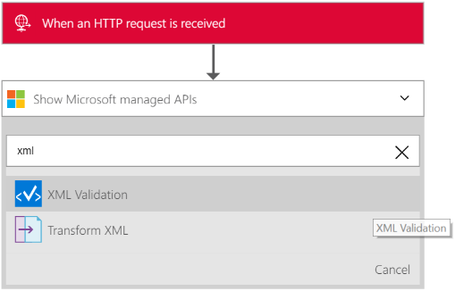
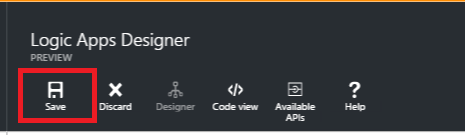

<properties 
    pageTitle="Übersicht über XML-Überprüfung im Enterprise-Integration Pack | Microsoft Azure-App-Verwaltungsdienst | Microsoft Azure" 
    description="Erfahren Sie, wie die Überprüfung in der Enterprise-Integration Pack und Logik apps funktioniert" 
    services="logic-apps" 
    documentationCenter=".net,nodejs,java"
    authors="msftman" 
    manager="erikre" 
    editor="cgronlun"/>

<tags 
    ms.service="logic-apps" 
    ms.workload="integration" 
    ms.tgt_pltfrm="na" 
    ms.devlang="na" 
    ms.topic="article" 
    ms.date="07/08/2016" 
    ms.author="deonhe"/>

# Enterprise-Integration in XML-Überprüfung

## (Übersicht)
Häufig müssen in B2B Szenarien, die Partner zu einer Vertrag überprüfen, die Nachrichten, die sie zwischen miteinander austauschen gültig sind, bevor Verarbeitung der Daten beginnen kann. Den Verbinder XML-Überprüfung können Sie in der Enterprise-Integration Pack Dokumente anhand eines vordefinierten Schemas überprüfen.  

## So überprüfen Sie ein Dokument mit der XML-Überprüfung Verbinder
1. Erstellen Sie eine app Logik und [Verknüpfen Sie es mit Ihrem Konto Integration](./app-service-logic-enterprise-integration-accounts.md "erhalten grundlegende Informationen zu einer Firma Integration einer app Logik verknüpfen") , die das Schema enthält, die, das zum Überprüfen der XML-Daten verwendet werden soll.
2. Hinzufügen eines Triggers **Anforderung – Wenn ein HTTP-Anforderung empfangen wird** zu Ihrer Anwendung Logik  
    
3. Hinzufügen der **XML-Überprüfung** Aktion vom ersten Auswählen eines **eine Aktion hinzufügen.**  
4. Geben Sie in das Suchfeld *Xml* akzeptieren, um alle Aktionen auf den Filtern, die Sie verwenden möchten. 
5. Wählen Sie die **XML-Überprüfung**     
   
6. Wählen Sie im Textfeld **Inhalt**  

7. Wählen Sie das Texttag als der Inhalte, die überprüft werden sollen.   
  
8. Wählen Sie das **SCHEMA OBJEKTNAMEN** -Listenfeld und wählen Sie das Schema aus, die Sie verwenden, um die Eingabe der *Inhalt* oben überprüfen möchten.     
 
9. Speichern Sie Ihre Arbeit  
 

Jetzt sind Sie fertig den Verbinder Überprüfung einrichten. In einer realen Anwendung möchten Sie möglicherweise die überprüften Daten in einer LOB-Anwendung, wie z. B. Vertrieb speichern. Sie können eine Aktion, um die Ausgabe der Überprüfung auf Vertrieb problemlos hinzufügen. 

Sie können nun die Überprüfung Aktion testen, indem er eine Anforderung an den HTTP-Endpunkt.  

## Nächste Schritte

[Erfahren Sie mehr über das Enterprise-Integration Pack] (./app-service-logic-enterprise-integration-overview.md "Erfahren Sie mehr über Pack für Enterprise-Integration")   