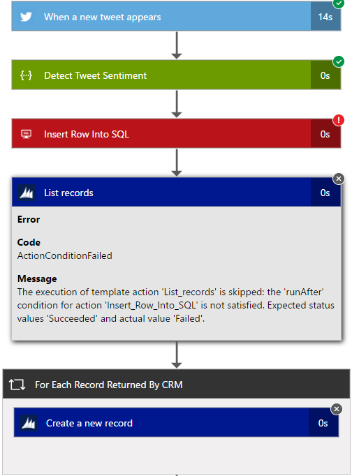

<properties 
    pageTitle="Überwachen Ihrer apps Logik in Azure App-Verwaltungsdienst | Microsoft Azure" 
    description="So finden Sie unter was Ihre apps Logik getan haben" 
    authors="jeffhollan" 
    manager="erikre" 
    editor="" 
    services="logic-apps" 
    documentationCenter=""/>

<tags
    ms.service="logic-apps"
    ms.workload="integration"
    ms.tgt_pltfrm="na"
    ms.devlang="na"
    ms.topic="article"
    ms.date="10/18/2016"
    ms.author="jehollan"/>

# <a name="monitor-your-logic-apps"></a>Überwachen Sie Ihrer apps Logik

Nachdem Sie [eine app Logik erstellen](app-service-logic-create-a-logic-app.md)können Sie den vollständigen Verlauf der Ausführung im Azure-Portal anzeigen.  Sie können auch Einrichten von Diensten wie Azure-Diagnose und Azure-Benachrichtigungen zum Überwachen von Ereignissen in Echtzeit und benachrichtigen Sie für Ereignisse wie "Wenn mehr als 5 ausgeführt innerhalb einer Stunde ein Fehler auftreten,."

## <a name="monitor-in-the-azure-portal"></a>Überwachen der Azure-Portal

Wenn Sie den Verlauf anzeigen möchten, wählen Sie **Durchsuchen**, und wählen Sie **Logik Apps**. Eine Liste aller Logik Apps im Rahmen Ihres Abonnements angezeigt.  Wählen Sie die app Logik zu überwachen.  Sehen Sie eine Liste aller Aktionen und Trigger, die für diese app Logik aufgetreten sind.


Es gibt einige Abschnitte in diesem Blade, die hilfreich sind:

- **Zusammenfassung** listet **Alle ausgeführt wird** und der **Trigger Verlauf**
    - Liste **aller ausgeführt wird** die neuesten Logik app ausgeführt wird.  Sie können klicken Sie auf eine beliebige Zeile ausführliche Informationen zum Ausführen, oder klicken Sie auf die Kachel der Liste weitere ausgeführt.
    - **Auslösen** Verlaufslisten die Trigger Aktivität für diese app Logik.  Auslösen Aktivität konnte ein Häkchen "Übersprungen" für neue Daten (z. B. gesehen um festzustellen, ob eine neue Datei FTP hinzugefügt wurde), werden, auf "Erfolgreich", was bedeutet, dass die Daten zurückgegeben wurde, eine app Logik ausgelöst oder "Fehlgeschlagen" einen Fehler in der Konfiguration entspricht.
- **Diagnose** ermöglicht es Ihnen, Laufzeit Details und Ereignisse anzeigen und Abonnieren von [Benachrichtigungen Azure](#adding-azure-alerts)

>[AZURE.NOTE] Alle Runtime Details und Ereignisse sind statisch sind innerhalb der Logik App-Verwaltungsdienst verschlüsselt. Diese sind nur bei der Anforderung einer Ansicht eines Benutzers entschlüsselt. Zugriff auf diese Ereignisse kann auch durch Azure Role-Based Access Steuerelement (RBAC) gesteuert werden.

### <a name="view-the-run-details"></a>Zeigen Sie die Details ausführen

Diese Liste der ausgeführt zeigt den **Status**, die **Startzeit**und die **Dauer** für das jeweilige ausführen. Wählen Sie eine Zeile aus, um Details anzuzeigen, klicken Sie auf, die ausgeführt werden.

Die Überwachung Ansicht zeigt Sie jeden Schritt ausführen, die Eingaben und Ausgaben und alle Fehlermeldungen, die möglicherweise Occurre besitzen.



Wenn Sie zusätzliche Details wie die ausführen **Korrelations-ID** benötigen (das für die REST-API verwendet werden kann), können Sie klicken Sie auf die Schaltfläche **Details ausführen** .  Dies umfasst alle Schritte, Status und Eingaben/Ausgaben für ausführen.

## <a name="azure-diagnostics-and-alerts"></a>Azure Diagnose und Benachrichtigungen

Zusätzlich zu den Details von der Azure-Portal und der REST-API oben bereitgestellt können Sie Ihre app Logik für die Verwendung von Azure-Diagnose für Weitere Rich-Details und für das Debuggen konfigurieren.

1. Klicken Sie im Abschnitt **Diagnose** des Blades app Logik auf
1. Klicken Sie auf, um die **Diagnoseeinstellungen** zu konfigurieren
1. Konfigurieren eines Ereignisses Hub oder Speicher-Konto Ausgeben von Daten

    

### <a name="adding-azure-alerts"></a>Hinzufügen von Azure Benachrichtigungen

Sobald Diagnose konfiguriert sind, können Sie Azure Benachrichtigungen ausgelöst wird, wenn bestimmte Schwellenwerte überschritten werden hinzufügen.  Wählen Sie in der **Diagnose** Blade **Benachrichtigungen** Kachel und **Benachrichtigung hinzufügen**aus.  Dies führt Sie durch eine Benachrichtigung basierend auf einer Reihe von Schwellenwerten und Kennzahlen konfigurieren.


Sie können die **Bedingung**, den **Schwellenwert**und den **Zeitraum** wie gewünscht konfigurieren.  Sie können schließlich konfigurieren eine e-Mail-Adresse, um eine Benachrichtigung zu senden oder eine Webhook konfigurieren.  Die [Anforderung Trigger](../connectors/connectors-native-reqres.md) können in einer app Logik Sie auf eine Benachrichtigung auch (wie [Pufferzeit Posten](https://github.com/Azure/azure-quickstart-templates/tree/master/201-alert-to-slack-with-logic-app), [Senden Sie einen Textplatzhalter](https://github.com/Azure/azure-quickstart-templates/tree/master/201-alert-to-text-message-with-logic-app)oder [Fügen Sie eine Nachricht an eine Warteschlange](https://github.com/Azure/azure-quickstart-templates/tree/master/201-alert-to-queue-with-logic-app)Möglichkeiten) ausgeführt werden.

### <a name="azure-diagnostics-settings"></a>Azure-Diagnose

Jedes dieser Ereignisse enthält Details zu der Logik-app und Ereignis wie Status aus.  Hier ist ein Beispiel für ein Ereignis *ActionCompleted* aus:

```javascript
{
            "time": "2016-07-09T17:09:54.4773148Z",
            "workflowId": "/SUBSCRIPTIONS/80D4FE69-ABCD-EFGH-A938-9250F1C8AB03/RESOURCEGROUPS/MYRESOURCEGROUP/PROVIDERS/MICROSOFT.LOGIC/WORKFLOWS/MYLOGICAPP",
            "resourceId": "/SUBSCRIPTIONS/80D4FE69-ABCD-EFGH-A938-9250F1C8AB03/RESOURCEGROUPS/MYRESOURCEGROUP/PROVIDERS/MICROSOFT.LOGIC/WORKFLOWS/MYLOGICAPP/RUNS/08587361146922712057/ACTIONS/HTTP",
            "category": "WorkflowRuntime",
            "level": "Information",
            "operationName": "Microsoft.Logic/workflows/workflowActionCompleted",
            "properties": {
                "$schema": "2016-06-01",
                "startTime": "2016-07-09T17:09:53.4336305Z",
                "endTime": "2016-07-09T17:09:53.5430281Z",
                "status": "Succeeded",
                "code": "OK",
                "resource": {
                    "subscriptionId": "80d4fe69-ABCD-EFGH-a938-9250f1c8ab03",
                    "resourceGroupName": "MyResourceGroup",
                    "workflowId": "cff00d5458f944d5a766f2f9ad142553",
                    "workflowName": "MyLogicApp",
                    "runId": "08587361146922712057",
                    "location": "eastus",
                    "actionName": "Http"
                },
                "correlation": {
                    "actionTrackingId": "e1931543-906d-4d1d-baed-dee72ddf1047",
                    "clientTrackingId": "my-custom-tracking-id"
                },
                "trackedProperties": {
                    "myProperty": "<value>"
                }
            }
        }
```

Die beiden Eigenschaften, die besonders zum Verfolgen und überwachen sind sind *ClientTrackingId* und *TrackedProperties*.  

#### <a name="client-tracking-id"></a>Client Verlauf-ID

Der Client-ID-Überwachung ist ein Wert, der Ereignisse über eine Logik app ausführen, einschließlich Namens als Bestandteil einer app Logik geschachtelte Workflows zu koordinieren wird.  Diese ID wird werden automatisch generierte Wenn Sie nicht zur Verfügung gestellt, aber Sie können den Nachverfolgen von ID von einem Trigger übergeben Client manuell angeben einer `x-ms-client-tracking-id` Header mit dem Wert ID in der Besprechungsanfrage Trigger (Anforderung Trigger, HTTP-Trigger oder Webhook Trigger).

#### <a name="tracked-properties"></a>Nachverfolgte Eigenschaften

Nachverfolgte Eigenschaften können auf Aktionen in die Workflowdefinition zum Nachverfolgen von Eingaben oder Ausgaben Diagnose Daten hinzugefügt werden.  Dies ist nützlich, wenn Sie zum Nachverfolgen von Daten wie ein "Bestell-Nr." in Ihrer werden soll.  Wenn eine nachverfolgte Eigenschaft hinzufügen möchten, verwenden den `trackedProperties` Eigenschaft auf eine Aktion.  Nachverfolgte Eigenschaften können nur verfolgen einer einzelnen Aktionen Eingaben und Ausgaben, aber Sie können die `correlation` Eigenschaften der Ereignisse, um über die Aktionen in einer Instanz zu koordinieren.

```javascript
{
    "myAction": {
        "type": "http",
        "inputs": {
            "uri": "http://uri",
            "headers": {
                "Content-Type": "application/json"
            },
            "body": "@triggerBody()"
        },
        "trackedProperties":{
            "myActionHTTPStatusCode": "@action()['outputs']['statusCode']",
            "myActionHTTPValue": "@action()['outputs']['body']['foo']",
            "transactionId": "@action()['inputs']['body']['bar']"
        }
    }
}
```

### <a name="extending-your-solutions"></a>Erweitern Sie Ihre Lösungen

Sie können diese werden vom Ereignis Hub oder Speicher in anderen Diensten wie [Vorgänge Management Suite](https://www.microsoft.com/cloud-platform/operations-management-suite), [Azure Stream Analytics](https://azure.microsoft.com/services/stream-analytics/)und [Power BI](https://powerbi.com) haben Echtzeit überwachen Ihrer Workflows Integration nutzen.

## <a name="next-steps"></a>Nächste Schritte
- [Allgemeine Beispiele und Szenarien Logik apps](app-service-logic-examples-and-scenarios.md)
- [Erstellen einer Vorlage für Logik App Bereitstellung](app-service-logic-create-deploy-template.md)
- [Enterprise-Funktionen](app-service-logic-enterprise-integration-overview.md)
