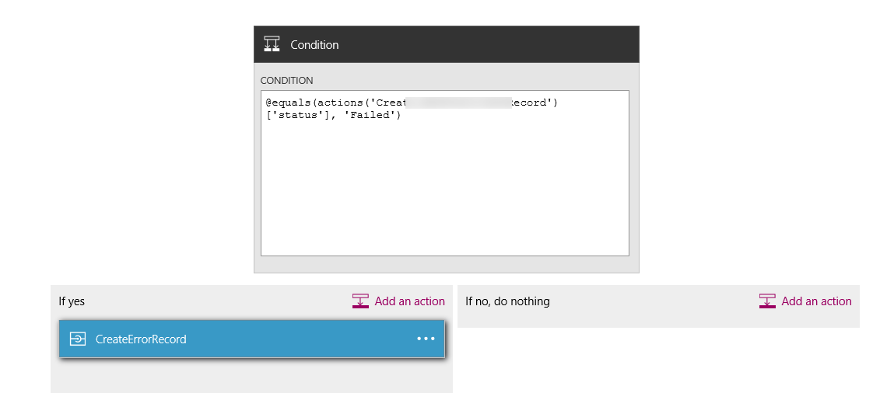
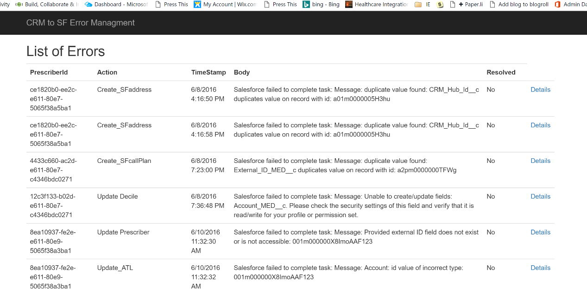

<properties
    pageTitle="Protokollierung und Fehlerbehandlung in Logik Apps | Microsoft Azure"
    description="Anzeigen einer realen Anwendungsfall-erweiterte Fehlers Behandlung und Protokollierung mit Logik Apps"
    keywords=""
    services="logic-apps"
    authors="hedidin"
    manager="anneta"
    editor=""
    documentationCenter=""/>

<tags
    ms.service="logic-apps"
    ms.workload="na"
    ms.tgt_pltfrm="na"
    ms.devlang="na"
    ms.topic="article"
    ms.date="07/29/2016"
    ms.author="b-hoedid"/>

# <a name="logging-and-error-handling-in-logic-apps"></a>Protokollierung und Fehlerbehandlung in Logik Apps

Dieser Artikel beschreibt, wie Sie eine app Logik zur Behandlung von Ausnahmen besser Unterstützung erweitern können. Es ist eine reale Anwendungsfall- und unsere Antwort auf die Frage, "Logik Apps Ausnahme und Fehlerbehandlung unterstützt?"

>[AZURE.NOTE]Die aktuelle Version des Logik Apps-Features von Microsoft Azure-App-Dienst bietet standard-Vorlage für Aktion Antworten.
>Dies umfasst sowohl interne Validierung und Fehlerantworten aus einer app API zurückgegeben.

## <a name="overview-of-the-use-case-and-scenario"></a>Übersicht über die Anwendungsfall- und Szenario

Die folgende Geschichte ist die Anwendungsfall-für diesen Artikel.
Eine bekannte im Gesundheitswesen Organisation nicht nachlässt uns eine Azure-Lösung entwickeln möchte, die einem Patienten Portal mithilfe von Microsoft Dynamics CRM Online erstellen möchten. Diese Termindatensätze zwischen dem Dynamics CRM Patienten Onlineportal und Vertrieb senden erforderlich sind.  Wir wurden aufgefordert werden, den standardmäßigen [HL7 FHIR](http://www.hl7.org/implement/standards/fhir/) für alle Patienten Datensätze verwendet werden soll.

Das Projekt hatte zwei Bereiche Anforderungen an:  

 -  Eine Methode zum Melden von Dynamics CRM Online-Portal gesendeten Datensätze
 -  Eine Möglichkeit zum Anzeigen von Fehlern, die innerhalb des Workflows aufgetreten sind


## <a name="how-we-solved-the-problem"></a>Wie wir das Problem gelöst

>[AZURE.TIP] Sie können bei der [Integration Benutzergruppe](http://www.integrationusergroup.com/do-logic-apps-support-error-handling/ "Integration Benutzergruppe")Video des Projekts auf hoher Ebene anzeigen.

Wir haben entschieden [Azure DocumentDB](https://azure.microsoft.com/services/documentdb/ "Azure DocumentDB") als Repository für die Protokolldateien und Fehlermeldungen Einträge (DocumentDB bezieht sich auf Datensätze als Dokumente) zu. Da Logik Apps eine Standardvorlage für alle Antworten verfügt, möchten wir kein benutzerdefiniertes Schema zu erstellen. Wir konnten eine app API zum **Einfügen** und **Abfrage** für Fehler und der Protokolldateien Datensätze erstellen. Wir konnten auch ein Schema für jede innerhalb der app API definieren.  

Eine weitere Anforderung wurde bereinigt Einträge nach einem bestimmten Datum. DocumentDB verfügt über eine Eigenschaft namens [Time to Live](https://azure.microsoft.com/blog/documentdb-now-supports-time-to-live-ttl/ "Time to Live") (TTL), die uns einen **Time to Live** -Wert für jeden Datensatz oder Websitesammlung festlegen zulässig. Dies überflüssig gemacht Datensätze in DocumentDB manuell zu löschen.

### <a name="creation-of-the-logic-app"></a>Erstellung der Logik-app

Der erste Schritt besteht die Logik app erstellen, und Laden es im Designer. In diesem Beispiel verwenden wir die über-und untergeordnete Elemente Logik apps. Angenommen, wir die übergeordnete bereits erstellt haben, und erstellen Sie eine untergeordnete Logik app vertraut sind.

Da wir den Eintrag in Kürze von Dynamics CRM Online anmelden möchten, beginnen Sie zunächst oben. Müssen wir einen Anforderung Trigger verwenden, da die übergeordnete Logik app dieses Kind auslöst.

> [AZURE.IMPORTANT] Um dieses Lernprogramms abgeschlossen haben, müssen Sie zum Erstellen einer Datenbank DocumentDB und zwei Websitesammlungen (Protokollierung und Fehler).

### <a name="logic-app-trigger"></a>Logik app trigger

Wir verwenden eine Anforderung auslösen, wie im folgenden Beispiel dargestellt.

```` json
"triggers": {
        "request": {
          "type": "request",
          "kind": "http",
          "inputs": {
            "schema": {
              "properties": {
                "CRMid": {
                  "type": "string"
                },
                "recordType": {
                  "type": "string"
                },
                "salesforceID": {
                  "type": "string"
                },
                "update": {
                  "type": "boolean"
                }
              },
              "required": [
                "CRMid",
                "recordType",
                "salesforceID",
                "update"
              ],
              "type": "object"
            }
          }
        }
      },

````


### <a name="steps"></a>Schritte

Müssen wir des Quellcodes (Anforderung) den Eintrag Patienten vom Dynamics CRM Online-Portal zu melden.

1. Müssen wir einen neuen Termin Eintrag von Dynamics CRM Online zu gelangen.
    Der Trigger aus CRM stammen bietet uns die **CRM PatentId**, **Datensatztyp**, **neu oder Datensatz aktualisiert** (neuen oder Aktualisieren der boolesche Wert), und **SalesforceId**. Die **SalesforceId** kann null sein, da sie nur für eine Aktualisierung verwendet wird.
    Wir erhalten den Eintrag CRM mithilfe der CRM **Patienten-ID** und den **Datensatztyp**.
1. Als Nächstes müssen wir unsere DocumentDB API app **InsertLogEntry** Vorgang hinzufügen, wie in der folgenden Abbildung gezeigt.


#### <a name="insert-log-entry-designer-view"></a>Einfügen von Log Eintrag Ansicht-Designers


#### <a name="insert-error-entry-designer-view"></a>Einfügen von Fehler Eintragsansicht-Designers


#### <a name="check-for-create-record-failure"></a>Datensatz Fehler beim Erstellen der prüfen




## <a name="logic-app-source-code"></a>Logik app-Quellcode

>[AZURE.NOTE]  Im folgenden sind nur Beispiele. Da dieses Lernprogramms auf eine Implementierung derzeit in Fertigung basiert, möglicherweise der Wert eines **Quellknoten** keine Eigenschaften angezeigt, die zum Planen eines Termins verwandt sind.

### <a name="logging"></a>Protokollierung
Im folgenden Logik app Beispiel wird gezeigt, wie Protokollierung verarbeitet werden.

#### <a name="log-entry"></a>Vertrieb
Dies ist der Logik app-Quellcode für einen Eintrag einfügen.

``` json
"InsertLogEntry": {
        "metadata": {
        "apiDefinitionUrl": "https://.../swagger/docs/v1",
        "swaggerSource": "website"
        },
        "type": "Http",
        "inputs": {
        "body": {
            "date": "@{outputs('Gets_NewPatientRecord')['headers']['Date']}",
            "operation": "New Patient",
            "patientId": "@{triggerBody()['CRMid']}",
            "providerId": "@{triggerBody()['providerID']}",
            "source": "@{outputs('Gets_NewPatientRecord')['headers']}"
        },
        "method": "post",
        "uri": "https://.../api/Log"
        },
        "runAfter":    {
            "Gets_NewPatientecord": ["Succeeded"]
        }
}
```

#### <a name="log-request"></a>Log-Anforderung

Dies ist die Log Request-Nachricht mit der API veröffentlicht.

``` json
    {
    "uri": "https://.../api/Log",
    "method": "post",
    "body": {
        "date": "Fri, 10 Jun 2016 22:31:56 GMT",
        "operation": "New Patient",
        "patientId": "6b115f6d-a7ee-e511-80f5-3863bb2eb2d0",
        "providerId": "",
        "source": "{\"Pragma\":\"no-cache\",\"x-ms-request-id\":\"e750c9a9-bd48-44c4-bbba-1688b6f8a132\",\"OData-Version\":\"4.0\",\"Cache-Control\":\"no-cache\",\"Date\":\"Fri, 10 Jun 2016 22:31:56 GMT\",\"Set-Cookie\":\"ARRAffinity=785f4334b5e64d2db0b84edcc1b84f1bf37319679aefce206b51510e56fd9770;Path=/;Domain=127.0.0.1\",\"Server\":\"Microsoft-IIS/8.0,Microsoft-HTTPAPI/2.0\",\"X-AspNet-Version\":\"4.0.30319\",\"X-Powered-By\":\"ASP.NET\",\"Content-Length\":\"1935\",\"Content-Type\":\"application/json; odata.metadata=minimal; odata.streaming=true\",\"Expires\":\"-1\"}"
        }
    }

```


#### <a name="log-response"></a>Log-Antwort

Dies ist der Log-Antwortnachricht aus der API-app.

``` json
{
    "statusCode": 200,
    "headers": {
        "Pragma": "no-cache",
        "Cache-Control": "no-cache",
        "Date": "Fri, 10 Jun 2016 22:32:17 GMT",
        "Server": "Microsoft-IIS/8.0",
        "X-AspNet-Version": "4.0.30319",
        "X-Powered-By": "ASP.NET",
        "Content-Length": "964",
        "Content-Type": "application/json; charset=utf-8",
        "Expires": "-1"
    },
    "body": {
        "ttl": 2592000,
        "id": "6b115f6d-a7ee-e511-80f5-3863bb2eb2d0_1465597937",
        "_rid": "XngRAOT6IQEHAAAAAAAAAA==",
        "_self": "dbs/XngRAA==/colls/XngRAOT6IQE=/docs/XngRAOT6IQEHAAAAAAAAAA==/",
        "_ts": 1465597936,
        "_etag": "\"0400fc2f-0000-0000-0000-575b3ff00000\"",
        "patientID": "6b115f6d-a7ee-e511-80f5-3863bb2eb2d0",
        "timestamp": "2016-06-10T22:31:56Z",
        "source": "{\"Pragma\":\"no-cache\",\"x-ms-request-id\":\"e750c9a9-bd48-44c4-bbba-1688b6f8a132\",\"OData-Version\":\"4.0\",\"Cache-Control\":\"no-cache\",\"Date\":\"Fri, 10 Jun 2016 22:31:56 GMT\",\"Set-Cookie\":\"ARRAffinity=785f4334b5e64d2db0b84edcc1b84f1bf37319679aefce206b51510e56fd9770;Path=/;Domain=127.0.0.1\",\"Server\":\"Microsoft-IIS/8.0,Microsoft-HTTPAPI/2.0\",\"X-AspNet-Version\":\"4.0.30319\",\"X-Powered-By\":\"ASP.NET\",\"Content-Length\":\"1935\",\"Content-Type\":\"application/json; odata.metadata=minimal; odata.streaming=true\",\"Expires\":\"-1\"}",
        "operation": "New Patient",
        "salesforceId": "",
        "expired": false
    }
}

```

Jetzt sehen wir uns die Schritte zur Fehlerbehandlung.


### <a name="error-handling"></a>Fehlerbehandlung

Im folgende Beispiel Logik Apps zeigt an, wie Sie Fehlerbehandlung implementieren können.

#### <a name="create-error-record"></a>Fehlerdatensatz erstellen

Dies ist der Logik Apps-Quellcode für das Erstellen eines Datensatzes zurück.

``` json
"actions": {
    "CreateErrorRecord": {
        "metadata": {
        "apiDefinitionUrl": "https://.../swagger/docs/v1",
        "swaggerSource": "website"
        },
        "type": "Http",
        "inputs": {
        "body": {
            "action": "New_Patient",
            "isError": true,
            "crmId": "@{triggerBody()['CRMid']}",
            "patientID": "@{triggerBody()['CRMid']}",
            "message": "@{body('Create_NewPatientRecord')['message']}",
            "providerId": "@{triggerBody()['providerId']}",
            "severity": 4,
            "source": "@{actions('Create_NewPatientRecord')['inputs']['body']}",
            "statusCode": "@{int(outputs('Create_NewPatientRecord')['statusCode'])}",
            "salesforceId": "",
            "update": false
        },
        "method": "post",
        "uri": "https://.../api/CrMtoSfError"
        },
        "runAfter":
        {
            "Create_NewPatientRecord": ["Failed" ]
        }
    }
}          
```

#### <a name="insert-error-into-documentdb--request"></a>Fehler beim Einfügen in DocumentDB – anfordern

``` json

{
    "uri": "https://.../api/CrMtoSfError",
    "method": "post",
    "body": {
        "action": "New_Patient",
        "isError": true,
        "crmId": "6b115f6d-a7ee-e511-80f5-3863bb2eb2d0",
        "patientId": "6b115f6d-a7ee-e511-80f5-3863bb2eb2d0",
        "message": "Salesforce failed to complete task: Message: duplicate value found: Account_ID_MED__c duplicates value on record with id: 001U000001c83gK",
        "providerId": "",
        "severity": 4,
        "salesforceId": "",
        "update": false,
        "source": "{\"Account_Class_vod__c\":\"PRAC\",\"Account_Status_MED__c\":\"I\",\"CRM_HUB_ID__c\":\"6b115f6d-a7ee-e511-80f5-3863bb2eb2d0\",\"Credentials_vod__c\",\"DTC_ID_MED__c\":\"\",\"Fax\":\"\",\"FirstName\":\"A\",\"Gender_vod__c\":\"\",\"IMS_ID__c\":\"\",\"LastName\":\"BAILEY\",\"MasterID_mp__c\":\"\",\"C_ID_MED__c\":\"851588\",\"Middle_vod__c\":\"\",\"NPI_vod__c\":\"\",\"PDRP_MED__c\":false,\"PersonDoNotCall\":false,\"PersonEmail\":\"\",\"PersonHasOptedOutOfEmail\":false,\"PersonHasOptedOutOfFax\":false,\"PersonMobilePhone\":\"\",\"Phone\":\"\",\"Practicing_Specialty__c\":\"FM - FAMILY MEDICINE\",\"Primary_City__c\":\"\",\"Primary_State__c\":\"\",\"Primary_Street_Line2__c\":\"\",\"Primary_Street__c\":\"\",\"Primary_Zip__c\":\"\",\"RecordTypeId\":\"012U0000000JaPWIA0\",\"Request_Date__c\":\"2016-06-10T22:31:55.9647467Z\",\"ONY_ID__c\":\"\",\"Specialty_1_vod__c\":\"\",\"Suffix_vod__c\":\"\",\"Website\":\"\"}",
        "statusCode": "400"
    }
}
```

#### <a name="insert-error-into-documentdb--response"></a>Fehler in DocumentDB – Antwort einfügen


``` json
{
    "statusCode": 200,
    "headers": {
        "Pragma": "no-cache",
        "Cache-Control": "no-cache",
        "Date": "Fri, 10 Jun 2016 22:31:57 GMT",
        "Server": "Microsoft-IIS/8.0",
        "X-AspNet-Version": "4.0.30319",
        "X-Powered-By": "ASP.NET",
        "Content-Length": "1561",
        "Content-Type": "application/json; charset=utf-8",
        "Expires": "-1"
    },
    "body": {
        "id": "6b115f6d-a7ee-e511-80f5-3863bb2eb2d0-1465597917",
        "_rid": "sQx2APhVzAA8AAAAAAAAAA==",
        "_self": "dbs/sQx2AA==/colls/sQx2APhVzAA=/docs/sQx2APhVzAA8AAAAAAAAAA==/",
        "_ts": 1465597912,
        "_etag": "\"0c00eaac-0000-0000-0000-575b3fdc0000\"",
        "prescriberId": "6b115f6d-a7ee-e511-80f5-3863bb2eb2d0",
        "timestamp": "2016-06-10T22:31:57.3651027Z",
        "action": "New_Patient",
        "salesforceId": "",
        "update": false,
        "body": "CRM failed to complete task: Message: duplicate value found: CRM_HUB_ID__c duplicates value on record with id: 001U000001c83gK",
        "source": "{\"Account_Class_vod__c\":\"PRAC\",\"Account_Status_MED__c\":\"I\",\"CRM_HUB_ID__c\":\"6b115f6d-a7ee-e511-80f5-3863bb2eb2d0\",\"Credentials_vod__c\":\"DO - Degree level is DO\",\"DTC_ID_MED__c\":\"\",\"Fax\":\"\",\"FirstName\":\"A\",\"Gender_vod__c\":\"\",\"IMS_ID__c\":\"\",\"LastName\":\"BAILEY\",\"MterID_mp__c\":\"\",\"Medicis_ID_MED__c\":\"851588\",\"Middle_vod__c\":\"\",\"NPI_vod__c\":\"\",\"PDRP_MED__c\":false,\"PersonDoNotCall\":false,\"PersonEmail\":\"\",\"PersonHasOptedOutOfEmail\":false,\"PersonHasOptedOutOfFax\":false,\"PersonMobilePhone\":\"\",\"Phone\":\"\",\"Practicing_Specialty__c\":\"FM - FAMILY MEDICINE\",\"Primary_City__c\":\"\",\"Primary_State__c\":\"\",\"Primary_Street_Line2__c\":\"\",\"Primary_Street__c\":\"\",\"Primary_Zip__c\":\"\",\"RecordTypeId\":\"012U0000000JaPWIA0\",\"Request_Date__c\":\"2016-06-10T22:31:55.9647467Z\",\"XXXXXXX\":\"\",\"Specialty_1_vod__c\":\"\",\"Suffix_vod__c\":\"\",\"Website\":\"\"}",
        "code": 400,
        "errors": null,
        "isError": true,
        "severity": 4,
        "notes": null,
        "resolved": 0
        }
}
```

#### <a name="salesforce-error-response"></a>Vertrieb Fehlerantwort

``` json
{
    "statusCode": 400,
    "headers": {
        "Pragma": "no-cache",
        "x-ms-request-id": "3e8e4884-288e-4633-972c-8271b2cc912c",
        "X-Content-Type-Options": "nosniff",
        "Cache-Control": "no-cache",
        "Date": "Fri, 10 Jun 2016 22:31:56 GMT",
        "Set-Cookie": "ARRAffinity=785f4334b5e64d2db0b84edcc1b84f1bf37319679aefce206b51510e56fd9770;Path=/;Domain=127.0.0.1",
        "Server": "Microsoft-IIS/8.0,Microsoft-HTTPAPI/2.0",
        "X-AspNet-Version": "4.0.30319",
        "X-Powered-By": "ASP.NET",
        "Content-Length": "205",
        "Content-Type": "application/json; charset=utf-8",
        "Expires": "-1"
    },
    "body": {
        "status": 400,
        "message": "Salesforce failed to complete task: Message: duplicate value found: Account_ID_MED__c duplicates value on record with id: 001U000001c83gK",
        "source": "Salesforce.Common",
        "errors": []
    }
}

```

### <a name="returning-the-response-back-to-the-parent-logic-app"></a>Die Antwort an den übergeordneten Logik app zurückgeben

Nachdem Sie die Antwort haben, können Sie ihn wieder zur übergeordneten Logik app übergeben.

#### <a name="return-success-response-to-the-parent-logic-app"></a>Erfolg Antwort mit der übergeordneten Logik zurückgeben

``` json
"SuccessResponse": {
    "runAfter":
        {
            "UpdateNew_CRMPatientResponse": ["Succeeded"]
        },
    "inputs": {
        "body": {
            "status": "Success"
    },
    "headers": {
    "   Content-type": "application/json",
        "x-ms-date": "@utcnow()"
    },
    "statusCode": 200
    },
    "type": "Response"
}
```

#### <a name="return-error-response-to-the-parent-logic-app"></a>Antwort mit der übergeordneten Logik Fehler zurückgeben

``` json
"ErrorResponse": {
    "runAfter":
        {
            "Create_NewPatientRecord": ["Failed"]
        },
    "inputs": {
        "body": {
            "status": "BadRequest"
        },
        "headers": {
            "Content-type": "application/json",
            "x-ms-date": "@utcnow()"
        },
        "statusCode": 400
    },
    "type": "Response"
}

```


## <a name="documentdb-repository-and-portal"></a>DocumentDB Repository und -portal

Unsere Lösung hinzugefügt Zusatzfunktionen mit [DocumentDB](https://azure.microsoft.com/services/documentdb).

### <a name="error-management-portal"></a>Verwaltungsportal zurück

Wenn der Fehler anzeigen möchten, können Sie eine MVC Web app zum Anzeigen von DocumentDB Datensätze zurück erstellen. **Liste**, **Details**, **Bearbeiten**und **Löschen von** Vorgängen sind in der aktuellen Version enthalten.

> [AZURE.NOTE]Vorgang bearbeiten: DocumentDB hat eine Ersetzen des gesamten Dokuments.
> Die Datensätze in der **Liste** und **Details** Ansichten angezeigt werden nur Beispiele. Es werden keine Termindatensätze der tatsächlichen Patienten.

Im folgenden werden Beispiele für unsere erstellt mit den oben beschriebenen Ansatz MVC-app-Details.

#### <a name="error-management-list"></a>Liste der Fehler-Verwaltung



#### <a name="error-management-detail-view"></a>Fehler beim Projektmanagement-Detailansicht


### <a name="log-management-portal"></a>Log-Verwaltungsportal

Zum Anzeigen der Protokolle können wir auch eine MVC Web app erstellt.  Im folgenden werden Beispiele für unsere erstellt mit den oben beschriebenen Ansatz MVC-app-Details.

#### <a name="sample-log-detail-view"></a>Beispiel für Log-Detailansicht


### <a name="api-app-details"></a>API app-details

#### <a name="logic-apps-exception-management-api"></a>Verwaltung von Logik Apps Ausnahmen API

Unsere öffnen Source-Logik Apps Ausnahme Management API app bietet die folgenden Funktionen.

Es gibt zwei Controller aus:

- **ErrorController** Fügt ein Eintrag zurück (Dokument) in eine Auflistung von DocumentDB.
- **LogController** Fügt einen Eintrag Log (Dokument) in eine Auflistung von DocumentDB.

> [AZURE.TIP] Verwenden Sie beide Controller `async Task<dynamic>` Vorgänge. Dadurch wird die Vorgänge zur Laufzeit aufgelöst werden, damit das Schema DocumentDB im Textkörper des Vorgangs erstellt werden können.

Jedes Dokument in DocumentDB muss eine eindeutige ID aufweisen. Wir verwenden die `PatientId` und Hinzufügen von einem Zeitstempel, die in einem Unix-Timestamp-Wert (Double) konvertiert wird. Wir kürzen, um den Wert rationale zu entfernen.

Sie können den Quellcode der unser Fehler Controller API [aus GitHub](https://github.com/HEDIDIN/LogicAppsExceptionManagementApi/blob/master/Logic App Exception Management API/Controllers/ErrorController.cs)anzeigen.

Wir Aufrufen die-API in einer app Logik mithilfe der folgenden Syntax.

``` json
 "actions": {
        "CreateErrorRecord": {
          "metadata": {
            "apiDefinitionUrl": "https://.../swagger/docs/v1",
            "swaggerSource": "website"
          },
          "type": "Http",
          "inputs": {
            "body": {
              "action": "New_Patient",
              "isError": true,
              "crmId": "@{triggerBody()['CRMid']}",
              "prescriberId": "@{triggerBody()['CRMid']}",
              "message": "@{body('Create_NewPatientRecord')['message']}",
              "salesforceId": "@{triggerBody()['salesforceID']}",
              "severity": 4,
              "source": "@{actions('Create_NewPatientRecord')['inputs']['body']}",
              "statusCode": "@{int(outputs('Create_NewPatientRecord')['statusCode'])}",
              "update": false
            },
            "method": "post",
            "uri": "https://.../api/CrMtoSfError"
          },
          "runAfter": {
              "Create_NewPatientRecord": ["Failed"]
            }
        }
 }
```

Der Ausdruck im vorhergehenden Beispiel wird der Status *Create_NewPatientRecord* **fehlgeschlagen**Überprüfung.

## <a name="summary"></a>Zusammenfassung

- Sie können ganz einfach Protokollierung und Fehlerbehandlung in einer app Logik implementieren.
- Sie können DocumentDB als Repository für Protokolldateien und Fehlermeldungen Einträge (Dokumente) verwenden.
- MVC können Sie um ein Portal zum Anzeigen Log und Fehlermeldungen Datensätze zu erstellen.

### <a name="source-code"></a>Quellcode
Beispiel-Quellcode für die Verwaltung von Ausnahmen Logik Apps API-Anwendung steht in dieser [GitHub Repository](https://github.com/HEDIDIN/LogicAppsExceptionManagementApi "Logik App Ausnahme Management-API").


## <a name="next-steps"></a>Nächste Schritte
- [Weitere Beispiele Logik Apps und Szenarien anzeigen](app-service-logic-examples-and-scenarios.md)
- [Erfahren Sie mehr über Logik Apps Überwachungstools](app-service-logic-monitor-your-logic-apps.md)
- [Erstellen einer App Logik automatisierte Bereitstellungsvorlage](app-service-logic-create-deploy-template.md)
