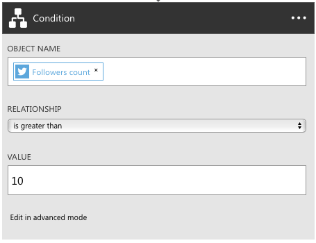

<properties 
    pageTitle="Verwenden Sie Logik App-Features | Microsoft Azure" 
    description="Informationen Sie zum Verwenden der erweiterten Features von Logik apps." 
    authors="stepsic-microsoft-com" 
    manager="erikre" 
    editor="" 
    services="logic-apps" 
    documentationCenter=""/>

<tags
    ms.service="logic-apps"
    ms.workload="integration"
    ms.tgt_pltfrm="na"
    ms.devlang="na"
    ms.topic="article"
    ms.date="03/28/2016"
    ms.author="stepsic"/> 
    
# Verwenden von Logik Apps-features

Im [vorherigen Thema](app-service-logic-create-a-logic-app.md)haben Sie die erste Logik app erstellt. Jetzt wird wir Sie so erstellen Sie einen genauere Prozess mithilfe der App Services Logik Apps angezeigt. In diesem Thema werden die folgenden neuen Logik Apps Konzepte vorgestellt:

- Bedingte Logik, der eine Aktion ausgeführt wird, nur, wenn eine bestimmte Bedingung erfüllt ist.
- Codeansicht zum Bearbeiten einer vorhandenen Logik app.
- Optionen zum Starten eines Workflows.

Bevor Sie dieses Thema abgeschlossen haben, sollten Sie die Schritte in [Erstellen einer neuen Logik app](app-service-logic-create-a-logic-app.md)abschließen. Im [Portal Azure]-navigieren Sie zu Ihrer Anwendung Logik, und klicken Sie auf **Trigger und Aktionen** in der Zusammenfassung die Logik app Definition bearbeiten.

## Referenzmaterial

Die folgenden Dokumente kann hilfreich sein:

- [Verwaltung und Laufzeit-APIs REST](https://msdn.microsoft.com/library/azure/mt643787.aspx) -, einschließlich so Logik apps direkt aufrufen
- [Sprache Verweis](https://msdn.microsoft.com/library/azure/mt643789.aspx) - eine umfassende Liste aller unterstützten Funktionen/Ausdrücke
- [Auslösen und Aktionstypen](https://msdn.microsoft.com/library/azure/mt643939.aspx) - die verschiedenen Typen von Aktionen und die Eingaben, die sie ergreifen
- [Übersicht der App-Verwaltungsdienst](../app-service/app-service-value-prop-what-is.md) - Beschreibung der welche Komponenten, um auszuwählen, wann eine Lösung erstellen

## Bedingten Logik hinzufügen

Obwohl der ursprüngliche Fluss funktioniert, gibt es einige Bereiche, die verbessert werden könnte. 

### Bedingte
Diese app Logik können Sie die erste viele e-Mails führen. Die folgenden Schritte durch Hinzufügen von Logik um sicherzustellen, dass Sie nur eine e-Mail-Nachricht erhalten, wenn die Tweet aus einer anderen Person mit einer bestimmten Anzahl von Followers stammen. 

1. Klicken Sie auf das Pluszeichen, und suchen Sie die Aktion *Erhalten Benutzer* für Twitter.

2. Übergeben Sie im Feld **Tweeted durch** , aus der auslösen, um die Informationen zu den Twitter-Benutzer erhalten.

    

3. Klicken Sie erneut auf das Pluszeichen, jedoch diesmal auswählen **Bedingung hinzufügen**

4. Klicken Sie im ersten Feld auf **...** unterhalb der **Benutzer erhalten** , finden im Feld **Anzahl Followers** .

5. Wählen Sie in der Dropdownliste **größer als**

6. Geben Sie im zweiten Feld die Anzahl der Followers, die Sie Benutzern zuweisen möchten.

    

7.  Schließlich ziehen und Ablegen der e-Mail im Feld, in das Feld **Wenn Ja** . Dies bedeutet, dass nur e-Mails erzielen Sie, wenn die Anzahl der Folgeelement erfüllt ist.

## Wiederholte über eine Liste mit forEach

Die ForEach-Schleife gibt eine Matrix zurück, wenn Sie über eine Aktion zu wiederholen. Wenn es sich nicht um ein Array handelt, schlägt illustrieren. Als Beispiel, wenn Sie Aktion1, die ein Array von Nachrichten ausgegeben haben und an jede Nachricht senden möchten Sie können einbeziehen dieser ForEach-Anweisung in den Eigenschaften die Aktion: ForEach:"@action('action1').outputs.messages"
 

## Verwenden der Codeansicht so bearbeiten Sie eine App Logik

Neben dem Designer können Sie direkt den Code bearbeiten, der eine app Logik wie folgt definiert. 

1. Klicken Sie auf die Schaltfläche **Code** für die Befehlsleiste. 

    Einen vollständigen-Editor, in dem die Definition angezeigt, die Sie gerade bearbeitet wird geöffnet.

    

    Mithilfe des Text-Editors können Sie kopieren und Einfügen eine beliebige Anzahl von Aktionen innerhalb der gleichen Logik app oder zwischen Logik apps. Sie können auch auf einfache Weise hinzufügen oder Entfernen der gesamten Abschnitte aus der Definition, und Sie können auch Definitionen für andere Personen freigeben.

2. Nachdem Sie Ihre Änderungen in der Codeansicht haben, klicken Sie einfach auf **Speichern**. 

### Parameter
Es gibt einige Funktionen von Logik Apps, die nur in der Codeansicht verwendet werden können. Ein Beispiel für diese ist Parameter. Parameter erleichtern die Werte in der gesamten Ihre app Logik wieder verwenden. Wenn Sie eine e-Mail-Adresse enthält, die Sie in mehrere Aktionen verwenden möchten, sollten Sie es beispielsweise als Parameter definieren.

Die folgenden aktualisiert, dass Sie Ihre vorhandene Logik-app, um die Parameter für den Abfrageausdruck verwendet.

1. Suchen Sie in der Codeansicht der `parameters : {}` -Objekt, und fügen Sie das folgende Thema Objekt:

        "topic" : {
            "type" : "string",
            "defaultValue" : "MicrosoftAzure"
        }
    
2. Ausführen eines Bildlaufs nach der `twitterconnector` Aktion, suchen Sie den Wert für die Abfrage, und Ersetzen Sie es mit `#@{parameters('topic')}`.
    Sie können auch mithilfe die Funktion **Verketten** um mindestens zwei Zeichenfolgen, beispielsweise miteinander zu verbinden: `@concat('#',parameters('topic'))` mit den oben angegebenen identisch ist. 
 
Parameter sind eine gute Möglichkeit, Werte herauszuziehen, die Sie wahrscheinlich sehr geändert werden. Sie sind besonders hilfreich, wenn Sie in verschiedenen Umgebungen Parameter außer Kraft setzen müssen. Weitere Informationen zum Parameter auf Grundlage der Umgebung außer Kraft setzen finden Sie unter unseren [REST-API-Dokumentation](https://msdn.microsoft.com/library/mt643787.aspx).

Nun, wenn Sie auf **Speichern**klicken, werden stündlich Sie alle neuen Tweets, die mehr als 5 Retweets in einem Ordner namens **Tweets** in Ihrem Dropbox übermittelt haben.

Wenn Sie weitere Informationen zur Logik App Definitionen finden Sie unter [Logik App Definitionen verfassen](app-service-logic-author-definitions.md).

## Starten eines Workflows der Logik-app
Es gibt mehrere verschiedene Optionen zum Starten des Workflows Logik app definiert. Ein Workflow kann immer bei Bedarf gestartet werden im [Azure-Portal].

### Serie Trigger
Ein Serie Trigger ausgeführt wird, die von Ihnen angegebenen Intervall. Wenn der Trigger bedingten Logik enthält, bestimmt der Trigger, ob der Workflow ausgeführt werden muss. Ein Trigger zeigt an, es sollte ausführen, indem Sie zurückgeben eines `200` Statuscode. Wenn es nicht ausführen muss, gibt es eine `202` Statuscode.

### Rückruf mit REST-APIs
Services können einen app-Endpunkt Logik zum Starten eines Workflows aufrufen. Weitere Informationen finden Sie unter [Logik apps als aufgerufen Endpunkte](app-service-logic-connector-http.md) . Um diese Art von Logik app bei Bedarf zu beginnen, klicken Sie auf die Schaltfläche **jetzt ausführen** , klicken Sie auf der Befehlsleiste. 

<!-- Shared links -->
[Azure-portal]: https://portal.azure.com 