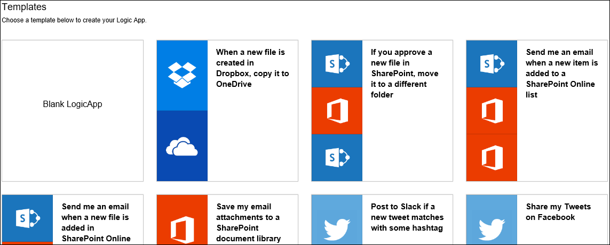
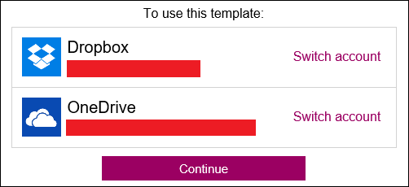
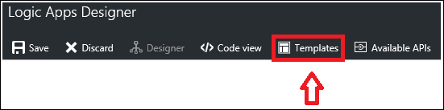

<properties
 pageTitle="App-Vorlagen Logik | Microsoft Azure"
 description="Erfahren Sie, wie zuvor erstellte Logik app-Vorlagen Raumpläne"
 authors="kevinlam1"
 manager="dwrede"
 editor=""
 services="app-service\logic"
 documentationCenter=""/>

<tags
    ms.service="app-service-logic"
    ms.workload="integration"
    ms.tgt_pltfrm="na"
    ms.devlang="na"
    ms.topic="article"
    ms.date="08/24/2016"
    ms.author="klam"/>

# Logik App-Vorlagen

## Was sind Logik app-Vorlagen

Vorlage app Logik ist eine vorgefertigte Logik app, die Sie zum schnellen Einstieg beim Erstellen Ihrer eigenen Workflows verwenden können. 

Diese Vorlagen sind eine gute Möglichkeit zum Ermitteln der verschiedenen Mustern mit Logik apps erstellt werden kann. Sie können entweder diese Vorlagen als-ist, oder ändern Sie sie, um Ihrem Szenario passt.

## Übersicht über die verfügbaren Vorlagen

Es gibt viele verfügbare Vorlagen, die derzeit in der app-Plattform Logik veröffentlicht. Einige Beispiel Kategorien als auch den Typ der Verbinder in diese verwendet werden nachfolgend aufgeführt.

### Enterprise-Cloud-Vorlagen
Vorlagen, die Dynamics CRM, Vertrieb, Feld, Azure Blob und andere Connectors für Ihre Enterprise-Cloud-Anforderungen integriert werden soll. Einige Beispiele für Aktionen mit diesen durchgeführt werden können Vorlagen Organisieren von Leads und Sichern Ihrer Dateidaten corporate enthalten.

### Enterprise-Integration Pack-Vorlagen
Konfigurationen von VETER (überprüfen, extrahieren, transformieren, bereichern, weiterleiten) Pipelines, ein X12 EDI Dokument über AS2 sowie in XML, als X12 und AS2 Nachricht Versand empfangen.

### Protokoll Muster Vorlagen
Diese Vorlagen bestehen aus Logik apps, die Protokoll Mustern wie Anfrage-Antwort über HTTP sowie Integration über FTP und SFTP enthalten. Verwenden Sie diese wie diese vorhanden sind, oder als Grundlage für komplexere Protokoll Muster erstellen.  

### Persönliche Produktivität Vorlagen
Muster zur Verbesserung der Produktivität persönliche einbeziehen Vorlagen, die tägliche Erinnerungen festlegen, Umwandeln von Arbeit wichtige Elemente in Vorgangslisten und Automatisieren von langen Aufgaben auf einen einzelnen Benutzer Genehmigungsschritt

### Consumer Cloud-Vorlagen
Einfache Vorlagen, die mit den Diensten von sozialer Medien wie Twitter, Pufferzeit und schließlich in sozialen Medien Marketinginitiativen Stärken e-Mail integriert werden soll. Hierzu gehören auch Vorlagen z. B. bewölkt kopieren, die Produktivität steigern, indem Sie die Zeit für auf traditionell auszuführende Vorgänge speichern helfen können. 

## So erstellen Sie eine Logik app mithilfe einer Vorlage 

Um anzufangen Logik app Vorlage verwenden, wechseln Sie in den app-Designer Logik. Wenn Sie den Designer durch Öffnen einer vorhandenen Logik app eingeben, wird die app Logik in Ihrer Ansicht-Designer automatisch geladen. Wenn Sie eine neue Logik app erstellen, wird jedoch im folgenden Bildschirm.  
   

Dieser Bildschirm können Sie entweder auswählen, um mit einer leeren Logik app oder eine vorgefertigte Vorlage zu starten. Wenn Sie eine der Vorlagen auswählen, erhalten Sie weitere Informationen. In diesem Beispiel verwenden wir die Vorlage *beim Erstellen eine neue Datei in Dropbox, kopieren sie OneDrive* aus.  
   

Wenn Sie die Vorlage verwenden, wählen Sie einfach die Schaltfläche *mithilfe dieser Vorlage* . Sie werden aufgefordert, melden Sie sich an Ihren Konten basierend auf welche, die Connectors die Vorlage verwendet. Wenn Sie eine Verbindung mit diesen Connectors zuvor eingerichtet haben, können Sie auswählen wie folgt fortsetzen.  
   

Nach dem Herstellen der Verbindung und *weiterhin*ausgewählt haben, wird die Logik-app in der Entwurfsansicht.  
   

Im obigen Beispiel wie viele Vorlagen, zutrifft möglicherweise einige Felder verbindliche Eigenschaft innerhalb der Verbinder ausgefüllt werden; erfordert jedoch möglicherweise einige immer noch einen Wert, damit Sie die app Logik ordnungsgemäß bereitstellen zu können. Wenn Sie versuchen, ohne Eingabe einiger fehlende Felder bereitstellen, erhalten Sie eine Fehlermeldung benachrichtigt.

Wenn Sie den Betrachter Vorlage zurückgeben möchten, wählen Sie die Schaltfläche " *Vorlagen* " in der oberen Navigationsleiste. Wechseln Sie zurück zum Betrachter Vorlage, verlieren Sie alle nicht gespeicherten Status aus. Vor dem Wechsel wieder in Vorlage Viewer, sehen Sie eine Warnung angezeigt, die Sie diesen benachrichtigt.  
   

## Gewusst wie: Bereitstellen eine Logik app aus einer Vorlage erstellt wurde

Sobald Sie Ihre Vorlage geladen und alle gewünschten Änderungen vorgenommen haben, wählen Sie speichern aus Schaltfläche in der oberen linken Ecke. Dies speichert und Ihre app Logik veröffentlicht.  
   

Wenn Sie weitere Informationen erhalten möchten, klicken Sie auf bearbeitet so weitere Maßnahmen, die in einer vorhandenen Logik app-Vorlage hinzuzufügen, oder stellen Sie im Allgemeinen erfahren Sie mehr unter [eine app Logik zu erstellen](app-service-logic-create-a-logic-app.md).