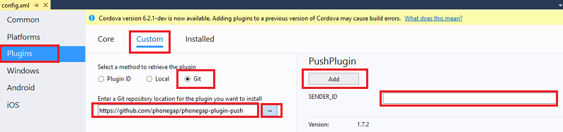

<properties
    pageTitle="Hinzufügen von Pushbenachrichtigungen zu Apache Cordova App mit Azure mobilen Apps | Azure App-Verwaltungsdienst"
    description="Informationen Sie zum Azure Mobile-Apps zu verwenden, um Pushbenachrichtigungen zu Ihrer Apache Cordova-Anwendung zu senden."
    services="app-service\mobile"
    documentationCenter="javascript"
    manager="erikre"
    editor=""
    authors="ysxu"/>

<tags
    ms.service="app-service-mobile"
    ms.workload="mobile"
    ms.tgt_pltfrm="mobile-html"
    ms.devlang="javascript"
    ms.topic="article"
    ms.date="10/01/2016"
    ms.author="yuaxu"/>

# Hinzufügen von Pushbenachrichtigungen zu Ihrer Apache Cordova-Anwendung

[AZURE.INCLUDE [app-service-mobile-selector-get-started-push](../../includes/app-service-mobile-selector-get-started-push.md)]

## (Übersicht)

In diesem Lernprogramm fügen Sie Pushbenachrichtigungen des Projekts [Apache Cordova schnell zu starten] , damit eine Pushbenachrichtigung an das Gerät gesendet werden, jedes Mal, wenn ein Datensatz eingefügt wird.

Wenn Sie die heruntergeladene Schnellstart Server Project nicht verwenden, benötigen Sie das Pushbenachrichtigungen Benachrichtigung Erweiterungspaket. Weitere Informationen finden Sie unter [Arbeiten mit der Back-End-Server SDK für Mobile-Apps Azure](app-service-mobile-dotnet-backend-how-to-use-server-sdk.md) .

##Erforderliche Komponenten

In diesem Lernprogramm behandelt Anwendung Apache Cordova entwickelt mit Visual Studio 2015, die für den Google Android Emulator, Android-Gerät, ein Windows-Gerät und einem iOS-Gerät ausgeführt wird.

Um dieses Lernprogramms abgeschlossen haben, müssen Sie folgende Aktionen ausführen:

* PC mit [Visual Studio Community 2015] oder höhere Versionen.
* [Visual Studio-Tools für Apache Cordova].
* Ein [Aktives Azure-Konto](https://azure.microsoft.com/pricing/free-trial/).
* Ein fertigen [Apache Cordova Schnellstart] -Projekt.
* (Android) [Gmail-Konto] mit einem überprüft e-Mail-Adresse.
* (iOS) Eine Mitgliedschaft Apple Developer-Programm und einem iOS-Gerät (iOS Simulator unterstützt keine Pushbenachrichtigungen).
* (Windows) Ein Windows Store-Entwickler-Konto und einem Windows-10-Gerät.

##Konfigurieren eines Benachrichtigung Hubs

[AZURE.INCLUDE [app-service-mobile-configure-notification-hub](../../includes/app-service-mobile-configure-notification-hub.md)]

[Zeigen Sie ein Video mit der Schritte in diesem Abschnitt](https://channel9.msdn.com/series/Azure-connected-services-with-Cordova/Azure-connected-services-task-3-Create-azure-notification-hub)

##Aktualisieren der Project Server um Pushbenachrichtigungen zu senden.

[AZURE.INCLUDE [app-service-mobile-update-server-project-for-push-template](../../includes/app-service-mobile-update-server-project-for-push-template.md)]

##Ändern Sie Ihre app Cordova zum Empfangen von Pushbenachrichtigungen

Sie müssen sicherstellen, dass Projekt app Apache Cordova Pushbenachrichtigungen durch Installieren der Cordova Pushbenachrichtigungen-Plug-Ins sowie alle Dienste Plattform-spezifische Pushbenachrichtigungen verarbeitet werden kann.

#### Aktualisieren Sie die Version Cordova in Ihrem Projekt.

Es empfiehlt sich, das Clientprojekt zu Cordova 6.1.1 aktualisieren, wenn Ihr Projekt mit einer älteren Version konfiguriert ist. Um das Projekt zu aktualisieren, und mit der rechten Maustaste config.xml, um die Konfiguration-Designer zu öffnen. Wählen Sie die Registerkarte Plattformen, und wählen Sie in das Textfeld **Cordova CLI** 6.1.1 aus.

Wählen Sie **Erstellen**, und klicken Sie dann **Lösung erstellen** , aktualisieren das Projekt aus.

#### Installieren Sie das Plug-in Pushbenachrichtigungen

Apache Cordova Applikationen behandelt nicht systembedingt Gerät oder Netzwerk-Funktionen.  Diese Funktionen werden von-Plug-Ins bereitgestellt, die auf [Npm](https://www.npmjs.com/) oder GitHub veröffentlicht werden.  Die `phonegap-plugin-push` -Plug-Ins wird verwendet, um Pushbenachrichtigungen Netzwerk zu behandeln.

Sie können das Pushbenachrichtigungen-Plug-in eine der folgenden Arten installieren:

**Über die Befehlszeile:**

Führen Sie den folgenden Befehl ein:

    cordova plugin add phonegap-plugin-push

**Von Visual Studio:**

1.  Öffnen Sie im Explorer-Lösung den `config.xml` Datei, klicken Sie auf **-Plug-Ins** > **Benutzerdefiniert**wählen Sie als die Installationsquelle **Git** aus, und geben Sie `https://github.com/phonegap/phonegap-plugin-push` als Quelle.

    

2.  Klicken Sie auf den Pfeil neben der Installationsquelle.

3. In **SENDER_ID**Wenn Sie eine numerische Projektnummer für das Projekt Google Entwicklertools Console bereits können Sie ihn hier hinzufügen. Geben Sie andernfalls einen Platzhalterwert wie 777777, und wenn Sie Android verwendet, können Sie diesen Wert in config.xml später aktualisieren.

4. Klicken Sie auf **Hinzufügen**.

Das Plug-in Pushbenachrichtigungen ist jetzt installiert.

####Installieren Sie das Gerät-Plug-Ins

Befolgen Sie dasselbe Verfahren, mit dem Sie die Pushbenachrichtigungen-Plug-In installiert, aber das Gerät-Plug-Ins finden Sie in der Liste der Core-Plug-Ins (klicken Sie auf **-Plug-Ins** > **Core** zu finden). Sie benötigen diese-Plug-in, um den Plattformnamen erhalten (`device.platform`).

#### Registrieren Sie Ihr Gerät für Pushbenachrichtigungen beim Start

Wir werden zunächst einige minimalen Code für Android enthalten. Höher, wird wir machen, einige kleinen Änderungen für iOS oder Windows 10 ausgeführt.

1. Fügen Sie einen Anruf an **RegisterForPushNotifications** während des Rückrufs für die Anmeldung oder am Ende der Methode **OnDeviceReady** hinzu:

        // Login to the service.
        client.login('google')
            .then(function () {
                // Create a table reference
                todoItemTable = client.getTable('todoitem');

                // Refresh the todoItems
                refreshDisplay();

                // Wire up the UI Event Handler for the Add Item
                $('#add-item').submit(addItemHandler);
                $('#refresh').on('click', refreshDisplay);

                    // Added to register for push notifications.
                registerForPushNotifications();

            }, handleError);

    In diesem Beispiel zeigt **RegisterForPushNotifications** aufrufen, nachdem die Authentifizierung erfolgreich ist, wird die empfohlen, wenn sowohl Pushbenachrichtigungen und Authentifizierung in Ihre app zu verwenden.

2. Fügen Sie die neue Methode **RegisterForPushNotifications** wie folgt ein:

        // Register for Push Notifications. Requires that phonegap-plugin-push be installed.
        var pushRegistration = null;
        function registerForPushNotifications() {
          pushRegistration = PushNotification.init({
              android: { senderID: 'Your_Project_ID' },
              ios: { alert: 'true', badge: 'true', sound: 'true' },
              wns: {}
          });

        // Handle the registration event.
        pushRegistration.on('registration', function (data) {
          // Get the native platform of the device.
          var platform = device.platform;
          // Get the handle returned during registration.
          var handle = data.registrationId;
          // Set the device-specific message template.
          if (platform == 'android' || platform == 'Android') {
              // Register for GCM notifications.
              client.push.register('gcm', handle, {
                  mytemplate: { body: { data: { message: "{$(messageParam)}" } } }
              });
          } else if (device.platform === 'iOS') {
              // Register for notifications.            
              client.push.register('apns', handle, {
                  mytemplate: { body: { aps: { alert: "{$(messageParam)}" } } }
              });
          } else if (device.platform === 'windows') {
              // Register for WNS notifications.
              client.push.register('wns', handle, {
                  myTemplate: {
                      body: '<toast><visual><binding template="ToastText01"><text id="1">$(messageParam)</text></binding></visual></toast>',
                      headers: { 'X-WNS-Type': 'wns/toast' } }
              });
          }
        });

        pushRegistration.on('notification', function (data, d2) {
          alert('Push Received: ' + data.message);
        });

        pushRegistration.on('error', handleError);
        }

3. (Android) Ersetzen Sie im obigen Code `Your_Project_ID` mit den numerischen project-ID für Ihre app über die [Google Entwicklertools Console].

## (Optional) Konfigurieren Sie, und führen Sie die app für Android

Führen Sie diesen Abschnitt, um Pushbenachrichtigungen für Android aktivieren.

####Aktivieren Sie Firebase Cloud Messaging

Da wir die Google Android-Plattform Anfangs verwenden, müssen Sie Firebase Cloud Messaging aktivieren. Wenn Sie Microsoft Windows-Geräten verwendet wurden, möchten Sie WNS Support aktivieren.

[AZURE.INCLUDE [notification-hubs-enable-firebase-cloud-messaging](../../includes/notification-hubs-enable-firebase-cloud-messaging.md)]

####Konfigurieren Sie die Mobile-App Back-End-Senden von Pushbenachrichtigungen Anfragen FCM verwenden

[AZURE.INCLUDE [app-service-mobile-android-configure-push](../../includes/app-service-mobile-android-configure-push.md)]

####Konfigurieren Sie Ihre Cordova-app für Android

Klicken Sie in Ihrer app Cordova config.xml öffnen, und Ersetzen Sie `Your_Project_ID` mit den numerischen project-ID für Ihre app über die [Google Entwicklertools Console].

        <plugin name="phonegap-plugin-push" version="1.7.1" src="https://github.com/phonegap/phonegap-plugin-push.git">
            <variable name="SENDER_ID" value="Your_Project_ID" />
        </plugin>

Öffnen Sie index.js, und aktualisieren Sie den Code, um Ihre numerische Project-ID verwendet wird.

        pushRegistration = PushNotification.init({
            android: { senderID: 'Your_Project_ID' },
            ios: { alert: 'true', badge: 'true', sound: 'true' },
            wns: {}
        });

####Konfigurieren von Ihrem Android-Gerät für das Debuggen von USB

Bevor Sie die Anwendung auf Ihrem Android-Gerät bereitstellen können, müssen Sie USB-Debuggen zu aktivieren.  Führen Sie die folgenden Schritte auf Ihrem Android-Smartphone:

1. Wechseln Sie zu **Einstellungen** > **über Telefon**, und tippen Sie auf die **Build-Nummer** bis Entwicklermodus (etwa 7 Mal) aktiviert ist.

2. In den **Einstellungen** > **Entwicklertools Optionen** **USB-Debuggen**aktivieren, und klicken Sie dann Herstellen einer Verbindung Ihrer Entwicklung PC mit einem USB-Kabel mit Ihrem Android-Smartphone.

Wir getestet mit einem Google Nexus 5 X-Gerät mit Android 6.0 (Kaugummi).  Die Verfahren sind jedoch über alle modernen Android Release allgemeine.

#### Installieren von Google Play Services

Das Plug-in Pushbenachrichtigungen beruht auf Android Google-Diensten auf Wiedergabe für Pushbenachrichtigungen.  

1.  Klicken Sie auf **Extras**, in **Visual Studio** > **Android** > **Android SDK-Manager**, erweitern Sie den Ordner **Extras** , und aktivieren Sie das Kontrollkästchen, um sicherzustellen, dass alle folgenden SDKs installiert ist.
    * Android 2.3 oder höher
    * Google Repository Überarbeitung 27 oder höher
    * Wiedergabe Google-Diensten 9.0.2 oder höher

2.  Klicken Sie auf **Pakete installieren** und warten Sie, bis die Installation abgeschlossen.

Das aktuelle erforderlichen Bibliotheken in der [Dokumentation zur Installation Phonegap--Plug-in-Pushbenachrichtigungen]aufgelistet werden.

#### Testen von Pushbenachrichtigungen in der app für Android

Sie können jetzt testen Pushbenachrichtigungen, indem Sie die app ausgeführt und Einfügen von Elementen in der Tabelle TodoItem. Sie können von dem gleichen Gerät oder ein zweites Gerät, ausführen, solange Sie mit der gleichen Back-End-arbeiten. Testen Sie Ihre app Cordova auf dem Android-Plattform auf eine der folgenden Methoden aus:

- **Auf einem physischen Gerät:**  
Fügen Sie Ihrem Android-Gerät auf Ihren Entwicklungscomputer mit einem USB-Kabel an.  Wählen Sie anstelle von **Google Android Emulator**- **Gerät**aus. Visual Studio bereitstellen die Anwendung auf dem Gerät und auszuführen.  Sie können dann mit der Anwendung auf dem Gerät interagieren.  
Verbessern Sie Ihre Erfahrung in der Entwicklung.  Anwendungen wie [Mobizen] für die Bildschirmfreigabe unterstützen Sie bei der Entwicklung von Android Anwendung durch ein Projektor angeschlossen ist Android Bildschirms an einem Webbrowser auf Ihrem PC.

- **Klicken Sie auf einem Android-Emulator:**  
Es gibt zusätzliche Konfigurationsschritte erforderlich sind, wenn auf einem Emulator ausgeführt.

    Stellen Sie sicher, dass Sie zum Bereitstellen oder auf virtuellen Geräten, die das Ziel festgelegte Google-APIs enthält Debuggen, wie unten dargestellt, in der Android virtuelle Gerät (AVD)-Manager.

    

    Wenn Sie eine schnellere X86 verwenden möchten Emulator, die Sie [den HAXM-Treiber installieren](https://taco.visualstudio.com/en-us/docs/run-app-apache/#HAXM) und konfigurieren den Emulator verwenden.

    Gmail-Konto auf dem Android-Gerät hinzufügen, indem Sie auf **Apps** > **Einstellungen** > **Konto hinzufügen**, und klicken Sie dann die Anweisungen zum Hinzufügen einer vorhandenen Google-Konto auf das Gerät (Es empfiehlt sich ein vorhandenes Konto verwenden, statt Erstellen einer neuen) folgen.

    

    Führen Sie die Aufgabenliste app als vor, und fügen Sie ein neues Element der erledigen. Diesmal, wird ein Benachrichtigungssymbol im Infobereich angezeigt. Öffnen Sie die Benachrichtigung Einzug, um den vollständigen Text der Benachrichtigung anzuzeigen.

    

##(Optional) Konfigurieren Sie, und führen Sie für iOS

Dieser Abschnitt ist für das Projekt Cordova für iOS-Geräte ausgeführt. Wenn Sie nicht mit iOS-Geräte arbeiten, können Sie diesen Abschnitt überspringen.

####Installieren und Ausführen des iOS Remotebuild Agents auf einem Mac oder Cloud-Dienst

Bevor Sie eine app Cordova unter iOS mit Visual Studio ausführen können, führen Sie die Schritte in der [iOS Handbuch](http://taco.visualstudio.com/en-us/docs/ios-guide/) zum Installieren und Ausführen des Remotebuild-Agents aus.

Stellen Sie sicher, dass Sie die app für iOS erstellen können. Die Schritte im Handbuch für das sind erforderlich für iOS von Visual Studio erstellen. Wenn Sie nicht mit einen Mac verfügen, können Sie für iOS mithilfe des Remotebuild-Agents auf einen Service wie MacInCloud erstellen. Weitere Informationen finden Sie unter [Ausführen von Ihrem iOS-app in der Cloud](http://taco.visualstudio.com/en-us/docs/build_ios_cloud/).

>[AZURE.NOTE] Verwenden Sie das Plug-in Pushbenachrichtigungen unter iOS ist XCode 7 oder höher erforderlich.

####Suchen Sie nach der ID als Ihre App-ID verwenden

Bevor Sie Ihre app für Pushbenachrichtigungen, geöffneten config.xml in Ihrer app Cordova registrieren Suchen nach der `id` -Attribut Wert im Widget-Element, und kopieren Sie sie zur späteren Verwendung. Im folgenden XML, ist die ID `io.cordova.myapp7777777`.

        <widget defaultlocale="en-US" id="io.cordova.myapp7777777"
        version="1.0.0" windows-packageVersion="1.1.0.0" xmlns="http://www.w3.org/ns/widgets"
            xmlns:cdv="http://cordova.apache.org/ns/1.0" xmlns:vs="http://schemas.microsoft.com/appx/2014/htmlapps">

Verwenden Sie diesen Bezeichner später beim Erstellen einer App-ID auf Apple Entwicklerportal. (Wenn Sie eine andere App-ID auf die Entwicklerportal erstellen und dieses verwenden möchten, müssen Sie einige zusätzliche Schritte Unternehmen, später in diesem Lernprogramm diese ID in config.xml ändern. Die ID im Widget-Element muss die App-ID in der Entwicklerportal übereinstimmen.)

####Registrieren Sie sich die app für Pushbenachrichtigungen auf Apple Entwicklerportal

[AZURE.INCLUDE [Enable Apple Push Notifications](../../includes/enable-apple-push-notifications.md)]

[Zeigen Sie ein Video mit ähnlichen Schritten](https://channel9.msdn.com/series/Azure-connected-services-with-Cordova/Azure-connected-services-task-5-Set-up-apns-for-push)

####Konfigurieren von Azure um Pushbenachrichtigungen zu senden.

[AZURE.INCLUDE [app-service-mobile-apns-configure-push](../../includes/app-service-mobile-apns-configure-push.md)]

####Stellen Sie sicher, dass Ihre App-ID Ihre app Cordova entsprechen.

Wenn die App-ID, die Sie bereits in Ihrem Apple Developer Konto erstellt die ID des Widget-Elements in config.xml entspricht, können Sie diesen Schritt überspringen. Wenn die IDs nicht entsprechen, gehen Sie folgendermaßen vor:

1. Löschen Sie den Ordner Plattformen aus Ihrem Projekt.

2. Löschen Sie den Ordner-Plug-Ins aus Ihrem Projekt.

3. Löschen Sie den Ordner Node_modules aus Ihrem Projekt.

4. Aktualisieren Sie das Id-Attribut des Widget-Elements in config.xml der App-ID verwenden, die Sie in Ihrem Apple Developer Konto erstellt haben.

5. Erstellen Sie Ihr Projekt neu.

#####Testen von Pushbenachrichtigungen in Ihrer app für iOS

1. Stellen Sie in Visual Studio sicher, dass die **iOS** als Bereitstellungsziel ausgewählt ist, und wählen Sie dann das **Gerät** auf Ihrem verbundenen iOS-Gerät ausführen.

    Sie können auf einem iOS-Gerät an Ihren Computer angeschlossen ausführen iTunes verwenden. IOS Simulator unterstützt Pushbenachrichtigungen nicht.

2. Drücken Sie die Schaltfläche **Ausführen** oder **F5** in Visual Studio erstellen Sie das Projekt, und starten Sie die app auf einem iOS-Gerät, und klicken Sie auf **OK** , um Pushbenachrichtigungen zu übernehmen.

    >[AZURE.NOTE] Sie müssen explizit Pushbenachrichtigungen zustimmen, aus der app. Diese Anforderung tritt nur beim ersten, die die app ausgeführt wird.

3. Geben Sie einen Vorgang in der app, und klicken Sie dann auf das Pluszeichen (+) Symbol.

4. Stellen Sie sicher, dass eine Benachrichtigung empfangen wird, und klicken Sie auf OK, um die Benachrichtigung zu schließen.

##(Optional) Konfigurieren und Ausführen von Windows

In diesem Abschnitt ist zum Ausführen des app-Projekts Apache Cordova auf Windows-10-Geräten (die PhoneGap Pushbenachrichtigungen-Plug-Ins wird auf Windows 10 unterstützt). Wenn Sie nicht mit Windows-Geräten arbeiten, können Sie diesen Abschnitt überspringen.

####Registrieren Sie Ihre Windows-app für Pushbenachrichtigungen mit WNS

Wenn die Optionen zur Speicherung in Visual Studio verwenden möchten, wählen Sie ein Windows-Ziel aus der Liste Lösung Plattformen wie **Windows-X64** oder **Windows-X86** ( **Windows-AnyCPU** für Pushbenachrichtigungen zur Vermeidung).

[AZURE.INCLUDE [app-service-mobile-register-wns](../../includes/app-service-mobile-register-wns.md)]

[Zeigen Sie ein Video mit ähnlichen Schritten](https://channel9.msdn.com/series/Azure-connected-services-with-Cordova/Azure-connected-services-task-6-Set-up-wns-for-push)

####Konfigurieren Sie den Benachrichtigung Hub für WNS

[AZURE.INCLUDE [app-service-mobile-configure-wns](../../includes/app-service-mobile-configure-wns.md)]

####Konfigurieren der app Cordova zur Unterstützung von Pushbenachrichtigungen für Windows

Öffnen Sie den Kontokonfigurations-Designer (Rechtsklick auf config.xml und select **Ansicht-Designer**), wählen Sie die **Windows** -Registerkarte, und wählen Sie **Windows 10** unter **Windows Zielversion**.

>[AZURE.NOTE] Wenn Sie eine Version Cordova vor Cordova 5.1.1 (6.1.1 empfohlen) verwenden, müssen Sie auch die Kennzeichen Spruch in True in config.xml festlegen.

Zur Unterstützung von Pushbenachrichtigungen Benachrichtigungen in Ihrem standardmäßigen (Debuggen) erstellt wurde, build.json geöffneten Datei. Kopieren Sie die Konfiguration "Release", an der Konfiguration Debuggen.

        "windows": {
            "release": {
                "packageCertificateKeyFile": "res\\native\\windows\\CordovaApp.pfx",
                "publisherId": "CN=yourpublisherID"
            }
        }

Nach der Aktualisierung sollte der vorherige Code wie folgt aussehen.

    "windows": {
        "release": {
            "packageCertificateKeyFile": "res\\native\\windows\\CordovaApp.pfx",
            "publisherId": "CN=yourpublisherID"
            },
        "debug": {
            "packageCertificateKeyFile": "res\\native\\windows\\CordovaApp.pfx",
            "publisherId": "CN=yourpublisherID"
            }
        }

Erstellen Sie die app, und stellen Sie sicher, dass Sie keine Fehler aufweisen. Client app sollte für die Benachrichtigungen aus der Mobile-App Back-End-jetzt registrieren. Wiederholen Sie diesen Abschnitt für jedes Windows-Projekt in der Lösung.

####Testen von Pushbenachrichtigungen in Ihrem Windows-app

Visual Studio stellen Sie sicher, dass eine Windows-Plattform als Bereitstellungsziel, wie etwa **Windows-X64** oder **Windows-X86**ausgewählt ist. Wählen Sie zum Ausführen der app auf einem PC mit Windows 10 Hostinganbieter Visual Studio **Lokaler Computer**aus.

Drücken Sie die Schaltfläche "ausführen", erstellen Sie das Projekt, und starten Sie die app aus.

Klicken Sie in der app, geben Sie einen Namen für eine neue Todoitem, und klicken Sie dann auf das Pluszeichen (+) das Symbol, um es hinzuzufügen.

Stellen Sie sicher, dass eine Benachrichtigung empfangen wurde, wenn das Element hinzugefügt wird.

##Nächste Schritte

* Weitere Informationen zum [Benachrichtigung Hubs] Pushbenachrichtigungen lernen.
* Wenn Sie dies nicht bereits getan haben, fahren Sie Lernprogramm zu Ihrer Anwendung Apache Cordova von [Authentifizierung hinzufügen] .

Erfahren Sie, wie die SDKs verwenden.

* [Apache Cordova SDK]
* [ASP.NET Server SDK]
* [Node.js Server SDK]

<!-- URLs -->
[Hinzufügen von Authentifizierung]: app-service-mobile-cordova-get-started-users.md
[Schnellstart Apache Cordova]: app-service-mobile-cordova-get-started.md
[authentication]: app-service-mobile-cordova-get-started-users.md
[Work with the .NET backend server SDK for Azure Mobile Apps]: app-service-mobile-dotnet-backend-how-to-use-server-sdk.md
[Gmail-Konto]: http://go.microsoft.com/fwlink/p/?LinkId=268302
[Google Entwicklertools Konsole]: https://console.developers.google.com/home/dashboard
[Dokumentation zur Installation PhoneGap--Plug-in-Pushbenachrichtigungen]: https://github.com/phonegap/phonegap-plugin-push/blob/master/docs/INSTALLATION.md
[Mobizen]: https://www.mobizen.com/
[Visual Studio-Community 2015]: http://www.visualstudio.com/
[Visual Studio-Tools für Apache Cordova]: https://www.visualstudio.com/en-us/features/cordova-vs.aspx
[Benachrichtigung Hubs]: ../notification-hubs/notification-hubs-push-notification-overview.md
[Apache Cordova SDK]: app-service-mobile-cordova-how-to-use-client-library.md
[ASP.NET Server SDK]: app-service-mobile-dotnet-backend-how-to-use-server-sdk.md
[Node.js Server SDK]: app-service-mobile-node-backend-how-to-use-server-sdk.md
