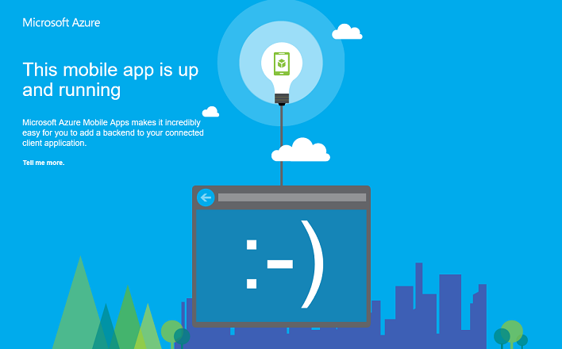

<properties
    pageTitle="Zum Arbeiten mit dem .NET Back-End-Server SDK für Mobile-Apps | Azure App-Verwaltungsdienst"
    description="Informationen Sie zum Arbeiten mit dem .NET Back-End-Server SDK für Azure App Dienst Mobile-Apps."
    keywords="App-Dienst, Azure app-Dienst, mobile-app, mobile Service, skalieren skalierbare, app Bereitstellung, Azure app-Bereitstellung"
    services="app-service\mobile"
    documentationCenter=""
    authors="adrianhall"
    manager="erikre"
    editor=""/>

<tags
    ms.service="app-service-mobile"
    ms.workload="mobile"
    ms.tgt_pltfrm="mobile-multiple"
    ms.devlang="dotnet"
    ms.topic="article"
    ms.date="10/01/2016"
    ms.author="adrianha"/>

# Arbeiten Sie mit der Back-End-Server SDK für Azure Mobile-Apps

[AZURE.INCLUDE [app-service-mobile-selector-server-sdk](../../includes/app-service-mobile-selector-server-sdk.md)]

In diesem Thema wird gezeigt, wie die Back-End-Server SDK in Schlüsselszenarien Azure App Dienst Mobile-Apps verwendet werden kann. Azure Mobile-Apps-SDK hilft Ihnen bei der Arbeit mit mobilen Clients aus Ihrer Anwendung ASP.NET.

>[AZURE.TIP] [.NET Server SDK für Mobile-Apps Azure] [ 2] Quelle GitHub geöffnet ist. Das Repository enthält alle Quellcode, einschließlich der gesamten Server SDK Unit Test-Suite und einige Beispielprojekte.

## Dokumentation zur

Der Dokumentation für den Server SDK befindet sich hier: [Azure Mobile Apps .NET Bezug][1].

## So: Erstellen einer .NET Mobile-App Back-End-

Wenn Sie ein neues Projekt starten, können Sie eine App-verwaltungsdienstanwendung mit dem [Azure-Portal] oder Visual Studio erstellen. Können Sie die App-Service-Anwendung lokal ausgeführt werden, oder veröffentlichen Sie das Projekt zu Ihrer cloudbasierten mobilen App-Service-Anwendung.  

Wenn Sie ein vorhandenes Projekt mobile Funktionen hinzufügen, finden Sie im Abschnitt [herunterladen und Initialisierung das SDK](#install-sdk) .

### Erstellen einer .NET Back-End-über das Azure-portal

Zum Erstellen einer App-Dienst mobilen Back-End-führen Sie entweder das [Schnellstart-Lernprogramm] [ 3] oder gehen Sie folgendermaßen vor:

[AZURE.INCLUDE [app-service-mobile-dotnet-backend-create-new-service-classic](../../includes/app-service-mobile-dotnet-backend-create-new-service-classic.md)]

Zurück in das _Erste Schritte_ -Blade, klicken Sie unter **Erstellen einer Tabelle API**wählen Sie **c#** als **Back-End-Sprache**. Klicken Sie auf **herunterladen**, Extrahieren der komprimierten Projektdateien mit Ihrem lokalen Computer, und öffnen Sie die Lösung in Visual Studio.

### Erstellen einer .NET Back-End-mit Visual Studio 2013 und Visual Studio 2015

Installieren Sie das [Azure SDK für .NET] [ 4] (Version 2.9.0 oder höher) zu einem Projekt Azure Mobile-Apps in Visual Studio erstellen. Nachdem Sie das SDK installiert haben, erstellen Sie ASP.NET-Anwendung mithilfe der folgenden Schritte aus:

1. Öffnen Sie das Dialogfeld **Neues Projekt** (aus *Datei* > **neu** > **Projekt...**).
2. Erweitern Sie **Vorlagen** > **C#-**und select **Web**.
3. Wählen Sie **ASP.NET Web-Anwendung**.
4. Füllen Sie den Projektnamen ein. Klicken Sie dann auf **OK**.
5. Klicken Sie unter _ASP.NET 4.5.2 Vorlagen_, wählen Sie **Azure Mobile-App**aus. Aktivieren Sie **in der Cloud Host** um einen mobilen Back-End-in der Cloud zu erstellen, in dem Sie dieses Projekt veröffentlichen können.
6. Klicken Sie auf **OK**.

## So: herunterladen und das SDK Initialisierung

Das SDK ist unter ["NuGet.org"]verfügbar. Dieses Paket enthält die base Funktionalität zur Seite Erste Schritte mit dem SDK erforderlich. Das SDK Initialisierung, müssen Sie auf das Objekt **HttpConfiguration** Aktionen ausführen.

### Installieren Sie das SDK

Klicken Sie zum Installieren das SDK mit der rechten Maustaste auf den Server-Projekt in Visual Studio, wählen Sie **NuGet-Pakete verwalten**, für das Paket [Microsoft.Azure.Mobile.Server] suchen, und klicken Sie auf **Installieren**.

###Initialisierung der Project server

Ein Projekt von .NET Back-End-Server ist durch, einschließlich einer OWIN Start-Klasse mit anderen ASP.NET-Projekten vergleichbar Initialisierung. Stellen Sie sicher, dass Sie das NuGet-Paket verwiesen haben `Microsoft.Owin.Host.SystemWeb`. Um diese Klasse in Visual Studio hinzugefügt, mit der rechten Maustaste auf das Server-Projekt, und wählen Sie **Hinzufügen** > 
**Neues Element**, und klicken Sie dann auf **Web** > **Allgemeine** > **OWIN Start Class**.  Eine Klasse ist mit dem folgenden Attribut erzeugt:

    [assembly: OwinStartup(typeof(YourServiceName.YourStartupClassName))]

In der `Configuration()` Methode der Klasse OWIN starten, verwenden Sie ein Objekt **HttpConfiguration** Konfiguration die Umgebung Azure Mobile-Apps.
Im folgende Beispiel initialisiert die Project Server mit keine zusätzlichen Funktionen:

    // in OWIN startup class
    public void Configuration(IAppBuilder app)
    {
        HttpConfiguration config = new HttpConfiguration();

        new MobileAppConfiguration()
            // no added features
            .ApplyTo(config);

        app.UseWebApi(config);
    }

Zum Aktivieren der einzelner Funktionen müssen Sie die Erweiterungsmethoden auf das Objekt **MobileAppConfiguration** aufrufen, bevor Sie **auf**. Beispielsweise der folgenden Code hinzugefügt die Standard-leitet alle API Controller mit dem Attribut `[MobileAppController]` bei der Initialisierung:

    new MobileAppConfiguration()
        .MapApiControllers()
        .ApplyTo(config);

Der Server Schnellstart vom Azure-Portal ruft **UseDefaultConfiguration()**. Diese Entsprechung in der Einrichtung die folgenden:

        new MobileAppConfiguration()
            .AddMobileAppHomeController()             // from the Home package
            .MapApiControllers()
            .AddTables(                               // from the Tables package
                new MobileAppTableConfiguration()
                    .MapTableControllers()
                    .AddEntityFramework()             // from the Entity package
                )
            .AddPushNotifications()                   // from the Notifications package
            .MapLegacyCrossDomainController()         // from the CrossDomain package
            .ApplyTo(config);

Die Erweiterungsmethoden verwendet werden:

* `AddMobileAppHomeController()`Stellt die standardmäßigen Homepage Azure Mobile-Apps.
* `MapApiControllers()`enthält benutzerdefinierte API-Funktionen, die sich auf WebAPI Controller mit versehen der `[MobileAppController]` Attribut.
* `AddTables()`Stellt eine Zuordnung der `/tables` von Endpunkten in Tabelle Controller.
* `AddTablesWithEntityFramework()`eine kurze-Hand für die Zuordnung ist die `/tables` Endpunkte mithilfe von Entität Framework basierend Controller.
* `AddPushNotifications()`Stellt eine einfache Methode der registrieren Geräte für Benachrichtigung Hubs an.
* `MapLegacyCrossDomainController()`Stellt standard CORS Kopfzeilen für lokale Entwicklung an.

### SDK Erweiterungen

Die folgenden NuGet-basierten Erweiterung Pakete bieten verschiedene mobile Geräte Features, die von der Anwendung verwendet werden können. Sie aktivieren Erweiterungen bei der Initialisierung mithilfe des Objekts **MobileAppConfiguration** .

- [Microsoft.Azure.Mobile.Server.Quickstart] unterstützt die grundlegende Einrichtung von Mobile-Apps. An der Konfiguration hinzugefügt, indem Sie die Methode **UseDefaultConfiguration** Erweiterung bei der Initialisierung. Diese Erweiterung umfasst die folgenden Erweiterungen: Benachrichtigungen, Authentifizierung, Entität, Tabellen, Domänen- und Start-Paketen. Dieses Paket wird von der Mobile-Apps-Schnellstart Azure-Portal verwendet.

- [Microsoft.Azure.Mobile.Server.Home](http://www.nuget.org/packages/Microsoft.Azure.Mobile.Server.Home/) 
   Standard implementiert *mobile-app ist einsatzbereit Seite* für die Website aus. Fügen Sie an der Konfiguration, indem die   **AddMobileAppHomeController** Erweiterungsmethode aufrufen.

- [Microsoft.Azure.Mobile.Server.Tables](http://www.nuget.org/packages/Microsoft.Azure.Mobile.Server.Tables/) 
   umfasst Klassen zum Arbeiten mit Daten und die Daten Verkaufspipeline einrichten. Fügen Sie an der Konfiguration, indem die **AddTables** Erweiterungsmethode aufrufen.

- [Microsoft.Azure.Mobile.Server.Entity](http://www.nuget.org/packages/Microsoft.Azure.Mobile.Server.Entity/) 
   ermöglicht die Entität Framework mit Access-Daten in der SQL-Datenbank. Fügen Sie an der Konfiguration, indem die **AddTablesWithEntityFramework** Erweiterungsmethode aufrufen.

- [Microsoft.Azure.Mobile.Server.Authentication] Authentifizierung aktiviert und einrichten die OWIN Middleware verwendet Token zu bestätigen. An der Konfiguration hinzufügen, indem Sie die **AddAppServiceAuthentication**  
   und **IAppBuilder**. **UseAppServiceAuthentication** Erweiterungsmethoden.

- [Microsoft.Azure.Mobile.Server.Notifications] ermöglicht Pushbenachrichtigungen und einen Pushbenachrichtigungen Registrierung Endpunkt definiert. Fügen Sie an der Konfiguration, indem die **AddPushNotifications** Erweiterungsmethode aufrufen.

- [Microsoft.Azure.Mobile.Server.CrossDomain](http://www.nuget.org/packages/Microsoft.Azure.Mobile.Server.CrossDomain/) 
   erstellt einen Controller, die Daten zu älteren Webbrowsern aus der Mobile-App fungiert. Fügen Sie an der Konfiguration, indem die   **MapLegacyCrossDomainController** Erweiterungsmethode aufrufen.

- [Microsoft.Azure.Mobile.Server.Login] stellt die AppServiceLoginHandler.CreateToken()-Methode, also eine statische Methode, die während der benutzerdefinierten Authentifizierung verwendet wird.   

## So: Veröffentlichen der Project Server

In diesem Abschnitt wird gezeigt, wie Ihr .NET Back-End-Projekt aus Visual Studio veröffentlicht werden kann. Sie können auch mithilfe von Git oder eine der anderen Methoden in der [Dokumentation der App-Verwaltungsdienst Azure-Bereitstellung](../app-service-web/web-sites-deploy.md)behandelt Back-End-Projekt bereitstellen.

1. Erstellen Sie Projekt zum Wiederherstellen von NuGet-Paketen neu in Visual Studio.

2. Im Explorer-Lösung mit der rechten Maustaste in des Projekts, und klicken Sie auf **Veröffentlichen**. Beim ersten, die Sie veröffentlichen möchten, müssen Sie ein Profil für die Veröffentlichung definieren. Wenn Sie bereits über ein Profil definiert haben, können Sie wählen Sie ihn aus und klicken Sie auf **Veröffentlichen**.

2. Zum Auswählen eines Ziels veröffentlichen, klicken Sie anschließend auf **Microsoft Azure-App-Verwaltungsdienst** > **Weiter**, und klicken Sie dann (falls erforderlich) mit Ihren Anmeldeinformationen Azure anmelden. 
   Visual Studio downloads und sicheres Speichern der Einstellungen direkt aus Azure veröffentlichen.

    

3. Wählen Sie Ihr **Abonnement**, wählen Sie die **Ressourcenart** aus der **Ansicht**, erweitern Sie **Mobile-App**, und klicken Sie auf Ihre Mobile-App Back-End-und dann auf **OK**.

    

4. Überprüfen Sie die Profilinformationen veröffentlichen, und klicken Sie auf **Veröffentlichen**.

    

    Wenn Ihre Mobile-App Back-End-erfolgreich veröffentlicht wurde, wird eine Erfolgsmeldung Startseite.

    

##So: definieren einen Tabelle Controller

Definieren einer Tabelle Controller, um eine SQL-Tabelle mit mobilen Clients verfügbar zu machen.  Konfigurieren einer Tabelle Controller sind drei Schritte erforderlich:

1. Erstellen einer Klasse Daten übertragen Objekt (DTO).
2. Konfigurieren Sie einen Tabellenverweis in der Klasse DbContext Mobile an.
3. Erstellen eines Tabelle Controllers an.

Daten übertragen Objekt (DTO) ist ein einfarbigen c#-Objekt, das von erbt `EntityData`.  Beispiel:

    public class TodoItem : EntityData
    {
        public string Text { get; set; }
        public bool Complete {get; set;}
    }

Das DTO wird verwendet, um die Tabelle in der SQL-Datenbank definieren.  Um den Datenbankeintrag zu erstellen, fügen ein `DbSet<>` -Eigenschaft, um die DbContext verwenden.  In der Standard-Projektvorlage für Azure Mobile-Apps, die DbContext heißt `Models\MobileServiceContext.cs`:

    public class MobileServiceContext : DbContext
    {
        private const string connectionStringName = "Name=MS_TableConnectionString";

        public MobileServiceContext() : base(connectionStringName)
        {

        }

        public DbSet<TodoItem> TodoItems { get; set; }

        protected override void OnModelCreating(DbModelBuilder modelBuilder)
        {
            modelBuilder.Conventions.Add(
                new AttributeToColumnAnnotationConvention<TableColumnAttribute, string>(
                    "ServiceColumnTable", (property, attributes) => attributes.Single().ColumnType.ToString()));
        }
    }

Wenn Sie das Azure SDK installiert haben, können Sie einen Vorlage Tabelle Controller jetzt wie folgt erstellen:

1. Mit der rechten Maustaste auf den Ordner Controller, und wählen Sie **Hinzufügen** > **... Controller**.
2. Wählen Sie die Option **Azure Mobile Apps Tabelle Controller** , und klicken Sie auf **Hinzufügen**.
3. Im Dialogfeld **Controller hinzufügen** :
    * Wählen Sie in der Dropdownliste **Modellklasse** Ihrer neuen DTO.
    * Wählen Sie in der Dropdownliste **DbContext** die Mobile Service DbContext Klasse ein.
    * Der Name der Controller wird für Sie erstellt.
4. Klicken Sie auf **Hinzufügen**.

Schnellstart-Server-Projekt enthält ein Beispiel für eine einfache **TodoItemController**an.

### So: Anpassen der Seitennavigation Tabellengröße

Standardmäßig gibt Azure Mobile-Apps 50 Datensätze pro Anforderung.  Seitennavigation: Damit ist sichergestellt, dass der Client nicht deren UI-Thread noch auf dem Server zu lange, gebunden ist um eine gute Benutzerfunktionalität. Zum Ändern der Tabellengröße Seitennavigation vergrößern "zulässige Abfragegröße" serverseitig und clientseitig Seitengröße serverseitig "zulässige Abfragegröße" wird angepasst mithilfe der `EnableQuery` Attribut:

    [EnableQuery(PageSize = 500)]

Sicherstellen, dass die PageSize ist gleich oder größer als die Größe von dem Client angefordert.  Schlagen Sie in den betreffenden Client so wird's gemacht Dokumentation ausführliche Informationen zum Ändern des Papierformats Client.

## So: definieren einen benutzerdefinierten API Controller

Der benutzerdefinierte API-Controller bietet die grundlegendste Funktionen, um Ihre Mobile-App Back-End-durch einen Endpunkt verfügbar machen. Sie können einen Mobilgerät-spezifische API Controller mit dem Attribut [MobileAppController] registrieren. Die `MobileAppController` Attribut registriert die Routing, richtet das Mobile Apps JSON-Serialisierungsprogramm und wird die [Client Version Überprüfung](app-service-mobile-client-and-server-versioning.md)aktiviert.

1. Klicken Sie in Visual Studio mit der rechten Maustaste in des Ordners Controller und anschließend auf **Hinzufügen** > **Controller**, wählen Sie **Web-API 2 Controller&mdash;leeren** , und klicken Sie auf **Hinzufügen**.

2. Geben Sie einen **Namen Controller**, wie `CustomController`, und klicken Sie auf **Hinzufügen**.

3. In der neuen Controller Klassendatei, fügen Sie die folgende Anweisung verwenden:

        using Microsoft.Azure.Mobile.Server.Config;

4. Wenden Sie das Attribut **[MobileAppController]** , auf die API Controller Class Definition, wie im folgenden Beispiel gezeigt:

        [MobileAppController]
        public class CustomController : ApiController
        {
              //...
        }

4. Fügen Sie einen Anruf an die **MapApiControllers** Erweiterungsmethode, wie im folgenden Beispiel App_Start/Startup.MobileApp.cs Datei hinzu:

        new MobileAppConfiguration()
            .MapApiControllers()
            .ApplyTo(config);

Sie können auch die `UseDefaultConfiguration()` Erweiterungsmethode statt `MapApiControllers()`. Einen beliebigen Controller an, die keinen **MobileAppControllerAttribute** angewendet enthält immer noch über Clients zugegriffen werden kann, aber es möglicherweise nicht ordnungsgemäß verbraucht werden von Clients mit einem beliebigen Mobile-App-Client SDK.

## So: Arbeiten mit Authentifizierung

Azure Mobile-Apps verwendet die App-Dienstauthentifizierung / Autorisierung Ihre mobile Back-End-gesichert.  In diesem Abschnitt wird gezeigt, wie die folgenden Authentifizierung-bezogene Aufgaben im Projekt .NET Back-End-Server ausführen:

+ [So: Authentifizierung für eine Project Server hinzufügen](#add-auth)
+ [So: Verwenden von benutzerdefinierten Authentifizierung für eine Anwendung](#custom-auth)
+ [So: Abrufen authentifiziert Benutzerinformationen](#user-info)
+ [So: Einschränken des Zugriffs für autorisierte Benutzer Daten](#authorize)

### So: Authentifizierung für eine Project Server hinzufügen

Sie können Authentifizierung zum Serverprojekt hinzufügen, indem Sie das Objekt **MobileAppConfiguration** erweitern und OWIN Middleware konfigurieren. Wenn Sie das Paket [Microsoft.Azure.Mobile.Server.Quickstart] installieren und rufen Sie die **UseDefaultConfiguration** Erweiterungsmethode, können Sie Schritt 3 überspringen.

1. Installieren Sie das Paket [Microsoft.Azure.Mobile.Server.Authentication] in Visual Studio.

2. Fügen Sie in der Projektdatei Startup.cs die folgende Zeile des Codes am Anfang der Methode **Konfiguration** hinzu:

        app.UseAppServiceAuthentication(config);

    Diese OWIN Middleware Komponente überprüft Token ausgestellt von das zugewiesene Gateway der App-Dienst an.

3. Hinzufügen der `[Authorize]` Attribut an einer beliebigen Controller oder eine Methode, die Authentifizierung erforderlich ist. 

Informationen dazu, wie Sie Ihre Mobile-Apps Back-End-Clients authentifizieren finden Sie unter [Hinzufügen von Authentifizierung zu Ihrer Anwendung](app-service-mobile-ios-get-started-users.md).

### So: Verwenden von benutzerdefinierten Authentifizierung für eine Anwendung

Wenn Sie nicht, eine der App-Dienst Authentifizierung/Autorisierung Anbieter verwenden möchten, können Sie eigene Login-System implementieren. Installieren Sie das Paket [Microsoft.Azure.Mobile.Server.Login] zur Unterstützung bei token Generation Authentifizierung.  Bereitstellen von eigenem Code zur Überprüfung Benutzeranmeldeinformationen an. Beispielsweise können Sie gegen salted und gestrichelte Kennwörter in einer Datenbank aktivieren. Im folgenden Beispiel wird die `isValidAssertion()` (an anderer Stelle definiert) Methode für diese Prüfungen verantwortlich ist.

Benutzerdefinierte Authentifizierung wird durch Erstellen einer ApiController und Verfügbarmachen bereitgestellt `register` und `login` Aktionen. Der Client sollte eine benutzerdefinierte Benutzeroberfläche zum Sammeln von Informationen von der Benutzer verwenden.  Die Informationen wird dann an die API mit einem standard HTTP POST Anruf übermittelt. Nachdem der Server die Assertion überprüft wurde, wird ein Token ausgestellt mithilfe der `AppServiceLoginHandler.CreateToken()` Methode.  Die ApiController **sollte nicht** verwenden die `[MobileAppController]` Attribut. 

Beispiel für `login` Aktion:

        public IHttpActionResult Post([FromBody] JObject assertion)
        {
            if (isValidAssertion(assertion)) // user-defined function, checks against a database
            {
                JwtSecurityToken token = AppServiceLoginHandler.CreateToken(new Claim[] { new Claim(JwtRegisteredClaimNames.Sub, assertion["username"]) },
                    mySigningKey,
                    myAppURL,
                    myAppURL,
                    TimeSpan.FromHours(24) );
                return Ok(new LoginResult()
                {
                    AuthenticationToken = token.RawData,
                    User = new LoginResultUser() { UserId = userName.ToString() }
                });
            }
            else // user assertion was not valid
            {
                return this.Request.CreateUnauthorizedResponse();
            }
        }

Das vorstehende Beispiel werden LoginResult und LoginResultUser serialisierbare Objekte erforderliche Eigenschaften verfügbar zu machen. Der Client erwartet Login Antworten als JSON-Objekte des Formulars zurückgegeben werden soll:

        {
            "authenticationToken": "<token>",
            "user": {
                "userId": "<userId>"
            }
        }

Die `AppServiceLoginHandler.CreateToken()` Methode berücksichtigt, einer _Zielgruppe_ und eines _Herausgebers_ Parameter. Beide Parameter werden auf die URL des Stammverzeichnis der Anwendung, die mit dem HTTPS-Schema festgelegt. Ebenso sollten Sie _SecretKey_ sein, dass der Wert der Anwendung Schlüssel Signieren des festlegen. Verteilen Sie den signierenden Schlüssel in einem Client nicht als MinZ Tasten und annehmen von Benutzern verwendet werden kann. Sie können den signierenden Key, während im App-Dienst durch Verweisen auf gehostet erhalten die _WEBSITE\_Autorisierende\_signieren\_KEY_ Umgebungsvariable. Bei Bedarf in einem lokalen Debuggen Kontext Anweisungen Sie im Abschnitt [lokale Debuggen mit Authentifizierung](#local-debug) die Taste abrufen und speichern Sie es als anwendungseinstellung einer.

Das registrierte Token kann auch andere Ansprüche und ein Ablaufdatum enthalten.  Minimal, darf das ausgestellte Token einen Anspruch Betreff (**Sub**) enthalten.

Sie können den standard-Client unterstützen `loginAsync()` Methode durch Überladen der Authentifizierung weiterleiten.  Wenn der Client ruft `client.loginAsync('custom');` zum Anmelden, muss Ihr Routing `/.auth/login/custom`.  Lassen sich die Routing für die benutzerdefinierte Authentifizierung Controller mit `MapHttpRoute()`:

    config.Routes.MapHttpRoute("custom", ".auth/login/custom", new { controller = "CustomAuth" });

>[AZURE.TIP] Verwenden der `loginAsync()` Ansatz stellt sicher, dass das Authentifizierungstoken zu jeder nachfolgenden Anruf mit dem Dienst verbunden ist.

###So: Abrufen authentifiziert Benutzerinformationen

Wenn ein Benutzer von App-Dienst authentifiziert wird, können Sie die zugeordneten Benutzer-ID und andere Informationen in Ihrem .NET Back-End-Code zugreifen. Die Benutzerinformationen kann für die Autorisierung Entscheidung in die Back-End-verwendet werden. Im folgende Code erhält die Benutzer-ID, die einer Anforderung zugeordnet:

    // Get the SID of the current user.
    var claimsPrincipal = this.User as ClaimsPrincipal;
    string sid = claimsPrincipal.FindFirst(ClaimTypes.NameIdentifier).Value;

Die SID ist abgeleitet von anbieterspezifische Benutzer-ID und ist für einen bestimmten Benutzer und Login Anbieter statisch.  Die SID ist null für ungültige Authentifizierungstoken.

App-Dienst ermöglicht Ihnen außerdem, bestimmte Ansprüche von Ihrem Anbieter Login anfordern. Jede Identitätsanbieter kann weitere Informationen zum Verwenden der Identitätsanbieter SDK bereitstellen.  Beispielsweise können Sie die Facebook-Graph-API Freunde Informationen ein.  Sie können die Ansprüche, die angefordert werden in Anbieter vorher in der Azure-Portal angeben. Einige Ansprüche erfordern zusätzliche Konfiguration mit dem Identitätsanbieter.

Der folgende Code Ruft die **GetAppServiceIdentityAsync** Erweiterung-Methode, um die Anmeldeinformationen abzurufen, die gehören das Zugriffstoken anzufordern gegen die Facebook-API Graph erforderlich:

    // Get the credentials for the logged-in user.
    var credentials =
        await this.User
        .GetAppServiceIdentityAsync<FacebookCredentials>(this.Request);

    if (credentials.Provider == "Facebook")
    {
        // Create a query string with the Facebook access token.
        var fbRequestUrl = "https://graph.facebook.com/me/feed?access_token="
            + credentials.AccessToken;

        // Create an HttpClient request.
        var client = new System.Net.Http.HttpClient();

        // Request the current user info from Facebook.
        var resp = await client.GetAsync(fbRequestUrl);
        resp.EnsureSuccessStatusCode();

        // Do something here with the Facebook user information.
        var fbInfo = await resp.Content.ReadAsStringAsync();
    }

Fügen Sie eine using-Anweisung für `System.Security.Principal` die **GetAppServiceIdentityAsync** Erweiterungsmethode bereitstellen.

### So: Einschränken des Zugriffs für autorisierte Benutzer Daten

Im vorherigen Abschnitt haben wir gezeigt, wie die Benutzer-ID von einem authentifizierten Benutzer abgerufen. Sie können den Zugriff auf Daten und anderen Ressourcen basierend auf diesem Wert einschränken. Hinzufügen einer Benutzer-ID-Spalteninhalts zu Tabellen und Filtern die Abfrageergebnisse, indem Sie die Benutzer-ID beträgt beispielsweise eine einfache Möglichkeit, die zurückgegebene Daten nur für autorisierte Benutzer zu beschränken. Im folgenden Beispiel wird die Datenzeilen nur, wenn die SID den Wert in der Benutzer-ID-Spalte in der Tabelle TodoItem entspricht:

    // Get the SID of the current user.
    var claimsPrincipal = this.User as ClaimsPrincipal;
    string sid = claimsPrincipal.FindFirst(ClaimTypes.NameIdentifier).Value;

    // Only return data rows that belong to the current user.
    return Query().Where(t => t.UserId == sid);

Die `Query()` Methode gibt eine `IQueryable` , die nicht von LINQ verarbeitet Filtern bearbeitet werden können.

## So: Hinzufügen von Pushbenachrichtigungen Benachrichtigungen zu einem Serverprojekt

Hinzufügen von Pushbenachrichtigungen zum Serverprojekt durch das Objekt **MobileAppConfiguration** erweitern und Erstellen einer Benachrichtigung Hubs Client.

1. In Visual Studio mit der rechten Maustaste in die Project Server, und klicken Sie auf **NuGet-Pakete verwalten**, suchen Sie nach `Microsoft.Azure.Mobile.Server.Notifications`, klicken Sie dann auf **Installieren**. 

2. Wiederholen Sie diesen Schritt zum Installieren der `Microsoft.Azure.NotificationHubs` -Paket, wozu auch die Benachrichtigung Hubs Client-Bibliothek.

3. In App_Start/Startup.MobileApp.cs und fügen Sie bei der Initialisierung eines Anrufs an die **AddPushNotifications()** Erweiterungsmethode hinzu:

        new MobileAppConfiguration()
            // other features...
            .AddPushNotifications()
            .ApplyTo(config);

4. Fügen Sie den folgenden Code, der einen Benachrichtigung Hubs Client erstellt:

        // Get the settings for the server project.
        HttpConfiguration config = this.Configuration;
        MobileAppSettingsDictionary settings =
            config.GetMobileAppSettingsProvider().GetMobileAppSettings();

        // Get the Notification Hubs credentials for the Mobile App.
        string notificationHubName = settings.NotificationHubName;
        string notificationHubConnection = settings
            .Connections[MobileAppSettingsKeys.NotificationHubConnectionString].ConnectionString;

        // Create a new Notification Hub client.
        NotificationHubClient hub = NotificationHubClient
            .CreateClientFromConnectionString(notificationHubConnection, notificationHubName);

Den Benachrichtigung Hubs Client können jetzt um Pushbenachrichtigungen an registrierte Geräte zu senden. Weitere Informationen finden Sie unter [Hinzufügen von Pushbenachrichtigungen zu Ihrer Anwendung](app-service-mobile-ios-get-started-push.md). Um weitere Informationen zur Benachrichtigung Hubs finden Sie unter [Übersicht über die Benachrichtigung Hubs](../notification-hubs/notification-hubs-push-notification-overview.md).

##So: Aktivieren Ziel Pushbenachrichtigungen mithilfe von Kategorien

Benachrichtigung Hubs können Sie gezielte Benachrichtigungen an bestimmten Registrierungen zu senden, mithilfe von Kategorien. Mehrere Kategorien werden automatisch erstellt:

* Die Installation-ID wird ein bestimmtes Gerät.
* Anhand der SID authentifizierten Benutzer-Id identifiziert einen bestimmten Benutzer.

Die Installation ID kann aus der Eigenschaft **InstallationId** auf den **MobileServiceClient**zugegriffen werden.  Im folgenden Beispiel wird gezeigt, wie Sie Personalnummer Installation eine Kategorie zu einer bestimmten Installation in Benachrichtigung Hubs hinzufügen:

    hub.PatchInstallation("my-installation-id", new[]
    {
        new PartialUpdateOperation
        {
            Operation = UpdateOperationType.Add,
            Path = "/tags",
            Value = "{my-tag}"
        }
    });

Bei die Installation erstellen, werden alle Kategorien, die vom Client bei der Registrierung von Pushbenachrichtigungen Benachrichtigung bereitgestellte durch die Back-End-ignoriert. Wenn einen Client zum Hinzufügen von Kategorien zur Installation aktivieren möchten, müssen Sie eine benutzerdefinierte API erstellen, die unter Verwendung des vorherigen Musters Tags hinzufügt. 

Finden Sie unter [Client hinzugefügt Pushbenachrichtigungen Benachrichtigung Tags] [ 5] in der App-Dienst Mobile-Apps fertigen Schnellstart ein Beispiel für.

##So: Pushbenachrichtigungen zu einem authentifizierten Benutzer senden

Wenn ein authentifizierter Benutzer für Pushbenachrichtigungen registriert hat, wird ein Benutzer-ID-Tag automatisch auf die Erfassung hinzugefügt. Mithilfe dieses Tag können Sie Pushbenachrichtigungen für alle Geräte registriert ist, indem Sie diese Person senden. Im folgenden Code wird die SID des Benutzers, die die Anforderung ausführenden und sendet der Pushbenachrichtigung eine Vorlage auf jedem Gerät Erfassung für diese Person:

    // Get the current user SID and create a tag for the current user.
    var claimsPrincipal = this.User as ClaimsPrincipal;
    string sid = claimsPrincipal.FindFirst(ClaimTypes.NameIdentifier).Value;
    string userTag = "_UserId:" + sid;

    // Build a dictionary for the template with the item message text.
    var notification = new Dictionary<string, string> { { "message", item.Text } };

    // Send a template notification to the user ID.
    await hub.SendTemplateNotificationAsync(notification, userTag);

Beim Registrieren für Pushbenachrichtigungen von einem authentifizierten Client, stellen Sie sicher, dass die Authentifizierung abgeschlossen ist, bevor Sie versuchen, die Registrierung. Weitere Informationen finden Sie unter [Pushbenachrichtigungen für Benutzer] [ 6] in der fertigen Schnellstart Stichproben .NET Back-End-App-Dienst Mobile-Apps.

## So: Debuggen und Problembehandlung bei .NET Server SDK

App-Verwaltungsdienst Azure bietet verschiedene für das Debuggen und Techniken für ASP zur Problembehandlung:

- [Für die Überwachung eines Azure App-Diensts](../app-service-web/web-sites-monitor.md)
- [Diagnoseprotokolle in Azure App-Verwaltungsdienst aktivieren](../app-service-web/web-sites-enable-diagnostic-log.md)
- [Behandeln von Problemen mit einer Azure App-Dienst in Visual Studio](../app-service-web/web-sites-dotnet-troubleshoot-visual-studio.md)

### Protokollierung

Sie können in App Dienst Diagnoseprotokolle schreiben, mithilfe das standardmäßige ASP.NET Spur schreiben. Bevor Sie in die Protokolle schreiben können, müssen Sie in Ihrem Mobile-App Back-End-Diagnose aktivieren.

Aktivieren der Diagnose und in die Protokolle schreiben:

1. Folgen Sie den Schritten [zum Aktivieren der Diagnose](../app-service-web/web-sites-enable-diagnostic-log.md#enablediag).

2. Fügen Sie die folgende Anweisung in der Codedatei verwenden:

        using System.Web.Http.Tracing;

3. Erstellen einer Spur Autor aus dem .NET Back-End in den Diagnoseprotokollen, wie folgt geschrieben:

        ITraceWriter traceWriter = this.Configuration.Services.GetTraceWriter();
        traceWriter.Info("Hello, World");

4. Veröffentlichen Sie Ihre Project Server erneut, und Zugriff auf die Mobile-App Back-End-zum Ausführen des Code Pfads mit der Protokollierung.

5. Herunterladen und ausgewertet werden die Protokolle in beschriebenen [wie: Herunterladen von Protokollen](../app-service-web/web-sites-enable-diagnostic-log.md#download).

### Lokale Debuggen mit Authentifizierung

Sie können Ihrer Anwendung lokal, um Änderungen zu testen, bevor sie in der Cloud veröffentlichen ausführen. Drücken Sie für die meisten Downloadzeit Azure Mobile-Apps *F5* , klicken Sie in Visual Studio aus. Es gibt jedoch einige zusätzliche Aspekte bei Verwendung der Authentifizierung.

Müssen Sie eine cloudbasierten mobile-app mit App Dienst Authentifizierung/Autorisierung konfiguriert haben, und Ihren Kunden müssen den Cloud-Endpunkt als Alternative Login Host angegeben. Finden Sie in der Dokumentation für Ihre Clientplattform für die einzelnen Schritte erforderlich.

Stellen Sie sicher, dass Ihre mobile Back-End- [Microsoft.Azure.Mobile.Server.Authentication] installiert ist. Klicken Sie dann in Ihrer Anwendung OWIN Start-Klasse hinzufügen Folgendes ein, nach dem `MobileAppConfiguration` zugewiesen wurde, um Ihre `HttpConfiguration`:

        app.UseAppServiceAuthentication(new AppServiceAuthenticationOptions()
        {
            SigningKey = ConfigurationManager.AppSettings["authSigningKey"],
            ValidAudiences = new[] { ConfigurationManager.AppSettings["authAudience"] },
            ValidIssuers = new[] { ConfigurationManager.AppSettings["authIssuer"] },
            TokenHandler = config.GetAppServiceTokenHandler()
        });

Im vorherigen Beispiel sollten Sie die Anwendungseinstellungen _AuthAudience_ und _AuthIssuer_ innerhalb der Datei Web.config zu den einzelnen konfigurieren die URL des Stammverzeichnis der Anwendung, die mit dem HTTPS-Schema werden. Ebenso sollten Sie _AuthSigningKey_ sein, dass der Wert der Anwendung Schlüssel Signieren des festlegen. Um den signierenden Schlüssel zu erhalten:

1. Navigieren Sie zu Ihrer Anwendung innerhalb des [Azure-portal] 
2. Klicken Sie auf **Extras**, **Kudu**, **wechseln**.
3. Klicken Sie auf der Website Kudu Management auf **Umgebung**.
4. Suchen Sie den Wert für _WEBSITE\_Autorisierende\_signieren\_Schlüssel_. 

Verwenden Sie den signierenden Schlüssel für den Parameter _AuthSigningKey_ in der lokalen Anwendung Config.  Ihre mobile Back-End-ist jetzt ausgestattet Token, wenn lokal ausgeführten überprüft die Client das Token aus den Endpunkt cloudbasierten abruft.

[1]: https://msdn.microsoft.com/library/azure/dn961176.aspx
[2]: https://github.com/Azure/azure-mobile-apps-net-server
[3]: app-service-mobile-ios-get-started.md
[4]: https://azure.microsoft.com/downloads/
[5]: https://github.com/Azure-Samples/app-service-mobile-dotnet-backend-quickstart/blob/master/README.md#client-added-push-notification-tags
[6]: https://github.com/Azure-Samples/app-service-mobile-dotnet-backend-quickstart/blob/master/README.md#push-to-users
[Azure-portal]: https://portal.azure.com
["NuGet.org"]: http://www.nuget.org/
[Microsoft.Azure.Mobile.Server]: http://www.nuget.org/packages/Microsoft.Azure.Mobile.Server/
[Microsoft.Azure.Mobile.Server.Quickstart]: http://www.nuget.org/packages/Microsoft.Azure.Mobile.Server.Quickstart/
[Microsoft.Azure.Mobile.Server.Authentication]: http://www.nuget.org/packages/Microsoft.Azure.Mobile.Server.Authentication/
[Microsoft.Azure.Mobile.Server.Login]: http://www.nuget.org/packages/Microsoft.Azure.Mobile.Server.Login/
[Microsoft.Azure.Mobile.Server.Notifications]: http://www.nuget.org/packages/Microsoft.Azure.Mobile.Server.Notifications/
[MapHttpAttributeRoutes]: https://msdn.microsoft.com/library/dn479134(v=vs.118).aspx

