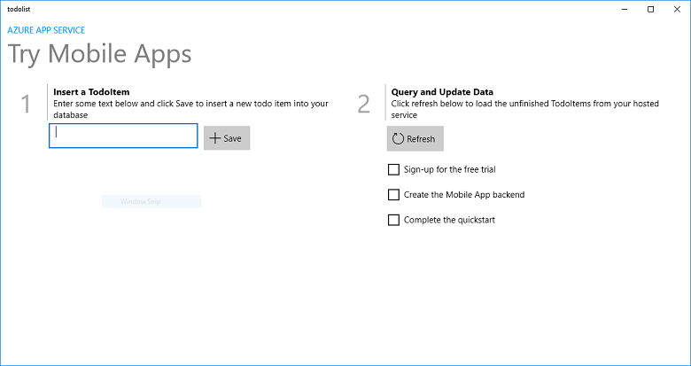

<properties
    pageTitle="Erstellen einer Universal Windows Plattform (UWP), die auf Mobile-Apps verwendet | Microsoft Azure"
    description="Führen Sie dieses Lernprogramm zu ersten Schritten mit Azure mobile-app Downloadzeit für app-Entwicklung in c#, Visual Basic oder JavaScript Universal Windows-Plattform (UWP)."
    services="app-service\mobile"
    documentationCenter="windows"
    authors="adrianhall"
    manager="erikre"
    editor=""/>

<tags
    ms.service="app-service-mobile"
    ms.workload="mobile"
    ms.tgt_pltfrm="mobile-windows"
    ms.devlang="dotnet"
    ms.topic="hero-article"
    ms.date="10/01/2016"
    ms.author="adrianha"/>

#Erstellen einer app für Windows

[AZURE.INCLUDE [app-service-mobile-selector-get-started](../../includes/app-service-mobile-selector-get-started.md)]

##(Übersicht)

In diesem Lernprogramm erfahren Sie, wie Sie eine app Universal Windows-Plattform (UWP) einen cloudbasierten Back-End-Dienst hinzufügen. Weitere Informationen finden Sie unter [Was sind Mobile-Apps](app-service-mobile-value-prop.md). Im folgenden finden in der fertigen app Bildschirmausschnitte:

   
Klicken Sie auf einen Desktop ausgeführt. 

  
Auf einem Smartphone ausgeführt

In diesem Lernprogramm durchführen ist eine Voraussetzung für alle anderen Mobile-App-Lernprogramme für UWP-apps. 

##Erforderliche Komponenten

Damit dieses Lernprogramm abgeschlossen, benötigen Sie Folgendes:

* Ein aktives Azure-Konto. Wenn Sie kein Konto haben, können für eine Azure-Testversion registrieren und erhalten bis zu 10 kostenlosen mobile-apps, die Sie auch nach dem Ende Ihrer Testversion weiterhin dazu verwenden können. Weitere Informationen finden Sie unter [Azure kostenlose Testversion](https://azure.microsoft.com/pricing/free-trial/).

* [Visual Studio Community 2015] oder einer späteren Version.

>[AZURE.NOTE] Wenn Sie mit Azure-App-Verwaltungsdienst anzufangen, bevor Sie für ein Azure-Konto anmelden möchten, wechseln Sie zu [App-Verwaltungsdienst versuchen](https://tryappservice.azure.com/?appServiceName=mobile). Vorhanden, können Sie sofort eine kurzlebige Starter mobile-app erstellen, im App-Dienst – keine Kreditkarte erforderlich, und keine Zusagen.

##Erstellen einer neuen Azure Mobile-App Back-End-

Wie folgt vor, um eine neue Mobile-App Back-End-erstellen.

[AZURE.INCLUDE [app-service-mobile-dotnet-backend-create-new-service](../../includes/app-service-mobile-dotnet-backend-create-new-service.md)]

Sie haben nun eine Azure Mobile-App Back-End-bereitgestellt, die von der mobilen Clientanwendungen verwendet werden kann. Sie werden als Nächstes Herunterladen einer Project Server für eine einfache "Aufgabenliste" Back-End- und Azure veröffentlichen.

## Konfigurieren der Project server

[AZURE.INCLUDE [app-service-mobile-configure-new-backend.md](../../includes/app-service-mobile-configure-new-backend.md)]

##Herunterladen und Ausführen des Client-Projekts

Nachdem Sie Ihre Mobile-App Back-End-konfiguriert haben, können Sie eine neue Client-app erstellen oder Ändern einer vorhandene Verbindung zum Azure-app. In diesem Abschnitt Laden Sie ein UWP app Vorlagenprojekt, das angepasst wird, um Ihre Mobile-App Back-End-Verbindung.

1. Zurück in das **Schnellstart** Blade für Ihre Mobile-App Back-End-, klicken Sie auf **Erstellen einer neuen app** > **herunter**, und Extrahieren der komprimierten Project-Dateien auf den lokalen Computer.

    

3. (Optional) Hinzufügen des UWP-app-Projekts in der gleichen Lösung als der Project Server an. Dies vereinfacht Debuggen und Testen sowohl die Back-End-als auch die app in der gleichen Visual Studio-Lösung, wenn Sie auswählen können. Wenn Sie die Lösung UWP-app-Projekt hinzugefügt haben, müssen Sie Visual Studio 2015 oder höher verwenden.

4. Drücken Sie mit der UWP-app als die Startprojekt F5, um bereitstellen, und führen Sie die app aus.

5. Geben Sie in der app einen aussagekräftigen Text, z. B. *abgeschlossen des Lernprogramms*, in das Textfeld **Einfügen einer TodoItem** ein, und klicken Sie dann auf **Speichern**.

    

    Sendet eine POST-Anforderung an die neue mobile-app Back-End-, die in Azure gehostet wird.

6. (Optional) Halten Sie die app und starten Sie es auf einem anderen Gerät oder Emulator für Mobilgeräte.

    

    Beachten Sie, dass die Daten aus dem vorherigen Schritt gespeichert aus Azure geladen werden, nachdem die UWP app gestartet. 

##Nächste Schritte

* [Authentifizierung für Ihre app hinzufügen](app-service-mobile-windows-store-dotnet-get-started-users.md)  
  Erfahren Sie, wie Benutzer der app mit einem Identitätsanbieter authentifizieren.

* [Hinzufügen von Pushbenachrichtigungen zu Ihrer Anwendung](app-service-mobile-windows-store-dotnet-get-started-push.md)  
  Informationen Sie zum Hinzufügen von Pushbenachrichtigungen Benachrichtigungen zu Ihrer Anwendung zu unterstützen, und konfigurieren Ihre Mobile-App Back-End-um Azure Benachrichtigung Hubs verwenden, um Pushbenachrichtigungen zu senden.

* [Offlinesynchronisierung für Ihre app zu aktivieren](app-service-mobile-windows-store-dotnet-get-started-offline-data.md)  
  Erfahren Sie, wie offlinesupport Ihre app ein Mobile-App Back-End hinzufügen. Offlinesynchronisierung ermöglicht es den Endbenutzern Interaktion mit einem mobilen app&mdash;anzeigen, hinzufügen oder Ändern von Daten&mdash;auch, wenn keine Verbindung zum Netzwerk vorhanden ist.

<!-- Anchors. -->
<!-- Images. -->
<!-- URLs. -->
[Mobile App SDK]: http://go.microsoft.com/fwlink/?LinkId=257545
[Azure portal]: https://portal.azure.com/
[Visual Studio-Community 2015]: https://go.microsoft.com/fwLink/p/?LinkID=534203
